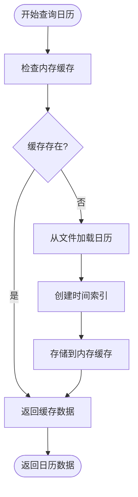

# 日历数据访问接口

<cite>
**本文档引用的文件**   
- [data.py](file://qlib/data/data.py#L126-L161)
- [data.py](file://qlib/data/data.py#L84-L124)
- [data.py](file://qlib/data/data.py#L0-L199)
- [data.py](file://qlib/data/data.py#L1000-L1199)
- [__init__.py](file://qlib/data/__init__.py#L0-L66)
</cite>

## 目录
1. [日历数据访问接口](#日历数据访问接口)
2. [D.calendar()方法详解](#dcalendar方法详解)
3. [日历数据加载与缓存机制](#日历数据加载与缓存机制)
4. [实际使用示例](#实际使用示例)
5. [异常处理机制](#异常处理机制)

## D.calendar()方法详解

`D.calendar()`方法是QLib框架中用于获取指定市场在特定时间范围内交易日历的核心接口。该方法通过`start_time`、`end_time`、`freq`和`future`参数来精确控制查询结果。

方法的主要参数包括：
- `start_time`: 时间范围的开始时间
- `end_time`: 时间范围的结束时间
- `freq`: 时间频率，可选值包括year/quarter/month/week/day
- `future`: 布尔值，指示是否包含未来交易日

当查询时间范围内的交易日历时，系统会首先验证起始时间和结束时间是否在日历范围内。如果起始时间大于日历的最后一天，则返回空数组；如果结束时间小于日历的第一天，同样返回空数组。对于不在日历中的时间点，系统会自动调整到最近的有效交易日。

**Section sources**
- [data.py](file://qlib/data/data.py#L84-L124)
- [data.py](file://qlib/data/data.py#L126-L161)

## 日历数据加载与缓存机制

日历数据的加载和查询效率通过内存缓存机制得到显著提升。核心方法`_get_calendar`实现了这一缓存策略，它利用内存缓存(H["c"])来存储已加载的日历数据，避免重复的文件读取操作。

缓存机制的工作原理如下：
1. 根据`freq`和`future`参数生成唯一的缓存标识符
2. 检查该标识符是否已存在于内存缓存中
3. 如果不存在，则从文件系统加载日历数据，创建索引并存入缓存
4. 如果存在，则直接返回缓存中的数据

这种设计确保了相同参数的日历查询只需进行一次实际的文件读取操作，后续查询均可从内存中快速获取，大大提高了查询效率。



**Diagram sources **
- [data.py](file://qlib/data/data.py#L126-L161)

**Section sources**
- [data.py](file://qlib/data/data.py#L126-L161)

## 实际使用示例

以下是`D.calendar()`方法在不同场景下的使用示例：

### 不同频率的日历查询
```python
# 获取日频交易日历
daily_calendar = D.calendar(freq="day")

# 获取周频交易日历
weekly_calendar = D.calendar(freq="week")

# 获取月频交易日历
monthly_calendar = D.calendar(freq="month")
```

### 包含未来交易日的查询
```python
# 查询包含未来交易日的日历
future_calendar = D.calendar(future=True)

# 在指定时间范围内查询包含未来交易日的日历
range_calendar = D.calendar(start_time="2023-01-01", end_time="2023-12-31", future=True)
```

### 特定时间范围的交易日历
```python
# 查询2023年全年的交易日历
year_calendar = D.calendar(start_time="2023-01-01", end_time="2023-12-31")

# 查询最近30个交易日
recent_calendar = D.calendar(end_time="2023-12-31", freq="day")
```

**Section sources**
- [data.py](file://qlib/data/data.py#L84-L124)

## 异常处理机制

`D.calendar()`方法实现了完善的异常处理机制，特别是在处理未来日期查询时提供了清晰的错误提示。

当查询一个未来的起始时间但`future`参数设置为`False`时，系统会抛出`IndexError`异常，并提供明确的错误信息：
```
`start_time` uses a future date, if you want to get future trading days, you can use: `future=True`
```

这一设计确保了用户能够快速理解问题所在并采取正确的解决方案。异常处理流程如下：
1. 尝试在日历中定位起始时间
2. 如果起始时间不在日历中，尝试使用二分查找找到最近的交易日
3. 如果二分查找失败（即时间超出日历范围），抛出带有明确指导的异常

这种异常处理机制不仅保证了系统的健壮性，还为用户提供了友好的使用体验。

**Section sources**
- [data.py](file://qlib/data/data.py#L126-L161)