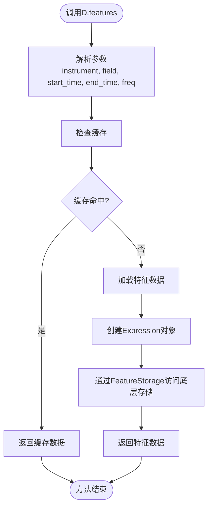
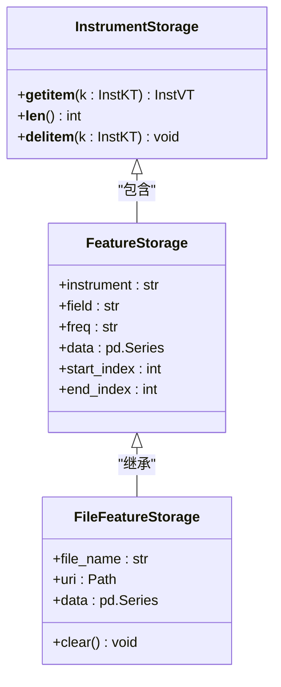
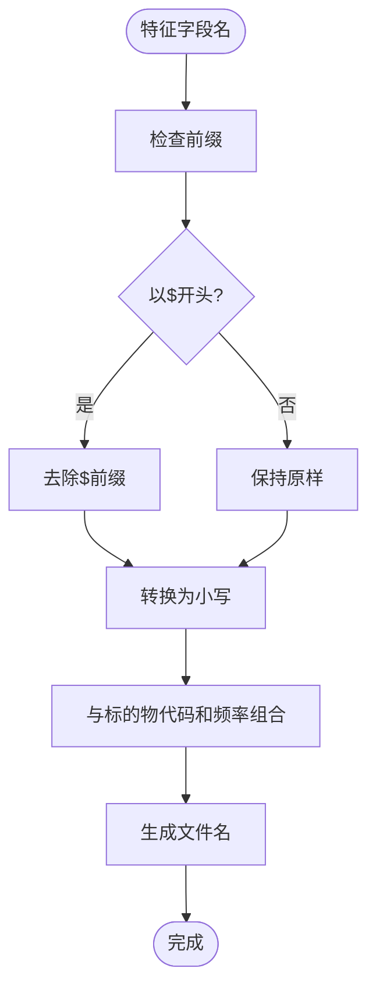
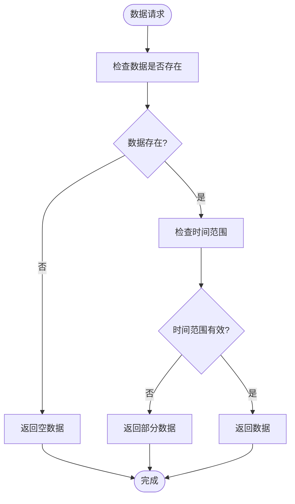

# 特征数据访问接口

<cite>
**本文档引用的文件**
- [base.py](file://qlib/data/base.py)
- [data.py](file://qlib/data/data.py)
- [storage.py](file://qlib/data/storage/storage.py)
- [file_storage.py](file://qlib/data/storage/file_storage.py)
- [ops.py](file://qlib/data/ops.py)
- [example.py](file://examples/orderbook_data/example.py)
- [test_pit.py](file://tests/test_pit.py)
</cite>

## 目录
1. [简介](#简介)
2. [D.features()方法详解](#dfeatures方法详解)
3. [特征数据存储结构](#特征数据存储结构)
4. [特征字段名处理机制](#特征字段名处理机制)
5. [代码示例](#代码示例)
6. [数据边界处理与异常情况](#数据边界处理与异常情况)

## 简介
Qlib提供了一套完整的特征数据访问接口，通过D.features()方法可以方便地获取特定标的物的特征数据。该接口支持多种参数配置，能够灵活地查询不同时间范围、不同频率的特征数据。本文档将详细介绍D.features()方法的使用方法和参数配置，以及特征数据的存储结构和访问模式。

**Section sources**
- [data.py](file://qlib/data/data.py#L1161-L1332)

## D.features方法详解
D.features()方法是Qlib中用于获取特征数据的核心接口，其主要参数包括instrument、field、start_time、end_time和freq。

### 参数说明
- **instrument**: 标的物代码，可以是单个标的物代码或标的物列表
- **field**: 特征字段名，可以是单个字段或字段列表
- **start_time**: 查询开始时间
- **end_time**: 查询结束时间
- **freq**: 数据频率，支持"day"、"week"、"month"等

该方法通过FeatureD.feature()实现具体的数据访问，首先将特征表达式解析为Expression对象，然后通过load()方法加载数据。



**Diagram sources**
- [data.py](file://qlib/data/data.py#L1161-L1332)
- [base.py](file://qlib/data/base.py#L216-L262)

**Section sources**
- [data.py](file://qlib/data/data.py#L1161-L1332)
- [base.py](file://qlib/data/base.py#L216-L262)

## 特征数据存储结构
Qlib采用分层存储结构来管理特征数据，主要通过FeatureStorage类实现。

### 存储层次
1. **InstrumentStorage**: 管理标的物级别的存储
2. **FeatureStorage**: 管理特征级别的存储
3. **FileFeatureStorage**: 基于文件系统的具体实现

FileFeatureStorage将特征数据存储为二进制文件，文件命名规则为"{instrument.lower()}/{field.lower()}.{freq.lower()}.bin"。



**Diagram sources**
- [storage.py](file://qlib/data/storage/storage.py#L228-L273)
- [file_storage.py](file://qlib/data/storage/file_storage.py#L278-L296)

**Section sources**
- [storage.py](file://qlib/data/storage/storage.py#L228-L273)
- [file_storage.py](file://qlib/data/storage/file_storage.py#L278-L296)

## 特征字段名处理机制
Qlib对特征字段名有一套特定的处理机制，主要体现在特征表达式的解析和处理上。

### 前缀处理
- **$前缀**: 表示普通特征，如"$close"表示收盘价
- **$$前缀**: 表示PIT特征，如"$$roewa_q"表示季度ROE
- **表达式**: 支持复杂的表达式，如"Ref($close, 1)"表示前一日收盘价

特征字段名在存储时会去除$前缀，转换为小写，并与标的物代码和频率组合成文件名。



**Diagram sources**
- [base.py](file://qlib/data/base.py#L216-L262)
- [ops.py](file://qlib/data/ops.py#L85-L140)

**Section sources**
- [base.py](file://qlib/data/base.py#L216-L262)
- [ops.py](file://qlib/data/ops.py#L85-L140)

## 代码示例
以下是一些使用D.features()方法的代码示例：

### 单特征查询
```python
# 查询单个标的物的单个特征
df = D.features(
    "sh600519",
    fields=["$close"],
    start_time="2020-01-01",
    end_time="2020-12-31",
    freq="day"
)
```

### 多特征查询
```python
# 查询多个特征
df = D.features(
    "sh600519",
    fields=["$close", "$volume", "$open"],
    start_time="2020-01-01",
    end_time="2020-12-31",
    freq="day"
)
```

### 不同频率数据查询
```python
# 查询分钟级数据
df = D.features(
    ["sh600519", "sz000001"],
    fields=["$ask1", "$bid1"],
    freq="ticks",
    start_time="20201230",
    end_time="20210101"
)
```

**Section sources**
- [example.py](file://examples/orderbook_data/example.py#L42-L85)
- [test_pit.py](file://tests/test_pit.py#L129-L147)

## 数据边界处理与异常情况
D.features()方法在处理数据边界和异常情况时有特定的返回值规则。

### 边界处理
- 当请求的数据超出实际数据范围时，返回实际存在的数据
- 当start_time晚于end_time时，返回空DataFrame
- 当标的物或特征不存在时，返回空DataFrame

### 异常情况
- **数据不存在**: 返回空的pandas.Series
- **索引越界**: 对于单个索引，返回(None, None)；对于切片，返回空的pandas.Series
- **长度不匹配**: 在进行特征运算时，如果两个序列长度不同，会发出警告



**Diagram sources**
- [storage.py](file://qlib/data/storage/storage.py#L455-L493)
- [base.py](file://qlib/data/base.py#L109-L155)

**Section sources**
- [storage.py](file://qlib/data/storage/storage.py#L455-L493)
- [base.py](file://qlib/data/base.py#L109-L155)