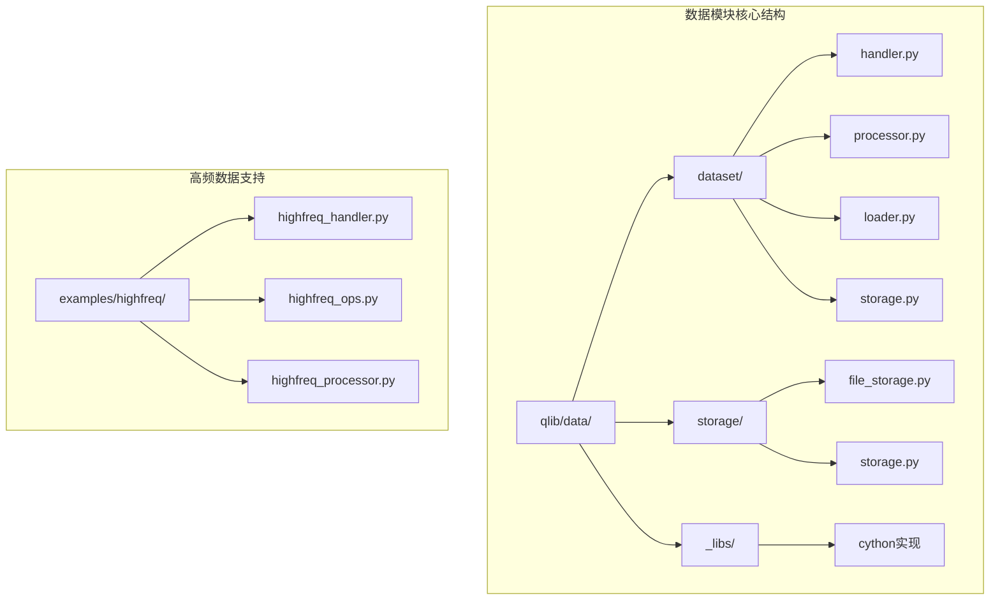
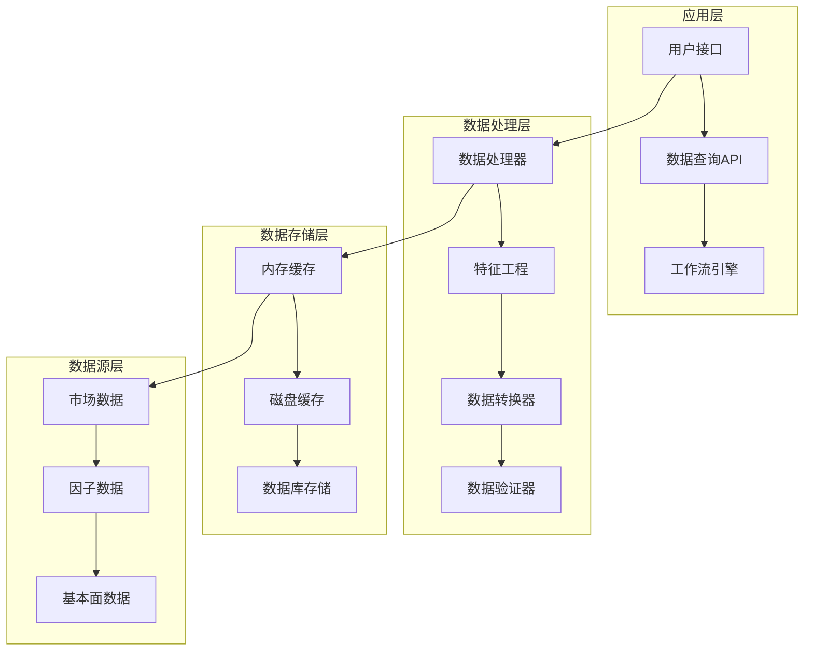
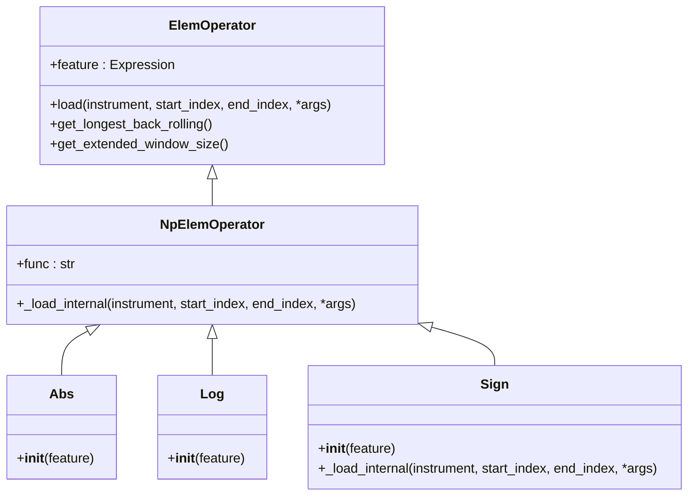
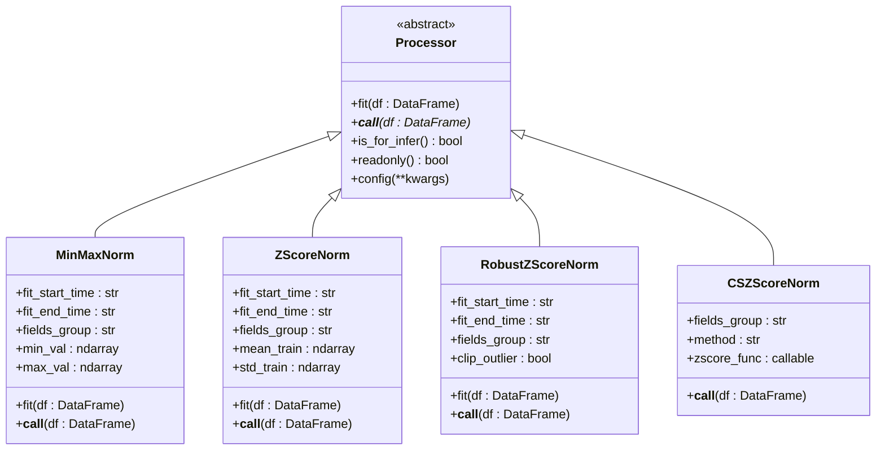
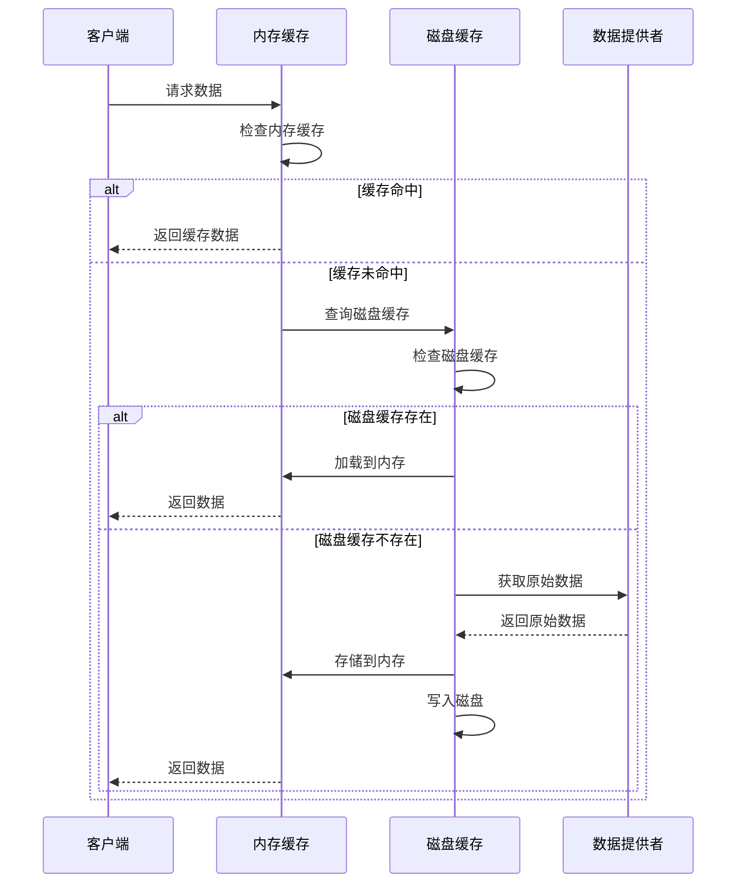
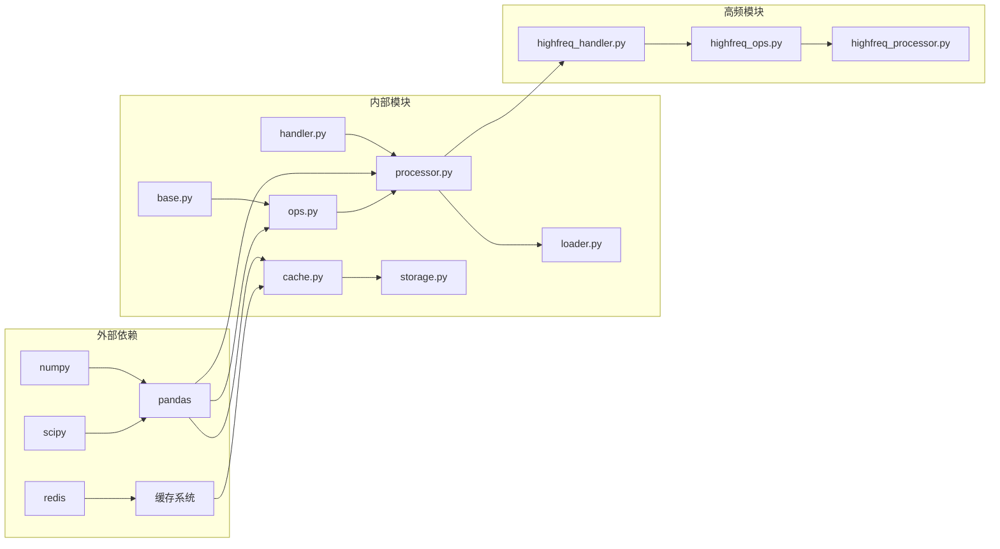

# Qlib 数据模块综合文档

<cite>
**本文档引用的文件**
- [qlib/data/__init__.py](file://qlib/data/__init__.py)
- [qlib/data/base.py](file://qlib/data/base.py)
- [qlib/data/ops.py](file://qlib/data/ops.py)
- [qlib/data/dataset/handler.py](file://qlib/data/dataset/handler.py)
- [qlib/data/dataset/processor.py](file://qlib/data/dataset/processor.py)
- [qlib/data/cache.py](file://qlib/data/cache.py)
- [examples/highfreq/highfreq_handler.py](file://examples/highfreq/highfreq_handler.py)
- [examples/highfreq/highfreq_ops.py](file://examples/highfreq/highfreq_ops.py)
- [examples/highfreq/highfreq_processor.py](file://examples/highfreq/highfreq_processor.py)
</cite>

## 目录
1. [简介](#简介)
2. [项目结构](#项目结构)
3. [核心组件](#核心组件)
4. [架构概览](#架构概览)
5. [详细组件分析](#详细组件分析)
6. [依赖关系分析](#依赖关系分析)
7. [性能考虑](#性能考虑)
8. [故障排除指南](#故障排除指南)
9. [结论](#结论)

## 简介

Qlib 数据模块是一个功能强大且高度可扩展的数据处理框架，专为量化金融领域设计。该模块提供了完整的数据处理、存储、缓存和高频数据处理解决方案，支持从原始市场数据到机器学习模型输入的全流程数据管道。

数据模块的核心设计理念是通过抽象化和模块化的方式，将复杂的数据处理逻辑分解为可重用、可配置的组件。这种设计使得用户能够灵活地构建适合特定投资策略的数据处理流水线，同时保持高性能和可维护性。

## 项目结构

Qlib 数据模块采用分层架构设计，主要包含以下核心目录：



**图表来源**
- [qlib/data/__init__.py](file://qlib/data/__init__.py#L1-L67)
- [qlib/data/dataset/handler.py](file://qlib/data/dataset/handler.py#L1-L50)

**章节来源**
- [qlib/data/__init__.py](file://qlib/data/__init__.py#L1-L67)

## 核心组件

### 表达式系统 (Expression System)

表达式系统是 Qlib 数据模块的核心，它提供了一套完整的数学运算符和数据处理函数。所有数据操作都基于表达式树的形式进行建模。

```python
# 基本表达式类
class Expression(abc.ABC):
    """表达式基类，支持两维数据格式：特征和时间"""
    
    def load(self, instrument, start_index, end_index, *args):
        """加载特征数据，包含缓存机制"""
        cache_key = str(self), instrument, start_index, end_index, *args
        if cache_key in H["f"]:
            return H["f"][cache_key]
        # 缓存未命中时的处理逻辑
        series = self._load_internal(instrument, start_index, end_index, *args)
        H["f"][cache_key] = series
        return series
```

### 数据处理器 (Data Handler)

数据处理器负责管理数据的加载、预处理和访问。其中 `DataHandlerLP` 是最常用的实现，支持学习和推理两种不同的数据处理流程。

```python
class DataHandlerLP(DataHandler):
    """具有可学习处理器的数据处理器"""
    
    # 支持三种数据类型
    DK_R = "raw"    # 原始数据
    DK_I = "infer"  # 推理数据
    DK_L = "learn"  # 学习数据
    
    def process_data(self, with_fit: bool = False):
        """处理数据，支持共享和独立的处理器流程"""
        # 共享数据处理器
        _shared_df = self._data
        _shared_df = self._run_proc_l(_shared_df, self.shared_processors, 
                                    with_fit=with_fit, check_for_infer=True)
        
        # 推理数据处理
        _infer_df = _shared_df
        _infer_df = self._run_proc_l(_infer_df, self.infer_processors, 
                                   with_fit=with_fit, check_for_infer=True)
        
        # 学习数据处理
        if self.process_type == self.PTYPE_I:
            _learn_df = _shared_df
        elif self.process_type == self.PTYPE_A:
            _learn_df = _infer_df
        
        _learn_df = self._run_proc_l(_learn_df, self.learn_processors, 
                                   with_fit=with_fit, check_for_infer=False)
```

**章节来源**
- [qlib/data/base.py](file://qlib/data/base.py#L1-L282)
- [qlib/data/dataset/handler.py](file://qlib/data/dataset/handler.py#L1-L787)

## 架构概览

Qlib 数据模块采用分层架构设计，各层之间职责明确，便于扩展和维护：



**图表来源**
- [qlib/data/dataset/handler.py](file://qlib/data/dataset/handler.py#L100-L200)
- [qlib/data/cache.py](file://qlib/data/cache.py#L1-L100)

## 详细组件分析

### 特征工程操作符

Qlib 提供了丰富的特征工程操作符，涵盖了从基础算术运算到高级统计分析的各个方面：

#### 基础算术运算符



**图表来源**
- [qlib/data/ops.py](file://qlib/data/ops.py#L30-L150)

#### 滚动统计操作符

滚动统计是量化分析中的重要工具，Qlib 提供了多种滚动窗口计算方法：

```python
class Rolling(ExpressionOps):
    """滚动操作符
    
    参数：
    - feature: 表达式实例
    - N: 滚动窗口大小
    - func: 滚动方法
    
    返回：
    - 滚动输出的表达式
    """
    
    def _load_internal(self, instrument, start_index, end_index, *args):
        series = self.feature.load(instrument, start_index, end_index, *args)
        
        if isinstance(self.N, int) and self.N == 0:
            # 扩展窗口（expanding）
            series = getattr(series.expanding(min_periods=1), self.func)()
        elif isinstance(self.N, float) and 0 < self.N < 1:
            # 指数加权移动平均
            series = series.ewm(alpha=self.N, min_periods=1).mean()
        else:
            # 固定窗口滚动
            series = getattr(series.rolling(self.N, min_periods=1), self.func)()
            
        return series
```

#### 高频数据专用操作符

针对高频交易场景，Qlib 提供了专门的操作符来处理分钟级甚至更细粒度的数据：

```python
class DayLast(ElemOperator):
    """日末值操作符
    
    将每个特征值转换为其所在交易日的最后一个值
    """
    
    def _load_internal(self, instrument, start_index, end_index, freq):
        _calendar = get_calendar_day(freq=freq)
        series = self.feature.load(instrument, start_index, end_index, freq)
        return series.groupby(_calendar[series.index], group_keys=False).transform("last")

class Cut(ElemOperator):
    """截断操作符
    
    删除序列的前l个元素和后-r个元素
    """
    
    def _load_internal(self, instrument, start_index, end_index, freq):
        series = self.feature.load(instrument, start_index, end_index, freq)
        return series.iloc[self.l : self.r]
```

**章节来源**
- [qlib/data/ops.py](file://qlib/data/ops.py#L1-L800)
- [examples/highfreq/highfreq_ops.py](file://examples/highfreq/highfreq_ops.py#L1-L168)

### 数据处理器 (Processor)

数据处理器是数据预处理的核心组件，支持多种标准化和归一化方法：



**图表来源**
- [qlib/data/dataset/processor.py](file://qlib/data/dataset/processor.py#L20-L200)

### 缓存系统

Qlib 实现了多层缓存系统来提高数据访问性能：



**图表来源**
- [qlib/data/cache.py](file://qlib/data/cache.py#L100-L300)

**章节来源**
- [qlib/data/dataset/processor.py](file://qlib/data/dataset/processor.py#L1-L420)
- [qlib/data/cache.py](file://qlib/data/cache.py#L1-L800)

### 高频数据处理

Qlib 为高频交易场景提供了专门的数据处理方案：

```python
class HighFreqHandler(DataHandlerLP):
    """高频数据处理器
    
    支持1分钟级别的高频数据处理
    包含价格、成交量等高频特征的标准化处理
    """
    
    def get_feature_config(self):
        """获取高频特征配置"""
        fields = []
        names = []
        
        # 标准化价格特征
        def get_normalized_price_feature(price_field, shift=0):
            if shift == 0:
                template_norm = "Cut({0}/Ref(DayLast({1}), 240), 240, None)"
            else:
                template_norm = "Cut(Ref({0}, " + str(shift) + ")/Ref(DayLast({1}), 240), 240, None)"
            
            feature_ops = template_norm.format(
                template_if.format(
                    template_fillnan.format(template_paused.format("$close")),
                    template_paused.format(price_field),
                ),
                template_fillnan.format(template_paused.format("$close")),
            )
            return feature_ops
        
        # 添加多个时间点的价格特征
        fields += [get_normalized_price_feature("$open", 0)]
        fields += [get_normalized_price_feature("$high", 0)]
        fields += [get_normalized_price_feature("$low", 0)]
        fields += [get_normalized_price_feature("$close", 0)]
        
        # 添加滞后特征
        fields += [get_normalized_price_feature("$open", 240)]
        fields += [get_normalized_price_feature("$high", 240)]
        fields += [get_normalized_price_feature("$low", 240)]
        fields += [get_normalized_price_feature("$close", 240)]
        
        return fields, names
```

**章节来源**
- [examples/highfreq/highfreq_handler.py](file://examples/highfreq/highfreq_handler.py#L1-L159)

## 依赖关系分析

Qlib 数据模块的依赖关系呈现清晰的层次结构：



**图表来源**
- [qlib/data/__init__.py](file://qlib/data/__init__.py#L1-L30)
- [qlib/data/dataset/handler.py](file://qlib/data/dataset/handler.py#L1-L50)

**章节来源**
- [qlib/data/__init__.py](file://qlib/data/__init__.py#L1-L67)

## 性能考虑

### 内存优化策略

1. **惰性加载**: 数据只在需要时才被加载到内存中
2. **缓存机制**: 多层缓存减少重复计算
3. **就地修改**: 对于只读处理器，避免不必要的数据复制

### 并行处理

```python
# 使用并行处理加速数据预处理
from qlib.utils.paral import datetime_groupby_apply

def parallel_processing(data):
    """并行处理数据"""
    def process_chunk(chunk):
        # 并行处理逻辑
        return chunk.groupby("datetime", group_keys=False).apply(process_func)
    
    return datetime_groupby_apply(data, process_chunk)
```

### 高频数据优化

对于高频数据，Qlib 采用了特殊的优化策略：

1. **批量处理**: 减少I/O操作次数
2. **内存映射**: 利用内存映射文件处理大容量数据
3. **索引优化**: 高效的时间序列索引

## 故障排除指南

### 常见问题及解决方案

#### 缓存问题

```python
# 清理缓存以解决数据不一致问题
from qlib.data.cache import H
H.clear()

# 检查缓存状态
print(f"内存缓存大小: {len(H['f'])}")
print(f"缓存命中率: {H.hit_rate}")
```

#### 数据加载失败

```python
# 检查数据源连接
try:
    data = D.features(...)
except Exception as e:
    print(f"数据加载失败: {e}")
    # 检查网络连接和数据源可用性
```

#### 内存不足

```python
# 调整内存缓存设置
import qlib
qlib.init(mem_cache_size_limit=1000)  # MB

# 使用磁盘缓存替代内存缓存
handler = DataHandlerLP(..., drop_raw=True)  # 删除原始数据释放内存
```

**章节来源**
- [qlib/data/cache.py](file://qlib/data/cache.py#L500-L800)

## 结论

Qlib 数据模块通过其模块化的设计和丰富的功能，为量化金融研究提供了强大的数据处理能力。其核心优势包括：

1. **灵活性**: 支持自定义数据处理流程和特征工程
2. **性能**: 多层缓存和优化算法确保高效的数据访问
3. **可扩展性**: 清晰的架构便于添加新的数据源和处理逻辑
4. **易用性**: 简洁的API和丰富的文档降低了使用门槛

通过合理配置和使用这些组件，研究人员可以构建高效、可靠的数据处理流水线，为后续的模型训练和策略回测奠定坚实的基础。