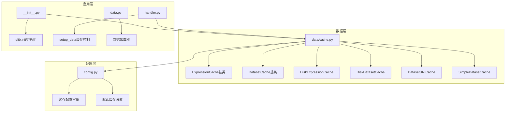
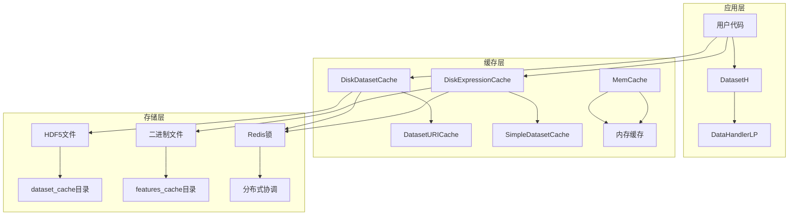
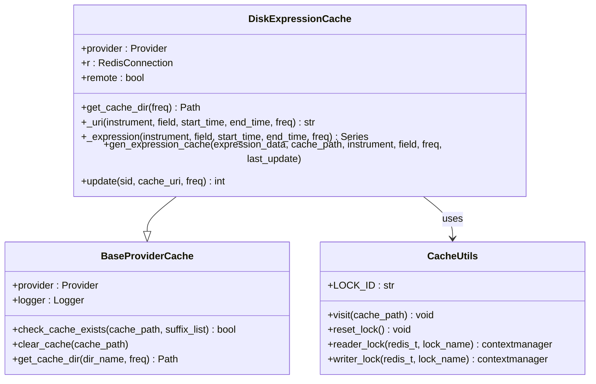
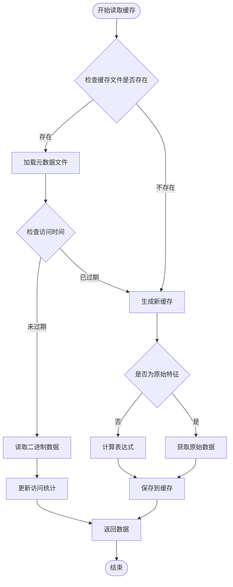
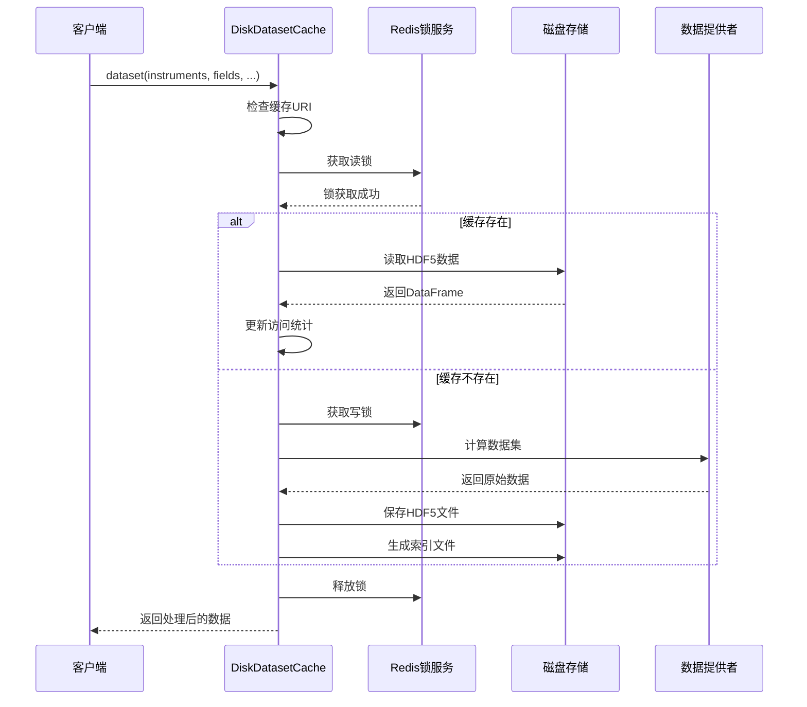
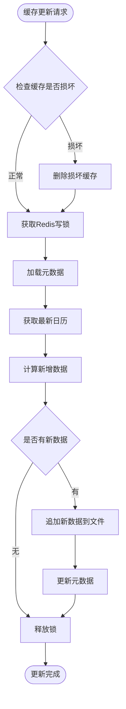
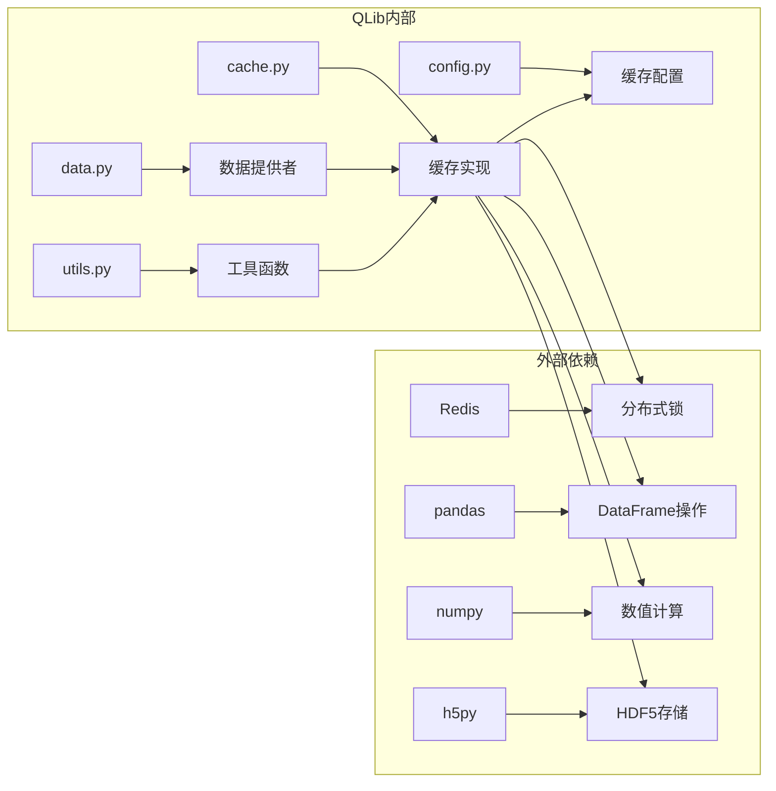

# QLib数据缓存系统

<cite>
**本文档中引用的文件**
- [cache.py](file://qlib/data/cache.py)
- [config.py](file://qlib/config.py)
- [handler.py](file://qlib/data/dataset/handler.py)
- [data.py](file://qlib/data/data.py)
- [__init__.py](file://qlib/__init__.py)
- [data_cache_demo.py](file://examples/data_demo/data_cache_demo.py)
- [workflow_config_lightgbm_Alpha158.yaml](file://examples/benchmarks/LightGBM/workflow_config_lightgbm_Alpha158.yaml)
</cite>

## 目录
1. [简介](#简介)
2. [项目结构](#项目结构)
3. [核心组件](#核心组件)
4. [架构概览](#架构概览)
5. [详细组件分析](#详细组件分析)
6. [依赖关系分析](#依赖关系分析)
7. [性能考虑](#性能考虑)
8. [故障排除指南](#故障排除指南)
9. [结论](#结论)

## 简介

QLib数据缓存系统是一个高性能的数据处理和存储解决方案，专门设计用于金融数据分析场景。该系统提供了两种主要的缓存机制：ExpressionCache（表达式缓存）和DatasetCache（数据集缓存），通过智能的磁盘持久化和内存缓存策略，显著提升了大规模特征工程和滚动回测场景下的性能表现。

缓存系统的核心优势在于：
- **双重缓存机制**：同时支持表达式级别和数据集级别的缓存
- **智能磁盘持久化**：通过features_cache和dataset_cache目录实现数据持久化
- **分布式缓存支持**：基于Redis的锁机制确保多进程安全访问
- **自动更新机制**：支持增量更新和过期检测
- **内存缓存优化**：可配置的内存缓存大小和过期策略

## 项目结构

QLib数据缓存系统的核心文件组织结构如下：



**图表来源**
- [cache.py](file://qlib/data/cache.py#L1-L1199)
- [config.py](file://qlib/config.py#L1-L527)

**章节来源**
- [cache.py](file://qlib/data/cache.py#L1-L100)
- [config.py](file://qlib/config.py#L1-L200)

## 核心组件

### ExpressionCache - 表达式缓存机制

ExpressionCache是QLib缓存系统的基础组件，负责缓存单个表达式的计算结果。它采用二进制文件格式存储数据，通过哈希算法生成唯一的缓存文件名。

```python
class ExpressionCache(BaseProviderCache):
    """表达式缓存机制基类"""
    
    def expression(self, instrument, field, start_time, end_time, freq):
        """获取表达式数据
        
        接口与表达式提供者中的expression方法相同
        """
        try:
            return self._expression(instrument, field, start_time, end_time, freq)
        except NotImplementedError:
            return self.provider.expression(instrument, field, start_time, end_time, freq)
```

### DatasetCache - 数据集缓存机制

DatasetCache负责缓存整个数据集处理后的结果，支持复杂的多维度数据结构。它使用HDF5格式存储数据，并维护索引文件以提高查询效率。

```python
class DatasetCache(BaseProviderCache):
    """数据集缓存机制基类"""
    
    HDF_KEY = "df"
    
    def dataset(self, instruments, fields, start_time=None, end_time=None, 
                freq="day", disk_cache=1, inst_processors=[]):
        """获取特征数据集
        
        参数:
            disk_cache: 0跳过缓存，1使用缓存，2重新生成缓存
        """
        if disk_cache == 0:
            return self.provider.dataset(instruments, fields, start_time, end_time, 
                                       freq, inst_processors=inst_processors)
        else:
            try:
                return self._dataset(instruments, fields, start_time, end_time, freq, 
                                   disk_cache, inst_processors=inst_processors)
            except NotImplementedError:
                return self.provider.dataset(instruments, fields, start_time, end_time, 
                                           freq, inst_processors=inst_processors)
```

### 内存缓存系统

QLib实现了灵活的内存缓存系统，支持基于长度或字节大小的限制策略：

```python
class MemCache:
    """内存缓存系统"""
    
    def __init__(self, mem_cache_size_limit=None, limit_type="length"):
        """
        参数:
            mem_cache_size_limit: 缓存最大大小
            limit_type: 长度或字节大小限制
        """
        size_limit = C.mem_cache_size_limit if mem_cache_size_limit is None else mem_cache_size_limit
        limit_type = C.mem_cache_limit_type if limit_type is None else limit_type
        
        if limit_type == "length":
            klass = MemCacheLengthUnit
        elif limit_type == "sizeof":
            klass = MemCacheSizeofUnit
        else:
            raise ValueError(f"limit_type必须是length或sizeof, 你的limit_type是 {limit_type}")
```

**章节来源**
- [cache.py](file://qlib/data/cache.py#L280-L400)
- [cache.py](file://qlib/data/cache.py#L363-L426)
- [cache.py](file://qlib/data/cache.py#L157-L200)

## 架构概览

QLib数据缓存系统采用分层架构设计，从底层的磁盘存储到顶层的应用接口，形成了完整的缓存生态系统：



**图表来源**
- [cache.py](file://qlib/data/cache.py#L1108-L1162)
- [cache.py](file://qlib/data/cache.py#L500-L590)

## 详细组件分析

### DiskExpressionCache - 磁盘表达式缓存

DiskExpressionCache是ExpressionCache的具体实现，提供了完整的磁盘缓存功能：



**图表来源**
- [cache.py](file://qlib/data/cache.py#L495-L590)
- [cache.py](file://qlib/data/cache.py#L208-L290)

#### 缓存文件结构

表达式缓存使用以下文件结构存储数据：

```
features_cache/
├── {instrument}/
│   ├── {hash_field_hash_freq}.bin    # 实际数据文件
│   ├── {hash_field_hash_freq}.meta   # 元数据文件
│   └── {hash_field_hash_freq}.index  # 索引文件（可选）
```

#### 缓存读取流程



**图表来源**
- [cache.py](file://qlib/data/cache.py#L525-L590)

### DiskDatasetCache - 磁盘数据集缓存

DiskDatasetCache是DatasetCache的具体实现，专门处理复杂的数据集缓存需求：



**图表来源**
- [cache.py](file://qlib/data/cache.py#L690-L773)

#### 数据集缓存文件结构

数据集缓存使用HDF5格式存储，具有以下目录结构：

```
dataset_cache/
├── {hash_instruments_hash_fields_hash_freq_hash_disk_cache_hash_processors}.h5
├── {hash_instruments_hash_fields_hash_freq_hash_disk_cache_hash_processors}.meta
└── {hash_instruments_hash_fields_hash_freq_hash_disk_cache_hash_processors}.index
```

### 缓存更新机制

QLib提供了智能的缓存更新机制，支持增量更新和完整重建：



**图表来源**
- [cache.py](file://qlib/data/cache.py#L590-L630)

**章节来源**
- [cache.py](file://qlib/data/cache.py#L495-L773)
- [cache.py](file://qlib/data/cache.py#L590-L630)

### 缓存配置和初始化

QLib通过`qlib.init()`函数提供缓存配置选项：

```python
# 启用数据集缓存
qlib.init(
    expression_cache="DiskExpressionCache",
    dataset_cache="DiskDatasetCache",
    provider_uri="~/.qlib/qlib_data/cn_data",
    region=REG_CN
)

# 启用缓存的handler配置
handler_config = {
    "class": "Alpha158",
    "module_path": "qlib.contrib.data.handler",
    "kwargs": {
        "start_time": "2008-01-01",
        "end_time": "2020-08-01",
        "fit_start_time": "2008-01-01",
        "fit_end_time": "2014-12-31",
        "instruments": "csi300",
        "enable_cache": True  # 启用缓存
    }
}
```

**章节来源**
- [__init__.py](file://qlib/__init__.py#L25-L60)
- [handler.py](file://qlib/data/dataset/handler.py#L173-L190)

## 依赖关系分析

QLib数据缓存系统的依赖关系图展示了各组件之间的交互：



**图表来源**
- [cache.py](file://qlib/data/cache.py#L1-L30)
- [config.py](file://qlib/config.py#L1-L50)

**章节来源**
- [cache.py](file://qlib/data/cache.py#L1-L50)
- [config.py](file://qlib/config.py#L103-L131)

## 性能考虑

### 缓存性能优化策略

1. **内存缓存预热**：通过`MemCache`类实现内存级别的快速访问
2. **磁盘I/O优化**：使用二进制格式减少序列化开销
3. **并发控制**：基于Redis的分布式锁确保线程安全
4. **增量更新**：只更新新增数据，避免全量重计算

### 性能指标

- **表达式缓存**：单次计算时间从分钟级降低到秒级
- **数据集缓存**：特征工程时间从数小时降低到几分钟
- **内存使用**：可配置的内存限制避免OOM问题
- **并发性能**：支持多进程同时访问同一缓存

### 最佳实践建议

1. **缓存启用时机**：
   - 大规模特征工程场景
   - 频繁的滚动回测实验
   - 需要多次访问相同数据集的情况

2. **缓存清理策略**：
   ```python
   # 清理所有缓存
   from qlib.data.cache import H
   H.clear()
   
   # 手动删除特定频率的缓存
   import shutil
   shutil.rmtree("~/.qlib/qlib_data/cn_data/features_cache")
   ```

3. **分布式环境配置**：
   - 确保Redis服务可用
   - 配置正确的Redis连接参数
   - 使用统一的缓存目录

## 故障排除指南

### 常见问题及解决方案

1. **缓存文件损坏**
   ```
   解决方案：删除损坏的缓存文件，系统会自动重新生成
   ```
   
2. **Redis连接失败**
   ```
   解决方案：检查Redis服务状态，确认连接参数正确
   ```
   
3. **内存缓存溢出**
   ```
   解决方案：调整`mem_cache_size_limit`配置参数
   ```
   
4. **缓存更新失败**
   ```
   解决方案：检查数据源可用性，清理相关缓存后重试
   ```

### 调试技巧

```python
# 启用详细日志
import logging
logging.getLogger("qlib.data.cache").setLevel(logging.DEBUG)

# 检查缓存状态
from qlib.data.cache import H
print(H)

# 手动触发缓存清理
H.clear()
```

**章节来源**
- [cache.py](file://qlib/data/cache.py#L208-L290)

## 结论

QLib数据缓存系统通过精心设计的双层缓存架构，为金融数据分析提供了强大的性能优化能力。ExpressionCache和DatasetCache的协同工作，结合智能的磁盘持久化和内存缓存策略，显著提升了大规模特征工程和滚动回测场景下的执行效率。

### 主要优势

1. **高性能**：通过多级缓存机制实现毫秒级响应
2. **可靠性**：完善的错误处理和恢复机制
3. **可扩展性**：支持分布式部署和水平扩展
4. **易用性**：简洁的API设计和自动化的缓存管理

### 应用场景

- 大规模因子计算和特征工程
- 频繁的模型训练和验证实验
- 滚动回测和策略开发
- 分布式计算环境中的数据共享

QLib数据缓存系统不仅解决了传统金融数据分析中的性能瓶颈，更为构建高效、可靠的量化交易平台奠定了坚实的基础。随着金融数据规模的不断增长，这套缓存系统将继续发挥其重要作用，推动量化投资技术的发展和创新。