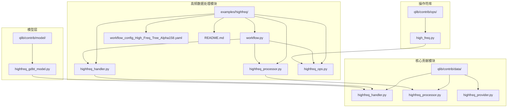
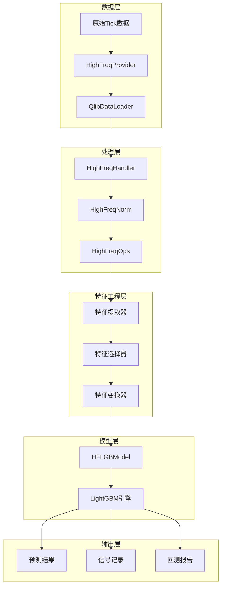
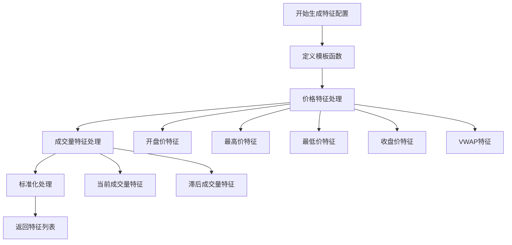
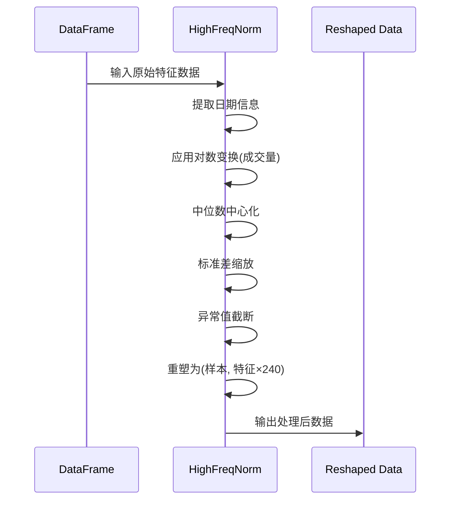
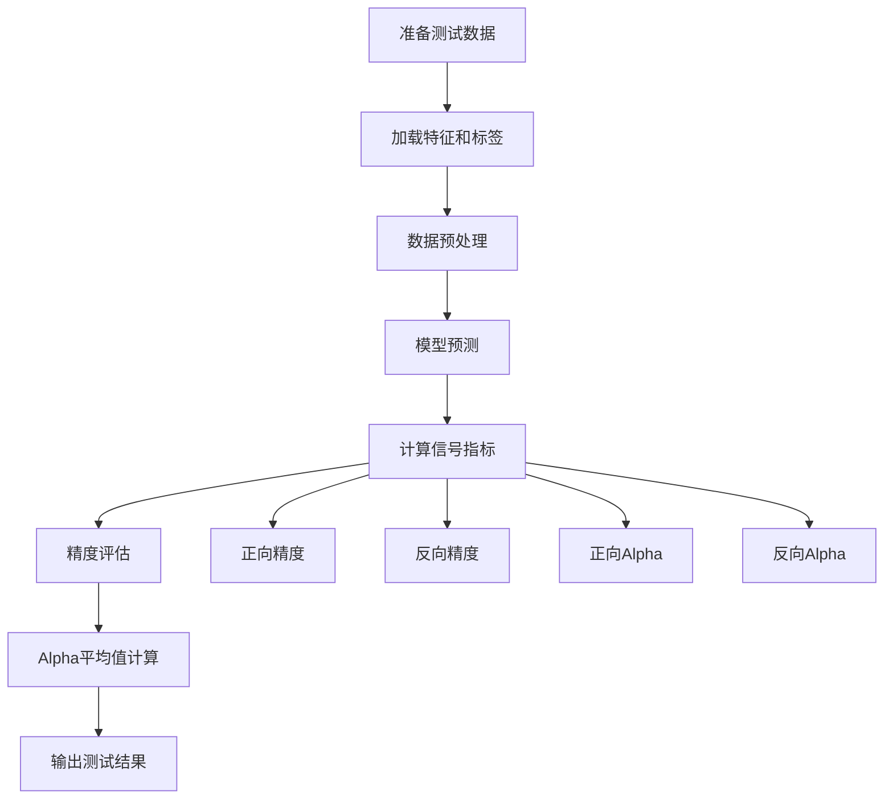
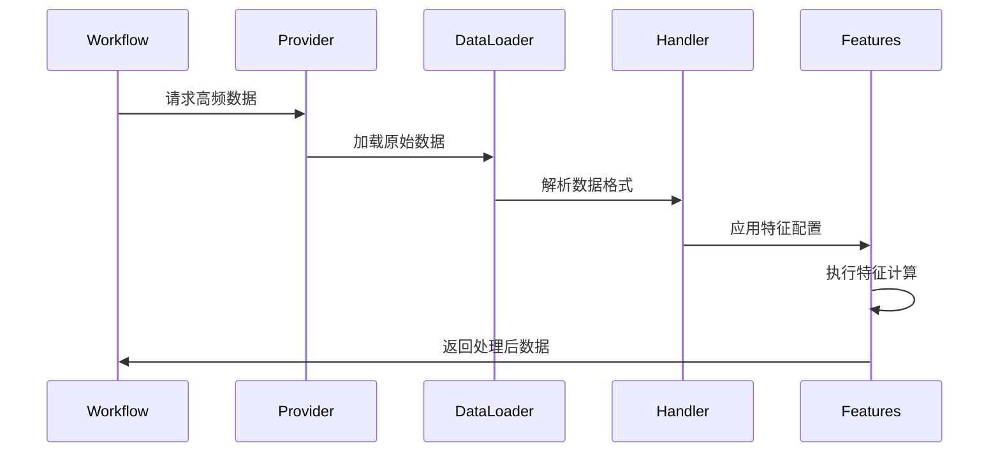
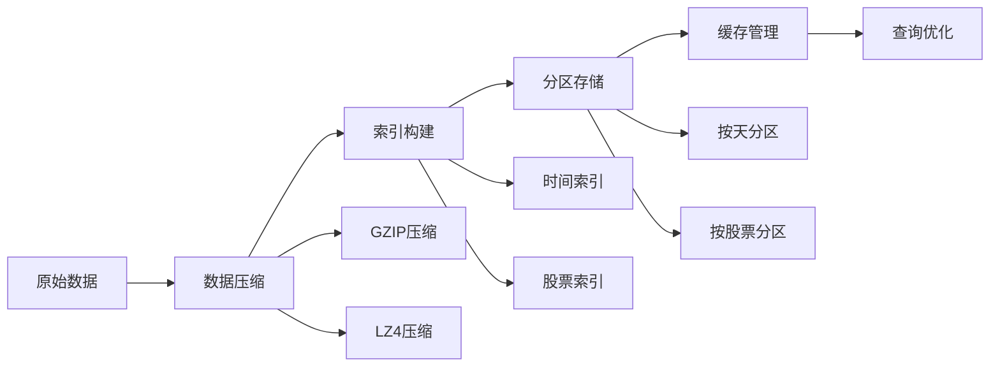

# 高频数据处理系统深度文档

<cite>
**本文档引用的文件**
- [examples/highfreq/README.md](file://examples/highfreq/README.md)
- [examples/highfreq/workflow.py](file://examples/highfreq/workflow.py)
- [examples/highfreq/workflow_config_High_Freq_Tree_Alpha158.yaml](file://examples/highfreq/workflow_config_High_Freq_Tree_Alpha158.yaml)
- [examples/highfreq/highfreq_handler.py](file://examples/highfreq/highfreq_handler.py)
- [examples/highfreq/highfreq_processor.py](file://examples/highfreq/highfreq_processor.py)
- [examples/highfreq/highfreq_ops.py](file://examples/highfreq/highfreq_ops.py)
- [qlib/contrib/data/highfreq_handler.py](file://qlib/contrib/data/highfreq_handler.py)
- [qlib/contrib/data/highfreq_processor.py](file://qlib/contrib/data/highfreq_processor.py)
- [qlib/contrib/model/highfreq_gdbt_model.py](file://qlib/contrib/model/highfreq_gdbt_model.py)
- [qlib/contrib/ops/high_freq.py](file://qlib/contrib/ops/high_freq.py)
</cite>

## 目录
1. [简介](#简介)
2. [项目结构](#项目结构)
3. [核心组件](#核心组件)
4. [架构概览](#架构概览)
5. [详细组件分析](#详细组件分析)
6. [高频特征工程](#高频特征工程)
7. [数据处理流程](#数据处理流程)
8. [性能优化策略](#性能优化策略)
9. [故障排除指南](#故障排除指南)
10. [结论](#结论)

## 简介

QLib的高频数据处理系统是一个专门设计用于处理分钟级及以下频率市场数据的综合框架。该系统通过专用的处理器、特征工程工具和优化的数据加载机制，为高频交易策略提供了强大的数据处理能力。

高频数据处理系统的核心特点包括：
- **分钟级数据支持**：原生支持1分钟、5分钟等高频时间频率
- **专用特征工程**：包含订单簿价差、成交量分布等高频特有指标
- **内存优化**：针对大规模高频数据的内存管理和计算效率优化
- **灵活配置**：支持多种工作流配置和模型集成
- **回测支持**：完整的高频回测环境和数据处理管道

## 项目结构

高频数据处理系统的文件组织结构如下：



**图表来源**
- [examples/highfreq/workflow.py](file://examples/highfreq/workflow.py#L1-L176)
- [qlib/contrib/data/highfreq_handler.py](file://qlib/contrib/data/highfreq_handler.py#L1-L540)

**章节来源**
- [examples/highfreq/README.md](file://examples/highfreq/README.md#L1-L42)

## 核心组件

高频数据处理系统由以下核心组件构成：

### 1. 高频处理器 (HighFreqHandler)
负责加载和预处理高频数据，支持多种数据源和格式。

### 2. 高频特征处理器 (HighFreqNorm)
对高频数据进行标准化和归一化处理，确保数据质量。

### 3. 高频操作符 (HighFreqOps)
提供专门的数学和统计操作符，支持复杂的特征计算。

### 4. 高频模型 (HFLGBModel)
专门为高频数据设计的梯度提升决策树模型。

### 5. 高频提供者 (HighFreqProvider)
数据提供接口，支持实时和历史高频数据访问。

**章节来源**
- [examples/highfreq/highfreq_handler.py](file://examples/highfreq/highfreq_handler.py#L1-L159)
- [examples/highfreq/highfreq_processor.py](file://examples/highfreq/highfreq_processor.py#L1-L77)
- [qlib/contrib/data/highfreq_handler.py](file://qlib/contrib/data/highfreq_handler.py#L1-L540)

## 架构概览

高频数据处理系统采用分层架构设计，确保高效的数据处理和模型训练：



**图表来源**
- [examples/highfreq/workflow.py](file://examples/highfreq/workflow.py#L40-L80)
- [qlib/contrib/model/highfreq_gdbt_model.py](file://qlib/contrib/model/highfreq_gdbt_model.py#L1-L172)

## 详细组件分析

### 高频处理器 (HighFreqHandler)

HighFreqHandler是高频数据处理的核心组件，继承自DataHandlerLP，专门处理分钟级数据：

```python
class HighFreqHandler(DataHandlerLP):
    def __init__(self, instruments="csi300", start_time=None, end_time=None, 
                 infer_processors=[], learn_processors=[], 
                 fit_start_time=None, fit_end_time=None, drop_raw=True):
        # 初始化数据加载器配置
        data_loader = {
            "class": "QlibDataLoader",
            "kwargs": {
                "config": self.get_feature_config(),
                "swap_level": False,
                "freq": "1min",
            },
        }
        super().__init__(
            instruments=instruments,
            start_time=start_time,
            end_time=end_time,
            data_loader=data_loader,
            infer_processors=infer_processors,
            learn_processors=learn_processors,
            drop_raw=drop_raw,
        )
```

#### 特征配置生成

HighFreqHandler通过`get_feature_config()`方法生成高频特征配置：



**图表来源**
- [examples/highfreq/highfreq_handler.py](file://examples/highfreq/highfreq_handler.py#L40-L90)
- [qlib/contrib/data/highfreq_handler.py](file://qlib/contrib/data/highfreq_handler.py#L40-L90)

**章节来源**
- [examples/highfreq/highfreq_handler.py](file://examples/highfreq/highfreq_handler.py#L4-L159)
- [qlib/contrib/data/highfreq_handler.py](file://qlib/contrib/data/highfreq_handler.py#L7-L145)

### 高频特征处理器 (HighFreqNorm)

HighFreqNorm负责对高频数据进行标准化处理，确保数据质量和模型训练效果：

```python
class HighFreqNorm(Processor):
    def __init__(self, fit_start_time, fit_end_time):
        self.fit_start_time = fit_start_time
        self.fit_end_time = fit_end_time

    def fit(self, df_features):
        # 提取训练时间段的数据
        fetch_df = fetch_df_by_index(df_features, 
                                   slice(self.fit_start_time, self.fit_end_time), 
                                   level="datetime")
        
        # 计算价格特征的中位数和标准差
        df_values = fetch_df.values
        names = {"price": slice(0, 10), "volume": slice(10, 12)}
        
        for name, name_val in names.items():
            part_values = df_values[:, name_val].astype(np.float32)
            if name == "volume":
                part_values = np.log1p(part_values)  # 对数变换
            
            # 计算中位数和绝对偏差
            self.feature_med[name] = np.nanmedian(part_values)
            part_values = part_values - self.feature_med[name]
            self.feature_std[name] = np.nanmedian(np.absolute(part_values)) * 1.4826 + EPS
            
            # 归一化处理
            part_values = part_values / self.feature_std[name]
            
            # 截断异常值
            self.feature_vmax[name] = np.nanmax(part_values)
            self.feature_vmin[name] = np.nanmin(part_values)
```

#### 数据重塑和转换

HighFreqNorm还负责将原始数据重塑为适合RL高频执行器的格式：



**图表来源**
- [examples/highfreq/highfreq_processor.py](file://examples/highfreq/highfreq_processor.py#L40-L77)

**章节来源**
- [examples/highfreq/highfreq_processor.py](file://examples/highfreq/highfreq_processor.py#L7-L77)
- [qlib/contrib/data/highfreq_processor.py](file://qlib/contrib/data/highfreq_processor.py#L23-L81)

### 高频操作符 (HighFreqOps)

高频操作符系统提供了一系列专门的数学和统计操作符：

#### 核心操作符类型

1. **时间序列操作符**
   - `DayLast`: 获取每日最后值
   - `DayCumsum`: 日内累计求和
   - `Date`: 提取日期信息

2. **填充操作符**
   - `FFillNan`: 前向填充NaN
   - `BFillNan`: 后向填充NaN

3. **条件操作符**
   - `Select`: 条件选择
   - `IsNull`: 检查NaN值
   - `IsInf`: 检查无穷值

4. **数据处理操作符**
   - `Cut`: 切片操作
   - `Cut`: 数据裁剪

```python
class DayLast(ElemOperator):
    """获取每日最后值的操作符"""
    def _load_internal(self, instrument, start_index, end_index, freq):
        _calendar = get_calendar_day(freq=freq)
        series = self.feature.load(instrument, start_index, end_index, freq)
        return series.groupby(_calendar[series.index], group_keys=False).transform("last")

class Select(PairOperator):
    """条件选择操作符"""
    def _load_internal(self, instrument, start_index, end_index, freq):
        series_condition = self.feature_left.load(instrument, start_index, end_index, freq)
        series_feature = self.feature_right.load(instrument, start_index, end_index, freq)
        return series_feature.loc[series_condition]
```

**章节来源**
- [examples/highfreq/highfreq_ops.py](file://examples/highfreq/highfreq_ops.py#L1-L168)
- [qlib/contrib/ops/high_freq.py](file://qlib/contrib/ops/high_freq.py#L1-L278)

### 高频模型 (HFLGBModel)

HFLGBModel是专门为高频数据设计的LightGBM模型，具有以下特性：

```python
class HFLGBModel(ModelFT, LightGBMFInt):
    """高频预测的LightGBM模型"""
    
    def __init__(self, loss="mse", **kwargs):
        if loss not in {"mse", "binary"}:
            raise NotImplementedError
        self.params = {"objective": loss, "verbosity": -1}
        self.params.update(kwargs)
        self.model = None

    def fit(self, dataset: DatasetH, num_boost_round=1000, 
            early_stopping_rounds=50, verbose_eval=20, evals_result=None):
        # 准备训练和验证数据
        dtrain, dvalid = self._prepare_data(dataset)
        
        # 训练模型
        self.model = lgb.train(
            self.params,
            dtrain,
            num_boost_round=num_boost_round,
            valid_sets=[dtrain, dvalid],
            valid_names=["train", "valid"],
            callbacks=[early_stopping_callback, verbose_eval_callback, evals_result_callback],
        )
```

#### 高频信号测试

HFLGBModel提供了专门的高频信号测试功能：



**图表来源**
- [qlib/contrib/model/highfreq_gdbt_model.py](file://qlib/contrib/model/highfreq_gdbt_model.py#L40-L80)

**章节来源**
- [qlib/contrib/model/highfreq_gdbt_model.py](file://qlib/contrib/model/highfreq_gdbt_model.py#L1-L172)

## 高频特征工程

高频特征工程是高频数据处理的核心环节，涉及多个层次的特征提取和变换：

### 基础价格特征

高频数据的基础价格特征包括：

1. **当前价格特征**：开盘价、最高价、最低价、收盘价、VWAP
2. **滞后价格特征**：前一天的价格特征
3. **标准化价格特征**：相对于昨日收盘价的标准化价格

### 成交量特征

成交量特征的处理更加复杂，需要考虑市场暂停和异常值：

```python
# 成交量特征模板
template_gzero = "If(Ge({0}, 0), {0}, 0)"
fields += [
    template_gzero.format(
        template_paused.format(
            "If(IsNull({0}), 0, {0})".format(
                "{0}/Ref(DayLast(Mean({0}, 7200)), 240)".format("$volume")
            )
        )
    )
]
names += ["$volume"]
```

### 订单簿特征

对于订单簿数据，系统支持以下特征：

1. **买卖价差特征**
   - 买一价/卖一价
   - 买卖价差
   - 买卖价差比率

2. **成交量分布特征**
   - 买卖盘口成交量
   - 不同价位的成交量分布
   - 大单成交量统计

### 时间序列特征

高频数据的时间序列特征包括：

1. **日内统计特征**
   - 日内累计成交量
   - 日内价格波动
   - 分时成交量分布

2. **周期性特征**
   - 开市前特征
   - 收市前特征
   - 盘中异常特征

**章节来源**
- [examples/highfreq/highfreq_handler.py](file://examples/highfreq/highfreq_handler.py#L40-L90)
- [qlib/contrib/data/highfreq_handler.py](file://qlib/contrib/data/highfreq_handler.py#L40-L90)

## 数据处理流程

高频数据处理遵循严格的流程管理，确保数据质量和处理效率：

### 数据加载流程



**图表来源**
- [examples/highfreq/workflow.py](file://examples/highfreq/workflow.py#L80-L100)

### 数据处理管道

高频数据处理管道包括以下步骤：

1. **数据收集阶段**
   - 从数据源获取原始tick数据
   - 数据完整性检查
   - 时间戳规范化

2. **数据清洗阶段**
   - 缺失值处理
   - 异常值检测和处理
   - 数据格式统一

3. **特征工程阶段**
   - 基础特征提取
   - 高级特征计算
   - 特征选择和变换

4. **数据标准化阶段**
   - 统一数据格式
   - 标准化处理
   - 数据压缩和存储

### 工作流配置

高频工作流通过YAML配置文件进行管理：

```yaml
qlib_init:
    provider_uri: "~/.qlib/qlib_data/cn_data_1min"
    region: cn
market: &market 'csi300'
start_time: &start_time "2020-09-15 00:00:00"
end_time: &end_time "2021-01-18 16:00:00"

task:
    model:
        class: "HFLGBModel"
        module_path: "qlib.contrib.model.highfreq_gdbt_model"
        kwargs:
            objective: 'binary'
            metric: ['binary_logloss','auc']
            learning_rate: 0.01
            max_depth: 8
            num_leaves: 150
```

**章节来源**
- [examples/highfreq/workflow_config_High_Freq_Tree_Alpha158.yaml](file://examples/highfreq/workflow_config_High_Freq_Tree_Alpha158.yaml#L1-L65)
- [examples/highfreq/workflow.py](file://examples/highfreq/workflow.py#L1-L176)

## 性能优化策略

高频数据处理面临的主要挑战是数据量大和计算密集，系统采用了多种优化策略：

### 内存管理优化

1. **数据分块加载**
   - 使用chunked读取避免内存溢出
   - 按需加载特定时间段的数据
   - 及时释放不需要的数据

2. **数据类型优化**
   - 使用float32代替float64减少内存占用
   - 对成交量应用对数变换
   - 使用稀疏矩阵存储稀疏特征

3. **缓存机制**
   - 实现多级缓存策略
   - 使用内存映射文件加速访问
   - 缓存频繁访问的中间结果

### 计算效率优化

1. **并行处理**
   - 使用多进程并行处理不同股票
   - 向量化操作替代循环
   - GPU加速关键计算

2. **算法优化**
   - 使用高效的排序和聚合算法
   - 实现增量式特征更新
   - 优化数据结构访问模式

3. **I/O优化**
   - 批量读写操作
   - 压缩存储格式
   - 异步I/O操作

### 存储优化策略



**图表来源**
- [qlib/contrib/data/highfreq_processor.py](file://qlib/contrib/data/highfreq_processor.py#L30-L60)

## 故障排除指南

高频数据处理过程中可能遇到的问题及解决方案：

### 常见问题

1. **内存不足错误**
   - 问题：处理大量高频数据时出现内存溢出
   - 解决方案：启用数据分块加载，使用更小的数据类型

2. **数据加载缓慢**
   - 问题：高频数据加载速度慢
   - 解决方案：使用缓存机制，优化数据存储格式

3. **特征计算错误**
   - 问题：某些特征计算结果异常
   - 解决方案：检查数据完整性，验证特征公式

### 调试技巧

1. **数据质量检查**
   ```python
   # 检查缺失值
   missing_values = df.isnull().sum()
   
   # 检查异常值
   outliers = df[(df > upper_bound) | (df < lower_bound)]
   ```

2. **性能监控**
   ```python
   import time
   start_time = time.time()
   # 执行数据处理
   end_time = time.time()
   print(f"Processing time: {end_time - start_time:.2f} seconds")
   ```

3. **内存使用监控**
   ```python
   import psutil
   process = psutil.Process()
   memory_usage = process.memory_info().rss / 1024 / 1024  # MB
   print(f"Memory usage: {memory_usage:.2f} MB")
   ```

**章节来源**
- [examples/highfreq/workflow.py](file://examples/highfreq/workflow.py#L100-L150)

## 结论

QLib的高频数据处理系统是一个功能完善、性能优异的高频交易数据处理框架。通过专门设计的处理器、丰富的特征工程能力和高效的性能优化策略，该系统能够满足高频交易场景下的各种需求。

### 主要优势

1. **专业性强**：专门针对高频数据的特点进行了优化
2. **功能完整**：涵盖从数据加载到模型训练的全流程
3. **性能优异**：采用多种优化策略确保高效处理
4. **易于扩展**：模块化设计便于添加新的功能

### 应用前景

高频数据处理系统在以下场景中具有广泛应用价值：
- 高频交易策略开发
- 市场微观结构研究
- 量化投资组合管理
- 风险管理和合规监控

通过持续的优化和改进，该系统将继续为高频交易领域提供强有力的技术支撑。