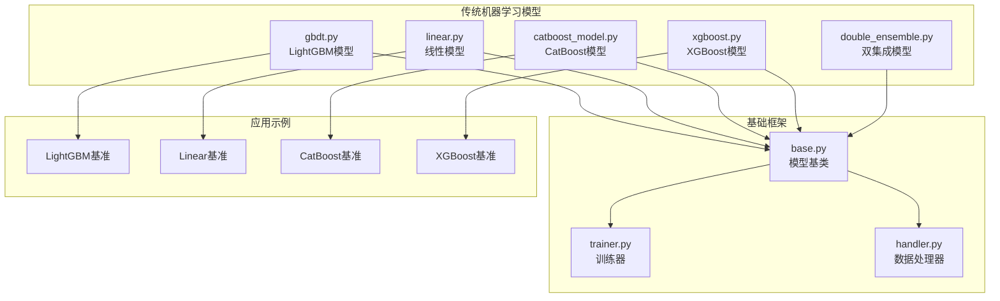
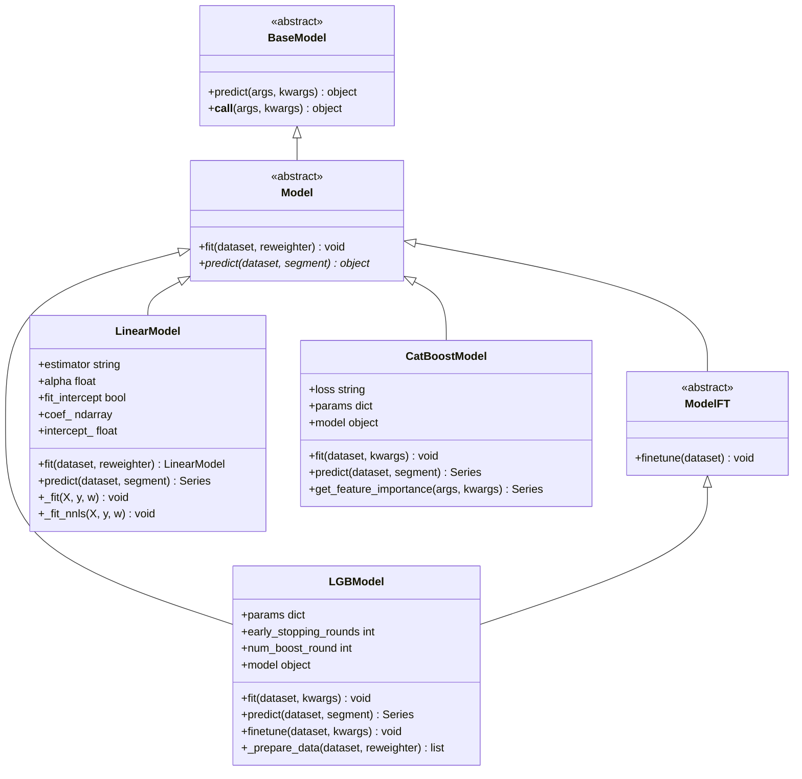
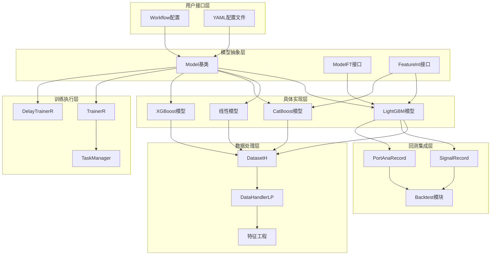
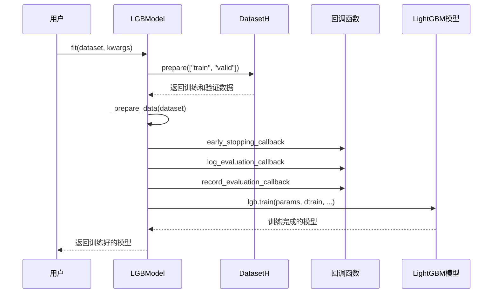
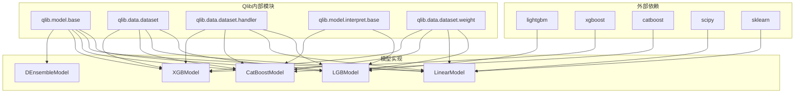

# Qlib传统机器学习模型详细文档

<cite>
**本文档引用的文件**
- [gbdt.py](file://qlib/contrib/model/gbdt.py)
- [linear.py](file://qlib/contrib/model/linear.py)
- [catboost_model.py](file://qlib/contrib/model/catboost_model.py)
- [xgboost.py](file://qlib/contrib/model/xgboost.py)
- [double_ensemble.py](file://qlib/contrib/model/double_ensemble.py)
- [__init__.py](file://qlib/contrib/model/__init__.py)
- [base.py](file://qlib/model/base.py)
- [workflow_config_lightgbm_Alpha158.yaml](file://examples/benchmarks/LightGBM/workflow_config_lightgbm_Alpha158.yaml)
- [workflow_config_linear_Alpha158.yaml](file://examples/benchmarks/Linear/workflow_config_linear_Alpha158.yaml)
- [handler.py](file://qlib/data/dataset/handler.py)
- [signal.py](file://qlib/backtest/signal.py)
- [trainer.py](file://qlib/model/trainer.py)
</cite>

## 目录
1. [简介](#简介)
2. [项目结构概览](#项目结构概览)
3. [核心组件分析](#核心组件分析)
4. [架构概览](#架构概览)
5. [详细组件分析](#详细组件分析)
6. [依赖关系分析](#依赖关系分析)
7. [性能考虑](#性能考虑)
8. [故障排除指南](#故障排除指南)
9. [结论](#结论)

## 简介

Qlib是一个面向量化投资研究的Python框架，提供了完整的机器学习模型集成能力。本文档专注于Qlib中传统机器学习模型的实现，特别是基于梯度提升树（LightGBM、XGBoost、CatBoost）和线性模型的集成机制。

这些传统机器学习模型通过统一的接口集成到Qlib框架中，为量化因子建模提供了强大的预测能力。它们支持从特征工程到模型训练再到回测评估的完整工作流，特别适用于金融时间序列数据的建模任务。

## 项目结构概览

Qlib的传统机器学习模型主要位于`qlib/contrib/model/`目录下，包含以下核心模块：



**图表来源**
- [gbdt.py](file://qlib/contrib/model/gbdt.py#L1-L125)
- [linear.py](file://qlib/contrib/model/linear.py#L1-L114)
- [catboost_model.py](file://qlib/contrib/model/catboost_model.py#L1-L99)

**章节来源**
- [__init__.py](file://qlib/contrib/model/__init__.py#L1-L42)

## 核心组件分析

### 模型基类系统

所有传统机器学习模型都继承自统一的基类系统，确保了一致的接口和行为：



**图表来源**
- [base.py](file://qlib/model/base.py#L1-L111)
- [gbdt.py](file://qlib/contrib/model/gbdt.py#L15-L125)
- [linear.py](file://qlib/contrib/model/linear.py#L15-L114)
- [catboost_model.py](file://qlib/contrib/model/catboost_model.py#L15-L99)

**章节来源**
- [base.py](file://qlib/model/base.py#L1-L111)
- [gbdt.py](file://qlib/contrib/model/gbdt.py#L1-L125)
- [linear.py](file://qlib/contrib/model/linear.py#L1-L114)

## 架构概览

Qlib的传统机器学习模型采用分层架构设计，实现了高度的模块化和可扩展性：



**图表来源**
- [trainer.py](file://qlib/model/trainer.py#L1-L620)
- [handler.py](file://qlib/data/dataset/handler.py#L1-L201)
- [signal.py](file://qlib/backtest/signal.py#L1-L106)

## 详细组件分析

### LightGBM模型实现

LightGBM模型是Qlib中最成熟的传统机器学习模型实现，提供了丰富的功能和优化：

#### 核心特性

1. **灵活的损失函数支持**：支持均方误差（mse）和二元分类（binary）
2. **早停机制**：内置早停回调函数，防止过拟合
3. **特征重要性分析**：提供多种特征重要性计算方法
4. **微调功能**：支持在线微调和增量训练

#### 关键实现细节

```python
class LGBModel(ModelFT, LightGBMFInt):
    def __init__(self, loss="mse", early_stopping_rounds=50, num_boost_round=1000, **kwargs):
        if loss not in {"mse", "binary"}:
            raise NotImplementedError
        self.params = {"objective": loss, "verbosity": -1}
        self.params.update(kwargs)
        self.early_stopping_rounds = early_stopping_rounds
        self.num_boost_round = num_boost_round
        self.model = None
```

#### 训练流程



**图表来源**
- [gbdt.py](file://qlib/contrib/model/gbdt.py#L45-L85)

**章节来源**
- [gbdt.py](file://qlib/contrib/model/gbdt.py#L1-L125)

### 线性模型实现

线性模型提供了简单而有效的回归解决方案，支持多种正则化技术：

#### 支持的回归类型

1. **普通最小二乘法（OLS）**：标准的线性回归
2. **非负最小二乘法（NNLS）**：约束系数为非负
3. **岭回归（Ridge）**：L2正则化
4. **套索回归（Lasso）**：L1正则化

#### 实现特点

```python
class LinearModel(Model):
    OLS = "ols"
    NNLS = "nnls"
    RIDGE = "ridge"
    LASSO = "lasso"
    
    def __init__(self, estimator="ols", alpha=0.0, fit_intercept=False, include_valid: bool = False):
        assert estimator in [self.OLS, self.NNLS, self.RIDGE, self.LASSO]
        self.estimator = estimator
        self.alpha = alpha
        self.fit_intercept = fit_intercept
        self.coef_ = None
        self.include_valid = include_valid
```

#### 特征选择和正则化

线性模型支持多种特征选择策略：
- **无正则化**：适用于小规模数据集
- **L1正则化（Lasso）**：自动特征选择
- **L2正则化（Ridge）**：防止多重共线性
- **弹性网络**：结合L1和L2正则化

**章节来源**
- [linear.py](file://qlib/contrib/model/linear.py#L1-L114)

### CatBoost模型实现

CatBoost模型专门针对类别特征进行了优化，提供了强大的特征处理能力：

#### 核心优势

1. **自动类别特征处理**：无需手动编码类别变量
2. **鲁棒的过拟合控制**：内置多种防过拟合机制
3. **GPU支持**：支持GPU加速训练
4. **特征重要性评估**：提供多种重要性计算方法

#### 配置参数

```python
class CatBoostModel(Model, FeatureInt):
    def __init__(self, loss="RMSE", **kwargs):
        if loss not in {"RMSE", "Logloss"}:
            raise NotImplementedError
        self._params = {"loss_function": loss}
        self._params.update(kwargs)
        self.model = None
```

**章节来源**
- [catboost_model.py](file://qlib/contrib/model/catboost_model.py#L1-L99)

### XGBoost模型实现

XGBoost模型提供了高效的梯度提升算法实现：

#### 主要特性

1. **高效计算**：优化的C++后端实现
2. **灵活的损失函数**：支持多种目标函数
3. **并行计算**：支持多线程训练
4. **模型压缩**：支持模型剪枝和压缩

#### 数据预处理

```python
def _prepare_data_gbm(self, df_train, df_valid, weights, features):
    x_train, y_train = df_train["feature"].loc[:, features], df_train["label"]
    x_valid, y_valid = df_valid["feature"].loc[:, features], df_valid["label"]
    
    # Lightgbm需要1D数组作为标签
    if y_train.values.ndim == 2 and y_train.values.shape[1] == 1:
        y_train, y_valid = np.squeeze(y_train.values), np.squeeze(y_valid.values)
    else:
        raise ValueError("LightGBM doesn't support multi-label training")
```

**章节来源**
- [xgboost.py](file://qlib/contrib/model/xgboost.py#L1-L44)

## 依赖关系分析

传统机器学习模型的依赖关系展现了清晰的层次结构：



**图表来源**
- [__init__.py](file://qlib/contrib/model/__init__.py#L1-L42)
- [gbdt.py](file://qlib/contrib/model/gbdt.py#L1-L15)
- [linear.py](file://qlib/contrib/model/linear.py#L1-L15)

**章节来源**
- [__init__.py](file://qlib/contrib/model/__init__.py#L1-L42)

## 性能考虑

### 内存管理

传统机器学习模型在处理大规模金融数据时需要特别注意内存使用：

1. **数据预处理优化**：使用稀疏矩阵表示避免内存浪费
2. **批量处理**：支持大数据集的分批处理
3. **模型缓存**：合理使用模型缓存减少重复计算

### 训练效率

1. **并行计算**：利用多核CPU进行并行训练
2. **早停机制**：防止不必要的训练迭代
3. **特征选择**：减少特征维度提高训练速度

### 推理优化

1. **模型压缩**：支持模型剪枝和量化
2. **批处理推理**：支持批量预测提高吞吐量
3. **缓存机制**：缓存常用预测结果

## 故障排除指南

### 常见问题及解决方案

#### 1. 模型训练失败

**问题症状**：训练过程中出现错误或模型无法收敛

**可能原因**：
- 数据质量问题（缺失值、异常值）
- 特征尺度不一致
- 参数设置不当

**解决方案**：
```python
# 检查数据质量
df_train = dataset.prepare("train", col_set=["feature", "label"], data_key=DataHandlerLP.DK_L)
print(df_train.isnull().sum())

# 使用数据预处理
from qlib.data.dataset.processor import RobustZScoreNorm
processor = RobustZScoreNorm()
df_train = processor.apply(df_train)
```

#### 2. 过拟合问题

**问题症状**：训练集表现良好但测试集表现差

**解决方案**：
- 调整正则化参数
- 增加早停轮数
- 减少模型复杂度

#### 3. 特征重要性分析

**问题症状**：无法获取特征重要性信息

**解决方案**：
```python
# 对于LightGBM和CatBoost模型
feature_importance = model.get_feature_importance()
print(feature_importance.head(10))

# 可视化特征重要性
import matplotlib.pyplot as plt
feature_importance.plot(kind='bar')
plt.show()
```

**章节来源**
- [gbdt.py](file://qlib/contrib/model/gbdt.py#L85-L125)
- [catboost_model.py](file://qlib/contrib/model/catboost_model.py#L79-L99)

## 结论

Qlib的传统机器学习模型提供了完整的量化因子建模解决方案。通过统一的接口设计，这些模型能够无缝集成到Qlib的完整工作流中，从数据准备到模型训练再到回测评估。

### 主要优势

1. **统一接口**：所有模型遵循相同的基类接口
2. **丰富功能**：支持早停、特征重要性、微调等功能
3. **易于使用**：通过YAML配置简化模型部署
4. **高性能**：充分利用现代硬件加速能力

### 应用场景

- **量化因子建模**：构建股票收益预测模型
- **风险因子分析**：识别影响资产价格的关键因素
- **组合优化**：基于预测信号进行投资组合构建
- **回测验证**：在历史数据上验证模型有效性

### 发展方向

1. **模型融合**：结合多个模型的预测结果
2. **在线学习**：支持模型的持续更新和优化
3. **自动化调参**：集成自动超参数优化功能
4. **分布式训练**：支持大规模数据集的分布式训练

通过深入理解这些传统机器学习模型的实现原理和最佳实践，用户可以更好地利用Qlib框架进行量化投资研究，构建稳健可靠的量化交易系统。