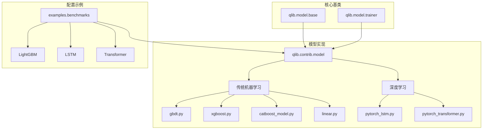
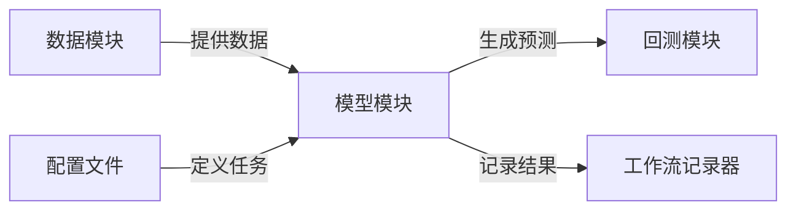
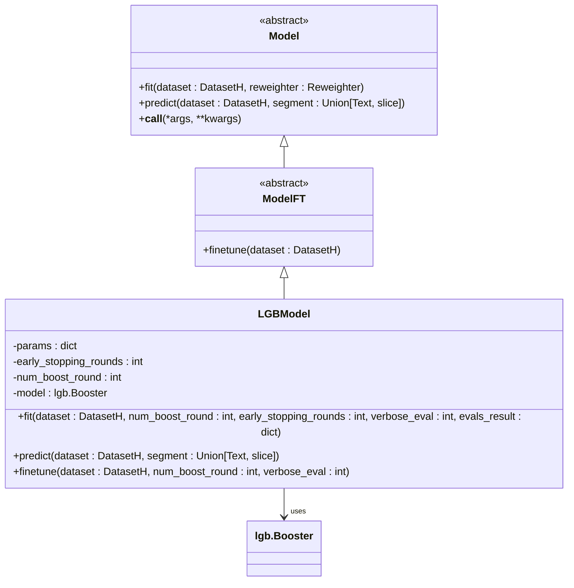
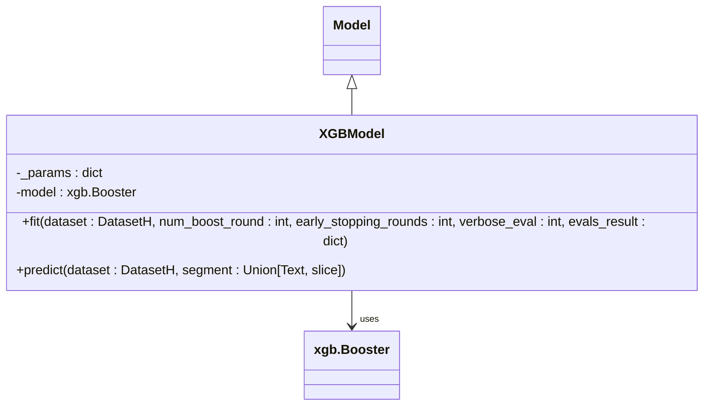
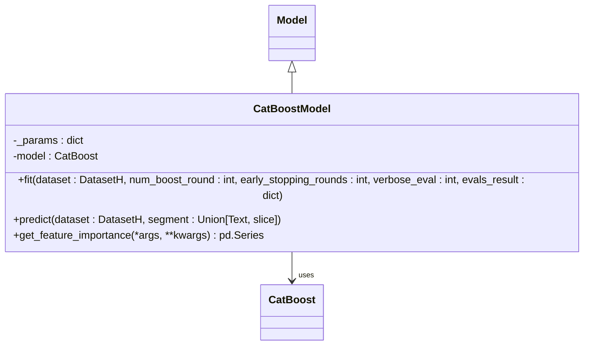
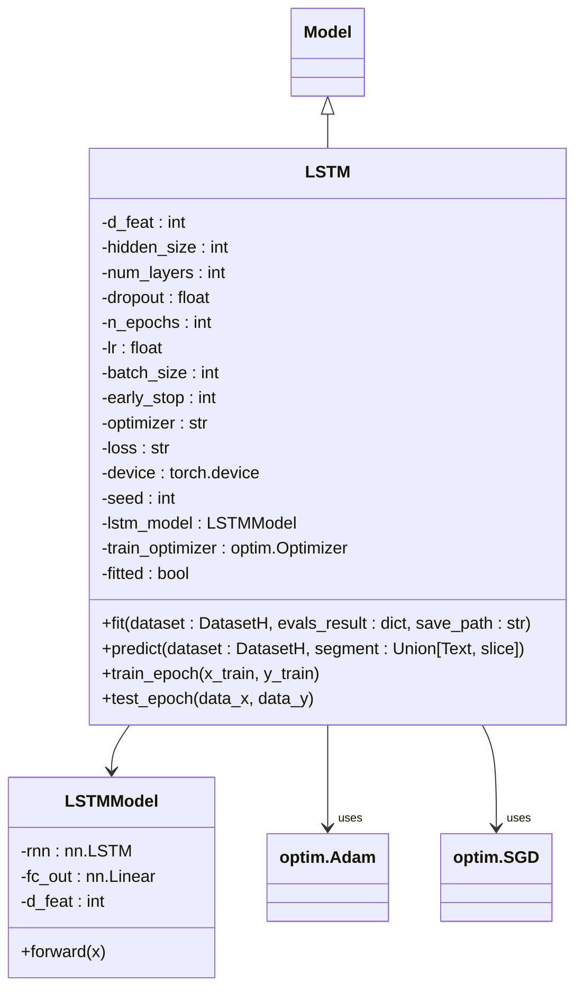
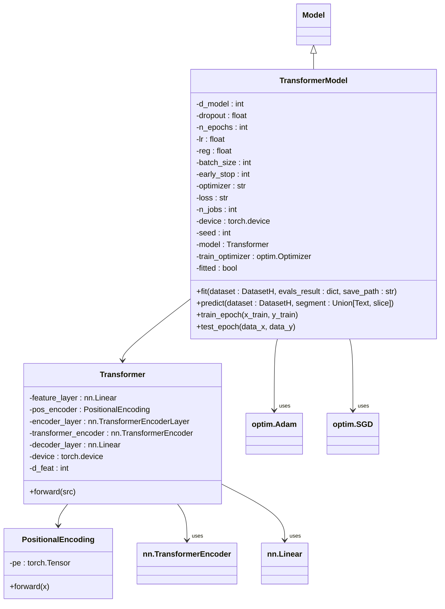
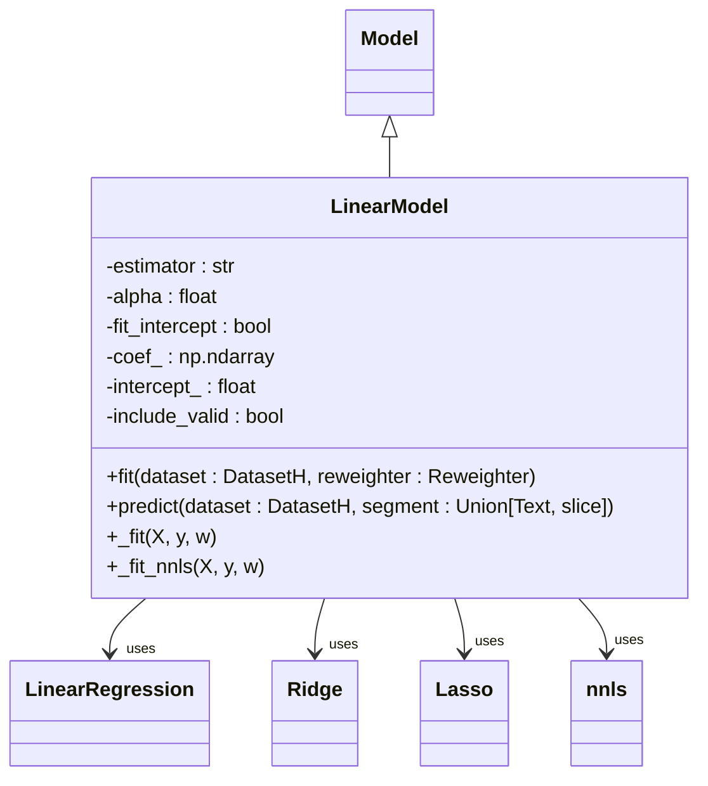
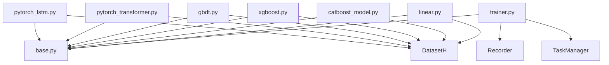

# 模型模块

<cite>
**本文档中引用的文件**  
- [LSTM.py](file://qlib/contrib/model/pytorch_lstm.py)
- [Transformer.py](file://qlib/contrib/model/pytorch_transformer.py)
- [gbdt.py](file://qlib/contrib/model/gbdt.py)
- [xgboost.py](file://qlib/contrib/model/xgboost.py)
- [catboost_model.py](file://qlib/contrib/model/catboost_model.py)
- [linear.py](file://qlib/contrib/model/linear.py)
- [base.py](file://qlib/model/base.py)
- [trainer.py](file://qlib/model/trainer.py)
- [workflow_config_lightgbm_Alpha360.yaml](file://examples/benchmarks/LightGBM/workflow_config_lightgbm_Alpha360.yaml)
- [workflow_config_lstm_Alpha360.yaml](file://examples/benchmarks/LSTM/workflow_config_lstm_Alpha360.yaml)
</cite>

## 目录
1. [简介](#简介)
2. [项目结构](#项目结构)
3. [核心组件](#核心组件)
4. [架构概述](#架构概述)
5. [详细组件分析](#详细组件分析)
6. [依赖关系分析](#依赖关系分析)
7. [性能考量](#性能考量)
8. [故障排除指南](#故障排除指南)
9. [结论](#结论)

## 简介
本文档深入探讨了 QLib 金融机器学习框架中的模型模块，重点分析传统机器学习模型（如 LightGBM、XGBoost、CatBoost）和深度学习模型（如 LSTM、Transformer）的实现细节、调用关系、接口、领域模型和使用模式。文档涵盖了模型的定义、训练流程、配置选项、参数和返回值，并解释了模型与数据处理及回测模块的关系。通过实际代码库示例，旨在为初学者和技术专家提供清晰、全面的理解。

## 项目结构
QLib 的模型模块主要分布在 `qlib/contrib/model` 目录下，该目录包含了多种机器学习和深度学习模型的实现。模型实现遵循统一的基类接口，确保了框架的一致性和可扩展性。`examples/benchmarks` 目录提供了各种模型的实际使用配置示例，展示了如何将模型集成到完整的量化研究工作流中。

**图示来源**
- [pytorch_lstm.py](file://qlib/contrib/model/pytorch_lstm.py)
- [pytorch_transformer.py](file://qlib/contrib/model/pytorch_transformer.py)
- [gbdt.py](file://qlib/contrib/model/gbdt.py)
- [xgboost.py](file://qlib/contrib/model/xgboost.py)
- [catboost_model.py](file://qlib/contrib/model/catboost_model.py)
- [linear.py](file://qlib/contrib/model/linear.py)
- [base.py](file://qlib/model/base.py)
- [trainer.py](file://qlib/model/trainer.py)
- [workflow_config_lightgbm_Alpha360.yaml](file://examples/benchmarks/LightGBM/workflow_config_lightgbm_Alpha360.yaml)
- [workflow_config_lstm_Alpha360.yaml](file://examples/benchmarks/LSTM/workflow_config_lstm_Alpha360.yaml)

**本节来源**
- [qlib/contrib/model](file://qlib/contrib/model)
- [examples/benchmarks](file://examples/benchmarks)

## 核心组件
QLib 模型模块的核心组件包括模型基类、具体模型实现和训练器。模型基类（`Model`）定义了所有模型必须实现的 `fit` 和 `predict` 方法，确保了接口的一致性。具体模型实现（如 `LGBModel`, `XGBModel`, `LSTM`, `TransformerModel`）继承自基类，并提供了特定算法的训练和预测逻辑。训练器（`TrainerR`, `DelayTrainerRM`）负责管理模型的训练生命周期，支持单线程和多进程训练模式。

**本节来源**
- [base.py](file://qlib/model/base.py#L1-L111)
- [trainer.py](file://qlib/model/trainer.py#L1-L620)

## 架构概述
QLib 的模型架构采用分层设计，上层是具体的模型实现，中层是统一的模型基类和训练器，底层是数据处理和回测模块。模型通过 `DatasetH` 接口从数据模块获取训练和测试数据，并将预测结果传递给回测模块进行策略评估。这种松耦合的设计使得用户可以轻松地替换不同的模型，而无需修改数据处理或回测逻辑。

**图示来源**
- [base.py](file://qlib/model/base.py#L1-L111)
- [pytorch_lstm.py](file://qlib/contrib/model/pytorch_lstm.py)
- [pytorch_transformer.py](file://qlib/contrib/model/pytorch_transformer.py)
- [gbdt.py](file://qlib/contrib/model/gbdt.py)

## 详细组件分析

### 传统机器学习模型分析
QLib 中的传统机器学习模型（如 LightGBM、XGBoost、CatBoost）主要基于 `Model` 基类实现。这些模型的 `fit` 方法负责训练模型，`predict` 方法用于生成预测。模型通过 `dataset.prepare` 方法获取训练、验证和测试数据，并支持早停、评估结果记录和模型保存。

#### LightGBM 模型
LightGBM 模型通过 `LGBModel` 类实现，继承自 `ModelFT`（可微调模型）。其 `fit` 方法使用 LightGBM 库的 `lgb.train` 函数进行训练，并支持早停和评估结果记录。

**图示来源**
- [gbdt.py](file://qlib/contrib/model/gbdt.py#L1-L25)
- [highfreq_gdbt_model.py](file://qlib/contrib/model/highfreq_gdbt_model.py#L111-L144)

#### XGBoost 模型
XGBoost 模型通过 `XGBModel` 类实现，其 `fit` 方法使用 XGBoost 库的 `xgb.train` 函数进行训练。与 LightGBM 类似，它也支持早停和评估结果记录。

**图示来源**
- [xgboost.py](file://qlib/contrib/model/xgboost.py#L1-L44)

#### CatBoost 模型
CatBoost 模型通过 `CatBoostModel` 类实现，其 `fit` 方法使用 CatBoost 库的 `CatBoost` 类进行训练。它还提供了 `get_feature_importance` 方法来获取特征重要性。

**图示来源**
- [catboost_model.py](file://qlib/contrib/model/catboost_model.py#L1-L100)

### 深度学习模型分析
QLib 中的深度学习模型（如 LSTM、Transformer）基于 PyTorch 实现，并遵循与传统机器学习模型相同的基类接口。这些模型的 `fit` 方法负责训练神经网络，`predict` 方法用于生成预测。

#### LSTM 模型
LSTM 模型通过 `LSTM` 类实现，其 `fit` 方法使用 PyTorch 的 `Adam` 或 `SGD` 优化器进行训练。模型支持早停、评估结果记录和模型保存。

**图示来源**
- [pytorch_lstm.py](file://qlib/contrib/model/pytorch_lstm.py#L1-L307)

#### Transformer 模型
Transformer 模型通过 `TransformerModel` 类实现，其 `fit` 方法使用 PyTorch 的 `Adam` 或 `SGD` 优化器进行训练。模型包含位置编码、特征层、编码器和解码器等组件。

**图示来源**
- [pytorch_transformer.py](file://qlib/contrib/model/pytorch_transformer.py#L1-L286)

### 线性模型分析
线性模型通过 `LinearModel` 类实现，支持多种回归方法，如普通最小二乘法（OLS）、非负最小二乘法（NNLS）、岭回归（Ridge）和套索回归（Lasso）。

**图示来源**
- [linear.py](file://qlib/contrib/model/linear.py#L1-L114)

## 依赖关系分析
QLib 模型模块的依赖关系清晰，模型实现依赖于 `qlib.model.base` 中的基类和 `qlib.data.dataset` 中的数据集接口。训练器依赖于 `qlib.workflow` 中的记录器和任务管理器。这种模块化的设计使得各组件可以独立开发和测试。

**图示来源**
- [pytorch_lstm.py](file://qlib/contrib/model/pytorch_lstm.py)
- [pytorch_transformer.py](file://qlib/contrib/model/pytorch_transformer.py)
- [gbdt.py](file://qlib/contrib/model/gbdt.py)
- [xgboost.py](file://qlib/contrib/model/xgboost.py)
- [catboost_model.py](file://qlib/contrib/model/catboost_model.py)
- [linear.py](file://qlib/contrib/model/linear.py)
- [base.py](file://qlib/model/base.py)
- [trainer.py](file://qlib/model/trainer.py)

## 性能考量
在使用 QLib 模型时，需要注意以下性能考量：
- **GPU 支持**：深度学习模型（如 LSTM、Transformer）可以通过设置 `GPU` 参数来利用 GPU 进行加速训练。
- **批处理大小**：调整 `batch_size` 参数可以平衡内存使用和训练速度。
- **并行训练**：使用 `TrainerRM` 可以在多进程或多台机器上并行训练多个模型，提高训练效率。
- **内存管理**：训练完成后，可以调用 `torch.cuda.empty_cache()` 来释放 GPU 内存。

## 故障排除指南
在使用 QLib 模型时，可能会遇到以下常见问题：
- **空数据集**：确保数据集配置正确，训练、验证和测试数据集不为空。
- **多标签训练**：LightGBM、XGBoost 和 CatBoost 不支持多标签训练，确保标签数据为一维数组。
- **特征维度不匹配**：确保输入特征的维度与模型定义的 `d_feat` 参数匹配。
- **GPU 不可用**：检查 CUDA 驱动和 PyTorch 是否正确安装，确保 GPU 可用。

**本节来源**
- [pytorch_lstm.py](file://qlib/contrib/model/pytorch_lstm.py#L1-L307)
- [pytorch_transformer.py](file://qlib/contrib/model/pytorch_transformer.py#L1-L286)
- [gbdt.py](file://qlib/contrib/model/gbdt.py#L1-L25)
- [xgboost.py](file://qlib/contrib/model/xgboost.py#L1-L44)
- [catboost_model.py](file://qlib/contrib/model/catboost_model.py#L1-L100)

## 结论
QLib 的模型模块提供了一个强大且灵活的框架，用于实现和训练各种机器学习和深度学习模型。通过统一的基类接口和模块化的设计，用户可以轻松地集成和比较不同的模型。本文档详细介绍了传统机器学习模型和深度学习模型的实现细节、调用关系和使用模式，为用户提供了全面的指导。通过合理配置和优化，用户可以在 QLib 框架中高效地进行量化研究和模型开发。