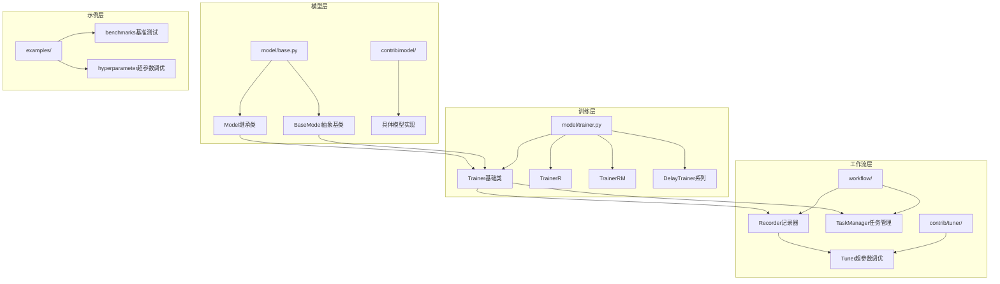
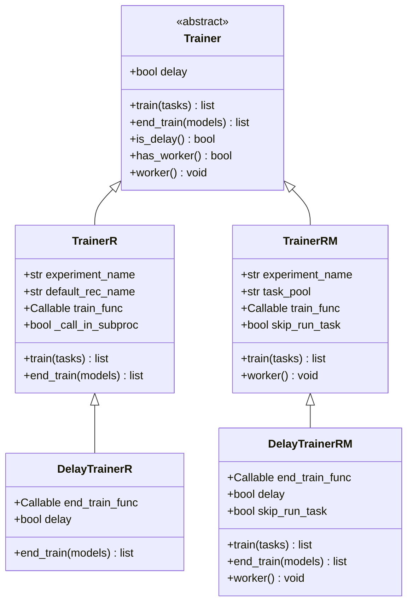
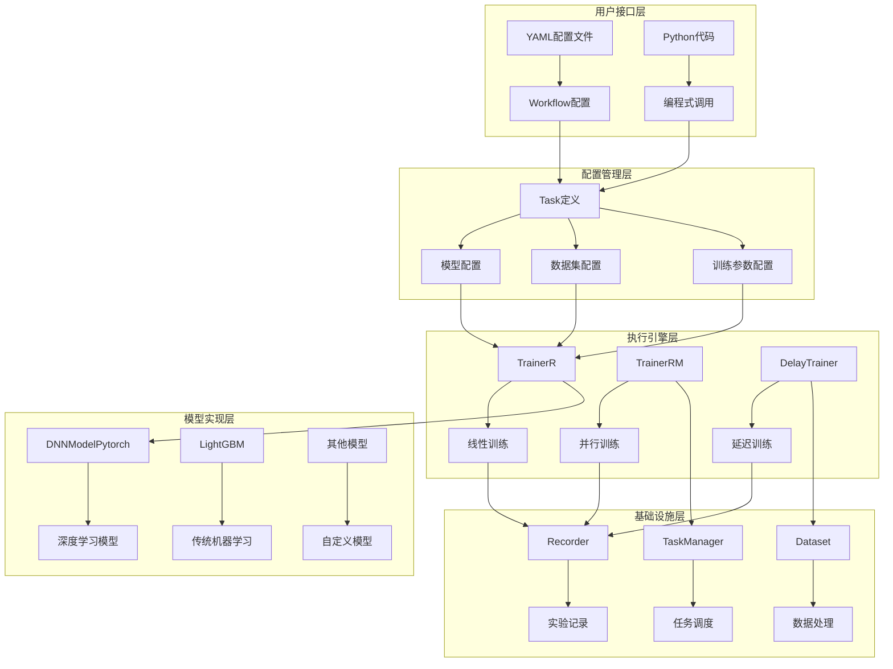
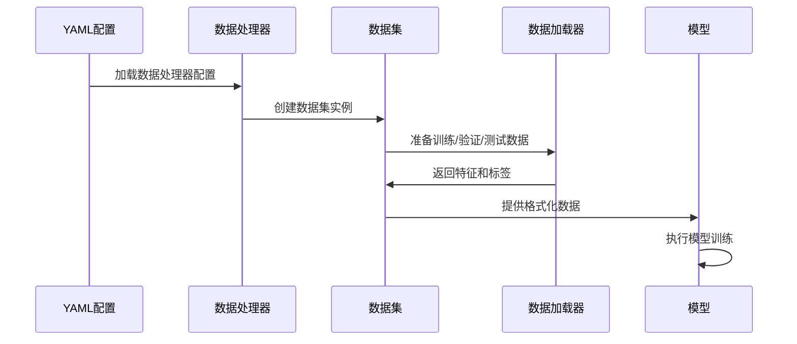
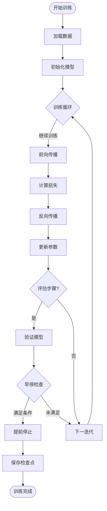
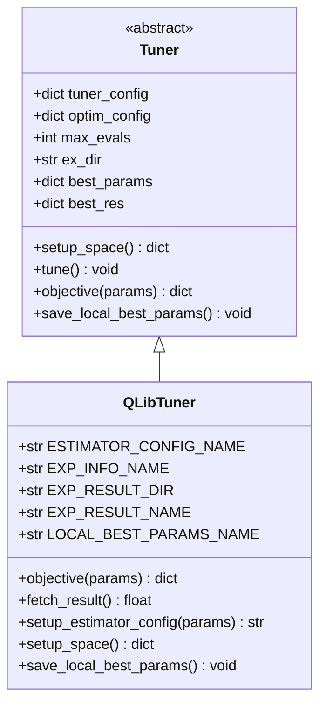
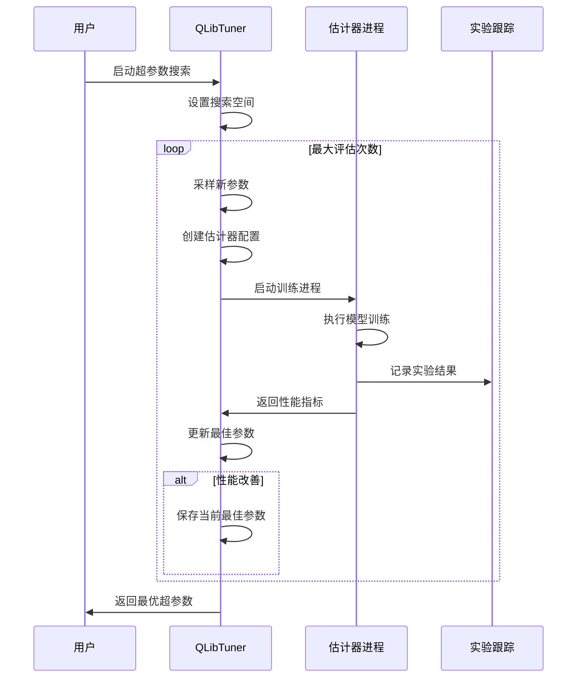
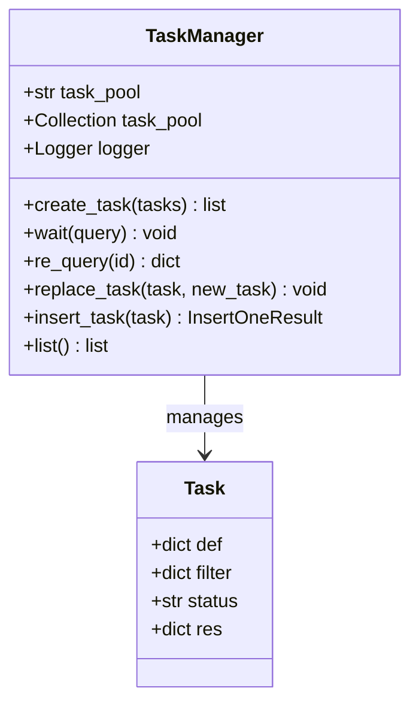
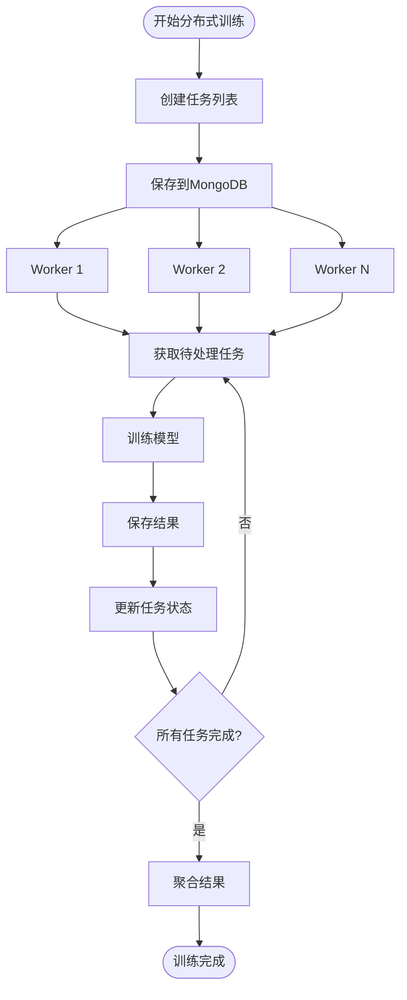
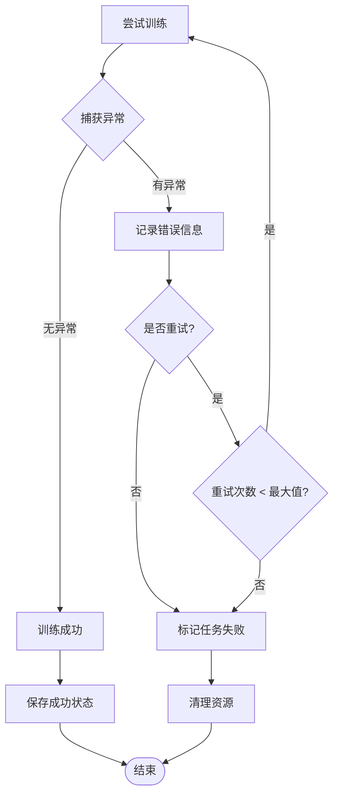

# QLib模型训练框架文档

<cite>
**本文档中引用的文件**
- [trainer.py](file://qlib/model/trainer.py)
- [base.py](file://qlib/model/base.py)
- [pytorch_nn.py](file://qlib/contrib/model/pytorch_nn.py)
- [tuner.py](file://qlib/contrib/tuner/tuner.py)
- [recorder.py](file://qlib/workflow/recorder.py)
- [manage.py](file://qlib/workflow/task/manage.py)
- [workflow_config_mlp_Alpha158.yaml](file://examples/benchmarks/MLP/workflow_config_mlp_Alpha158.yaml)
- [test_workflow.py](file://tests/test_workflow.py)
</cite>

## 目录
1. [简介](#简介)
2. [项目结构概览](#项目结构概览)
3. [核心组件分析](#核心组件分析)
4. [架构设计](#架构设计)
5. [详细组件分析](#详细组件分析)
6. [配置驱动的训练流程](#配置驱动的训练流程)
7. [超参数调优与Tuner模块](#超参数调优与tuner模块)
8. [分布式训练支持](#分布式训练支持)
9. [资源管理与异常处理](#资源管理与异常处理)
10. [最佳实践指南](#最佳实践指南)
11. [总结](#总结)

## 简介

QLib是一个面向量化投资研究的Python库，其模型训练框架提供了完整的机器学习工作流解决方案。该框架的核心设计理念是通过配置驱动的方式简化模型训练过程，同时提供灵活的扩展机制以支持各种深度学习模型和传统机器学习算法。

框架的主要特点包括：
- 基于配置的训练流程管理
- 统一的模型接口设计
- 支持多种训练模式（同步、异步、分布式）
- 完整的实验跟踪和结果记录
- 集成超参数调优功能
- 生产级的资源管理和错误处理

## 项目结构概览

QLib模型训练框架采用模块化设计，主要组件分布在以下目录结构中：



**图表来源**
- [base.py](file://qlib/model/base.py#L1-L111)
- [trainer.py](file://qlib/model/trainer.py#L1-L620)
- [recorder.py](file://qlib/workflow/recorder.py#L1-L494)

## 核心组件分析

### BaseModel抽象基类

BaseModel是整个模型体系的核心抽象基类，定义了所有模型必须实现的基本接口：

```python
class BaseModel(Serializable, metaclass=abc.ABCMeta):
    """模型抽象基类"""
    
    @abc.abstractmethod
    def predict(self, *args, **kwargs) -> object:
        """预测方法，模型训练完成后用于生成预测结果"""
    
    def __call__(self, *args, **kwargs) -> object:
        """重载函数调用操作符，使模型像函数一样使用"""
        return self.predict(*args, **kwargs)
```

Model类继承自BaseModel，为可学习模型添加了训练接口：

```python
class Model(BaseModel):
    """可学习模型基类"""
    
    def fit(self, dataset: Dataset, reweighter: Reweighter):
        """训练模型的核心方法，需要子类实现"""
        raise NotImplementedError()
    
    @abc.abstractmethod
    def predict(self, dataset: Dataset, segment: Union[Text, slice] = "test") -> object:
        """给定数据集进行预测"""
        raise NotImplementedError()
```

**章节来源**
- [base.py](file://qlib/model/base.py#L8-L111)

### Trainer训练器架构

Trainer类提供了统一的训练接口，支持多种训练模式：



**图表来源**
- [trainer.py](file://qlib/model/trainer.py#L75-L620)

## 架构设计

QLib模型训练框架采用了分层架构设计，每一层都有明确的职责分工：



**图表来源**
- [trainer.py](file://qlib/model/trainer.py#L1-L620)
- [recorder.py](file://qlib/workflow/recorder.py#L1-L494)

## 详细组件分析

### 数据加载与预处理

数据加载是训练流程的第一步，QLib提供了灵活的数据处理管道：



**图表来源**
- [workflow_config_mlp_Alpha158.yaml](file://examples/benchmarks/MLP/workflow_config_mlp_Alpha158.yaml#L1-L99)

### 训练循环与验证评估

训练循环包含了模型训练、验证评估和性能监控的完整流程：



**图表来源**
- [pytorch_nn.py](file://qlib/contrib/model/pytorch_nn.py#L1-L463)

### 检查点保存与恢复

检查点机制确保了训练过程的可靠性：

```python
# 检查点保存示例
def save_checkpoint(self, epoch, model, optimizer, scheduler, metrics):
    checkpoint = {
        'epoch': epoch,
        'model_state_dict': model.state_dict(),
        'optimizer_state_dict': optimizer.state_dict(),
        'scheduler_state_dict': scheduler.state_dict() if scheduler else None,
        'metrics': metrics,
        'best_loss': self.best_loss
    }
    torch.save(checkpoint, f'checkpoint_epoch_{epoch}.pth')
```

**章节来源**
- [pytorch_nn.py](file://qlib/contrib/model/pytorch_nn.py#L1-L199)

## 配置驱动的训练流程

QLib通过YAML配置文件实现了完全的配置驱动训练流程。这种设计使得用户可以通过修改配置文件来调整训练行为，而无需修改代码。

### 配置文件结构

典型的训练配置包含以下部分：

```yaml
qlib_init:
  provider_uri: "~/.qlib/qlib_data/cn_data"
  region: cn

task:
  model:
    class: DNNModelPytorch
    module_path: qlib.contrib.model.pytorch_nn
    kwargs:
      loss: mse
      lr: 0.002
      optimizer: adam
      max_steps: 8000
      batch_size: 8192
      GPU: 0
      weight_decay: 0.0002
  
  dataset:
    class: DatasetH
    module_path: qlib.data.dataset
    kwargs:
      handler:
        class: Alpha158
        module_path: qlib.contrib.data.handler
        kwargs: *data_handler_config
      segments:
        train: [2008-01-01, 2014-12-31]
        valid: [2015-01-01, 2016-12-31]
        test: [2017-01-01, 2020-08-01]
  
  record:
    - class: SignalRecord
      module_path: qlib.workflow.record_temp
      kwargs:
        model: <MODEL>
        dataset: <DATASET>
```

### 优化器选择与学习率调度

配置系统支持灵活的优化器选择和学习率调度策略：

```python
# 优化器配置示例
optimizers = {
    'adam': optim.Adam(model.parameters(), lr=lr, weight_decay=weight_decay),
    'sgd': optim.SGD(model.parameters(), lr=lr, weight_decay=weight_decay)
}

# 学习率调度器配置
if scheduler == "default":
    scheduler = torch.optim.lr_scheduler.ReduceLROnPlateau(
        optimizer, mode="min", factor=0.5, patience=10
    )
```

**章节来源**
- [workflow_config_mlp_Alpha158.yaml](file://examples/benchmarks/MLP/workflow_config_mlp_Alpha158.yaml#L1-L99)
- [pytorch_nn.py](file://qlib/contrib/model/pytorch_nn.py#L100-L150)

## 超参数调优与Tuner模块

QLib的Tuner模块提供了强大的超参数自动搜索功能，支持贝叶斯优化算法。

### Tuner架构设计



**图表来源**
- [tuner.py](file://qlib/contrib/tuner/tuner.py#L1-L216)

### 多阶段训练流程

Tuner支持多阶段训练，允许在不同阶段搜索不同的超参数空间：



**图表来源**
- [tuner.py](file://qlib/contrib/tuner/tuner.py#L50-L150)

**章节来源**
- [tuner.py](file://qlib/contrib/tuner/tuner.py#L1-L216)

## 分布式训练支持

QLib提供了完整的分布式训练支持，通过TaskManager实现任务的分布式调度和执行。

### TaskManager任务管理



**图表来源**
- [manage.py](file://qlib/workflow/task/manage.py#L1-L557)

### 分布式训练流程



**图表来源**
- [manage.py](file://qlib/workflow/task/manage.py#L100-L200)

**章节来源**
- [manage.py](file://qlib/workflow/task/manage.py#L1-L557)

## 资源管理与异常处理

### 内存管理

QLib提供了多种内存管理策略：

```python
# 子进程执行以强制释放内存
if self._call_in_subproc:
    get_module_logger("TrainerR").info("running models in sub process (for forcing release memroy).")
    train_func = call_in_subproc(train_func, C)
```

### 异常处理机制



### 日志记录系统

QLib使用结构化的日志记录系统：

```python
# 记录任务信息
def _log_task_info(task_config: dict):
    R.log_params(**flatten_dict(task_config))
    R.save_objects(**{"task": task_config})
    R.set_tags(**{"hostname": socket.gethostname()})
```

**章节来源**
- [trainer.py](file://qlib/model/trainer.py#L30-L50)

## 最佳实践指南

### 自定义训练逻辑扩展

要扩展训练框架，需要遵循以下步骤：

1. **继承BaseModel或Model类**：
```python
class CustomModel(Model):
    def fit(self, dataset, reweighter=None):
        # 实现自定义训练逻辑
        pass
    
    def predict(self, dataset, segment="test"):
        # 实现预测逻辑
        pass
```

2. **注册到配置系统**：
```yaml
task:
  model:
    class: CustomModel
    module_path: my_package.models
    kwargs:
      custom_param: value
```

3. **实现必要的序列化方法**：
```python
class CustomModel(Model, Serializable):
    def __getstate__(self):
        # 返回可序列化的状态
        pass
    
    def __setstate__(self, state):
        # 从序列化状态恢复
        pass
```

### 性能优化建议

1. **批量处理**：合理设置batch_size以平衡内存使用和训练效率
2. **数据预加载**：使用多进程数据加载加速数据准备
3. **梯度累积**：对于大批次训练，使用梯度累积技术
4. **混合精度训练**：在支持的硬件上启用FP16训练

### 生产环境部署

1. **监控指标**：定期监控训练损失、验证指标和资源使用情况
2. **自动化重启**：设置故障自动重启机制
3. **资源限制**：合理设置CPU、内存和GPU使用限制
4. **备份策略**：定期备份模型检查点和实验配置

## 总结

QLib模型训练框架通过其模块化设计和配置驱动的方法，为量化投资研究提供了强大而灵活的机器学习平台。框架的核心优势包括：

1. **统一的接口设计**：BaseModel抽象基类确保了所有模型的一致性
2. **灵活的配置系统**：YAML配置文件支持复杂的训练流程定制
3. **完整的生命周期管理**：从数据加载到模型部署的全流程支持
4. **强大的扩展能力**：支持自定义模型和训练逻辑
5. **生产级特性**：完善的资源管理、异常处理和监控机制

通过合理使用这些组件和遵循最佳实践，研究人员和开发者可以高效地构建和部署机器学习模型，推动量化投资领域的技术创新。