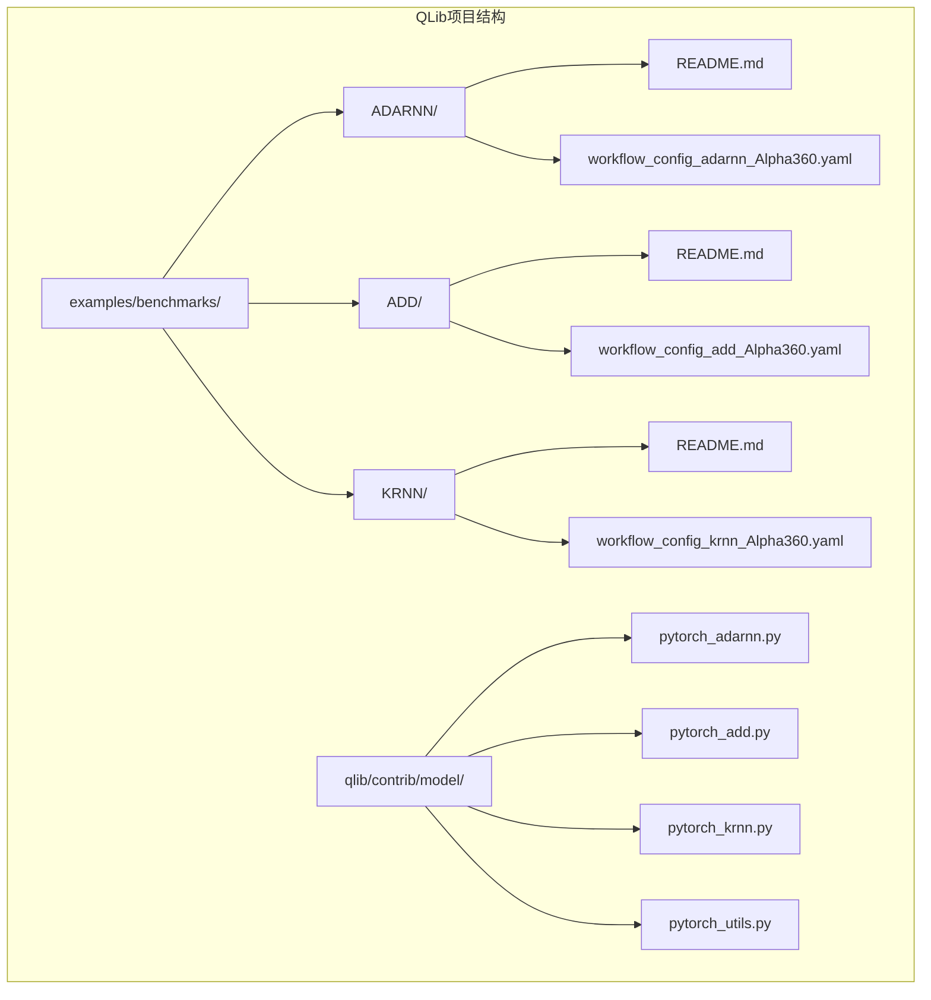

# ADARNN、ADD与KRNN模型综合分析文档

<cite>
**本文档引用的文件**
- [pytorch_adarnn.py](file://qlib/contrib/model/pytorch_adarnn.py)
- [pytorch_add.py](file://qlib/contrib/model/pytorch_add.py)
- [pytorch_krnn.py](file://qlib/contrib/model/pytorch_krnn.py)
- [workflow_config_adarnn_Alpha360.yaml](file://examples/benchmarks/ADARNN/workflow_config_adarnn_Alpha360.yaml)
- [workflow_config_add_Alpha360.yaml](file://examples/benchmarks/ADD/workflow_config_add_Alpha360.yaml)
- [workflow_config_krnn_Alpha360.yaml](file://examples/benchmarks/KRNN/workflow_config_krnn_Alpha360.yaml)
- [pytorch_utils.py](file://qlib/contrib/model/pytorch_utils.py)
- [base.py](file://qlib/model/base.py)
</cite>

## 目录
1. [引言](#引言)
2. [项目结构概述](#项目结构概述)
3. [ADARNN模型详解](#adarnn模型详解)
4. [ADD模型详解](#add模型详解)
5. [KRNN模型详解](#krnn模型详解)
6. [三模型架构对比](#三模型架构对比)
7. [性能分析与优化](#性能分析与优化)
8. [应用场景建议](#应用场景建议)
9. [故障排除指南](#故障排除指南)
10. [总结](#总结)

## 引言

ADARNN（Adaptive Attention Recurrent Neural Network）、ADD（Attention-based Dual Dynamics）和KRNN（Kernel Recurrent Neural Network）是三种先进的深度学习架构，专门设计用于处理复杂的金融时间序列预测任务。这些模型通过不同的创新机制解决了传统RNN在处理非平稳金融数据时面临的挑战。

ADARNN引入了自适应注意力门控机制，能够动态调整不同时间步的重要性；ADD实现了双动态建模，将趋势和波动分离以提高预测精度；KRNN则利用核函数技术进行隐状态更新，增强了模型的泛化能力。本文档将深入分析这三种模型的核心原理、实现细节和应用策略。

## 项目结构概述

QLib项目采用模块化的架构设计，将不同类型的模型组织在清晰的目录结构中：

**图表来源**
- [pytorch_adarnn.py](file://qlib/contrib/model/pytorch_adarnn.py#L1-L50)
- [pytorch_add.py](file://qlib/contrib/model/pytorch_add.py#L1-L50)
- [pytorch_krnn.py](file://qlib/contrib/model/pytorch_krnn.py#L1-L50)

**章节来源**
- [pytorch_adarnn.py](file://qlib/contrib/model/pytorch_adarnn.py#L1-L100)
- [pytorch_add.py](file://qlib/contrib/model/pytorch_add.py#L1-L100)
- [pytorch_krnn.py](file://qlib/contrib/model/pytorch_krnn.py#L1-L100)

## ADARNN模型详解

### 自适应注意力门控机制

ADARNN模型的核心创新在于其自适应注意力门控机制，该机制能够动态地为每个时间步分配权重，从而更好地捕捉金融时间序列中的重要模式。

**图表来源**
- [pytorch_adarnn.py](file://qlib/contrib/model/pytorch_adarnn.py#L25-L150)
- [pytorch_adarnn.py](file://qlib/contrib/model/pytorch_adarnn.py#L600-L700)

### 前向传播逻辑

ADARNN的前向传播过程分为预训练阶段和提升阶段两个主要部分：

**图表来源**
- [pytorch_adarnn.py](file://qlib/contrib/model/pytorch_adarnn.py#L150-L250)

### 超参数配置要点

ADARNN的关键超参数包括：
- **d_feat**: 输入特征维度，默认为6
- **hidden_size**: 隐藏层大小，默认为64
- **num_layers**: GRU层数，默认为2
- **dw**: 传输损失权重，默认为0.5
- **loss_type**: 传输损失类型，默认为"cosine"
- **len_seq**: 序列长度，默认为60

**章节来源**
- [pytorch_adarnn.py](file://qlib/contrib/model/pytorch_adarnn.py#L25-L150)
- [workflow_config_adarnn_Alpha360.yaml](file://examples/benchmarks/ADARNN/workflow_config_adarnn_Alpha360.yaml#L40-L60)

## ADD模型详解

### 双动态建模能力

ADD模型通过分离趋势和波动两个动态分量，实现了更精确的股票趋势预测。这种分离机制使得模型能够同时捕捉长期趋势和短期波动特征。

**图表来源**
- [pytorch_add.py](file://qlib/contrib/model/pytorch_add.py#L25-L150)
- [pytorch_add.py](file://qlib/contrib/model/pytorch_add.py#L400-L500)

### 损失函数设计

ADD模型采用了多目标损失函数，包括预训练损失、对抗损失和重构损失：

**图表来源**
- [pytorch_add.py](file://qlib/contrib/model/pytorch_add.py#L150-L250)

### 训练稳定性优化技巧

ADD模型通过以下技巧确保训练稳定性：

1. **渐进式对抗训练**: 使用RevGrad技术逐步增加对抗权重
2. **梯度裁剪**: 限制梯度范数防止梯度爆炸
3. **早停机制**: 基于验证集指标进行早停
4. **学习率调度**: 动态调整学习率

**章节来源**
- [pytorch_add.py](file://qlib/contrib/model/pytorch_add.py#L25-L200)
- [workflow_config_add_Alpha360.yaml](file://examples/benchmarks/ADD/workflow_config_add_Alpha360.yaml#L40-L70)

## KRNN模型详解

### 基于核函数的隐状态更新

KRNN模型创新性地结合了CNN和GRU的优势，通过并行RNN架构增强模型的表达能力。

**图表来源**
- [pytorch_krnn.py](file://qlib/contrib/model/pytorch_krnn.py#L25-L150)
- [pytorch_krnn.py](file://qlib/contrib/model/pytorch_krnn.py#L200-L300)

### 并行RNN架构

KRNN的核心创新在于其并行RNN架构，通过多个独立的RNN并行处理相同的数据：

**图表来源**
- [pytorch_krnn.py](file://qlib/contrib/model/pytorch_krnn.py#L80-L120)

### 核心组件分析

KRNN模型包含三个关键组件：

1. **CNN编码器**: 提取局部特征
2. **KRNN编码器**: 处理序列依赖关系
3. **输出层**: 生成最终预测

**章节来源**
- [pytorch_krnn.py](file://qlib/contrib/model/pytorch_krnn.py#L25-L200)
- [workflow_config_krnn_Alpha360.yaml](file://examples/benchmarks/KRNN/workflow_config_krnn_Alpha360.yaml#L40-L60)

## 三模型架构对比

### 架构差异分析

### 性能特点对比

| 特性 | ADARNN | ADD | KRNN |
|------|--------|-----|------|
| **优势** | 自适应权重分配 | 双动态建模 | 并行处理能力 |
| **适用场景** | 金融时间序列 | 股票趋势预测 | 多变量时间序列 |
| **复杂度** | 中等 | 高 | 中等 |
| **训练稳定性** | 良好 | 优秀 | 良好 |

## 性能分析与优化

### 训练效率优化

所有三种模型都采用了多种优化技术：

1. **梯度裁剪**: 防止梯度爆炸
2. **早停机制**: 避免过拟合
3. **批量归一化**: 加速收敛
4. **学习率调度**: 动态调整学习率

### 内存使用优化

**章节来源**
- [pytorch_utils.py](file://qlib/contrib/model/pytorch_utils.py#L10-L30)

## 应用场景建议

### ADARNN适用场景

- **高频交易数据**: 利用自适应权重捕捉短期价格变动
- **多市场套利**: 在不同市场间建立传输学习
- **风险管理**: 动态调整风险权重

### ADD适用场景

- **股票趋势预测**: 分离长期趋势和短期波动
- **资产配置**: 结合市场环境进行动态调整
- **投资组合优化**: 考虑市场周期性因素

### KRNN适用场景

- **多变量时间序列**: 处理包含多个相关特征的时间序列
- **复杂系统建模**: 如供应链、交通网络等
- **生物医学信号**: 处理生理信号的复杂模式

## 故障排除指南

### 常见问题及解决方案

1. **训练不收敛**
   - 检查学习率设置
   - 确认数据预处理正确
   - 验证模型架构配置

2. **内存不足**
   - 减少批次大小
   - 使用梯度累积
   - 启用混合精度训练

3. **过拟合**
   - 增加正则化强度
   - 使用早停机制
   - 增加数据增强

### 调试技巧

**章节来源**
- [pytorch_adarnn.py](file://qlib/contrib/model/pytorch_adarnn.py#L300-L400)
- [pytorch_add.py](file://qlib/contrib/model/pytorch_add.py#L300-L400)
- [pytorch_krnn.py](file://qlib/contrib/model/pytorch_krnn.py#L300-L400)

## 总结

ADARNN、ADD和KRNN三种模型代表了深度学习在金融时间序列预测领域的最新进展。它们各自具有独特的创新点：

- **ADARNN**通过自适应注意力门控机制实现了对重要时间步的动态识别
- **ADD**通过双动态建模分离了趋势和波动，提高了预测精度
- **KRNN**利用并行RNN架构增强了模型的表达能力和鲁棒性

这些模型在处理非平稳金融时间序列方面表现出色，为量化投资提供了强大的工具。选择合适的模型应根据具体的应用场景、数据特性和计算资源来决定。

未来的发展方向可能包括：
- 更高效的并行计算架构
- 自监督学习方法的应用
- 多模态数据融合
- 在线学习和持续更新能力

通过深入理解这些模型的原理和实现，研究人员和实践者可以更好地利用这些先进工具解决实际的金融建模问题。