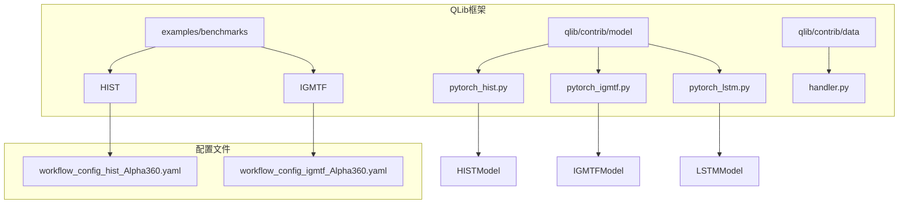
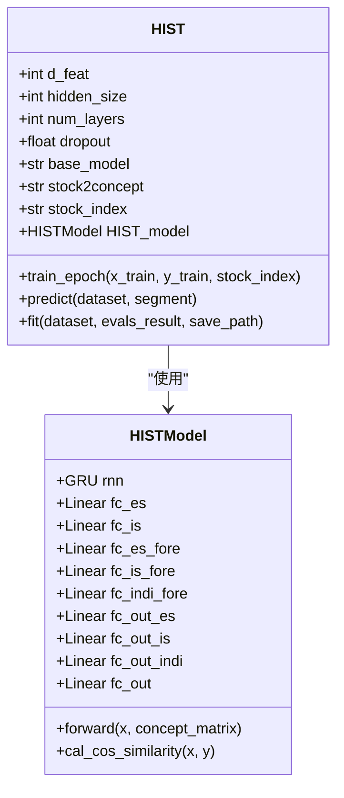
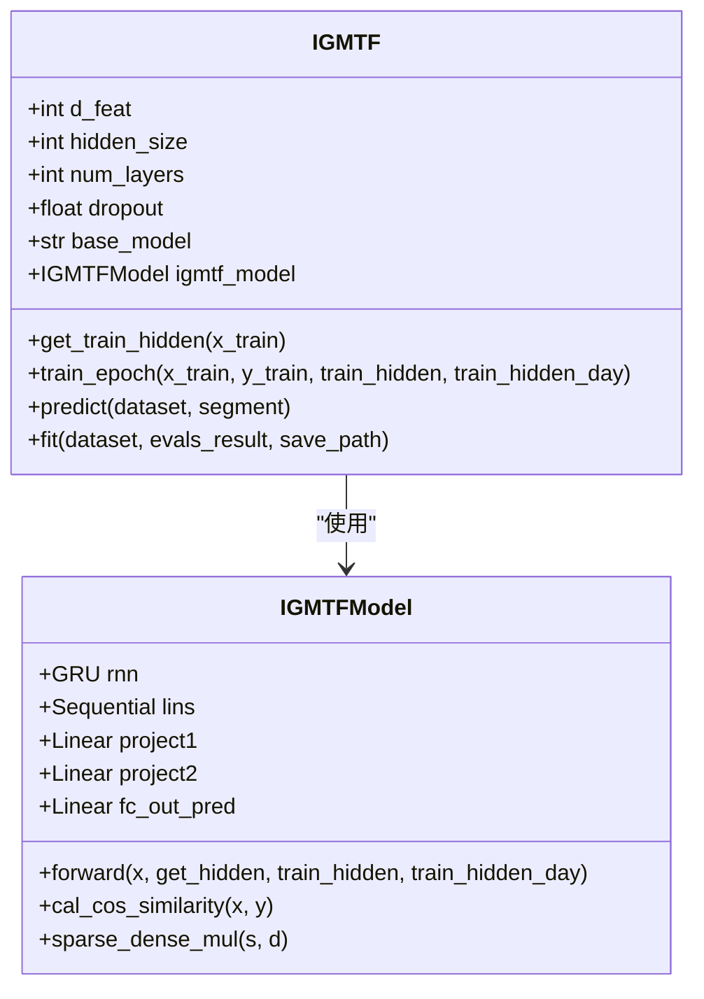
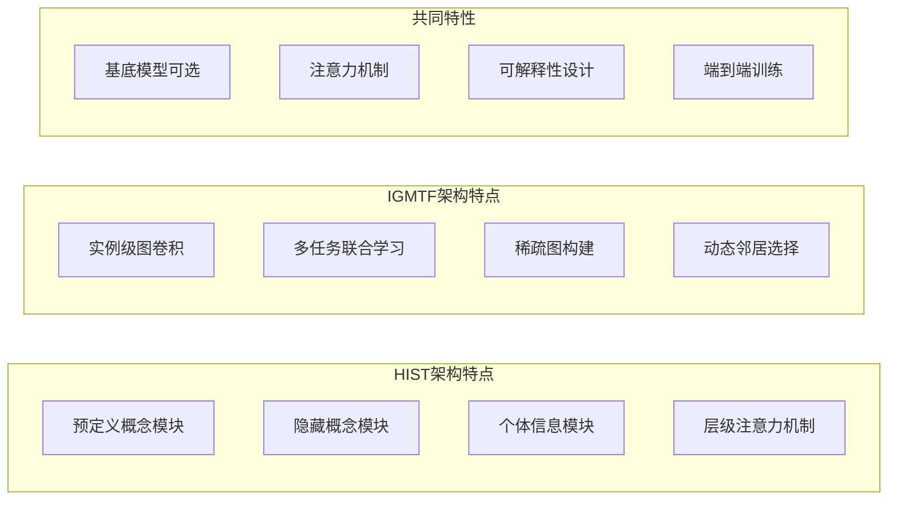
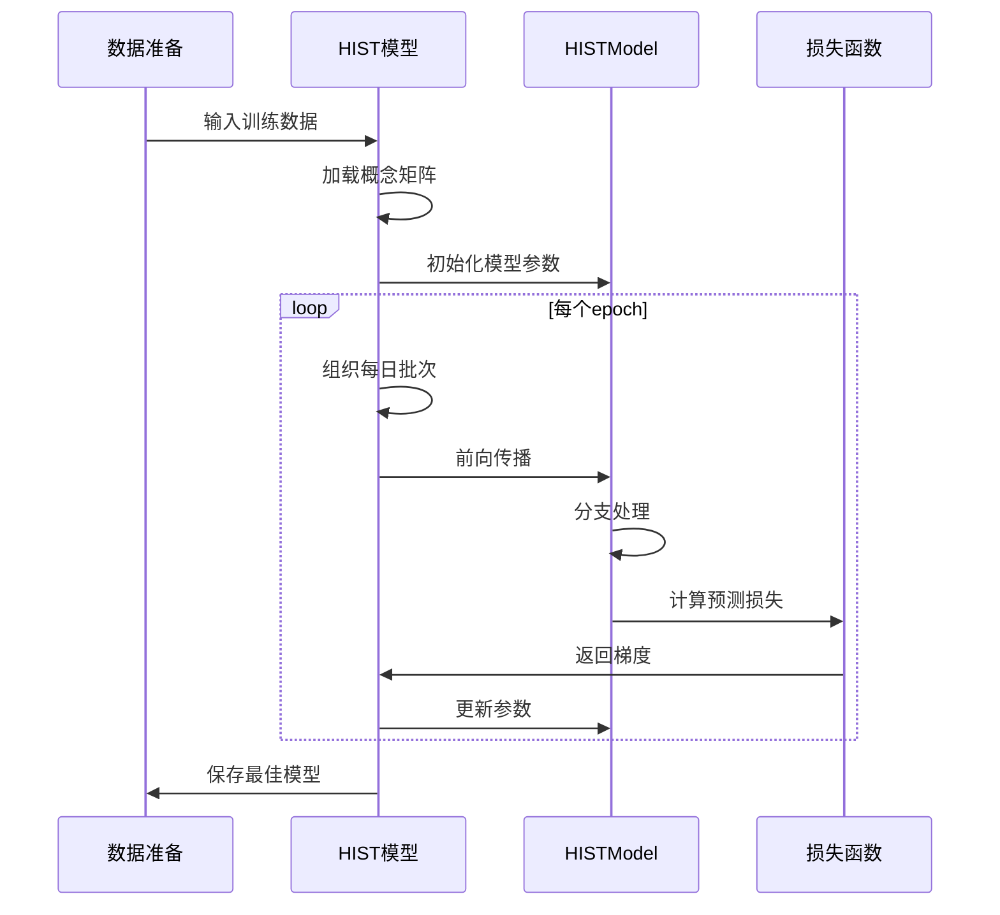
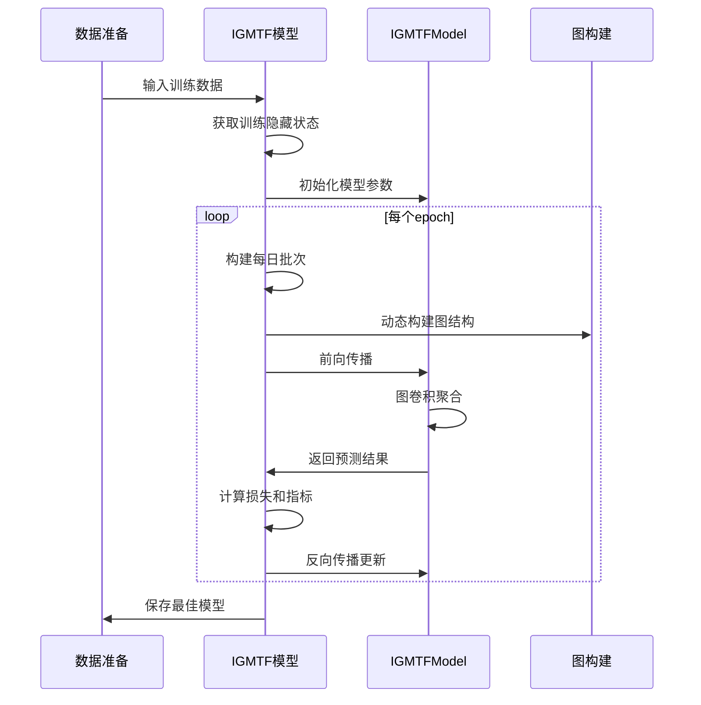

# HIST与IGMTF模型架构分析

<cite>
**本文档引用的文件**
- [examples/benchmarks/HIST/README.md](file://examples/benchmarks/HIST/README.md)
- [examples/benchmarks/HIST/workflow_config_hist_Alpha360.yaml](file://examples/benchmarks/HIST/workflow_config_hist_Alpha360.yaml)
- [examples/benchmarks/IGMTF/README.md](file://examples/benchmarks/IGMTF/README.md)
- [examples/benchmarks/IGMTF/workflow_config_igmtf_Alpha360.yaml](file://examples/benchmarks/IGMTF/workflow_config_igmtf_Alpha360.yaml)
- [qlib/contrib/model/pytorch_hist.py](file://qlib/contrib/model/pytorch_hist.py)
- [qlib/contrib/model/pytorch_igmtf.py](file://qlib/contrib/model/pytorch_igmtf.py)
- [qlib/contrib/model/pytorch_lstm.py](file://qlib/contrib/model/pytorch_lstm.py)
- [qlib/contrib/model/pytorch_utils.py](file://qlib/contrib/model/pytorch_utils.py)
- [qlib/contrib/data/handler.py](file://qlib/contrib/data/handler.py)
</cite>

## 目录
1. [简介](#简介)
2. [项目结构概览](#项目结构概览)
3. [HIST模型详解](#hist模型详解)
4. [IGMTF模型详解](#igmtf模型详解)
5. [模型架构对比分析](#模型架构对比分析)
6. [训练流程与配置](#训练流程与配置)
7. [性能评估与优化](#性能评估与优化)
8. [部署考虑因素](#部署考虑因素)
9. [总结](#总结)

## 简介

HIST（Hierarchical Interpretable Stock Transformer）和IGMTF（Interpretable Graph-based Multi-Task Framework）是两种专门针对金融时间序列预测设计的深度学习模型。这两种模型都采用了先进的神经网络架构，结合了可解释性设计原则，在Alpha预测任务中表现出色。

HIST模型通过层级注意力机制实现了股票与因子间的可解释交互，采用预定义概念模块和隐藏概念模块的双重架构来捕捉不同层次的信息。IGMTF模型则利用图结构进行多任务联合学习，通过实例级别的图卷积实现跨样本的知识迁移。

## 项目结构概览



**图表来源**
- [examples/benchmarks/HIST/workflow_config_hist_Alpha360.yaml](file://examples/benchmarks/HIST/workflow_config_hist_Alpha360.yaml#L1-L91)
- [examples/benchmarks/IGMTF/workflow_config_igmtf_Alpha360.yaml](file://examples/benchmarks/IGMTF/workflow_config_igmtf_Alpha360.yaml#L1-L89)

## HIST模型详解

### 核心架构设计

HIST模型采用了三层信息处理架构：预定义概念模块（Predefined Concept Module）、隐藏概念模块（Hidden Concept Module）和个体信息模块（Individual Information Module）。这种分层设计使得模型能够从不同抽象层次提取特征并进行融合。



**图表来源**
- [qlib/contrib/model/pytorch_hist.py](file://qlib/contrib/model/pytorch_hist.py#L20-L100)
- [qlib/contrib/model/pytorch_hist.py](file://qlib/contrib/model/pytorch_hist.py#L364-L450)

### 预定义概念模块

预定义概念模块负责从预先定义的概念矩阵中提取共享信息。该模块通过以下步骤工作：

1. **概念传播**：将股票特征向量映射到概念空间
2. **相似度计算**：计算股票与概念之间的余弦相似度
3. **信息聚合**：通过softmax加权聚合相关概念的信息

```python
# 概念传播过程示例
stock_to_concept_sum = torch.sum(stock_to_concept, 0).reshape(1, -1).repeat(stock_to_concept.shape[0], 1)
stock_to_concept_sum = stock_to_concept_sum.mul(concept_matrix)
stock_to_concept_sum = stock_to_concept_sum + (torch.ones(...))
stock_to_concept = stock_to_concept / stock_to_concept_sum
hidden = torch.t(stock_to_concept).mm(x_hidden)
```

### 隐藏概念模块

隐藏概念模块通过自组织的方式发现隐含的概念关系，不依赖于预定义的概念矩阵。该模块的关键特性包括：

1. **自适应相似度计算**：基于余弦相似度的自适应权重分配
2. **稀疏化处理**：通过稀疏化操作减少噪声影响
3. **动态概念发现**：根据数据分布动态调整概念关系

### 个体信息模块

个体信息模块专注于捕捉每个股票的独特特征，避免与共享信息模块产生冲突。该模块确保模型能够学习到个体层面的重要特征。

**章节来源**
- [qlib/contrib/model/pytorch_hist.py](file://qlib/contrib/model/pytorch_hist.py#L364-L501)

## IGMTF模型详解

### 图结构设计

IGMTF模型的核心创新在于其图结构设计，通过实例级别的图卷积实现跨样本的知识迁移。模型采用以下架构：



**图表来源**
- [qlib/contrib/model/pytorch_igmtf.py](file://qlib/contrib/model/pytorch_igmtf.py#L20-L100)
- [qlib/contrib/model/pytorch_igmtf.py](file://qlib/contrib/model/pytorch_igmtf.py#L356-L442)

### 多任务联合学习机制

IGMTF模型通过以下机制实现多任务联合学习：

1. **特征投影**：使用两个不同的线性投影矩阵分别处理当前样本和历史样本
2. **相似度计算**：计算当前样本与历史样本的余弦相似度
3. **稀疏图构建**：构建稀疏邻接矩阵，只保留最相关的邻居
4. **图卷积聚合**：通过图卷积操作聚合邻居样本的信息

```python
# 相似度计算和稀疏化示例
cos_similarity = self.cal_cos_similarity(self.project1(mini_batch_out), self.project2(sample_train_hidden))
row = torch.linspace(0, x.shape[0]-1, x.shape[0]).reshape([-1, 1]).repeat(1, n_neighbor).reshape(1, -1)
column = torch.topk(cos_similarity, n_neighbor, dim=1)[1].reshape(1, -1)
mask = torch.sparse_coo_tensor(torch.cat([row, column]), torch.ones([row.shape[1]]).to(device) / n_neighbor, (x.shape[0], sample_train_hidden.shape[0]))
agg_out = torch.sparse.mm(mask, self.project2(sample_train_hidden))
```

### 实例级别图卷积

IGMTF模型的创新之处在于其实例级别的图卷积设计：

1. **动态图构建**：每次前向传播时动态构建图结构
2. **邻居选择**：基于相似度选择最近邻样本
3. **信息聚合**：通过稀疏矩阵乘法实现高效的图卷积

**章节来源**
- [qlib/contrib/model/pytorch_igmtf.py](file://qlib/contrib/model/pytorch_igmtf.py#L356-L443)

## 模型架构对比分析

### 架构差异对比



### 计算复杂度分析

| 特性 | HIST | IGMTF |
|------|------|-------|
| 参数数量 | 中等 | 较高 |
| 计算复杂度 | O(T×N×D) | O(T×N×D×K) |
| 内存需求 | 中等 | 较高 |
| 可解释性 | 高 | 中等 |

其中：
- T: 时间步数
- N: 股票数量  
- D: 特征维度
- K: 最近邻数量

### 适用场景对比

**HIST适用场景**：
- 需要明确解释模型决策过程
- 数据中存在明显的概念层次结构
- 对模型透明度要求较高

**IGMTF适用场景**：
- 需要利用历史样本知识
- 数据分布变化较大
- 希望通过多任务学习提升泛化能力

## 训练流程与配置

### HIST模型训练流程



**图表来源**
- [qlib/contrib/model/pytorch_hist.py](file://qlib/contrib/model/pytorch_hist.py#L150-L200)

### IGMTF模型训练流程



**图表来源**
- [qlib/contrib/model/pytorch_igmtf.py](file://qlib/contrib/model/pytorch_igmtf.py#L199-L294)

### 关键配置参数

#### HIST模型关键参数

| 参数 | 默认值 | 说明 |
|------|--------|------|
| d_feat | 6 | 输入特征维度 |
| hidden_size | 64 | 隐藏层大小 |
| num_layers | 2 | RNN层数 |
| base_model | "GRU" | 基底模型类型 |
| stock2concept | None | 股票到概念矩阵路径 |
| stock_index | None | 股票索引路径 |

#### IGMTF模型关键参数

| 参数 | 默认值 | 说明 |
|------|--------|------|
| d_feat | 6 | 输入特征维度 |
| hidden_size | 64 | 隐藏层大小 |
| num_layers | 2 | RNN层数 |
| base_model | "GRU" | 基底模型类型 |
| k_day | 10 | 使用的历史天数 |
| n_neighbor | 10 | 最近邻数量 |

**章节来源**
- [examples/benchmarks/HIST/workflow_config_hist_Alpha360.yaml](file://examples/benchmarks/HIST/workflow_config_hist_Alpha360.yaml#L35-L50)
- [examples/benchmarks/IGMTF/workflow_config_igmtf_Alpha360.yaml](file://examples/benchmarks/IGMTF/workflow_config_igmtf_Alpha360.yaml#L35-L50)

## 性能评估与优化

### 损失函数设计

两种模型都采用了均方误差（MSE）作为主要损失函数，同时支持IC（信息系数）作为评估指标。

```python
# HIST损失函数
def mse(self, pred, label):
    loss = (pred - label) ** 2
    return torch.mean(loss)

# IGMTF损失函数
def mse(self, pred, label):
    loss = (pred - label) ** 2
    return torch.mean(loss)
```

### 早期停止机制

两种模型都实现了基于验证集指标的早期停止机制：

```python
# 早期停止逻辑
if val_score > best_score:
    best_score = val_score
    stop_steps = 0
    best_param = copy.deepcopy(model.state_dict())
else:
    stop_steps += 1
    if stop_steps >= early_stop:
        break
```

### 性能优化策略

1. **梯度裁剪**：防止梯度爆炸问题
2. **学习率调度**：动态调整学习率
3. **批量归一化**：加速收敛
4. **Dropout**：防止过拟合

**章节来源**
- [qlib/contrib/model/pytorch_hist.py](file://qlib/contrib/model/pytorch_hist.py#L100-L150)
- [qlib/contrib/model/pytorch_igmtf.py](file://qlib/contrib/model/pytorch_igmtf.py#L100-L150)

## 部署考虑因素

### 模型大小与内存占用

根据模型参数统计，两种模型的内存占用情况如下：

```python
# 模型大小计算
def count_parameters(models_or_parameters, unit="m"):
    if isinstance(models_or_parameters, nn.Module):
        counts = sum(v.numel() for v in models_or_parameters.parameters())
    elif isinstance(models_or_parameters, (list, tuple)):
        return sum(count_parameters(x, unit) for x in models_or_parameters)
    return counts / (2**20)  # MB单位
```

### 推理速度优化

1. **批处理推理**：使用适当大小的批次提高吞吐量
2. **GPU加速**：利用CUDA加速计算
3. **模型量化**：减少模型存储和计算需求
4. **缓存机制**：缓存频繁使用的中间结果

### 可扩展性设计

1. **分布式训练**：支持多GPU训练
2. **增量学习**：支持在线学习和模型更新
3. **版本管理**：模型版本控制和回滚机制
4. **监控告警**：实时监控模型性能和异常

## 总结

HIST和IGMTF模型代表了金融时间序列预测领域的先进水平。HIST通过层级注意力机制实现了高度可解释的股票预测，而IGMTF通过实例级别的图卷积实现了高效的多任务联合学习。

两种模型各有优势：
- HIST更适合需要明确解释性的应用场景
- IGMTF更适合需要利用历史知识的场景

在实际应用中，可以根据具体需求选择合适的模型，并通过合理的配置和优化策略获得最佳性能。随着金融市场的不断发展，这些模型将继续演进，为投资决策提供更强大的支持。