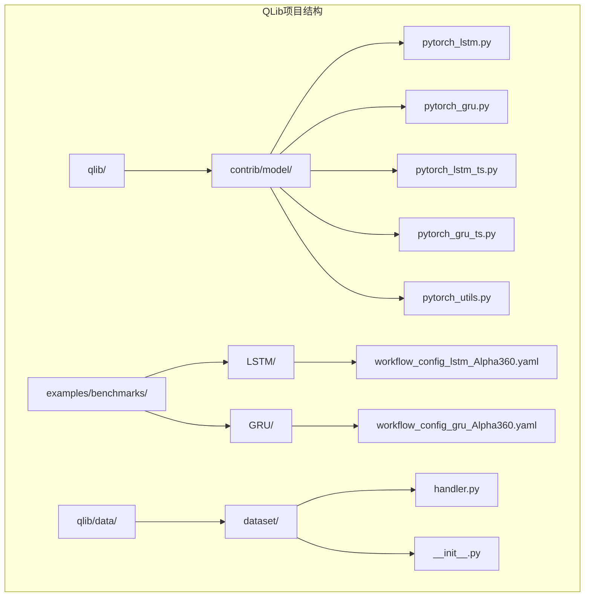
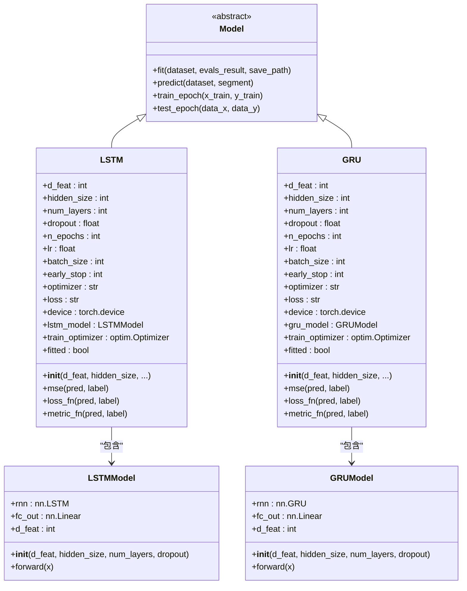
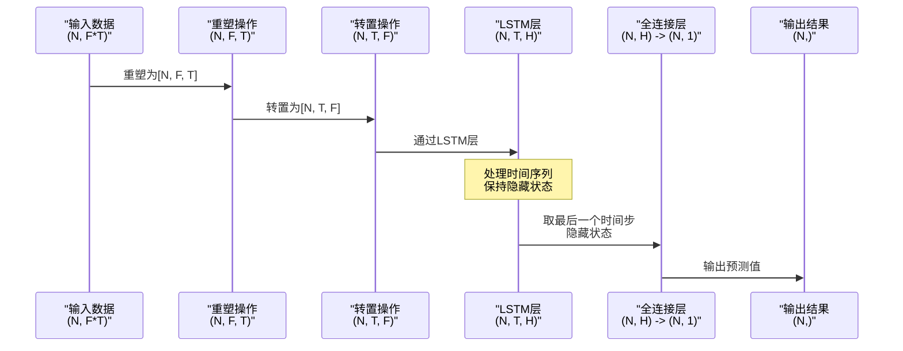
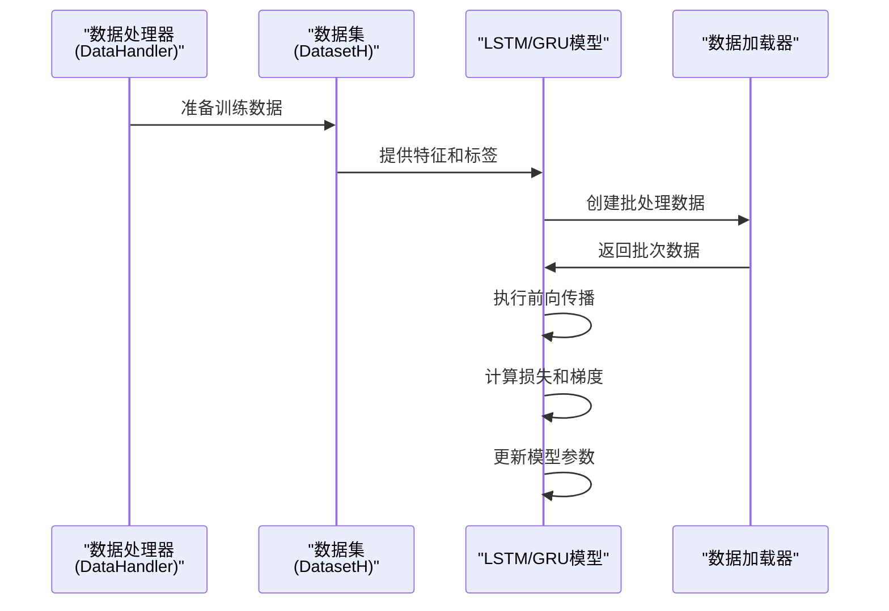
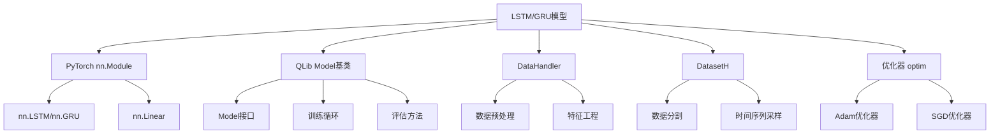

# Qlib中的LSTM和GRU循环神经网络模型

<cite>
**本文档引用的文件**
- [pytorch_lstm.py](file://qlib/contrib/model/pytorch_lstm.py)
- [pytorch_gru.py](file://qlib/contrib/model/pytorch_gru.py)
- [pytorch_lstm_ts.py](file://qlib/contrib/model/pytorch_lstm_ts.py)
- [pytorch_gru_ts.py](file://qlib/contrib/model/pytorch_gru_ts.py)
- [pytorch_utils.py](file://qlib/contrib/model/pytorch_utils.py)
- [workflow_config_lstm_Alpha360.yaml](file://examples/benchmarks/LSTM/workflow_config_lstm_Alpha360.yaml)
- [workflow_config_gru_Alpha360.yaml](file://examples/benchmarks/GRU/workflow_config_gru_Alpha360.yaml)
- [handler.py](file://qlib/data/dataset/handler.py)
- [dataset/__init__.py](file://qlib/data/dataset/__init__.py)
</cite>

## 目录
1. [简介](#简介)
2. [项目结构概览](#项目结构概览)
3. [核心组件分析](#核心组件分析)
4. [架构概览](#架构概览)
5. [详细组件分析](#详细组件分析)
6. [依赖关系分析](#依赖关系分析)
7. [性能考虑](#性能考虑)
8. [故障排除指南](#故障排除指南)
9. [结论](#结论)

## 简介

QLib是一个面向量化投资研究的系统框架，其中包含了基于PyTorch实现的LSTM和GRU循环神经网络模型。这些模型专门针对金融时间序列预测任务进行了优化，能够有效捕捉时间序列数据中的长期依赖关系和动态模式。

LSTM（长短期记忆网络）和GRU（门控循环单元）是两种重要的循环神经网络架构，它们通过门控机制解决了传统RNN在处理长序列时的梯度消失和梯度爆炸问题。在金融领域，这些模型特别适用于股票价格预测、市场趋势分析和风险评估等任务。

## 项目结构概览

QLib中的LSTM和GRU模型实现主要分布在以下目录结构中：



**图表来源**
- [pytorch_lstm.py](file://qlib/contrib/model/pytorch_lstm.py#L1-L307)
- [pytorch_gru.py](file://qlib/contrib/model/pytorch_gru.py#L1-L340)
- [workflow_config_lstm_Alpha360.yaml](file://examples/benchmarks/LSTM/workflow_config_lstm_Alpha360.yaml#L1-L88)

**章节来源**
- [pytorch_lstm.py](file://qlib/contrib/model/pytorch_lstm.py#L1-L50)
- [pytorch_gru.py](file://qlib/contrib/model/pytorch_gru.py#L1-L50)

## 核心组件分析

### LSTM模型类

LSTM模型类继承自`Model`基类，提供了完整的循环神经网络实现：

```python
class LSTM(Model):
    """LSTM模型
    
    参数
    ----------
    d_feat : int
        每个时间步的输入特征维度
    metric: str
        用于早停的评估指标
    optimizer : str
        优化器名称
    GPU : str
        训练使用的GPU ID
    """
```

### GRU模型类

GRU模型类同样继承自`Model`基类，具有相似的接口设计：

```python
class GRU(Model):
    """GRU模型
    
    参数
    ----------
    d_feat : int
        每个时间步的输入特征维度
    metric: str
        用于早停的评估指标
    optimizer : str
        优化器名称
    GPU : str
        训练使用的GPU ID
    """
```

**章节来源**
- [pytorch_lstm.py](file://qlib/contrib/model/pytorch_lstm.py#L18-L35)
- [pytorch_gru.py](file://qlib/contrib/model/pytorch_gru.py#L25-L42)

## 架构概览

LSTM和GRU模型的整体架构遵循标准的深度学习模型设计模式：



**图表来源**
- [pytorch_lstm.py](file://qlib/contrib/model/pytorch_lstm.py#L18-L307)
- [pytorch_gru.py](file://qlib/contrib/model/pytorch_gru.py#L25-L340)

## 详细组件分析

### LSTM模型详细分析

#### 初始化参数配置

LSTM模型提供了丰富的初始化参数，允许用户根据具体任务需求进行精细调整：

```python
def __init__(
    self,
    d_feat=6,           # 输入特征维度
    hidden_size=64,     # 隐藏层大小
    num_layers=2,       # LSTM层数
    dropout=0.0,        # Dropout比例
    n_epochs=200,       # 最大训练轮数
    lr=0.001,           # 学习率
    metric="",          # 评估指标
    batch_size=2000,    # 批量大小
    early_stop=20,      # 早停轮数
    loss="mse",         # 损失函数
    optimizer="adam",   # 优化器类型
    GPU=0,              # GPU编号
    seed=None,          # 随机种子
    **kwargs,
):
```

#### 前向传播逻辑

LSTM模型的前向传播过程展示了其独特的数据处理流程：



**图表来源**
- [pytorch_lstm.py](file://qlib/contrib/model/pytorch_lstm.py#L290-L307)

#### 序列输入处理方式

LSTM模型采用特殊的输入格式处理时间序列数据：

1. **输入格式转换**：将原始输入从`(N, F*T)`转换为`(N, F, T)`
2. **时间维度处理**：通过转置操作确保时间维度在中间位置
3. **序列建模**：利用LSTM的门控机制捕捉长期依赖关系

### GRU模型详细分析

#### GRU与LSTM的区别

GRU模型相比LSTM简化了门控结构，但仍保持了强大的序列建模能力：

```mermaid
flowchart TD
A[输入特征 x_t] --> B{更新门 z_t}
A --> C{重置门 r_t}
B --> D[候选隐藏状态 h'_t]
C --> E[上一时刻隐藏状态 h_{t-1}]
E --> F[重置门控制]
F --> G[计算新的候选状态]
D --> H[最终隐藏状态 h_t]
G --> H
H --> I[线性输出层]
I --> J[预测输出]
style B fill:#e1f5fe
style C fill:#e8f5e8
style H fill:#fff3e0
```

**图表来源**
- [pytorch_gru.py](file://qlib/contrib/model/pytorch_gru.py#L301-L318)

#### 批处理支持

两个模型都实现了高效的批处理机制：

```python
def train_epoch(self, x_train, y_train):
    x_train_values = x_train.values
    y_train_values = np.squeeze(y_train.values)
    
    self.lstm_model.train()
    
    indices = np.arange(len(x_train_values))
    np.random.shuffle(indices)
    
    for i in range(len(indices))[::self.batch_size]:
        if len(indices) - i < self.batch_size:
            break
            
        feature = torch.from_numpy(x_train_values[indices[i:i+self.batch_size]]).float().to(self.device)
        label = torch.from_numpy(y_train_values[indices[i:i+self.batch_size]]).float().to(self.device)
        
        pred = self.lstm_model(feature)
        loss = self.loss_fn(pred, label)
        
        self.train_optimizer.zero_grad()
        loss.backward()
        torch.nn.utils.clip_grad_value_(self.lstm_model.parameters(), 3.0)
        self.train_optimizer.step()
```

**章节来源**
- [pytorch_lstm.py](file://qlib/contrib/model/pytorch_lstm.py#L149-L189)
- [pytorch_gru.py](file://qlib/contrib/model/pytorch_gru.py#L150-L193)

### 与Qlib数据模块的集成

#### 数据处理器集成

LSTM和GRU模型与Qlib的数据处理管道无缝集成：



**图表来源**
- [handler.py](file://qlib/data/dataset/handler.py#L1-L199)
- [dataset/__init__.py](file://qlib/data/dataset/__init__.py#L1-L723)

#### 典型workflow_config配置文件解读

以下是Alpha360基准测试的LSTM配置文件的关键部分：

```yaml
task:
    model:
        class: LSTM
        module_path: qlib.contrib.model.pytorch_lstm
        kwargs:
            d_feat: 6                    # 特征数量
            hidden_size: 64             # 隐藏层维度
            num_layers: 2               # LSTM层数
            dropout: 0.0                # Dropout比例
            n_epochs: 200               # 最大训练轮数
            lr: 1e-3                    # 学习率
            early_stop: 20              # 早停轮数
            batch_size: 800             # 批量大小
            metric: loss                # 评估指标
            loss: mse                   # 损失函数
            GPU: 0                      # GPU编号
    dataset:
        class: DatasetH
        module_path: qlib.data.dataset
        kwargs:
            handler:
                class: Alpha360
                module_path: qlib.contrib.data.handler
                kwargs: *data_handler_config
            segments:
                train: [2008-01-01, 2014-12-31]
                valid: [2015-01-01, 2016-12-31]
                test: [2017-01-01, 2020-08-01]
```

**章节来源**
- [workflow_config_lstm_Alpha360.yaml](file://examples/benchmarks/LSTM/workflow_config_lstm_Alpha360.yaml#L40-L60)
- [workflow_config_gru_Alpha360.yaml](file://examples/benchmarks/GRU/workflow_config_gru_Alpha360.yaml#L40-L60)

### GPU加速实践

两个模型都支持GPU加速，自动检测可用的CUDA设备：

```python
self.device = torch.device("cuda:%d" % (GPU) if torch.cuda.is_available() and GPU >= 0 else "cpu")
self.lstm_model.to(self.device)
```

**章节来源**
- [pytorch_lstm.py](file://qlib/contrib/model/pytorch_lstm.py#L60-L65)
- [pytorch_gru.py](file://qlib/contrib/model/pytorch_gru.py#L60-L65)

## 依赖关系分析

### 核心依赖关系



**图表来源**
- [pytorch_lstm.py](file://qlib/contrib/model/pytorch_lstm.py#L1-L20)
- [pytorch_gru.py](file://qlib/contrib/model/pytorch_gru.py#L1-L20)

### 外部依赖分析

主要外部依赖包括：
- **PyTorch**：深度学习框架，提供张量运算和自动微分
- **NumPy**：数值计算基础库
- **Pandas**：数据处理和分析工具
- **Matplotlib**：可视化支持（通过QLib日志系统）

**章节来源**
- [pytorch_lstm.py](file://qlib/contrib/model/pytorch_lstm.py#L1-L17)
- [pytorch_gru.py](file://qlib/contrib/model/pytorch_gru.py#L1-L17)

## 性能考虑

### 模型复杂度分析

LSTM和GRU模型的计算复杂度主要取决于以下因素：

1. **隐藏层维度**：影响内存占用和计算时间
2. **序列长度**：对LSTM的影响大于GRU
3. **批量大小**：影响GPU利用率和内存消耗
4. **层数**：增加模型容量但提高过拟合风险

### 内存优化策略

```python
def predict(self, dataset: DatasetH, segment: Union[Text, slice] = "test"):
    # 使用批处理减少内存峰值
    for begin in range(sample_num)[::self.batch_size]:
        if sample_num - begin < self.batch_size:
            end = sample_num
        else:
            end = begin + self.batch_size
            
        x_batch = torch.from_numpy(x_values[begin:end]).float().to(self.device)
        with torch.no_grad():
            pred = self.lstm_model(x_batch).detach().cpu().numpy()
        preds.append(pred)
```

### 梯度裁剪实践

为了防止梯度爆炸，模型实现了梯度裁剪：

```python
torch.nn.utils.clip_grad_value_(self.lstm_model.parameters(), 3.0)
```

## 故障排除指南

### 常见训练问题及解决方案

#### 1. 梯度爆炸问题

**症状**：训练过程中损失值突然变为NaN或无穷大

**解决方案**：
- 调整学习率（建议从0.001开始）
- 增加梯度裁剪阈值
- 检查输入数据的归一化

#### 2. 内存不足

**症状**：CUDA out of memory错误

**解决方案**：
- 减少批量大小
- 使用更小的隐藏层维度
- 启用梯度检查点

#### 3. 收敛缓慢

**症状**：训练损失下降缓慢

**解决方案**：
- 增加隐藏层维度
- 调整学习率调度
- 增加训练轮数

### 调试技巧

1. **启用详细日志**：设置日志级别为DEBUG
2. **监控梯度范数**：定期检查梯度大小
3. **可视化训练曲线**：绘制训练和验证损失曲线
4. **检查数据质量**：确保输入数据没有异常值

**章节来源**
- [pytorch_lstm.py](file://qlib/contrib/model/pytorch_lstm.py#L170-L189)
- [pytorch_gru.py](file://qlib/contrib/model/pytorch_gru.py#L170-L193)

## 结论

QLib中的LSTM和GRU模型为金融时间序列预测提供了强大而灵活的解决方案。通过精心设计的架构和丰富的配置选项，这些模型能够有效地处理复杂的金融数据，捕捉长期依赖关系，并在实际应用中表现出色。

### 主要优势

1. **易于使用**：简洁的API设计，支持一键式训练和预测
2. **高度可配置**：丰富的超参数选项满足不同场景需求
3. **GPU加速**：原生支持CUDA，显著提升训练速度
4. **数据集成**：与QLib数据管道无缝集成
5. **稳定性**：内置梯度裁剪和早停机制

### 应用建议

- **特征选择**：根据具体任务选择合适的特征维度
- **超参数调优**：使用网格搜索或贝叶斯优化确定最佳参数
- **模型比较**：在相同条件下比较LSTM和GRU的性能
- **集成学习**：考虑与其他模型组合使用以提高预测精度

通过合理配置和使用这些模型，研究人员和投资者可以构建强大的量化交易系统，实现更准确的市场预测和风险管理。