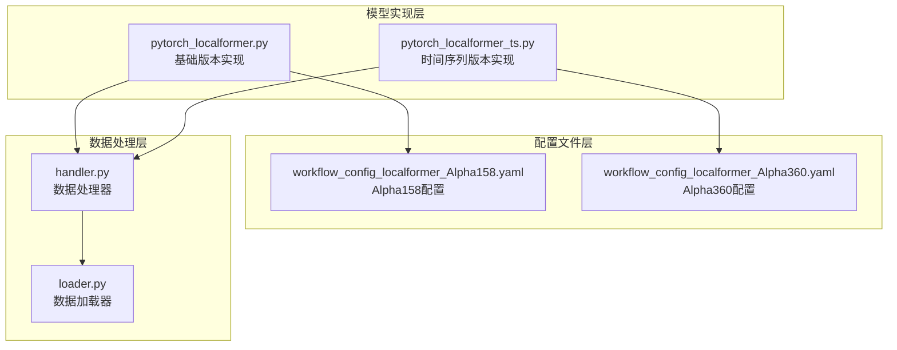
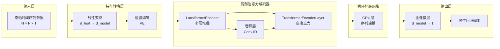
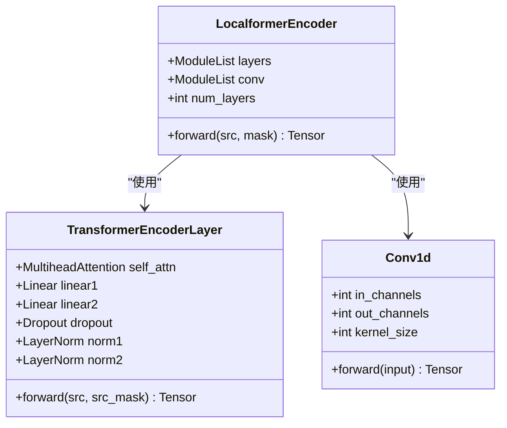
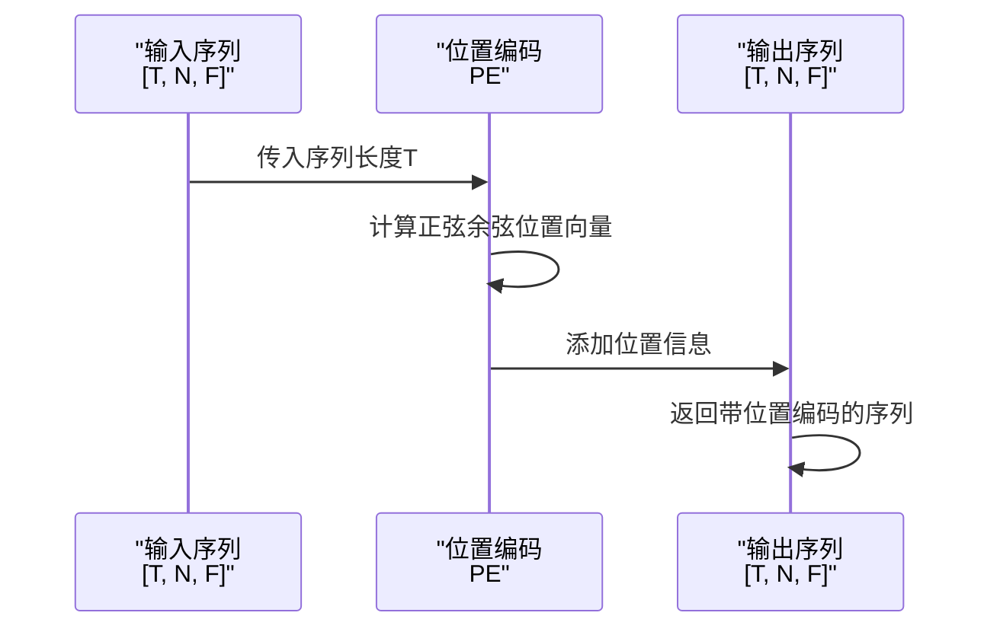
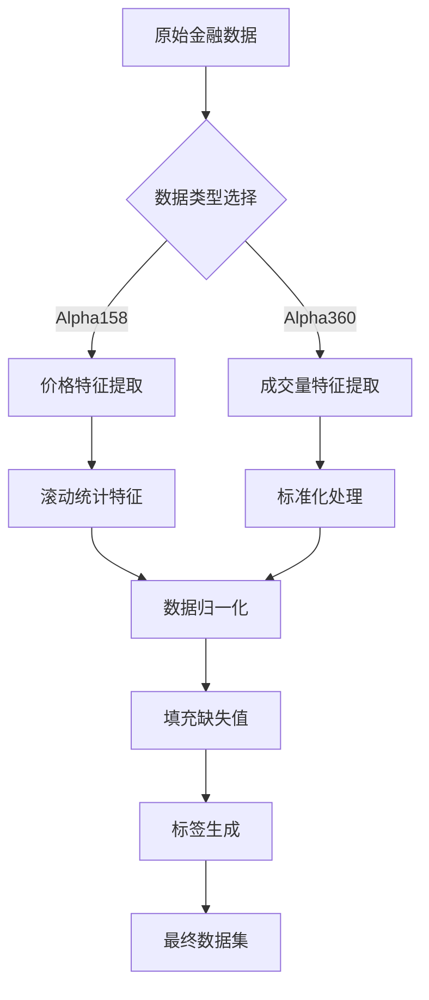
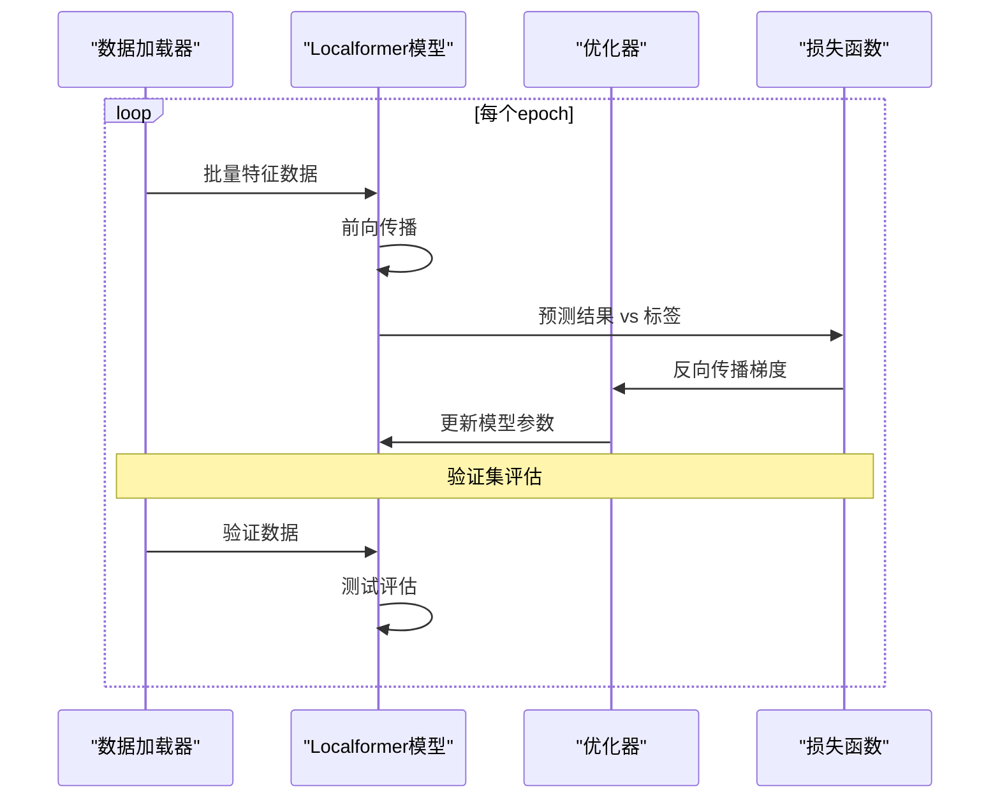
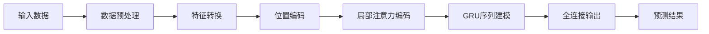
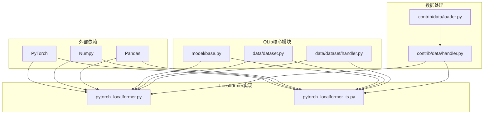

# Localformer模型

<cite>
**本文档中引用的文件**
- [pytorch_localformer.py](file://qlib/contrib/model/pytorch_localformer.py)
- [pytorch_localformer_ts.py](file://qlib/contrib/model/pytorch_localformer_ts.py)
- [workflow_config_localformer_Alpha158.yaml](file://examples/benchmarks/Localformer/workflow_config_localformer_Alpha158.yaml)
- [workflow_config_localformer_Alpha360.yaml](file://examples/benchmarks/Localformer/workflow_config_localformer_Alpha360.yaml)
- [handler.py](file://qlib/contrib/data/handler.py)
- [loader.py](file://qlib/contrib/data/loader.py)
</cite>

## 目录
1. [简介](#简介)
2. [项目结构](#项目结构)
3. [核心组件](#核心组件)
4. [架构概览](#架构概览)
5. [详细组件分析](#详细组件分析)
6. [依赖关系分析](#依赖关系分析)
7. [性能考虑](#性能考虑)
8. [故障排除指南](#故障排除指南)
9. [结论](#结论)

## 简介

Localformer是一个专门为金融时间序列预测设计的深度学习模型，它通过局部注意力机制有效降低了传统Transformer模型的计算复杂度，同时保持了对关键时间步的敏感性。该模型特别适用于高频交易和长周期预测任务，在处理大规模金融数据时展现出优异的性能表现。

Localformer的核心创新在于其独特的局部上下文提取机制，通过滑动窗口注意力和卷积神经网络相结合的方式，实现了对时间序列特征的有效捕捉。这种设计使得模型能够在保持计算效率的同时，充分挖掘时间序列数据中的长期依赖关系。

## 项目结构

Localformer模型在QLib框架中的组织结构清晰明确，主要包含以下几个关键部分：



**图表来源**
- [pytorch_localformer.py](file://qlib/contrib/model/pytorch_localformer.py#L1-L323)
- [pytorch_localformer_ts.py](file://qlib/contrib/model/pytorch_localformer_ts.py#L1-L303)
- [workflow_config_localformer_Alpha158.yaml](file://examples/benchmarks/Localformer/workflow_config_localformer_Alpha158.yaml#L1-L88)

**章节来源**
- [pytorch_localformer.py](file://qlib/contrib/model/pytorch_localformer.py#L1-L50)
- [pytorch_localformer_ts.py](file://qlib/contrib/model/pytorch_localformer_ts.py#L1-L50)

## 核心组件

### 模型架构设计

Localformer模型采用了多层堆叠的Transformer架构，并在此基础上引入了局部注意力机制和卷积神经网络来提升计算效率和特征提取能力。

#### 主要参数配置

```python
# 基础参数设置
d_feat: int = 20          # 输入特征维度
d_model: int = 64         # 模型隐藏层维度
batch_size: int = 2048    # 批量大小
nhead: int = 2           # 多头注意力头数
num_layers: int = 2       # 编码器层数
dropout: float = 0        # Dropout比例
n_epochs: int = 100       # 训练轮数
lr: float = 0.0001        # 学习率
optimizer: str = "adam"   # 优化器类型
```

#### 数据预处理流程

Localformer支持两种不同的数据处理方式：
- **基础版本**：使用DatasetH进行数据准备
- **时间序列版本**：使用TSDatasetH进行更高效的时间序列数据处理

**章节来源**
- [pytorch_localformer.py](file://qlib/contrib/model/pytorch_localformer.py#L20-L50)
- [pytorch_localformer_ts.py](file://qlib/contrib/model/pytorch_localformer_ts.py#L20-L50)

## 架构概览

Localformer的整体架构融合了Transformer的自注意力机制和卷积神经网络的优势，形成了一个高效的特征提取和序列建模系统：



**图表来源**
- [pytorch_localformer.py](file://qlib/contrib/model/pytorch_localformer.py#L298-L321)
- [pytorch_localformer_ts.py](file://qlib/contrib/model/pytorch_localformer_ts.py#L260-L301)

## 详细组件分析

### LocalformerEncoder组件

LocalformerEncoder是模型的核心组件，它结合了传统的Transformer编码器和卷积神经网络的优势：



**图表来源**
- [pytorch_localformer.py](file://qlib/contrib/model/pytorch_localformer.py#L247-L266)
- [pytorch_localformer_ts.py](file://qlib/contrib/model/pytorch_localformer_ts.py#L247-L265)

#### 卷积增强机制

LocalformerEncoder通过以下机制实现卷积增强：

1. **特征转换**：将时间序列数据从 `[T, N, F]` 转换为 `[N, F, T]` 的格式
2. **卷积处理**：应用1D卷积层提取局部特征
3. **特征回转**：将卷积结果转换回原始格式
4. **残差连接**：将卷积结果与原始特征相加

```python
# 卷积处理的核心逻辑
out = output.transpose(1, 0).transpose(2, 1)  # [T, N, F] -> [N, F, T]
out = self.conv[i](out).transpose(2, 1).transpose(1, 0)  # 卷积处理后回转
output = mod(output + out, src_mask=mask)  # 残差连接
```

**章节来源**
- [pytorch_localformer.py](file://qlib/contrib/model/pytorch_localformer.py#L254-L266)

### 位置编码机制

Localformer采用标准的正弦余弦位置编码，为模型提供时间序列的位置信息：



**图表来源**
- [pytorch_localformer.py](file://qlib/contrib/model/pytorch_localformer.py#L227-L246)
- [pytorch_localformer_ts.py](file://qlib/contrib/model/pytorch_localformer_ts.py#L227-L246)

### 数据处理管道

Localformer支持多种数据处理方式，包括Alpha158和Alpha360两种特征集：



**图表来源**
- [handler.py](file://qlib/contrib/data/handler.py#L40-L157)
- [loader.py](file://qlib/contrib/data/loader.py#L1-L310)

**章节来源**
- [handler.py](file://qlib/contrib/data/handler.py#L40-L157)
- [loader.py](file://qlib/contrib/data/loader.py#L1-L310)

### 训练和推理流程

#### 训练流程



**图表来源**
- [pytorch_localformer.py](file://qlib/contrib/model/pytorch_localformer.py#L130-L180)
- [pytorch_localformer_ts.py](file://qlib/contrib/model/pytorch_localformer_ts.py#L90-L140)

#### 推理流程



**图表来源**
- [pytorch_localformer.py](file://qlib/contrib/model/pytorch_localformer.py#L298-L321)
- [pytorch_localformer_ts.py](file://qlib/contrib/model/pytorch_localformer_ts.py#L260-L301)

**章节来源**
- [pytorch_localformer.py](file://qlib/contrib/model/pytorch_localformer.py#L130-L220)
- [pytorch_localformer_ts.py](file://qlib/contrib/model/pytorch_localformer_ts.py#L90-L180)

## 依赖关系分析

Localformer模型的依赖关系体现了QLib框架的模块化设计理念：



**图表来源**
- [pytorch_localformer.py](file://qlib/contrib/model/pytorch_localformer.py#L1-L20)
- [pytorch_localformer_ts.py](file://qlib/contrib/model/pytorch_localformer_ts.py#L1-L20)

**章节来源**
- [pytorch_localformer.py](file://qlib/contrib/model/pytorch_localformer.py#L1-L20)
- [pytorch_localformer_ts.py](file://qlib/contrib/model/pytorch_localformer_ts.py#L1-L20)

## 性能考虑

### 内存效率优化

Localformer通过以下策略实现内存效率优化：

1. **批量处理**：支持大批次训练，充分利用GPU内存
2. **梯度裁剪**：防止梯度爆炸，稳定训练过程
3. **早期停止**：避免过拟合，减少不必要的计算
4. **动态内存管理**：及时释放不需要的中间变量

### 计算复杂度分析

- **传统Transformer**：O(T²) 注意力计算复杂度
- **Localformer**：通过局部注意力机制显著降低计算复杂度
- **卷积操作**：O(F×K×T) 的线性复杂度，其中K为卷积核大小

### 适用场景

Localformer特别适合以下应用场景：
- **高频交易**：处理分钟级或秒级时间序列数据
- **长周期预测**：支持长时间跨度的预测任务
- **大规模金融数据**：能够处理包含大量股票的数据集
- **实时预测**：具备快速推理能力，适合在线部署

## 故障排除指南

### 常见问题及解决方案

#### 1. 内存不足错误
**症状**：CUDA out of memory
**解决方案**：
- 减少batch_size参数
- 使用梯度累积技术
- 启用混合精度训练

#### 2. 训练不收敛
**症状**：损失函数不下降
**解决方案**：
- 调整学习率参数
- 检查数据预处理流程
- 增加dropout比例

#### 3. 推理速度慢
**症状**：预测耗时过长
**解决方案**：
- 减少num_layers参数
- 使用CPU推理模式
- 优化批处理大小

**章节来源**
- [pytorch_localformer.py](file://qlib/contrib/model/pytorch_localformer.py#L130-L180)
- [pytorch_localformer_ts.py](file://qlib/contrib/model/pytorch_localformer_ts.py#L90-L140)

## 结论

Localformer模型代表了金融时间序列预测领域的重要进展，通过巧妙地结合Transformer的全局建模能力和卷积神经网络的局部特征提取优势，实现了计算效率和预测性能的平衡。

### 主要优势

1. **高效计算**：通过局部注意力机制显著降低计算复杂度
2. **灵活配置**：支持多种数据处理方式和特征组合
3. **易于集成**：完美融入QLib框架生态系统
4. **广泛适用**：适用于高频交易和长周期预测任务

### 应用前景

Localformer模型在量化投资、风险管理、资产定价等领域具有广阔的应用前景。随着金融数据规模的不断增长和预测精度要求的提高，Localformer有望成为金融时间序列建模的重要工具。

通过本文档的详细介绍，用户可以全面理解Localformer模型的设计理念、技术实现和最佳实践，为实际应用提供有力支撑。