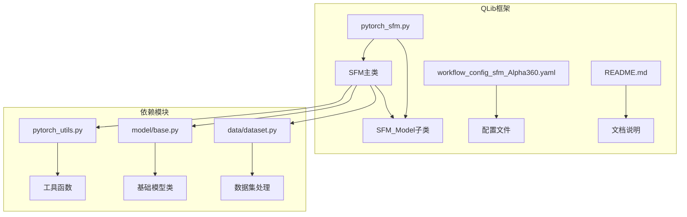
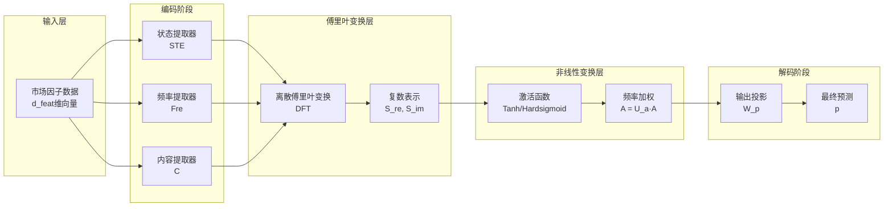
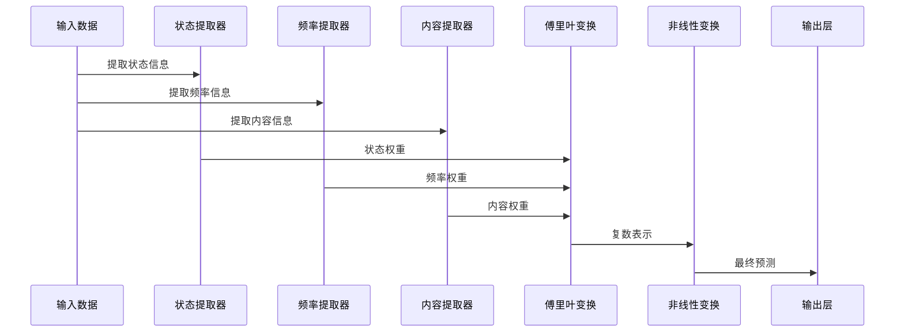
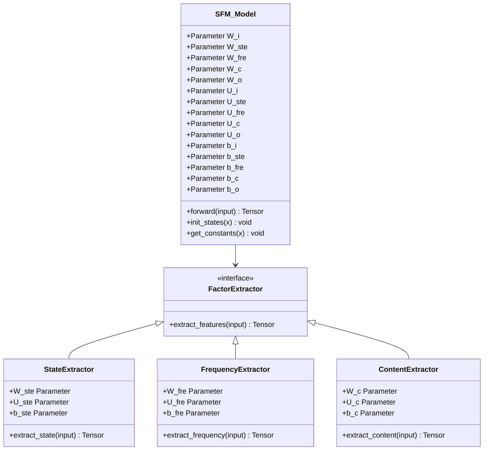
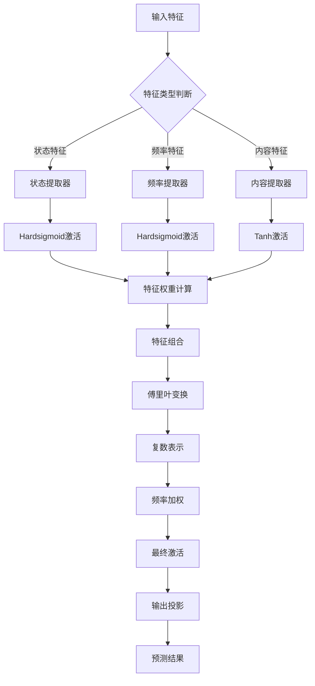
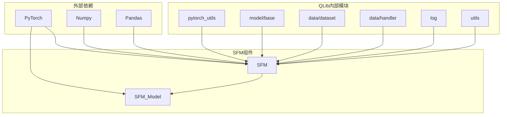

# SFM模型架构设计与金融建模逻辑详解

<cite>
**本文档引用的文件**
- [pytorch_sfm.py](file://qlib/contrib/model/pytorch_sfm.py)
- [workflow_config_sfm_Alpha360.yaml](file://examples/benchmarks/SFM/workflow_config_sfm_Alpha360.yaml)
- [README.md](file://examples/benchmarks/SFM/README.md)
- [pytorch_utils.py](file://qlib/contrib/model/pytorch_utils.py)
</cite>

## 目录
1. [简介](#简介)
2. [项目结构](#项目结构)
3. [核心组件](#核心组件)
4. [架构概览](#架构概览)
5. [详细组件分析](#详细组件分析)
6. [依赖关系分析](#依赖关系分析)
7. [性能考虑](#性能考虑)
8. [故障排除指南](#故障排除指南)
9. [结论](#结论)

## 简介

State-Frequency-Memory (SFM) 是一种创新的循环神经网络，它使用离散傅里叶变换来分解记忆单元的隐藏状态，从而从过去的市场数据中捕捉多频率交易模式以进行股票价格预测。该模型由Qi等人在KDD 2017年论文《通过发现多频率交易模式进行股票价格预测》中提出。

SFM模型的核心创新在于其独特的编码-解码结构，通过多层级结构融合不同类型的因子表示，实现了对复杂市场状态的建模。与传统的线性因子模型相比，SFM能够捕捉非线性的时间序列特征和多频率周期性模式。

## 项目结构

SFM模型在QLib框架中的组织结构如下：



**图表来源**
- [pytorch_sfm.py](file://qlib/contrib/model/pytorch_sfm.py#L1-L480)
- [workflow_config_sfm_Alpha360.yaml](file://examples/benchmarks/SFM/workflow_config_sfm_Alpha360.yaml#L1-L91)

**章节来源**
- [pytorch_sfm.py](file://qlib/contrib/model/pytorch_sfm.py#L1-L480)
- [workflow_config_sfm_Alpha360.yaml](file://examples/benchmarks/SFM/workflow_config_sfm_Alpha360.yaml#L1-L91)

## 核心组件

SFM模型包含两个主要组件：SFM主类和SFM_Model子类。这两个组件协同工作，实现了完整的金融建模功能。

### SFM主类

SFM主类继承自QLib的基础Model类，负责管理模型的生命周期、训练过程和预测功能。

```python
class SFM(Model):
    """SFM Model
    
    参数
    ----------
    input_dim : int
        输入维度
    output_dim : int
        输出维度
    lr : float
        学习率
    optimizer : str
        优化器名称
    GPU : int
        训练使用的GPU ID
    """
```

### SFM_Model子类

SFM_Model子类是实际的神经网络实现，包含了所有复杂的数学运算和状态管理逻辑。

```python
class SFM_Model(nn.Module):
    def __init__(
        self,
        d_feat=6,
        output_dim=1,
        freq_dim=10,
        hidden_size=64,
        dropout_W=0.0,
        dropout_U=0.0,
        device="cpu",
    ):
```

**章节来源**
- [pytorch_sfm.py](file://qlib/contrib/model/pytorch_sfm.py#L179-L236)
- [pytorch_sfm.py](file://qlib/contrib/model/pytorch_sfm.py#L25-L74)

## 架构概览

SFM模型采用独特的多层级结构，通过编码-解码机制实现对复杂市场状态的建模：



**图表来源**
- [pytorch_sfm.py](file://qlib/contrib/model/pytorch_sfm.py#L76-L138)

## 详细组件分析

### 编码-解码结构

SFM模型的核心创新在于其编码-解码结构，这种设计允许模型同时处理多个时间尺度的信息：



**图表来源**
- [pytorch_sfm.py](file://qlib/contrib/model/pytorch_sfm.py#L76-L138)

### 因子交互机制

SFM模型通过多种因子提取器实现复杂的因子交互：



**图表来源**
- [pytorch_sfm.py](file://qlib/contrib/model/pytorch_sfm.py#L25-L74)

### 非线性变换层设计

非线性变换层是SFM模型的关键组成部分，它通过多种激活函数实现复杂的非线性映射：



**图表来源**
- [pytorch_sfm.py](file://qlib/contrib/model/pytorch_sfm.py#L76-L138)

**章节来源**
- [pytorch_sfm.py](file://qlib/contrib/model/pytorch_sfm.py#L76-L138)

### 模型输入输出格式

SFM模型的输入输出格式经过精心设计，以适应金融市场的特点：

#### 输入格式
- **形状**: `[batch_size, features, time_steps]`
- **数据类型**: 浮点数张量
- **特征维度**: 包含多种市场因子（如价格、成交量、技术指标等）

#### 输出格式
- **形状**: `[batch_size, output_dim]`
- **数据类型**: 浮点数张量
- **输出含义**: 股票价格预测值或收益率预测值

### 训练目标函数设定

SFM模型支持多种损失函数和评估指标：

```python
def mse(self, pred, label):
    loss = (pred - label) ** 2
    return torch.mean(loss)

def loss_fn(self, pred, label):
    mask = ~torch.isnan(label)
    if self.loss == "mse":
        return self.mse(pred[mask], label[mask])
    raise ValueError("unknown loss `%s`" % self.loss)
```

**章节来源**
- [pytorch_sfm.py](file://qlib/contrib/model/pytorch_sfm.py#L415-L425)

## 依赖关系分析

SFM模型的依赖关系体现了其在QLib框架中的集成程度：



**图表来源**
- [pytorch_sfm.py](file://qlib/contrib/model/pytorch_sfm.py#L1-L20)

**章节来源**
- [pytorch_sfm.py](file://qlib/contrib/model/pytorch_sfm.py#L1-L20)

## 性能考虑

### 计算复杂度

SFM模型的计算复杂度主要来源于以下几个方面：

1. **傅里叶变换**: 时间复杂度为O(n log n)
2. **矩阵乘法**: 时间复杂度为O(d × h)，其中d为特征维度，h为隐藏层维度
3. **激活函数**: 时间复杂度为O(n)

### 内存使用

SFM模型的内存使用主要包括：
- 模型参数存储
- 中间状态变量
- 梯度计算缓存

### 优化建议

1. **批量处理**: 使用较大的批次大小以提高GPU利用率
2. **梯度裁剪**: 防止梯度爆炸问题
3. **早停机制**: 避免过拟合
4. **学习率调度**: 动态调整学习率

## 故障排除指南

### 常见问题及解决方案

#### 1. 内存不足错误
**症状**: CUDA out of memory
**解决方案**: 减少批次大小或隐藏层维度

#### 2. 收敛困难
**症状**: 损失函数不下降
**解决方案**: 
- 调整学习率
- 检查数据预处理
- 增加正则化

#### 3. 过拟合
**症状**: 训练误差低但验证误差高
**解决方案**:
- 增加dropout比例
- 使用早停机制
- 减少模型复杂度

**章节来源**
- [pytorch_sfm.py](file://qlib/contrib/model/pytorch_sfm.py#L335-L357)

## 结论

SFM模型通过其独特的编码-解码结构和多层级因子表示，成功地实现了对复杂市场状态的建模。其主要优势包括：

1. **多频率建模**: 通过傅里叶变换捕捉不同时间尺度的周期性模式
2. **非线性表达**: 利用多种激活函数实现复杂的非线性映射
3. **状态管理**: 通过精心设计的状态变量保持长期依赖关系
4. **金融适配**: 针对金融市场特点进行了专门优化

与传统线性因子模型相比，SFM模型能够更好地捕捉市场的非线性特征和动态变化，为量化投资提供了更强大的工具。然而，其较高的计算复杂度和参数数量也带来了相应的挑战，需要在实际应用中根据具体需求进行权衡和优化。