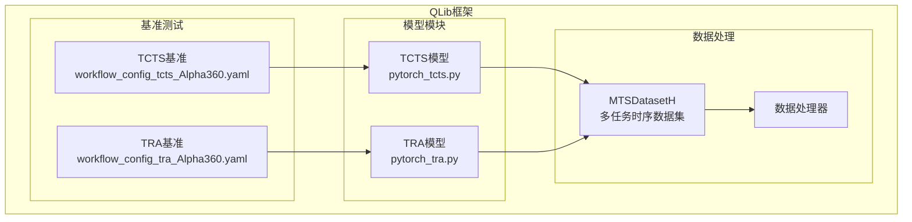
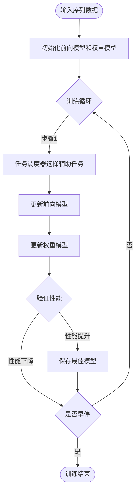
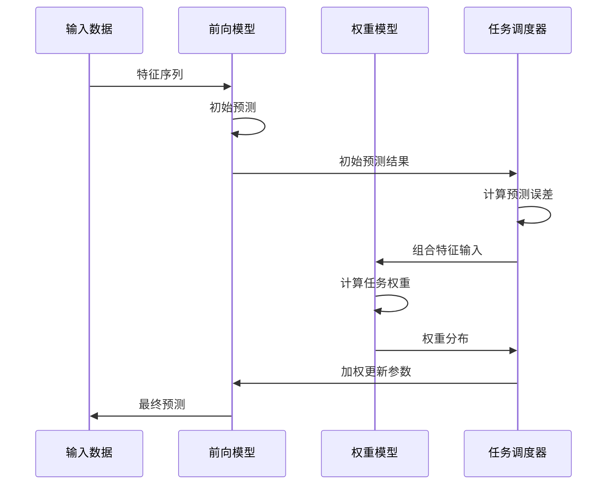
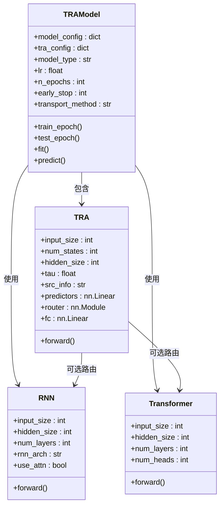
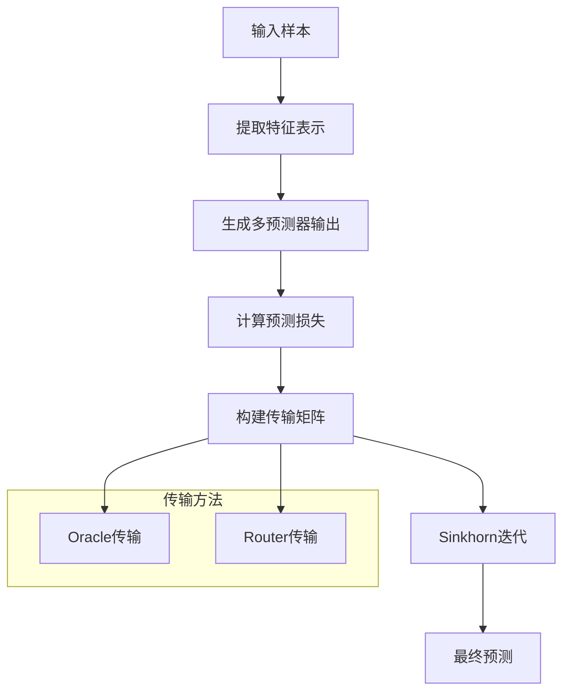
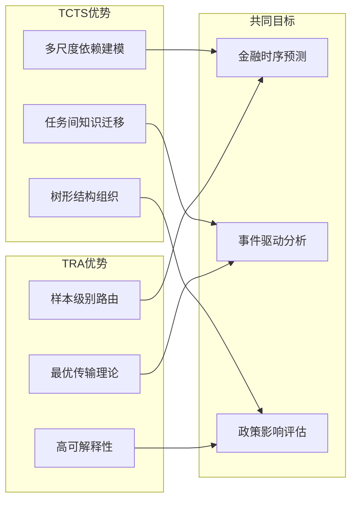
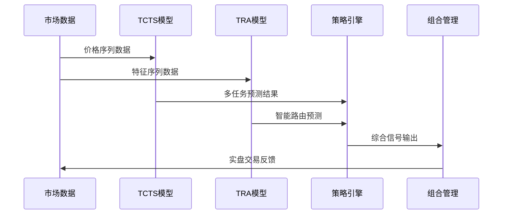

# TCTS与TRA模型技术文档

<cite>
**本文档中引用的文件**
- [README.md](file://examples/benchmarks/TCTS/README.md)
- [workflow_config_tcts_Alpha360.yaml](file://examples/benchmarks/TCTS/workflow_config_tcts_Alpha360.yaml)
- [pytorch_tcts.py](file://qlib/contrib/model/pytorch_tcts.py)
- [config_transformer_tra.yaml](file://examples/benchmarks/TRA/configs/config_transformer_tra.yaml)
- [pytorch_tra.py](file://qlib/contrib/model/pytorch_tra.py)
- [dataset.py](file://examples/benchmarks/TRA/src/dataset.py)
- [workflow_config_tra_Alpha360.yaml](file://examples/benchmarks/TRA/workflow_config_tra_Alpha360.yaml)
</cite>

## 目录
1. [简介](#简介)
2. [项目结构](#项目结构)
3. [TCTS模型详解](#tcts模型详解)
4. [TRA模型详解](#tra模型详解)
5. [架构对比分析](#架构对比分析)
6. [应用场景与应用潜力](#应用场景与应用潜力)
7. [训练配置与性能优化](#训练配置与性能优化)
8. [故障排除指南](#故障排除指南)
9. [总结](#总结)

## 简介

TCTS（Temporal Context Tree Search）和TRA（Temporal Reasoning Attention）是QLib框架中两种先进的时序推理模型，专门设计用于处理金融市场的时序数据预测任务。这两种模型都体现了深度学习在时间序列分析领域的创新应用，通过不同的技术手段实现了对复杂时间依赖关系的有效建模。

TCTS模型通过树形结构建模多尺度时间依赖关系，采用可学习的任务调度器来动态选择辅助任务，实现跨任务的知识迁移。TRA模型则结合逻辑规则与注意力机制，通过最优传输理论实现样本级别的智能路由，提升模型的可解释性和预测准确性。

## 项目结构



**图表来源**
- [pytorch_tcts.py](file://qlib/contrib/model/pytorch_tcts.py#L1-L50)
- [pytorch_tra.py](file://qlib/contrib/model/pytorch_tra.py#L1-L50)
- [dataset.py](file://examples/benchmarks/TRA/src/dataset.py#L1-L50)

## TCTS模型详解

### 核心原理

TCTS模型的核心思想是利用多个时序相关的辅助任务来帮助主要任务的学习。该模型通过一个可学习的任务调度器，在训练过程中动态选择最适合的辅助任务来更新主模型参数。



**图表来源**
- [pytorch_tcts.py](file://qlib/contrib/model/pytorch_tcts.py#L150-L200)

### 模型架构

TCTS模型包含两个核心组件：前向模型（Forecasting Model）和权重模型（Weight Model）。

#### 前向模型（GRU架构）

```python
class GRUModel(nn.Module):
    def __init__(self, d_feat=6, hidden_size=64, num_layers=2, dropout=0.0):
        super().__init__()
        
        self.rnn = nn.GRU(
            input_size=d_feat,
            hidden_size=hidden_size,
            num_layers=num_layers,
            batch_first=True,
            dropout=dropout,
        )
        self.fc_out = nn.Linear(hidden_size, 1)
    
    def forward(self, x):
        # x: [N, F*T]
        x = x.reshape(len(x), self.d_feat, -1)  # [N, F, T]
        x = x.permute(0, 2, 1)  # [N, T, F]
        out, _ = self.rnn(x)
        return self.fc_out(out[:, -1, :]).squeeze()
```

#### 权重模型（MLP架构）

```python
class MLPModel(nn.Module):
    def __init__(self, d_feat, hidden_size=256, num_layers=3, dropout=0.0, output_dim=1):
        super().__init__()
        
        self.mlp = nn.Sequential()
        self.softmax = nn.Softmax(dim=1)
        
        for i in range(num_layers):
            if i > 0:
                self.mlp.add_module("drop_%d" % i, nn.Dropout(dropout))
            self.mlp.add_module("fc_%d" % i, nn.Linear(d_feat if i == 0 else hidden_size, hidden_size))
            self.mlp.add_module("relu_%d" % i, nn.ReLU())
        
        self.mlp.add_module("fc_out", nn.Linear(hidden_size, output_dim))
    
    def forward(self, x):
        out = self.mlp(x).squeeze()
        out = self.softmax(out)
        return out
```

### 决策路径生成机制

TCTS模型的决策路径生成基于以下机制：

1. **任务嵌入生成**：为目标标签生成one-hot编码的任务嵌入
2. **初始预测计算**：使用未更新的前向模型进行初始预测
3. **差异计算**：计算初始预测与真实标签的差异
4. **特征拼接**：将原始特征、差异、标签等拼接作为权重模型输入
5. **权重分配**：通过softmax输出各辅助任务的权重分布



**图表来源**
- [pytorch_tcts.py](file://qlib/contrib/model/pytorch_tcts.py#L180-L220)

**章节来源**
- [pytorch_tcts.py](file://qlib/contrib/model/pytorch_tcts.py#L1-L425)

## TRA模型详解

### 核心原理

TRA模型结合了逻辑规则推理和注意力机制，通过最优传输理论实现样本级别的智能路由。该模型能够根据历史预测误差和潜在表示，将样本路由到最合适的预测器进行训练和推理。



**图表来源**
- [pytorch_tra.py](file://qlib/contrib/model/pytorch_tra.py#L30-L100)
- [pytorch_tra.py](file://qlib/contrib/model/pytorch_tra.py#L600-L700)

### 模型架构

TRA模型由三个主要部分组成：

#### 1. 背景模型（RNN或Transformer）
负责从输入序列中提取特征表示：

```python
class RNN(nn.Module):
    def __init__(self, input_size=16, hidden_size=64, num_layers=2, 
                 rnn_arch="GRU", use_attn=True, dropout=0.0):
        super().__init__()
        
        self.input_proj = nn.Linear(input_size, hidden_size)
        self.rnn = getattr(nn, rnn_arch)(
            input_size=hidden_size,
            hidden_size=hidden_size,
            num_layers=num_layers,
            batch_first=True,
            dropout=dropout,
        )
        
        if use_attn:
            self.W = nn.Linear(hidden_size, hidden_size)
            self.u = nn.Linear(hidden_size, 1, bias=False)
            self.output_size = hidden_size * 2
        else:
            self.output_size = hidden_size
    
    def forward(self, x):
        x = self.input_proj(x)
        rnn_out, last_out = self.rnn(x)
        
        if self.use_attn:
            laten = self.W(rnn_out).tanh()
            scores = self.u(laten).softmax(dim=1)
            att_out = (rnn_out * scores).sum(dim=1)
            last_out = torch.cat([last_out, att_out], dim=1)
        
        return last_out
```

#### 2. TRA适配器
实现智能路由功能：

```python
class TRA(nn.Module):
    def __init__(self, input_size, num_states=1, hidden_size=8, 
                 rnn_arch="GRU", num_layers=1, dropout=0.0, tau=1.0, src_info="LR_TPE"):
        super().__init__()
        
        self.num_states = num_states
        self.tau = tau
        self.src_info = src_info
        
        self.predictors = nn.Linear(input_size, num_states)
        
        if self.num_states > 1:
            if "TPE" in src_info:
                self.router = getattr(nn, rnn_arch)(
                    input_size=num_states,
                    hidden_size=hidden_size,
                    num_layers=num_layers,
                    batch_first=True,
                    dropout=dropout,
                )
                self.fc = nn.Linear(hidden_size + input_size if "LR" in src_info else hidden_size, num_states)
            else:
                self.fc = nn.Linear(input_size, num_states)
    
    def forward(self, hidden, hist_loss):
        preds = self.predictors(hidden)
        
        if self.num_states == 1:
            return preds, None, None
        
        if "TPE" in self.src_info:
            out = self.router(hist_loss)[1]
            out = out.mean(dim=0)
            if "LR" in self.src_info:
                out = torch.cat([hidden, out], dim=-1)
        else:
            out = hidden
        
        out = self.fc(out)
        choice = F.gumbel_softmax(out, dim=-1, tau=self.tau, hard=True)
        prob = torch.softmax(out / self.tau, dim=-1)
        
        return preds, choice, prob
```

#### 3. 最优传输机制
实现样本级别的路由决策：



**图表来源**
- [pytorch_tra.py](file://qlib/contrib/model/pytorch_tra.py#L800-L850)

### 注意力权重的语义解释

TRA模型通过以下方式实现注意力权重的语义解释：

1. **历史损失信息（TPE）**：利用历史预测误差指导当前路由决策
2. **线性回归信息（LR）**：结合当前特征表示增强路由能力
3. **Gumbel Softmax采样**：实现可微分的离散路由决策
4. **最优传输理论**：确保路由决策的数学严谨性

**章节来源**
- [pytorch_tra.py](file://qlib/contrib/model/pytorch_tra.py#L1-L931)

## 架构对比分析

### 技术特点对比

| 特性 | TCTS | TRA |
|------|------|-----|
| **核心思想** | 多任务协作学习 | 智能路由决策 |
| **任务选择** | 可学习的任务调度器 | 基于历史损失的路由 |
| **注意力机制** | 无显式注意力 | 基于Gumbel Softmax的离散注意力 |
| **可解释性** | 中等 | 高 |
| **计算复杂度** | 中等 | 较高 |
| **适用场景** | 多任务时序预测 | 样本级别个性化预测 |

### 性能特征对比



## 应用场景与应用潜力

### 金融场景应用

#### 1. 事件驱动预测
- **市场异常检测**：通过TCTS模型识别异常交易模式
- **新闻情感分析**：利用TRA模型处理文本事件对股价的影响
- **政策影响评估**：结合两种模型分析政策变化的长期效应

#### 2. 风险管理
- **VaR计算**：TRA模型的可解释性有助于风险因子分析
- **压力测试**：TCTS模型的多任务特性适合情景模拟
- **组合优化**：两种模型的互补性提升投资组合表现

#### 3. 策略开发
- **高频交易策略**：TRA模型的实时路由能力
- **宏观对冲策略**：TCTS模型的多尺度分析
- **机器学习增强策略**：结合两种模型的预测优势

### 实际应用示例



**图表来源**
- [workflow_config_tcts_Alpha360.yaml](file://examples/benchmarks/TCTS/workflow_config_tcts_Alpha360.yaml#L1-L50)
- [workflow_config_tra_Alpha360.yaml](file://examples/benchmarks/TRA/workflow_config_tra_Alpha360.yaml#L1-L50)

**章节来源**
- [README.md](file://examples/benchmarks/TCTS/README.md#L1-L38)

## 训练配置与性能优化

### TCTS模型训练配置

```yaml
task:
  model:
    class: TCTS
    module_path: qlib.contrib.model.pytorch_tcts
    kwargs:
      d_feat: 6
      hidden_size: 64
      num_layers: 2
      dropout: 0.3
      n_epochs: 200
      early_stop: 20
      batch_size: 800
      metric: loss
      loss: mse
      GPU: 0
      fore_optimizer: adam
      weight_optimizer: adam
      output_dim: 3
      fore_lr: 2e-3
      weight_lr: 2e-3
      steps: 3
      target_label: 0
      lowest_valid_performance: 0.993
```

### TRA模型训练配置

```yaml
task:
  model:
    class: TRAModel
    module_path: qlib.contrib.model.pytorch_tra
    kwargs:
      tra_config:
        num_states: 3
        hidden_size: 32
        num_layers: 1
        dropout: 0.0
        tau: 1.0
        src_info: LR_TPE
      model_config:
        input_size: 6
        hidden_size: 64
        num_layers: 2
        rnn_arch: LSTM
        use_attn: True
        dropout: 0.0
      model_type: RNN
      lr: 1e-3
      n_epochs: 100
      early_stop: 20
      logdir: output/Alpha360
      seed: 0
      lamb: 1.0
      rho: 0.99
      alpha: 0.5
      transport_method: router
      memory_mode: sample
```

### 性能优化策略

#### 1. 数据预处理优化
- **特征标准化**：使用RobustZScoreNorm进行鲁棒标准化
- **缺失值处理**：采用Fillna处理器处理缺失数据
- **标签归一化**：CSRankNorm确保标签分布稳定

#### 2. 模型架构优化
- **梯度裁剪**：防止梯度爆炸问题
- **早停机制**：避免过拟合
- **学习率调度**：动态调整学习率

#### 3. 训练过程监控
- **TensorBoard集成**：可视化训练指标
- **内存管理**：合理设置batch_size和pin_memory
- **分布式训练**：支持多GPU训练

**章节来源**
- [workflow_config_tcts_Alpha360.yaml](file://examples/benchmarks/TCTS/workflow_config_tcts_Alpha360.yaml#L1-L97)
- [workflow_config_tra_Alpha360.yaml](file://examples/benchmarks/TRA/workflow_config_tra_Alpha360.yaml#L1-L128)

## 故障排除指南

### 常见问题与解决方案

#### 1. 内存不足问题
**症状**：CUDA out of memory错误
**解决方案**：
- 减少batch_size大小
- 启用pin_memory减少CPU-GPU数据传输
- 使用梯度累积技术

#### 2. 训练不收敛
**症状**：损失函数不下降或震荡
**解决方案**：
- 调整学习率参数
- 检查数据预处理流程
- 验证模型架构配置

#### 3. 性能不佳
**症状**：预测准确率低于预期
**解决方案**：
- 增加训练轮数
- 调整超参数配置
- 检查数据质量

### 调试工具与技巧

#### 1. 日志分析
```python
# 启用详细日志记录
logger = get_module_logger("TRA")
logger.setLevel(logging.DEBUG)
```

#### 2. 模型检查点
```python
# 定期保存模型状态
torch.save({
    'model': model.state_dict(),
    'optimizer': optimizer.state_dict(),
    'epoch': epoch
}, f'model_checkpoint_{epoch}.pth')
```

#### 3. 性能监控
```python
# 使用TensorBoard监控训练过程
from torch.utils.tensorboard import SummaryWriter
writer = SummaryWriter(log_dir='./logs')
writer.add_scalar('loss/train', loss, global_step)
writer.add_scalar('accuracy/val', accuracy, global_step)
```

**章节来源**
- [pytorch_tra.py](file://qlib/contrib/model/pytorch_tra.py#L100-L200)

## 总结

TCTS和TRA模型代表了时序推理领域的重要进展，它们各自采用了不同的技术路线来解决复杂的金融时序预测问题。

### 主要贡献

1. **TCTS模型**：
   - 提出了多任务协作学习的新范式
   - 通过树形结构有效建模多尺度时间依赖
   - 实现了任务间的知识迁移和共享

2. **TRA模型**：
   - 结合逻辑规则与注意力机制
   - 通过最优传输理论实现智能路由
   - 提供了高可解释性的预测决策过程

### 技术创新

- **混合架构设计**：两种模型都采用了混合架构，结合了传统RNN/Transformer和现代深度学习技术
- **自适应学习机制**：通过可学习的参数实现自适应的决策过程
- **可解释性增强**：TRA模型特别强调了预测决策的可解释性

### 应用前景

这两种模型在金融领域的应用前景广阔，特别是在事件驱动预测、风险管理、策略开发等方面具有重要价值。随着模型的进一步优化和应用场景的拓展，它们将在量化投资和金融科技领域发挥更大的作用。

通过深入理解这两种模型的技术细节和应用场景，研究人员和从业者可以更好地利用这些先进工具来解决实际的金融问题，提升预测准确性和决策质量。