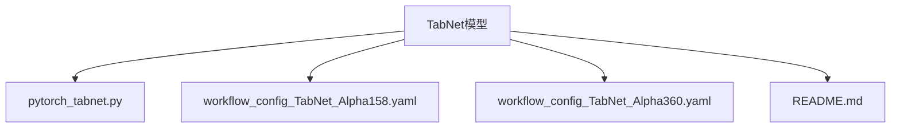
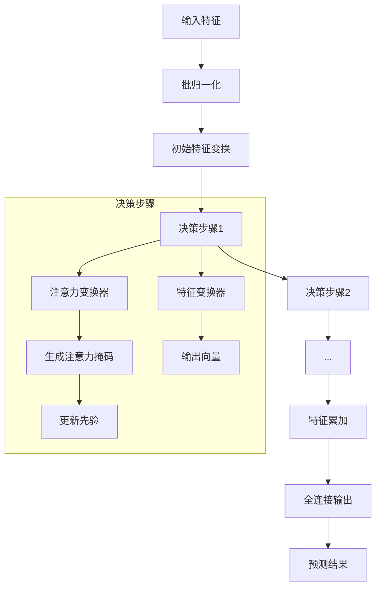
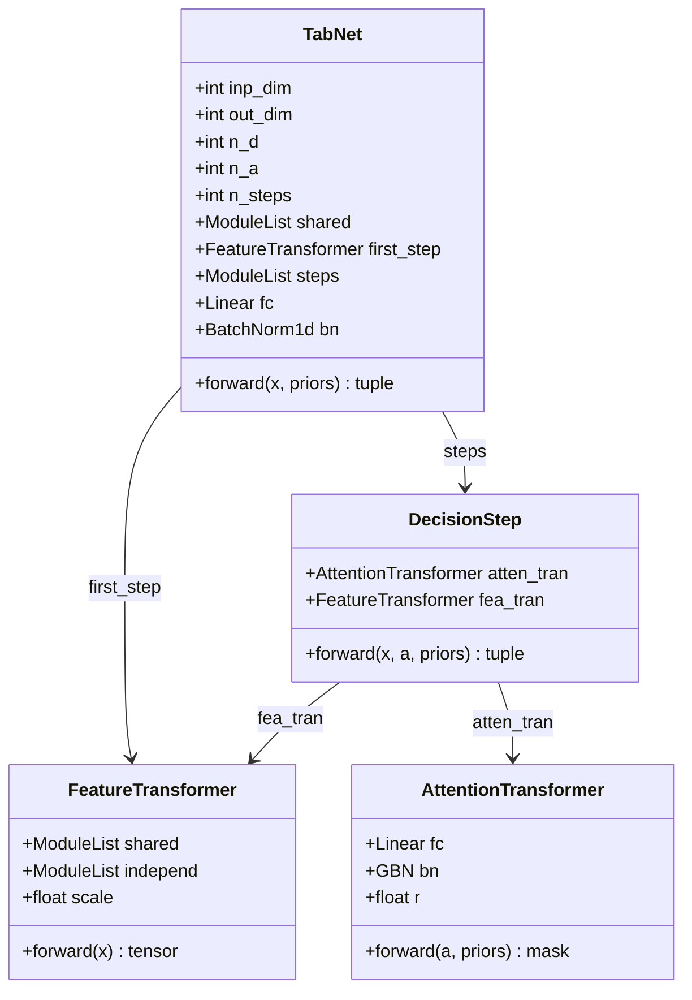
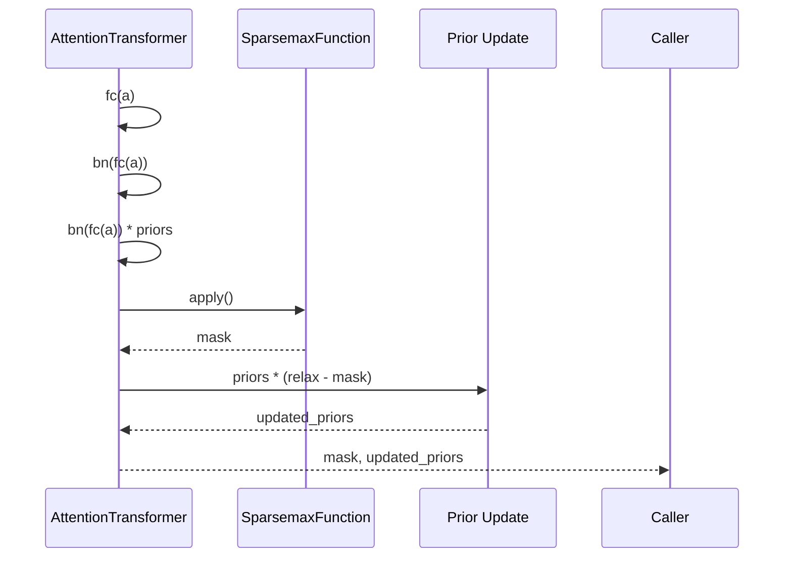
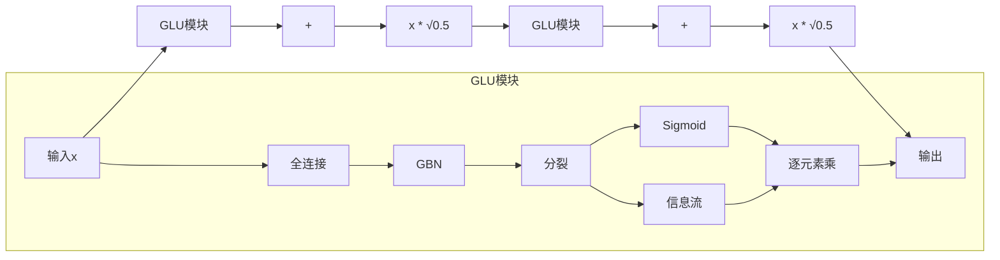
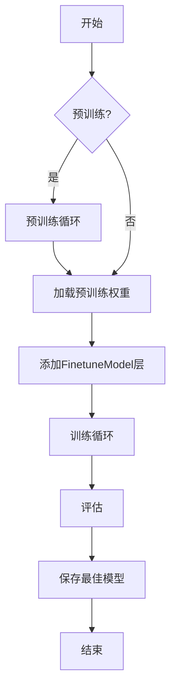
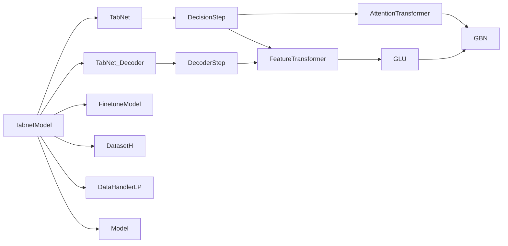

# TabNet模型

<cite>
**本文档中引用的文件**  
- [pytorch_tabnet.py](file://qlib/contrib/model/pytorch_tabnet.py#L24-L643)
- [workflow_config_TabNet_Alpha158.yaml](file://examples/benchmarks/TabNet/workflow_config_TabNet_Alpha158.yaml)
- [workflow_config_TabNet_Alpha360.yaml](file://examples/benchmarks/TabNet/workflow_config_TabNet_Alpha360.yaml)
- [README.md](file://examples/benchmarks/TabNet/README.md)
</cite>

## 目录
1. [简介](#简介)
2. [项目结构](#项目结构)
3. [核心组件](#核心组件)
4. [架构概述](#架构概述)
5. [详细组件分析](#详细组件分析)
6. [依赖分析](#依赖分析)
7. [性能考虑](#性能考虑)
8. [故障排除指南](#故障排除指南)
9. [结论](#结论)

## 简介
TabNet是一种专为表格型数据设计的深度学习模型，结合了注意力机制与可解释性优势，在金融因子建模中表现出色。该模型通过顺序注意力机制实现特征选择，支持预训练以提升泛化能力，并具备稀疏正则化特性，有助于识别关键因子。本文档深入解析其在Qlib框架中的实现机制，涵盖主干网络、注意力掩码生成、上下文信号传递等协同流程，并提供训练调参与内存优化建议。

## 项目结构
Qlib中TabNet模型的实现位于`qlib/contrib/model/`目录下，主要由`pytorch_tabnet.py`文件构成。配置文件位于`examples/benchmarks/TabNet/`路径，包含Alpha158和Alpha360两种因子集的实验设置。模型依赖PyTorch构建，采用模块化设计，分离编码器、解码器与微调逻辑，便于扩展与维护。

**图源**  
- [pytorch_tabnet.py](file://qlib/contrib/model/pytorch_tabnet.py#L1-L10)
- [workflow_config_TabNet_Alpha158.yaml](file://examples/benchmarks/TabNet/workflow_config_TabNet_Alpha158.yaml#L1-L5)
- [workflow_config_TabNet_Alpha360.yaml](file://examples/benchmarks/TabNet/workflow_config_TabNet_Alpha360.yaml#L1-L5)

**节源**  
- [pytorch_tabnet.py](file://qlib/contrib/model/pytorch_tabnet.py#L1-L50)
- [examples/benchmarks/TabNet](file://examples/benchmarks/TabNet)

## 核心组件
TabNet模型的核心组件包括：`TabnetModel`（顶层封装类）、`TabNet`（主干编码器）、`AttentionTransformer`（注意力变换器）、`FeatureTransformer`（特征变换器）、`DecisionStep`（决策步骤）、`GLU`（门控线性单元）以及`TabNet_Decoder`（预训练解码器）。这些组件共同实现了顺序注意力机制、特征选择、上下文传递与稀疏正则化功能。

**节源**  
- [pytorch_tabnet.py](file://qlib/contrib/model/pytorch_tabnet.py#L24-L643)

## 架构概述
TabNet采用分步决策架构，每一步通过注意力机制选择性地关注输入特征的子集。整体流程包括输入批归一化、初始特征变换、多步决策循环（含注意力掩码生成与特征变换）、输出聚合与最终线性映射。预训练阶段引入解码器进行特征重建，利用掩码自编码策略提升模型鲁棒性。

**图源**  
- [pytorch_tabnet.py](file://qlib/contrib/model/pytorch_tabnet.py#L435-L479)
- [pytorch_tabnet.py](file://qlib/contrib/model/pytorch_tabnet.py#L527-L594)

## 详细组件分析

### 主干网络分析
`TabNet`类作为模型主干，负责组织多个决策步骤。其输入经过批归一化后，首先进入`FeatureTransformer`生成初始注意力向量，随后在多个`DecisionStep`中循环处理。每一步输出的有效特征部分被累加至最终表示，其余部分用于下一轮注意力计算。`n_steps`参数控制决策步数，影响模型复杂度与解释性。

#### 类图

**图源**  
- [pytorch_tabnet.py](file://qlib/contrib/model/pytorch_tabnet.py#L435-L479)
- [pytorch_tabnet.py](file://qlib/contrib/model/pytorch_tabnet.py#L549-L577)
- [pytorch_tabnet.py](file://qlib/contrib/model/pytorch_tabnet.py#L580-L594)
- [pytorch_tabnet.py](file://qlib/contrib/model/pytorch_tabnet.py#L527-L546)

**节源**  
- [pytorch_tabnet.py](file://qlib/contrib/model/pytorch_tabnet.py#L435-L479)

### 注意力机制分析
`AttentionTransformer`是实现顺序注意力的核心模块。它接收上一步的注意力输出`a`，通过线性变换与Ghost Batch Normalization处理后，与当前先验`priors`相乘，再经`Sparsemax`函数生成稀疏注意力掩码。该掩码用于加权输入特征，同时更新先验分布（`priors = priors * (relax - mask)`），确保后续步骤关注未被充分使用的特征。

#### 序列图

**图源**  
- [pytorch_tabnet.py](file://qlib/contrib/model/pytorch_tabnet.py#L527-L546)
- [pytorch_tabnet.py](file://qlib/contrib/model/pytorch_tabnet.py#L600-L635)

**节源**  
- [pytorch_tabnet.py](file://qlib/contrib/model/pytorch_tabnet.py#L527-L546)

### 特征变换与门控机制
`FeatureTransformer`利用共享与独立的`GLU`模块堆叠实现非线性特征变换。`GLU`（门控线性单元）通过将输入分裂为两部分，一部分经Sigmoid激活作为门控信号，另一部分作为待传递信息，二者逐元素相乘，实现特征筛选。`scale`因子用于稳定残差连接的输出幅度。

**图源**  
- [pytorch_tabnet.py](file://qlib/contrib/model/pytorch_tabnet.py#L505-L524)
- [pytorch_tabnet.py](file://qlib/contrib/model/pytorch_tabnet.py#L549-L577)

**节源**  
- [pytorch_tabnet.py](file://qlib/contrib/model/pytorch_tabnet.py#L505-L524)

### 预训练与微调流程
模型支持预训练（pretrain）模式，通过`TabNet_Decoder`重建被随机掩码遮蔽的输入特征。预训练损失函数`pretrain_loss_fn`采用归一化均方误差，提升模型对噪声的鲁棒性。微调阶段通过`FinetuneModel`在编码器后添加最终输出层，适配具体任务维度。

**图源**  
- [pytorch_tabnet.py](file://qlib/contrib/model/pytorch_tabnet.py#L24-L381)
- [pytorch_tabnet.py](file://qlib/contrib/model/pytorch_tabnet.py#L384-L395)

**节源**  
- [pytorch_tabnet.py](file://qlib/contrib/model/pytorch_tabnet.py#L24-L381)

## 依赖分析
TabNet模型依赖于Qlib的核心模块，包括`DatasetH`用于数据加载、`DataHandlerLP`用于特征处理、`Model`基类提供统一接口。其内部组件高度模块化，各`DecisionStep`间通过注意力向量与先验进行状态传递，形成序列依赖。外部依赖PyTorch框架实现张量运算与自动微分。

**图源**  
- [pytorch_tabnet.py](file://qlib/contrib/model/pytorch_tabnet.py#L24-L643)

**节源**  
- [pytorch_tabnet.py](file://qlib/contrib/model/pytorch_tabnet.py#L24-L643)

## 性能考虑
TabNet通过虚拟批处理（Virtual Batch Size, vbs）与Ghost Batch Normalization（GBN）缓解小批量训练中的批归一化不稳定问题。`Sparsemax`函数引入的稀疏正则化损失项（`sparse_loss`）促进特征选择，但增加计算开销。建议根据GPU内存调整`batch_size`与`vbs`，并利用`torch.cuda.empty_cache()`释放缓存。对于高维因子（如Alpha360），可适当减少`n_steps`或`n_d/n_a`维度以降低内存占用。

## 故障排除指南
常见问题包括训练损失不下降、预测结果NaN等。应检查输入数据是否存在缺失值（已由`fillna`处理），确保`priors`初始化正确（全1张量），并验证`Sparsemax`输出的掩码是否有效（非NaN）。若预训练失败，可尝试关闭`pretrain`选项或调整`ps`（掩码概率）与`relax`（松弛系数）参数。梯度爆炸可通过`clip_grad_value_`限制。

**节源**  
- [pytorch_tabnet.py](file://qlib/contrib/model/pytorch_tabnet.py#L24-L643)

## 结论
TabNet模型在Qlib中实现了高效的表格数据建模能力，其顺序注意力机制提供了良好的可解释性，适用于金融因子重要性分析。通过预训练策略增强模型鲁棒性，结合稀疏正则化实现自动特征选择。合理配置超参数并优化内存使用，可在Alpha158/Alpha360等大规模因子集上取得稳定表现，为量化投资策略提供有力支持。