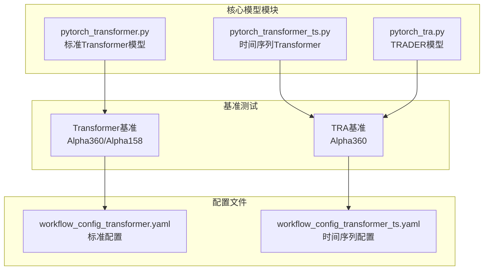
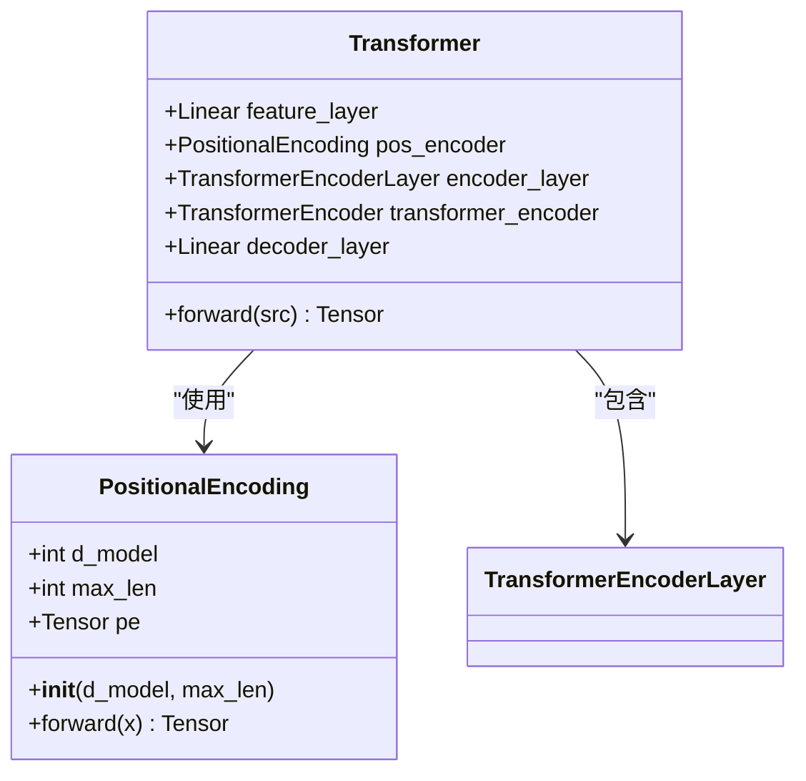
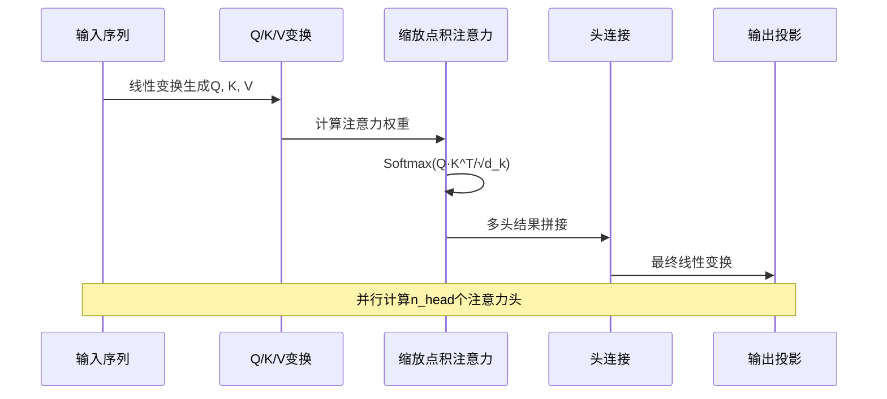
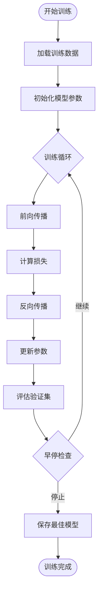
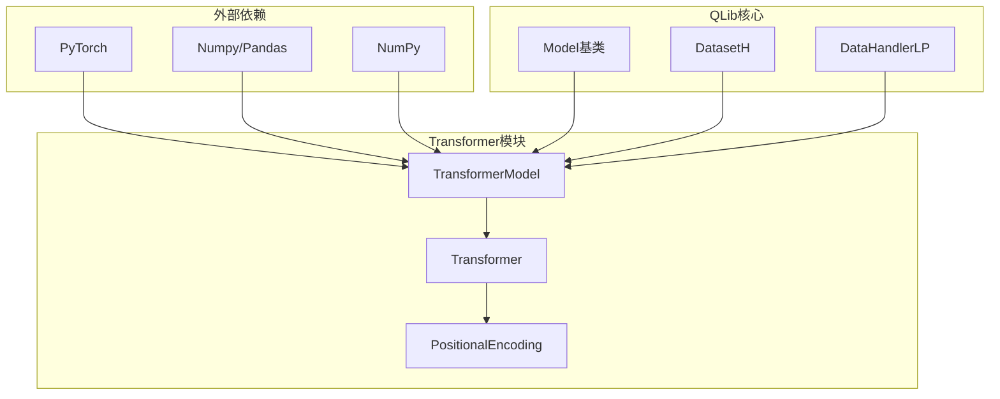

# Qlib中的Transformer模型架构详解

<cite>
**本文档引用的文件**
- [pytorch_transformer.py](file://qlib/contrib/model/pytorch_transformer.py)
- [pytorch_transformer_ts.py](file://qlib/contrib/model/pytorch_transformer_ts.py)
- [model.py](file://examples/benchmarks/TRA/src/model.py)
- [workflow_config_transformer_Alpha360.yaml](file://examples/benchmarks/Transformer/workflow_config_transformer_Alpha360.yaml)
- [workflow_config_transformer_Alpha158.yaml](file://examples/benchmarks/Transformer/workflow_config_transformer_Alpha158.yaml)
- [README.md](file://examples/benchmarks/Transformer/README.md)
</cite>

## 目录
1. [简介](#简介)
2. [项目结构](#项目结构)
3. [核心组件](#核心组件)
4. [架构概览](#架构概览)
5. [详细组件分析](#详细组件分析)
6. [依赖关系分析](#依赖关系分析)
7. [性能考虑](#性能考虑)
8. [故障排除指南](#故障排除指南)
9. [结论](#结论)

## 简介

Qlib中的Transformer模型是基于PyTorch实现的深度学习架构，专门针对金融时序数据设计。该模型借鉴了"Attention is All You Need"论文的核心思想，在Alpha因子预测任务中展现出卓越的建模能力。通过自注意力机制，模型能够有效捕捉金融时间序列中的长期依赖关系和复杂的非线性模式。

Transformer模型在Qlib中提供了两种主要实现：标准的Transformer模型（pytorch_transformer.py）和时间序列专用的Transformer模型（pytorch_transformer_ts.py）。这些模型都采用了先进的位置编码技术、多头注意力机制和前馈网络结构，为金融市场的预测任务提供了强大的工具。

## 项目结构

Qlib中的Transformer模型实现分布在多个模块中，形成了一个完整的生态系统：



**图表来源**
- [pytorch_transformer.py](file://qlib/contrib/model/pytorch_transformer.py#L1-L50)
- [pytorch_transformer_ts.py](file://qlib/contrib/model/pytorch_transformer_ts.py#L1-L50)
- [model.py](file://examples/benchmarks/TRA/src/model.py#L1-L50)

**章节来源**
- [pytorch_transformer.py](file://qlib/contrib/model/pytorch_transformer.py#L1-L286)
- [pytorch_transformer_ts.py](file://qlib/contrib/model/pytorch_transformer_ts.py#L1-L265)

## 核心组件

### Transformer模型类

Qlib中的Transformer模型实现了两个主要版本，每个都有其特定的应用场景：

#### 标准Transformer模型
```python
class TransformerModel(Model):
    def __init__(self, d_feat=20, d_model=64, batch_size=2048, nhead=2, 
                 num_layers=2, dropout=0, n_epochs=100, lr=0.0001, 
                 metric="", early_stop=5, loss="mse", optimizer="adam", 
                 reg=1e-3, n_jobs=10, GPU=0, seed=None, **kwargs):
```

#### 时间序列专用Transformer模型
```python
class TransformerModel(Model):
    def __init__(self, d_feat=20, d_model=64, batch_size=8192, nhead=2, 
                 num_layers=2, dropout=0, n_epochs=100, lr=0.0001, 
                 metric="", early_stop=5, loss="mse", optimizer="adam", 
                 reg=1e-3, n_jobs=10, GPU=0, seed=None, **kwargs):
```

**章节来源**
- [pytorch_transformer.py](file://qlib/contrib/model/pytorch_transformer.py#L20-L60)
- [pytorch_transformer_ts.py](file://qlib/contrib/model/pytorch_transformer_ts.py#L20-L60)

## 架构概览

Transformer模型的整体架构展示了从输入到输出的完整数据流：

```mermaid
graph LR
subgraph "输入层"
A[特征矩阵<br/>[N, F*T]]
end
subgraph "特征转换"
B[线性投影<br/>d_feat → d_model]
end
subgraph "位置编码"
C[正弦余弦编码<br/>positional encoding]
end
subgraph "多头注意力"
D[Transformer Encoder Layer]
E[多头自注意力<br/>nhead个并行注意力头]
F[前馈网络<br/>FFN]
end
subgraph "输出层"
G[线性解码器<br/>d_model → 1]
H[标量输出<br/>[N]]
end
A --> B --> C --> D --> E --> F --> G --> H
```

**图表来源**
- [pytorch_transformer.py](file://qlib/contrib/model/pytorch_transformer.py#L260-L284)
- [pytorch_transformer_ts.py](file://qlib/contrib/model/pytorch_transformer_ts.py#L240-L264)

## 详细组件分析

### 位置编码机制

位置编码是Transformer模型的核心创新之一，它解决了自注意力机制无法区分序列位置的问题：



**图表来源**
- [pytorch_transformer.py](file://qlib/contrib/model/pytorch_transformer.py#L240-L258)
- [pytorch_transformer.py](file://qlib/contrib/model/pytorch_transformer.py#L260-L284)

位置编码的数学公式：
```
PE(pos, 2i) = sin(pos / 10000^(2i/d_model))
PE(pos, 2i+1) = cos(pos / 10000^(2i/d_model))
```

其中：
- `pos` 是位置索引
- `i` 是维度索引
- `d_model` 是模型维度

这种编码方式具有以下特点：
1. **可学习性**：支持任意长度的序列
2. **周期性**：sin和cos函数的周期特性
3. **唯一性**：不同位置有不同的编码值
4. **相对性**：可以推断出相对位置关系

**章节来源**
- [pytorch_transformer.py](file://qlib/contrib/model/pytorch_transformer.py#L240-L258)
- [pytorch_transformer_ts.py](file://qlib/contrib/model/pytorch_transformer_ts.py#L200-L218)

### 多头注意力机制

多头注意力机制允许模型同时关注不同位置的信息，增强了模型的表达能力：



**图表来源**
- [model.py](file://examples/benchmarks/TRA/src/model.py#L414-L459)

### 前馈网络结构

每个Transformer编码器层都包含一个前馈网络，通常采用两层线性变换加激活函数的结构：

```python
layer = nn.TransformerEncoderLayer(
    nhead=num_heads, 
    dropout=dropout, 
    d_model=hidden_size, 
    dim_feedforward=hidden_size * 4
)
```

这种设计的优势：
1. **非线性增强**：通过激活函数增加模型复杂度
2. **维度扩展**：中间层维度通常是输入的4倍
3. **参数效率**：相比直接的全连接层更节省参数

**章节来源**
- [model.py](file://examples/benchmarks/TRA/src/model.py#L414-L459)

### 模型输入输出格式

#### 输入格式
Transformer模型接受形状为 `[N, F*T]` 的输入张量：
- `N`：批量大小
- `F`：特征数量
- `T`：时间步长

#### 输出格式
模型返回形状为 `[N]` 的标量张量，表示每个样本的预测值。

**章节来源**
- [pytorch_transformer.py](file://qlib/contrib/model/pytorch_transformer.py#L260-L284)
- [pytorch_transformer_ts.py](file://qlib/contrib/model/pytorch_transformer_ts.py#L240-L264)

### 训练过程与学习率调度

模型采用标准的监督学习训练流程：



**图表来源**
- [pytorch_transformer.py](file://qlib/contrib/model/pytorch_transformer.py#L100-L150)
- [pytorch_transformer_ts.py](file://qlib/contrib/model/pytorch_transformer_ts.py#L100-L150)

训练过程的关键特性：
1. **梯度裁剪**：防止梯度爆炸
2. **早停机制**：避免过拟合
3. **动态学习率**：支持Adam和SGD优化器
4. **GPU加速**：自动检测CUDA设备

**章节来源**
- [pytorch_transformer.py](file://qlib/contrib/model/pytorch_transformer.py#L100-L150)
- [pytorch_transformer_ts.py](file://qlib/contrib/model/pytorch_transformer_ts.py#L100-L150)

## 依赖关系分析

Transformer模型的依赖关系展现了清晰的层次结构：



**图表来源**
- [pytorch_transformer.py](file://qlib/contrib/model/pytorch_transformer.py#L1-L30)
- [pytorch_transformer_ts.py](file://qlib/contrib/model/pytorch_transformer_ts.py#L1-L30)

**章节来源**
- [pytorch_transformer.py](file://qlib/contrib/model/pytorch_transformer.py#L1-L30)
- [pytorch_transformer_ts.py](file://qlib/contrib/model/pytorch_transformer_ts.py#L1-L30)

## 性能考虑

### 内存优化策略

1. **批处理大小调整**：根据GPU内存动态调整batch_size
2. **梯度累积**：在内存受限时使用梯度累积
3. **混合精度训练**：支持FP16以减少内存占用

### 计算效率优化

1. **并行化处理**：利用多核CPU进行数据预处理
2. **异步数据加载**：使用DataLoader进行高效的数据传输
3. **缓存机制**：对频繁访问的数据进行缓存

### 超参数调优建议

1. **学习率范围**：0.0001-0.01之间
2. **批次大小**：2048-8192之间
3. **层数选择**：2-4层适合大多数金融数据
4. **头数设置**：2-8个注意力头
5. **dropout率**：0.1-0.5之间

## 故障排除指南

### 常见问题及解决方案

#### 内存不足错误
```python
# 解决方案：减小batch_size或使用梯度累积
self.batch_size = 1024  # 减小批次大小
```

#### 梯度消失/爆炸
```python
# 解决方案：使用梯度裁剪和适当的初始化
torch.nn.utils.clip_grad_value_(self.model.parameters(), 3.0)
```

#### 收敛速度慢
```python
# 解决方案：调整学习率和优化器
self.lr = 0.001  # 提高学习率
self.optimizer = "adam"  # 使用自适应优化器
```

**章节来源**
- [pytorch_transformer.py](file://qlib/contrib/model/pytorch_transformer.py#L100-L150)
- [pytorch_transformer_ts.py](file://qlib/contrib/model/pytorch_transformer_ts.py#L100-L150)

## 结论

Qlib中的Transformer模型架构代表了深度学习在金融时序数据分析领域的先进实践。通过精心设计的位置编码、多头注意力机制和前馈网络结构，该模型能够有效捕捉金融市场的复杂模式和长期依赖关系。

主要优势包括：
1. **强大的建模能力**：能够捕捉复杂的非线性关系
2. **并行计算友好**：适合大规模数据处理
3. **可扩展性强**：支持多种变体和改进
4. **易于集成**：与QLib生态系统无缝集成

未来发展方向：
1. **模型压缩**：减少模型大小以提高推理速度
2. **注意力可视化**：增强模型解释性
3. **多尺度分析**：支持不同时间尺度的数据处理
4. **领域适应**：针对特定金融市场进行优化

通过合理的超参数调优和训练策略，Transformer模型在Alpha因子预测任务中展现出了优异的性能，为量化投资提供了强有力的技术支撑。