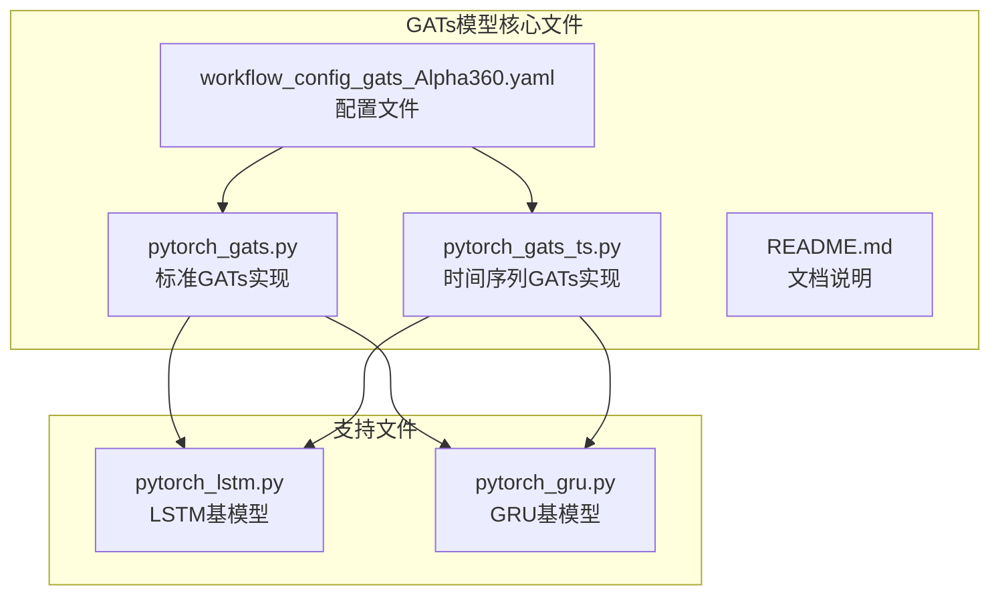
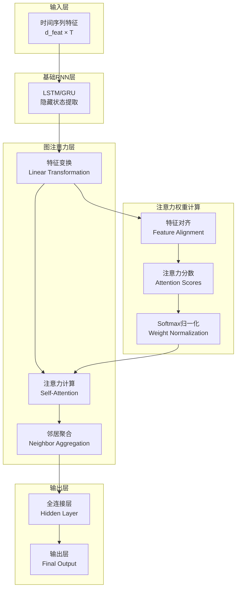
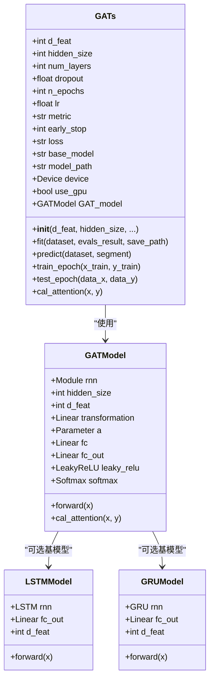
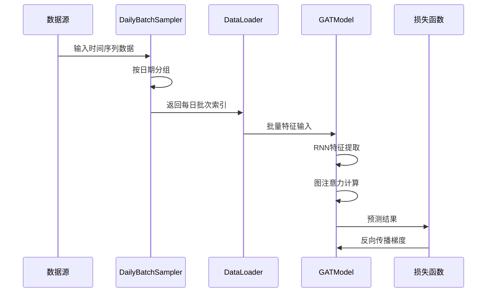
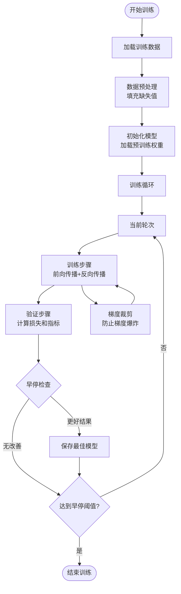
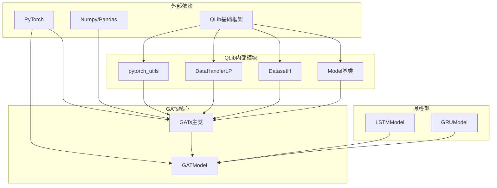

# 图神经网络（GATs）模型

<cite>
**本文档引用的文件**
- [pytorch_gats.py](file://qlib/contrib/model/pytorch_gats.py)
- [pytorch_gats_ts.py](file://qlib/contrib/model/pytorch_gats_ts.py)
- [workflow_config_gats_Alpha360.yaml](file://examples/benchmarks/GATs/workflow_config_gats_Alpha360.yaml)
- [README.md](file://examples/benchmarks/GATs/README.md)
- [pytorch_lstm.py](file://qlib/contrib/model/pytorch_lstm.py)
- [pytorch_gru.py](file://qlib/contrib/model/pytorch_gru.py)
</cite>

## 目录
1. [简介](#简介)
2. [项目结构](#项目结构)
3. [核心组件](#核心组件)
4. [架构概览](#架构概览)
5. [详细组件分析](#详细组件分析)
6. [依赖关系分析](#依赖关系分析)
7. [性能考虑](#性能考虑)
8. [故障排除指南](#故障排除指南)
9. [结论](#结论)

## 简介

QLib中的图注意力网络（Graph Attention Networks, GATs）是一种基于PyTorch实现的创新金融预测模型。该模型巧妙地将股票间的复杂关系建模为图结构，通过自注意力机制实现跨资产的信息传播和特征提取。

GATs模型的核心思想是利用图结构来表示金融市场的节点关系，其中每个节点代表一个股票或资产，边权重则反映了它们之间的相关性或影响程度。模型采用masked self-attentional layers，在不依赖预知图结构的情况下，让节点能够关注其邻域特征的不同权重。

这种设计使得GATs能够在保持计算效率的同时，有效捕捉金融市场中的复杂依赖关系，特别适用于板块轮动、关联性挖掘等场景。

## 项目结构

QLib中的GATs模型主要由以下文件组成：



**图表来源**
- [pytorch_gats.py](file://qlib/contrib/model/pytorch_gats.py#L1-L50)
- [pytorch_gats_ts.py](file://qlib/contrib/model/pytorch_gats_ts.py#L1-L50)

**章节来源**
- [pytorch_gats.py](file://qlib/contrib/model/pytorch_gats.py#L1-L385)
- [pytorch_gats_ts.py](file://qlib/contrib/model/pytorch_gats_ts.py#L1-L394)

## 核心组件

GATs模型的核心组件包括以下几个关键部分：

### 1. 主模型类（GATs）
主模型类负责整个训练和推理流程的管理，包括参数设置、数据处理、模型训练和预测。

### 2. 图注意力模型（GATModel）
这是GATs的核心神经网络架构，实现了图注意力机制和特征转换功能。

### 3. 基础RNN模型
支持使用LSTM或GRU作为基础模型，提供时序特征提取能力。

### 4. 数据处理器
专门的数据加载器和批处理机制，确保数据的正确组织和高效处理。

**章节来源**
- [pytorch_gats.py](file://qlib/contrib/model/pytorch_gats.py#L20-L100)
- [pytorch_gats_ts.py](file://qlib/contrib/model/pytorch_gats_ts.py#L39-L150)

## 架构概览

GATs模型的整体架构如下所示：



**图表来源**
- [pytorch_gats.py](file://qlib/contrib/model/pytorch_gats.py#L337-L385)
- [pytorch_gats_ts.py](file://qlib/contrib/model/pytorch_gats_ts.py#L337-L394)

## 详细组件分析

### GATs主模型类分析

GATs主模型类继承自QLib的基础Model类，提供了完整的机器学习管道：



**图表来源**
- [pytorch_gats.py](file://qlib/contrib/model/pytorch_gats.py#L20-L385)
- [pytorch_gats_ts.py](file://qlib/contrib/model/pytorch_gats_ts.py#L337-L394)

#### 注意力机制实现

GATs模型的核心在于其自定义的注意力计算函数：

```python
def cal_attention(self, x, y):
    x = self.transformation(x)
    y = self.transformation(y)
    
    sample_num = x.shape[0]
    dim = x.shape[1]
    e_x = x.expand(sample_num, sample_num, dim)
    e_y = torch.transpose(e_x, 0, 1)
    attention_in = torch.cat((e_x, e_y), 2).view(-1, dim * 2)
    self.a_t = torch.t(self.a)
    attention_out = self.a_t.mm(torch.t(attention_in)).view(sample_num, sample_num)
    attention_out = self.leaky_relu(attention_out)
    att_weight = self.softmax(attention_out)
    return att_weight
```

这个实现的关键特点：
- **特征变换**：通过线性层将原始特征映射到注意力空间
- **特征对齐**：创建所有可能的特征对组合
- **注意力分数**：使用可学习参数计算每对特征的重要性
- **归一化**：通过Softmax确保权重总和为1

**章节来源**
- [pytorch_gats.py](file://qlib/contrib/model/pytorch_gats.py#L350-L370)
- [pytorch_gats_ts.py](file://qlib/contrib/model/pytorch_gats_ts.py#L350-L370)

### 时间序列处理机制

GATs模型提供了两种不同的实现方式，分别针对不同的数据格式：

#### 标准GATs实现
适用于静态特征矩阵，直接进行图注意力计算。

#### 时间序列GATs实现
专门为时间序列数据设计，包含以下特性：
- **DailyBatchSampler**：按日组织数据批次，确保时间连续性
- **DataLoader集成**：高效的批量数据加载
- **填充处理**：自动处理缺失值



**图表来源**
- [pytorch_gats_ts.py](file://qlib/contrib/model/pytorch_gats_ts.py#L20-L35)
- [pytorch_gats_ts.py](file://qlib/contrib/model/pytorch_gats_ts.py#L200-L250)

**章节来源**
- [pytorch_gats_ts.py](file://qlib/contrib/model/pytorch_gats_ts.py#L20-L394)

### 训练流程分析

GATs模型的训练过程包含以下关键步骤：



**图表来源**
- [pytorch_gats.py](file://qlib/contrib/model/pytorch_gats.py#L200-L300)
- [pytorch_gats_ts.py](file://qlib/contrib/model/pytorch_gats_ts.py#L250-L350)

**章节来源**
- [pytorch_gats.py](file://qlib/contrib/model/pytorch_gats.py#L200-L350)
- [pytorch_gats_ts.py](file://qlib/contrib/model/pytorch_gats_ts.py#L250-L350)

## 依赖关系分析

GATs模型的依赖关系体现了其模块化设计：



**图表来源**
- [pytorch_gats.py](file://qlib/contrib/model/pytorch_gats.py#L1-L20)
- [pytorch_gats_ts.py](file://qlib/contrib/model/pytorch_gats_ts.py#L1-L20)

**章节来源**
- [pytorch_gats.py](file://qlib/contrib/model/pytorch_gats.py#L1-L20)
- [pytorch_gats_ts.py](file://qlib/contrib/model/pytorch_gats_ts.py#L1-L20)

## 性能考虑

### 内存优化
- **梯度裁剪**：防止梯度爆炸导致的内存溢出
- **批量处理**：合理设置批次大小平衡内存使用和训练效率
- **设备管理**：自动选择GPU加速训练过程

### 计算效率
- **注意力计算优化**：避免不必要的矩阵操作
- **预训练模型加载**：减少从头训练所需时间
- **早停机制**：防止过拟合同时节省计算资源

### 可扩展性
- **模块化设计**：支持不同类型的RNN基模型
- **配置灵活**：可通过YAML配置文件调整超参数
- **多GPU支持**：充分利用硬件资源

## 故障排除指南

### 常见问题及解决方案

#### 1. 内存不足错误
**症状**：CUDA out of memory
**解决方案**：
- 减少批次大小（batch_size）
- 使用更小的隐藏层维度（hidden_size）
- 启用梯度累积

#### 2. 训练不收敛
**症状**：损失函数不下降
**解决方案**：
- 调整学习率（lr）
- 检查数据预处理是否正确
- 增加dropout防止过拟合

#### 3. GPU利用率低
**症状**：GPU空闲时间过长
**解决方案**：
- 增加数据加载进程数（n_jobs）
- 优化数据预处理流程
- 使用混合精度训练

**章节来源**
- [pytorch_gats.py](file://qlib/contrib/model/pytorch_gats.py#L150-L200)
- [pytorch_gats_ts.py](file://qlib/contrib/model/pytorch_gats_ts.py#L150-L200)

## 结论

QLib中的GATs模型是一个精心设计的图神经网络实现，它成功地将图注意力机制应用于金融时间序列预测。该模型的主要优势包括：

1. **创新性**：首次在QLib中引入图注意力网络概念
2. **灵活性**：支持多种RNN基模型和数据格式
3. **实用性**：经过Alpha360基准测试验证有效性
4. **可扩展性**：模块化设计便于后续改进和扩展

通过将股票市场建模为图结构，GATs能够有效捕捉资产间的复杂关系，为量化投资提供了新的视角和工具。其在板块轮动、关联性挖掘等场景中的应用潜力巨大，值得进一步研究和实践。

未来的发展方向可能包括：
- 引入多头注意力机制提升表达能力
- 支持动态图更新以适应市场变化
- 集成更多金融特征和市场指标
- 开发专门的可视化工具辅助模型解释