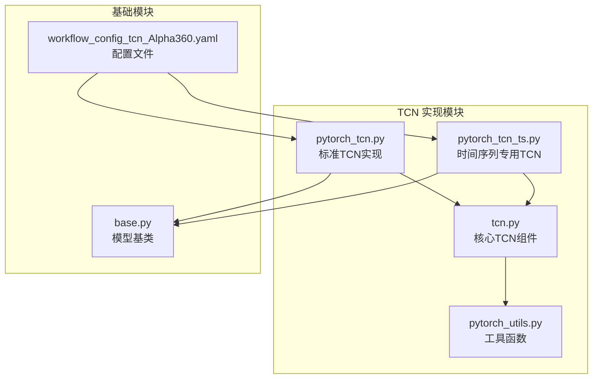
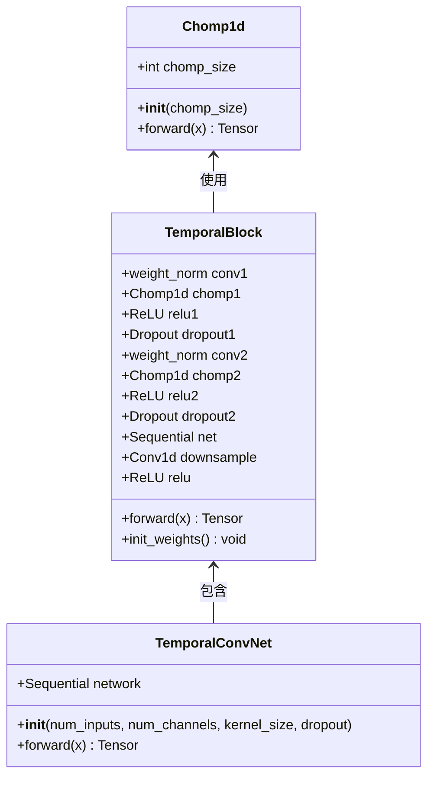
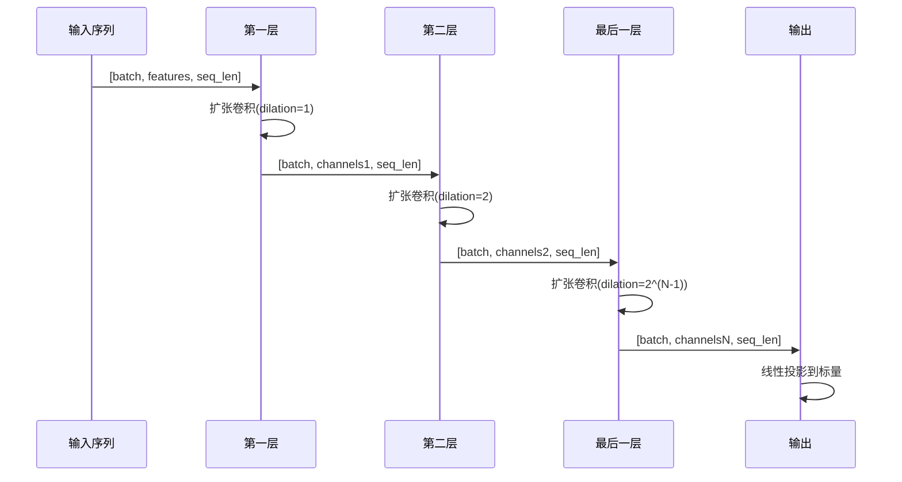
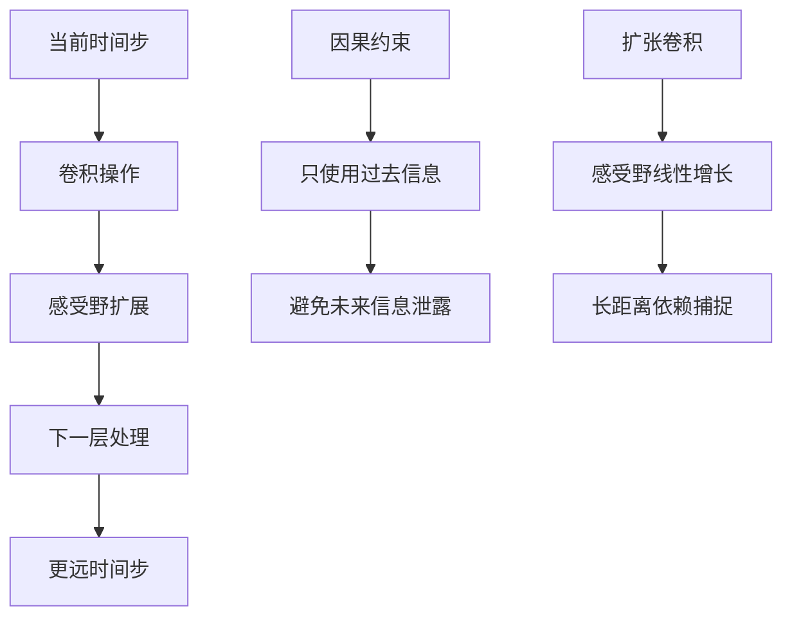
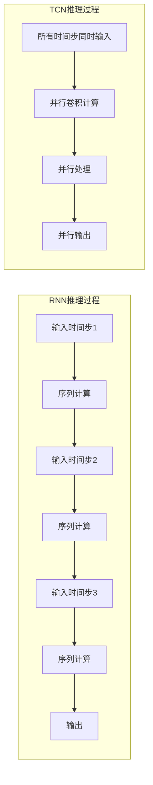
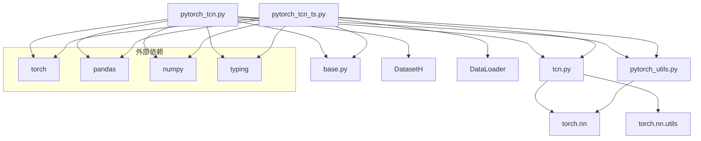

# 时序卷积网络（TCN）模型

<cite>
**本文档引用的文件**
- [pytorch_tcn.py](file://qlib/contrib/model/pytorch_tcn.py)
- [pytorch_tcn_ts.py](file://qlib/contrib/model/pytorch_tcn_ts.py)
- [tcn.py](file://qlib/contrib/model/tcn.py)
- [pytorch_utils.py](file://qlib/contrib/model/pytorch_utils.py)
- [base.py](file://qlib/model/base.py)
- [workflow_config_tcn_Alpha360.yaml](file://examples/benchmarks/TCN/workflow_config_tcn_Alpha360.yaml)
- [README.md](file://examples/benchmarks/TCN/README.md)
</cite>

## 目录
1. [简介](#简介)
2. [项目结构](#项目结构)
3. [核心组件](#核心组件)
4. [架构概览](#架构概览)
5. [详细组件分析](#详细组件分析)
6. [依赖关系分析](#依赖关系分析)
7. [性能考虑](#性能考虑)
8. [故障排除指南](#故障排除指南)
9. [结论](#结论)

## 简介

时序卷积网络（Temporal Convolutional Network，TCN）是一种专门用于处理时序数据的深度学习模型。在QLib框架中，TCN被设计为一种高效的时序预测解决方案，特别适用于金融市场的价格预测、趋势分析等任务。

TCN的核心优势在于其因果卷积结构，这种结构能够在保持并行计算能力的同时，有效地捕捉长距离依赖关系。相比于传统的循环神经网络（RNN）和长短时记忆网络（LSTM），TCN具有更好的训练稳定性和更快的推理速度。

## 项目结构

QLib中的TCN实现主要包含以下核心文件：



**图表来源**
- [pytorch_tcn.py](file://qlib/contrib/model/pytorch_tcn.py#L1-L62)
- [pytorch_tcn_ts.py](file://qlib/contrib/model/pytorch_tcn_ts.py#L1-L60)
- [tcn.py](file://qlib/contrib/model/tcn.py#L1-L77)

**章节来源**
- [pytorch_tcn.py](file://qlib/contrib/model/pytorch_tcn.py#L1-L309)
- [pytorch_tcn_ts.py](file://qlib/contrib/model/pytorch_tcn_ts.py#L1-L298)

## 核心组件

### TCN模型类

QLib提供了两种TCN实现：标准TCN和时间序列专用TCN。这两种实现都基于相同的底层架构，但在数据处理和接口设计上有所不同。

#### 标准TCN实现（pytorch_tcn.py）

标准TCN实现继承自`Model`基类，提供了完整的模型生命周期管理功能：

```python
class TCN(Model):
    """TCN Model
    
    参数：
    ----------
    d_feat : int
        每个时间步的输入维度
    n_chans: int
        通道数量
    metric: str
        早停使用的评估指标
    optimizer : str
        优化器名称
    GPU : str
        训练使用的GPU ID
    """
```

#### 时间序列专用TCN实现（pytorch_tcn_ts.py）

时间序列专用TCN实现针对时间序列数据的特点进行了优化：

```python
class TCN(Model):
    """TCN Model
    
    参数：
    ----------
    d_feat : int
        每个时间步的输入维度
    metric: str
        早停使用的评估指标
    optimizer : str
        优化器名称
    GPU : str
        训练使用的GPU ID
    """
```

**章节来源**
- [pytorch_tcn.py](file://qlib/contrib/model/pytorch_tcn.py#L20-L62)
- [pytorch_tcn_ts.py](file://qlib/contrib/model/pytorch_tcn_ts.py#L20-L60)

## 架构概览

TCN的整体架构基于扩张因果卷积（Dilated Causal Convolution）原理，通过多层扩张卷积来捕捉不同时间尺度的特征：

```mermaid
graph TD
A[输入序列<br/>形状: [batch, features, seq_len]] --> B[TCN层堆叠]
B --> C[扩张因果卷积]
C --> D[残差连接]
D --> E[ReLU激活]
E --> F[Dropout]
F --> G[线性输出层]
G --> H[预测结果]
subgraph "TCN层结构"
I[输入通道] --> J[扩张卷积1]
J --> K[Chomp1d]
K --> L[ReLU]
L --> M[Dropout]
M --> N[扩张卷积2]
N --> O[Chomp1d]
O --> P[ReLU]
P --> Q[残差连接]
Q --> R[输出]
end
subgraph "扩张卷积特性"
S[膨胀率递增<br/>2^0, 2^1, 2^2, ...]
T[感受野扩展<br/>线性增长]
U[因果约束<br/>不使用未来信息]
end
```

**图表来源**
- [tcn.py](file://qlib/contrib/model/tcn.py#L15-L77)
- [pytorch_tcn.py](file://qlib/contrib/model/pytorch_tcn.py#L285-L309)

## 详细组件分析

### 扩张因果卷积核心组件

#### Chomp1d层

Chomp1d层是TCN架构中的关键组件，用于确保因果性：



**图表来源**
- [tcn.py](file://qlib/contrib/model/tcn.py#L8-L37)

#### TemporalBlock结构

每个TemporalBlock包含两个扩张卷积层，采用残差连接设计：

```python
class TemporalBlock(nn.Module):
    def __init__(self, n_inputs, n_outputs, kernel_size, stride, dilation, padding, dropout=0.2):
        super(TemporalBlock, self).__init__()
        # 第一个卷积层
        self.conv1 = weight_norm(
            nn.Conv1d(n_inputs, n_outputs, kernel_size, 
                     stride=stride, padding=padding, dilation=dilation)
        )
        self.chomp1 = Chomp1d(padding)
        self.relu1 = nn.ReLU()
        self.dropout1 = nn.Dropout(dropout)
        
        # 第二个卷积层
        self.conv2 = weight_norm(
            nn.Conv1d(n_outputs, n_outputs, kernel_size, 
                     stride=stride, padding=padding, dilation=dilation)
        )
        self.chomp2 = Chomp1d(padding)
        self.relu2 = nn.ReLU()
        self.dropout2 = nn.Dropout(dropout)
        
        # 残差连接
        self.downsample = nn.Conv1d(n_inputs, n_outputs, 1) if n_inputs != n_outputs else None
        self.relu = nn.ReLU()
```

#### 扩张率计算

TCN中的扩张率按照指数增长：

```python
def __init__(self, num_inputs, num_channels, kernel_size=2, dropout=0.2):
    layers = []
    num_levels = len(num_channels)
    for i in range(num_levels):
        dilation_size = 2**i  # 扩张率指数增长
        in_channels = num_inputs if i == 0 else num_channels[i - 1]
        out_channels = num_channels[i]
        layers += [TemporalBlock(...)]
```

**章节来源**
- [tcn.py](file://qlib/contrib/model/tcn.py#L15-L77)

### TCN模型堆叠

#### 多层堆叠机制

TCN通过多层堆叠来增加模型容量和感受野：



**图表来源**
- [tcn.py](file://qlib/contrib/model/tcn.py#L55-L77)
- [pytorch_tcn.py](file://qlib/contrib/model/pytorch_tcn.py#L285-L309)

#### 时间维度信息流动

TCN的时间维度信息流动遵循因果约束：



**章节来源**
- [tcn.py](file://qlib/contrib/model/tcn.py#L55-L77)

### 数据预处理要求

#### 输入数据格式

TCN模型要求特定的数据格式：

```python
# 标准TCN输入格式
x_train_values = x_train.values  # 形状: [样本数, 特征数, 时间步长]
y_train_values = np.squeeze(y_train.values)  # 形状: [样本数]

# 时间序列专用TCN输入格式
data = torch.transpose(data, 1, 2)  # 转换为 [batch, features, seq_len]
feature = data[:, 0:-1, :].to(self.device)  # 特征部分
label = data[:, -1, -1].to(self.device)  # 标签部分
```

#### 数据标准化处理

模型支持多种数据预处理方法：

```yaml
infer_processors:
    - class: RobustZScoreNorm
      kwargs:
          fields_group: feature
          clip_outlier: true
    - class: Fillna
      kwargs:
          fields_group: feature
```

**章节来源**
- [pytorch_tcn.py](file://qlib/contrib/model/pytorch_tcn.py#L165-L190)
- [pytorch_tcn_ts.py](file://qlib/contrib/model/pytorch_tcn_ts.py#L180-L200)

### 训练配置与优化

#### 关键超参数

TCN模型的关键超参数包括：

```python
# 核心超参数
d_feat = 6           # 输入特征维度
n_chans = 128        # 每层通道数
kernel_size = 3      # 卷积核大小
num_layers = 5       # TCN层数
dropout = 0.5        # Dropout概率
lr = 0.001           # 学习率
batch_size = 2000    # 批量大小
n_epochs = 200       # 训练轮数
early_stop = 20      # 早停轮数
```

#### 优化器选择

模型支持多种优化器：

```python
if optimizer.lower() == "adam":
    self.train_optimizer = optim.Adam(self.tcn_model.parameters(), lr=self.lr)
elif optimizer.lower() == "gd":
    self.train_optimizer = optim.SGD(self.tcn_model.parameters(), lr=self.lr)
else:
    raise NotImplementedError(f"optimizer {optimizer} is not supported!")
```

#### 损失函数与评估指标

```python
def mse(self, pred, label):
    loss = (pred - label) ** 2
    return torch.mean(loss)

def loss_fn(self, pred, label):
    mask = ~torch.isnan(label)
    if self.loss == "mse":
        return self.mse(pred[mask], label[mask])
```

**章节来源**
- [pytorch_tcn.py](file://qlib/contrib/model/pytorch_tcn.py#L64-L113)
- [pytorch_tcn_ts.py](file://qlib/contrib/model/pytorch_tcn_ts.py#L130-L173)

### 推理延迟分析

#### 并行计算优势

TCN相比RNN的主要优势之一是并行计算能力：



#### 内存使用效率

TCN的内存使用特点：

```python
def count_parameters(models_or_parameters, unit="m"):
    """统计模型参数数量"""
    if isinstance(models_or_parameters, nn.Module):
        counts = sum(v.numel() for v in models_or_parameters.parameters())
    elif isinstance(models_or_parameters, nn.Parameter):
        counts = models_or_parameters.numel()
    return counts / (2**20)  # 返回MB单位
```

**章节来源**
- [pytorch_utils.py](file://qlib/contrib/model/pytorch_utils.py#L8-L37)

## 依赖关系分析

### 模块依赖图



**图表来源**
- [pytorch_tcn.py](file://qlib/contrib/model/pytorch_tcn.py#L1-L20)
- [pytorch_tcn_ts.py](file://qlib/contrib/model/pytorch_tcn_ts.py#L1-L20)

### 核心依赖关系

TCN模型的核心依赖关系包括：

1. **PyTorch基础模块**：`torch.nn`、`torch.optim`、`torch.utils.data`
2. **QLib基础模块**：`Model`基类、`DatasetH`、`DataHandlerLP`
3. **工具模块**：参数计数、日志记录、路径管理

**章节来源**
- [pytorch_tcn.py](file://qlib/contrib/model/pytorch_tcn.py#L1-L20)
- [pytorch_tcn_ts.py](file://qlib/contrib/model/pytorch_tcn_ts.py#L1-L20)

## 性能考虑

### 与其他模型的比较

#### TCN vs RNN

| 特性 | TCN | RNN |
|------|-----|-----|
| 计算模式 | 并行 | 序列 |
| 感受野 | 线性增长 | 指数增长 |
| 梯度消失 | 较少 | 常见 |
| 训练稳定性 | 更好 | 较差 |
| 推理速度 | 快 | 慢 |

#### TCN vs Transformer

| 特性 | TCN | Transformer |
|------|-----|-------------|
| 参数数量 | 较少 | 较多 |
| 计算复杂度 | O(T) | O(T²) |
| 长距离依赖 | 有效 | 注意力机制 |
| 可解释性 | 较高 | 较低 |

### 金融时序任务中的表现

在Alpha360基准测试中，TCN的表现特征：

```yaml
task:
    model:
        class: TCN
        module_path: qlib.contrib.model.pytorch_tcn
        kwargs:
            d_feat: 6
            num_layers: 5
            n_chans: 128
            kernel_size: 3
            dropout: 0.5
            n_epochs: 200
            lr: 1e-3
            early_stop: 20
            batch_size: 2000
```

### 优化建议

1. **硬件加速**：启用GPU训练以提高效率
2. **批处理优化**：适当调整batch_size平衡内存和速度
3. **正则化**：合理使用dropout防止过拟合
4. **早停策略**：设置合适的early_stop参数

## 故障排除指南

### 常见问题与解决方案

#### 内存不足错误

```python
# 解决方案：减小batch_size或使用梯度累积
if self.use_gpu:
    torch.cuda.empty_cache()  # 清理GPU缓存
```

#### 梯度爆炸问题

```python
# 解决方案：梯度裁剪
torch.nn.utils.clip_grad_value_(self.tcn_model.parameters(), 3.0)
```

#### 收敛缓慢

```python
# 解决方案：调整学习率和优化器
if optimizer.lower() == "adam":
    self.train_optimizer = optim.Adam(self.tcn_model.parameters(), lr=self.lr)
```

**章节来源**
- [pytorch_tcn.py](file://qlib/contrib/model/pytorch_tcn.py#L175-L185)
- [pytorch_tcn_ts.py](file://qlib/contrib/model/pytorch_tcn_ts.py#L190-L200)

### 调试技巧

1. **参数监控**：定期检查模型参数分布
2. **损失曲线**：观察训练和验证损失变化
3. **梯度检查**：监控梯度范数防止异常
4. **早期停止**：及时停止过拟合训练

## 结论

QLib中的时序卷积网络（TCN）模型提供了一种高效且稳定的时序预测解决方案。通过因果扩张卷积、残差连接和多层堆叠设计，TCN能够有效捕捉金融市场的长期依赖关系，同时保持良好的训练稳定性和推理效率。

### 主要优势

1. **因果性保证**：通过Chomp1d层确保因果约束
2. **并行计算**：支持GPU并行加速
3. **长距离依赖**：通过扩张卷积有效捕捉长期模式
4. **训练稳定**：较少的梯度消失问题
5. **可解释性**：相对简单的网络结构

### 应用建议

1. **数据预处理**：进行适当的特征标准化和缺失值处理
2. **超参数调优**：根据具体任务调整网络深度和宽度
3. **硬件配置**：优先使用GPU加速训练过程
4. **监控指标**：关注训练损失和验证性能的变化

TCN模型在金融时序预测任务中表现出色，特别是在需要快速推理和稳定训练的场景中。通过合理的配置和优化，TCN能够成为金融量化投资中的有力工具。