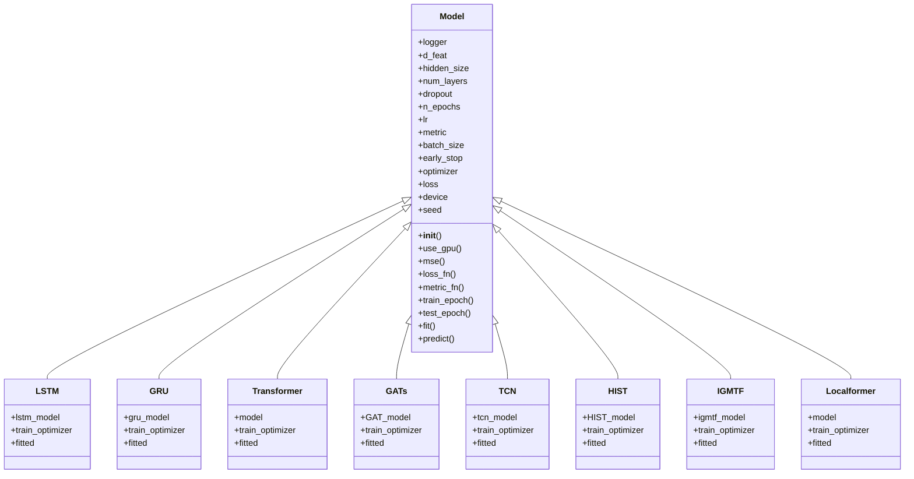

# 深度学习模型

<cite>
**本文档中引用的文件**   
- [pytorch_lstm.py](file://qlib/contrib/model/pytorch_lstm.py)
- [pytorch_gru.py](file://qlib/contrib/model/pytorch_gru.py)
- [pytorch_transformer.py](file://qlib/contrib/model/pytorch_transformer.py)
- [pytorch_gats.py](file://qlib/contrib/model/pytorch_gats.py)
- [pytorch_tcn.py](file://qlib/contrib/model/pytorch_tcn.py)
- [pytorch_hist.py](file://qlib/contrib/model/pytorch_hist.py)
- [pytorch_igmtf.py](file://qlib/contrib/model/pytorch_igmtf.py)
- [pytorch_localformer.py](file://qlib/contrib/model/pytorch_localformer.py)
- [pytorch_utils.py](file://qlib/contrib/model/pytorch_utils.py)
- [workflow_config_lstm_Alpha360.yaml](file://examples/benchmarks/LSTM/workflow_config_lstm_Alpha360.yaml)
- [workflow_config_gru_Alpha360.yaml](file://examples/benchmarks/GRU/workflow_config_gru_Alpha360.yaml)
- [workflow_config_transformer_Alpha360.yaml](file://examples/benchmarks/Transformer/workflow_config_transformer_Alpha360.yaml)
- [workflow_config_gats_Alpha360.yaml](file://examples/benchmarks/GATs/workflow_config_gats_Alpha360.yaml)
- [workflow_config_tcn_Alpha360.yaml](file://examples/benchmarks/TCN/workflow_config_tcn_Alpha360.yaml)
- [workflow_config_hist_Alpha360.yaml](file://examples/benchmarks/HIST/workflow_config_hist_Alpha360.yaml)
- [workflow_config_igmtf_Alpha360.yaml](file://examples/benchmarks/IMGTF/workflow_config_igmtf_Alpha360.yaml)
- [workflow_config_localformer_Alpha360.yaml](file://examples/benchmarks/Localformer/workflow_config_localformer_Alpha360.yaml)
</cite>

## 目录
1. [引言](#引言)
2. [项目结构](#项目结构)
3. [核心组件](#核心组件)
4. [架构概述](#架构概述)
5. [详细组件分析](#详细组件分析)
6. [依赖分析](#依赖分析)
7. [性能考虑](#性能考虑)
8. [故障排除指南](#故障排除指南)
9. [结论](#结论)

## 引言
本文档深入阐述了Qlib中基于PyTorch实现的各类深度学习模型，包括循环神经网络（LSTM/GRU）、注意力机制（Transformer）、图神经网络（GATs）、时序卷积网络（TCN）及其他专用架构（如HIST、IGMTF、Localformer等）。详细解析每类模型的网络结构设计、时间序列处理逻辑及其在金融时序预测中的适应性优化。结合代码示例说明模型类的继承关系、前向传播实现、损失函数配置及训练策略。文档涵盖模型输入输出格式、与数据集加载器的协作机制、GPU加速支持以及与其他模块（如工作流管理器）的集成方式。同时提供典型训练配置参数说明、调试技巧和性能瓶颈分析。

## 项目结构
Qlib项目中的深度学习模型主要位于`qlib/contrib/model/`目录下，每个模型都有独立的Python文件实现。模型文件命名遵循`pytorch_<model_name>.py`的模式，如`pytorch_lstm.py`、`pytorch_gru.py`等。这些模型文件实现了特定的深度学习架构，并提供了与Qlib框架集成的接口。

**图源**
- [pytorch_lstm.py](file://qlib/contrib/model/pytorch_lstm.py)
- [pytorch_gru.py](file://qlib/contrib/model/pytorch_gru.py)
- [pytorch_transformer.py](file://qlib/contrib/model/pytorch_transformer.py)
- [pytorch_gats.py](file://qlib/contrib/model/pytorch_gats.py)
- [pytorch_tcn.py](file://qlib/contrib/model/pytorch_tcn.py)
- [pytorch_hist.py](file://qlib/contrib/model/pytorch_hist.py)
- [pytorch_igmtf.py](file://qlib/contrib/model/pytorch_igmtf.py)
- [pytorch_localformer.py](file://qlib/contrib/model/pytorch_localformer.py)
- [workflow_config_lstm_Alpha360.yaml](file://examples/benchmarks/LSTM/workflow_config_lstm_Alpha360.yaml)
- [workflow_config_gru_Alpha360.yaml](file://examples/benchmarks/GRU/workflow_config_gru_Alpha360.yaml)
- [workflow_config_transformer_Alpha360.yaml](file://examples/benchmarks/Transformer/workflow_config_transformer_Alpha360.yaml)
- [workflow_config_gats_Alpha360.yaml](file://examples/benchmarks/GATs/workflow_config_gats_Alpha360.yaml)
- [workflow_config_tcn_Alpha360.yaml](file://examples/benchmarks/TCN/workflow_config_tcn_Alpha360.yaml)
- [workflow_config_hist_Alpha360.yaml](file://examples/benchmarks/HIST/workflow_config_hist_Alpha360.yaml)
- [workflow_config_igmtf_Alpha360.yaml](file://examples/benchmarks/IMGTF/workflow_config_igmtf_Alpha360.yaml)
- [workflow_config_localformer_Alpha360.yaml](file://examples/benchmarks/Localformer/workflow_config_localformer_Alpha360.yaml)

**章节源**
- [pytorch_lstm.py](file://qlib/contrib/model/pytorch_lstm.py)
- [pytorch_gru.py](file://qlib/contrib/model/pytorch_gru.py)
- [pytorch_transformer.py](file://qlib/contrib/model/pytorch_transformer.py)
- [pytorch_gats.py](file://qlib/contrib/model/pytorch_gats.py)
- [pytorch_tcn.py](file://qlib/contrib/model/pytorch_tcn.py)
- [pytorch_hist.py](file://qlib/contrib/model/pytorch_hist.py)
- [pytorch_igmtf.py](file://qlib/contrib/model/pytorch_igmtf.py)
- [pytorch_localformer.py](file://qlib/contrib/model/pytorch_localformer.py)

## 核心组件
Qlib中的深度学习模型核心组件主要包括模型类、数据处理类和训练管理类。模型类继承自`Model`基类，实现了特定的神经网络架构。数据处理类负责将原始金融数据转换为模型可接受的格式。训练管理类则负责模型的训练、验证和测试过程。

**章节源**
- [pytorch_lstm.py](file://qlib/contrib/model/pytorch_lstm.py)
- [pytorch_gru.py](file://qlib/contrib/model/pytorch_gru.py)
- [pytorch_transformer.py](file://qlib/contrib/model/pytorch_transformer.py)
- [pytorch_gats.py](file://qlib/contrib/model/pytorch_gats.py)
- [pytorch_tcn.py](file://qlib/contrib/model/pytorch_tcn.py)
- [pytorch_hist.py](file://qlib/contrib/model/pytorch_hist.py)
- [pytorch_igmtf.py](file://qlib/contrib/model/pytorch_igmtf.py)
- [pytorch_localformer.py](file://qlib/contrib/model/pytorch_localformer.py)

## 架构概述
Qlib中的深度学习模型架构遵循统一的设计模式。每个模型类都包含一个主模型实例和一个优化器实例。模型类提供了`fit`方法用于训练模型，`predict`方法用于预测，以及`train_epoch`和`test_epoch`方法用于单个训练和测试周期的执行。模型的超参数在初始化时设置，并在训练过程中保持不变。

**图源**
- [pytorch_lstm.py](file://qlib/contrib/model/pytorch_lstm.py)
- [pytorch_gru.py](file://qlib/contrib/model/pytorch_gru.py)
- [pytorch_transformer.py](file://qlib/contrib/model/pytorch_transformer.py)
- [pytorch_gats.py](file://qlib/contrib/model/pytorch_gats.py)
- [pytorch_tcn.py](file://qlib/contrib/model/pytorch_tcn.py)
- [pytorch_hist.py](file://qlib/contrib/model/pytorch_hist.py)
- [pytorch_igmtf.py](file://qlib/contrib/model/pytorch_igmtf.py)
- [pytorch_localformer.py](file://qlib/contrib/model/pytorch_localformer.py)

## 详细组件分析
### LSTM模型分析
LSTM模型是Qlib中实现的一种循环神经网络模型，用于处理时间序列数据。该模型通过LSTM层捕捉时间序列中的长期依赖关系，并通过全连接层输出预测结果。

#### 网络结构
LSTM模型的网络结构包括一个LSTM层和一个全连接层。LSTM层的输入大小为`d_feat`，隐藏层大小为`hidden_size`，层数为`num_layers`，并使用`dropout`进行正则化。全连接层将LSTM层的输出映射到单个预测值。

**图源**
- [pytorch_lstm.py](file://qlib/contrib/model/pytorch_lstm.py)

**章节源**
- [pytorch_lstm.py](file://qlib/contrib/model/pytorch_lstm.py)

### GRU模型分析
GRU模型是另一种循环神经网络模型，与LSTM类似，但结构更为简单。GRU通过更新门和重置门来控制信息的流动，从而捕捉时间序列中的依赖关系。

#### 网络结构
GRU模型的网络结构包括一个GRU层和一个全连接层。GRU层的输入大小为`d_feat`，隐藏层大小为`hidden_size`，层数为`num_layers`，并使用`dropout`进行正则化。全连接层将GRU层的输出映射到单个预测值。

**图源**
- [pytorch_gru.py](file://qlib/contrib/model/pytorch_gru.py)

**章节源**
- [pytorch_gru.py](file://qlib/contrib/model/pytorch_gru.py)

### Transformer模型分析
Transformer模型基于注意力机制，能够捕捉时间序列中的长距离依赖关系。该模型通过多头自注意力机制和前馈神经网络来处理输入序列。

#### 网络结构
Transformer模型的网络结构包括一个特征层、一个位置编码层、一个Transformer编码器层和一个解码器层。特征层将输入特征映射到指定的维度，位置编码层为输入序列添加位置信息，Transformer编码器层通过多头自注意力机制处理输入序列，解码器层将编码器的输出映射到预测值。

**图源**
- [pytorch_transformer.py](file://qlib/contrib/model/pytorch_transformer.py)

**章节源**
- [pytorch_transformer.py](file://qlib/contrib/model/pytorch_transformer.py)

### GATs模型分析
GATs模型是一种图神经网络模型，通过图注意力机制来处理股票之间的关系。该模型能够捕捉股票之间的复杂依赖关系，并利用这些关系来提高预测准确性。

#### 网络结构
GATs模型的网络结构包括一个GAT模型和一个优化器。GAT模型通过图注意力机制处理输入特征，并输出预测结果。优化器用于更新模型参数。

**图源**
- [pytorch_gats.py](file://qlib/contrib/model/pytorch_gats.py)

**章节源**
- [pytorch_gats.py](file://qlib/contrib/model/pytorch_gats.py)

### TCN模型分析
TCN模型是一种时序卷积网络模型，通过扩张卷积来捕捉时间序列中的长期依赖关系。该模型能够处理长序列数据，并保持较高的计算效率。

#### 网络结构
TCN模型的网络结构包括一个TCN层和一个线性层。TCN层通过扩张卷积处理输入序列，线性层将TCN层的输出映射到预测值。

**图源**
- [pytorch_tcn.py](file://qlib/contrib/model/pytorch_tcn.py)

**章节源**
- [pytorch_tcn.py](file://qlib/contrib/model/pytorch_tcn.py)

### HIST模型分析
HIST模型是一种结合了历史信息和概念信息的深度学习模型。该模型通过LSTM或GRU层处理时间序列数据，并通过注意力机制融合历史信息和概念信息。

#### 网络结构
HIST模型的网络结构包括一个HIST模型和一个优化器。HIST模型通过LSTM或GRU层处理输入特征，并通过注意力机制融合历史信息和概念信息，最终输出预测结果。

**图源**
- [pytorch_hist.py](file://qlib/contrib/model/pytorch_hist.py)

**章节源**
- [pytorch_hist.py](file://qlib/contrib/model/pytorch_hist.py)

### IGMTF模型分析
IMGTF模型是一种基于GRU的深度学习模型，通过融合多源信息来提高预测准确性。该模型能够处理复杂的金融时间序列数据，并利用多源信息来增强预测能力。

#### 网络结构
IMGTF模型的网络结构包括一个IMGTF模型和一个优化器。IMGTF模型通过GRU层处理输入特征，并通过融合多源信息来增强预测能力，最终输出预测结果。

**图源**
- [pytorch_igmtf.py](file://qlib/contrib/model/pytorch_igmtf.py)

**章节源**
- [pytorch_igmtf.py](file://qlib/contrib/model/pytorch_igmtf.py)

### Localformer模型分析
Localformer模型是一种基于局部注意力机制的深度学习模型，通过局部注意力机制来处理时间序列数据。该模型能够捕捉时间序列中的局部依赖关系，并利用这些关系来提高预测准确性。

#### 网络结构
Localformer模型的网络结构包括一个Localformer编码器和一个解码器。Localformer编码器通过局部注意力机制处理输入序列，解码器将编码器的输出映射到预测值。

**图源**
- [pytorch_localformer.py](file://qlib/contrib/model/pytorch_localformer.py)

**章节源**
- [pytorch_localformer.py](file://qlib/contrib/model/pytorch_localformer.py)

## 依赖分析
Qlib中的深度学习模型依赖于多个外部库和内部模块。主要依赖包括PyTorch、NumPy、Pandas等。内部模块包括数据处理模块、模型基类、日志模块等。这些依赖关系确保了模型的正常运行和高效训练。

**图源**
- [pytorch_lstm.py](file://qlib/contrib/model/pytorch_lstm.py)
- [pytorch_gru.py](file://qlib/contrib/model/pytorch_gru.py)
- [pytorch_transformer.py](file://qlib/contrib/model/pytorch_transformer.py)
- [pytorch_gats.py](file://qlib/contrib/model/pytorch_gats.py)
- [pytorch_tcn.py](file://qlib/contrib/model/pytorch_tcn.py)
- [pytorch_hist.py](file://qlib/contrib/model/pytorch_hist.py)
- [pytorch_igmtf.py](file://qlib/contrib/model/pytorch_igmtf.py)
- [pytorch_localformer.py](file://qlib/contrib/model/pytorch_localformer.py)

**章节源**
- [pytorch_lstm.py](file://qlib/contrib/model/pytorch_lstm.py)
- [pytorch_gru.py](file://qlib/contrib/model/pytorch_gru.py)
- [pytorch_transformer.py](file://qlib/contrib/model/pytorch_transformer.py)
- [pytorch_gats.py](file://qlib/contrib/model/pytorch_gats.py)
- [pytorch_tcn.py](file://qlib/contrib/model