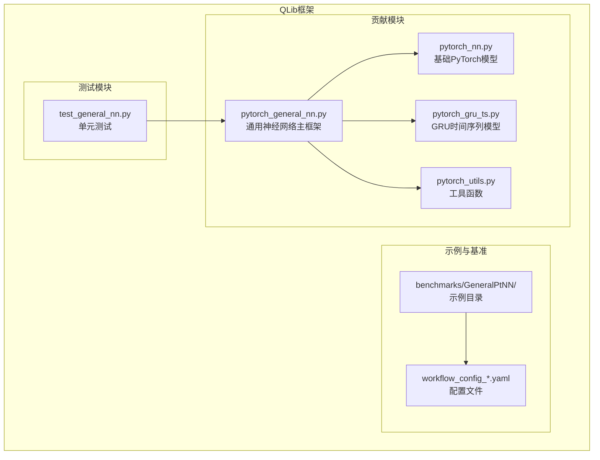
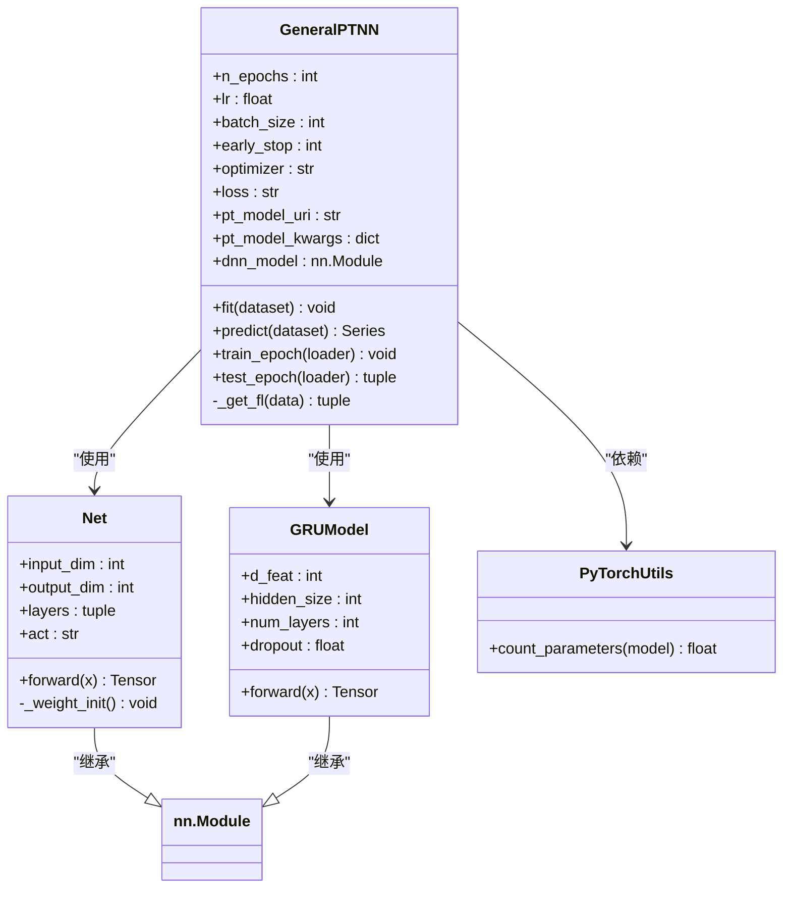
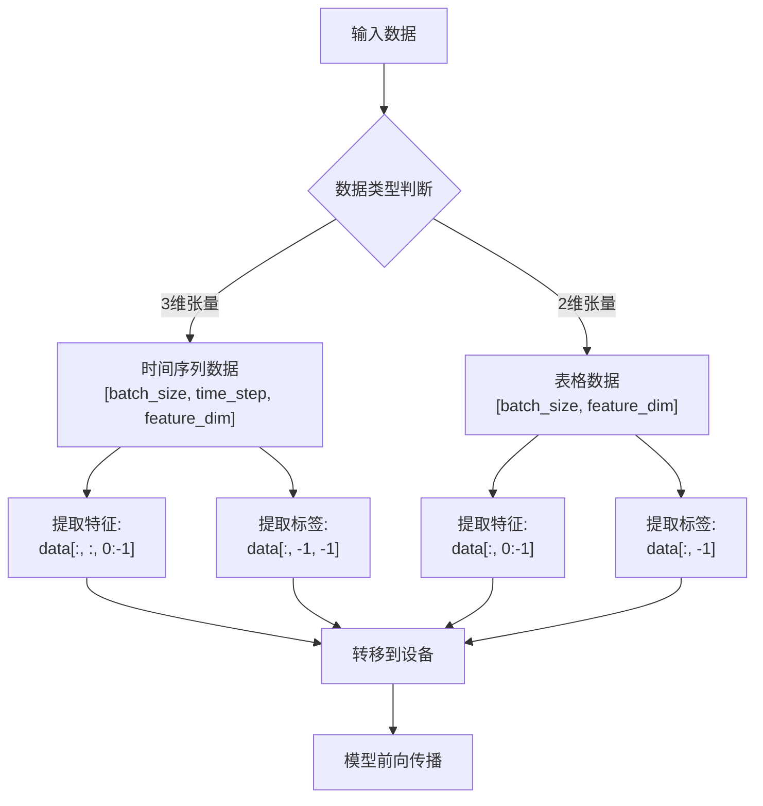
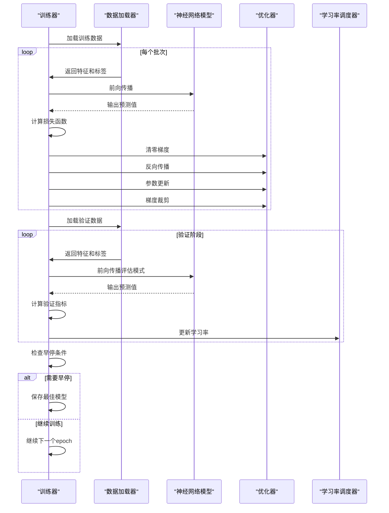
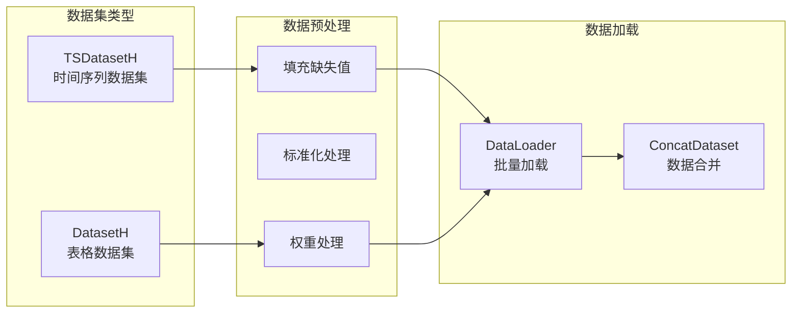
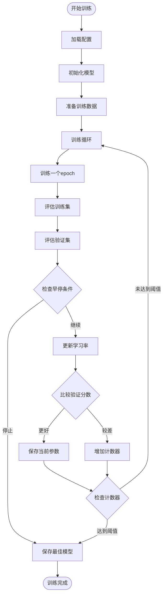

# 通用神经网络框架（GeneralPtNN）

<cite>
**本文档引用的文件**
- [pytorch_general_nn.py](file://qlib/contrib/model/pytorch_general_nn.py)
- [pytorch_nn.py](file://qlib/contrib/model/pytorch_nn.py)
- [pytorch_gru_ts.py](file://qlib/contrib/model/pytorch_gru_ts.py)
- [pytorch_utils.py](file://qlib/contrib/model/pytorch_utils.py)
- [test_general_nn.py](file://tests/model/test_general_nn.py)
- [workflow_config_gru.yaml](file://examples/benchmarks/GeneralPtNN/workflow_config_gru.yaml)
- [workflow_config_mlp.yaml](file://examples/benchmarks/GeneralPtNN/workflow_config_mlp.yaml)
- [workflow_config_gru2mlp.yaml](file://examples/benchmarks/GeneralPtNN/workflow_config_gru2mlp.yaml)
- [README.md](file://examples/benchmarks/GeneralPtNN/README.md)
</cite>

## 目录
1. [简介](#简介)
2. [项目结构](#项目结构)
3. [核心组件](#核心组件)
4. [架构概览](#架构概览)
5. [详细组件分析](#详细组件分析)
6. [配置文件驱动的模型构建](#配置文件驱动的模型构建)
7. [数据处理与适配](#数据处理与适配)
8. [训练与预测流程](#训练与预测流程)
9. [性能监控与调试](#性能监控与调试)
10. [最佳实践与示例](#最佳实践与示例)
11. [总结](#总结)

## 简介

GeneralPtNN是QLib框架中的一个通用神经网络框架，旨在为各种PyTorch模型提供统一的接口和训练基础设施。该框架的核心设计理念是通过配置文件驱动的方式，支持灵活的网络结构配置，包括MLP、RNN、CNN等组件的组合搭建。

GeneralPtNN框架的主要特点：
- **模块化设计**：支持任意PyTorch模型的无缝集成
- **配置文件驱动**：通过YAML配置实现快速实验迭代
- **双数据类型支持**：同时支持时间序列数据和表格数据
- **自动梯度计算**：内置完整的训练和推理流程
- **灵活的网络结构**：支持从简单线性模型到复杂混合架构

## 项目结构

GeneralPtNN框架在QLib项目中的组织结构如下：



**图表来源**
- [pytorch_general_nn.py](file://qlib/contrib/model/pytorch_general_nn.py#L1-L372)
- [pytorch_nn.py](file://qlib/contrib/model/pytorch_nn.py#L424-L462)
- [pytorch_gru_ts.py](file://qlib/contrib/model/pytorch_gru_ts.py#L301-L318)

## 核心组件

### GeneralPTNN主类

GeneralPTNN是整个框架的核心类，继承自QLib的基础Model类，提供了统一的模型接口：

```python
class GeneralPTNN(Model):
    """
    通用PyTorch模型适配器
    支持所有类型的PyTorch模型
    包含训练和预测过程
    """
```

主要功能特性：
- **参数管理**：统一管理学习率、批次大小、优化器等超参数
- **设备适配**：自动检测并使用GPU或CPU
- **模型初始化**：通过配置动态实例化指定的PyTorch模型
- **训练控制**：支持早停、学习率调度等功能

### 模型适配器模式

框架采用适配器模式，允许用户通过配置文件指定不同的PyTorch模型：

```python
# 通过配置文件动态加载模型
self.pt_model_uri, self.pt_model_kwargs = pt_model_uri, pt_model_kwargs
self.dnn_model = init_instance_by_config({
    "class": pt_model_uri, 
    "kwargs": pt_model_kwargs
})
```

**章节来源**
- [pytorch_general_nn.py](file://qlib/contrib/model/pytorch_general_nn.py#L25-L90)

## 架构概览

GeneralPtNN框架的整体架构采用分层设计，实现了高度的模块化和可扩展性：



**图表来源**
- [pytorch_general_nn.py](file://qlib/contrib/model/pytorch_general_nn.py#L25-L90)
- [pytorch_nn.py](file://qlib/contrib/model/pytorch_nn.py#L424-L462)
- [pytorch_gru_ts.py](file://qlib/contrib/model/pytorch_gru_ts.py#L301-L318)

## 详细组件分析

### 数据处理适配器

GeneralPTNN框架的核心优势之一是能够自动处理不同类型的数据格式：



**图表来源**
- [pytorch_general_nn.py](file://qlib/contrib/model/pytorch_general_nn.py#L132-L145)

#### 特征标签提取方法

```python
def _get_fl(self, data: torch.Tensor):
    """
    从数据中获取特征和标签
    处理时间序列和表格数据的不同形状
    """
    if data.dim() == 3:
        # 时间序列数据
        feature = data[:, :, 0:-1].to(self.device)
        label = data[:, -1, -1].to(self.device)
    elif data.dim() == 2:
        # 表格数据
        feature = data[:, 0:-1].to(self.device)
        label = data[:, -1].to(self.device)
    else:
        raise ValueError("Unsupported data shape.")
    return feature, label
```

**章节来源**
- [pytorch_general_nn.py](file://qlib/contrib/model/pytorch_general_nn.py#L132-L145)

### 训练循环实现

框架实现了完整的训练循环，包含前向传播、损失计算、反向传播和参数更新：



**图表来源**
- [pytorch_general_nn.py](file://qlib/contrib/model/pytorch_general_nn.py#L147-L180)
- [pytorch_general_nn.py](file://qlib/contrib/model/pytorch_general_nn.py#L182-L220)

#### 训练和测试方法

```python
def train_epoch(self, data_loader):
    """单个训练周期"""
    self.dnn_model.train()
    for data, weight in data_loader:
        feature, label = self._get_fl(data)
        
        pred = self.dnn_model(feature.float())
        loss = self.loss_fn(pred, label, weight.to(self.device))
        
        self.train_optimizer.zero_grad()
        loss.backward()
        torch.nn.utils.clip_grad_value_(self.dnn_model.parameters(), 3.0)
        self.train_optimizer.step()

def test_epoch(self, data_loader):
    """单个测试周期"""
    self.dnn_model.eval()
    scores = []
    losses = []
    
    for data, weight in data_loader:
        feature, label = self._get_fl(data)
        
        with torch.no_grad():
            pred = self.dnn_model(feature.float())
            loss = self.loss_fn(pred, label, weight.to(self.device))
            losses.append(loss.item())
            
            score = self.metric_fn(pred, label)
            scores.append(score.item())
    
    return np.mean(losses), np.mean(scores)
```

**章节来源**
- [pytorch_general_nn.py](file://qlib/contrib/model/pytorch_general_nn.py#L147-L180)
- [pytorch_general_nn.py](file://qlib/contrib/model/pytorch_general_nn.py#L182-L220)

### 损失函数和评估指标

框架支持多种损失函数和评估指标：

```python
def mse(self, pred, label, weight):
    """均方误差损失"""
    loss = weight * (pred - label) ** 2
    return torch.mean(loss)

def loss_fn(self, pred, label, weight=None):
    """损失函数包装器"""
    mask = ~torch.isnan(label)
    
    if weight is None:
        weight = torch.ones_like(label)
    
    if self.loss == "mse":
        return self.mse(pred[mask], label[mask].view(-1, 1), weight[mask])
    
    raise ValueError("unknown loss `%s`" % self.loss)

def metric_fn(self, pred, label):
    """评估指标函数"""
    mask = torch.isfinite(label)
    
    if self.metric in ("", "loss"):
        return self.loss_fn(pred[mask], label[mask])
    
    raise ValueError("unknown metric `%s`" % self.metric)
```

**章节来源**
- [pytorch_general_nn.py](file://qlib/contrib/model/pytorch_general_nn.py#L105-L130)

## 配置文件驱动的模型构建

### YAML配置格式

GeneralPtNN框架通过YAML配置文件实现模型的快速构建和实验迭代：

```yaml
task:
    model:
        class: GeneralPTNN
        module_path: qlib.contrib.model.pytorch_general_nn
        kwargs:
            n_epochs: 200
            lr: 2e-4
            early_stop: 10
            batch_size: 800
            metric: loss
            loss: mse
            n_jobs: 20
            GPU: 0
            pt_model_uri: "qlib.contrib.model.pytorch_gru_ts.GRUModel"
            pt_model_kwargs: {
                "d_feat": 20,
                "hidden_size": 64,
                "num_layers": 2,
                "dropout": 0.,
            }
```

### 配置参数详解

| 参数 | 类型 | 默认值 | 描述 |
|------|------|--------|------|
| `n_epochs` | int | 200 | 最大训练轮数 |
| `lr` | float | 0.001 | 学习率 |
| `batch_size` | int | 2000 | 批次大小 |
| `early_stop` | int | 20 | 早停轮数 |
| `optimizer` | str | "adam" | 优化器类型 |
| `loss` | str | "mse" | 损失函数类型 |
| `pt_model_uri` | str | "qlib.contrib.model.pytorch_gru_ts.GRUModel" | PyTorch模型路径 |
| `pt_model_kwargs` | dict | {} | PyTorch模型参数 |

**章节来源**
- [workflow_config_gru.yaml](file://examples/benchmarks/GeneralPtNN/workflow_config_gru.yaml#L45-L65)

### 不同模型类型的配置示例

#### MLP模型配置
```yaml
pt_model_uri: "qlib.contrib.model.pytorch_nn.Net"
pt_model_kwargs: 
    input_dim: 157
    layers: [256, 128, 64]
    act: "LeakyReLU"
```

#### GRU模型配置
```yaml
pt_model_uri: "qlib.contrib.model.pytorch_gru_ts.GRUModel"
pt_model_kwargs: 
    d_feat: 20
    hidden_size: 64
    num_layers: 2
    dropout: 0.0
```

#### 混合模型配置
```yaml
pt_model_uri: "qlib.contrib.model.pytorch_nn.Net"
pt_model_kwargs: 
    input_dim: 20
    layers: [64, 32]
    act: "SiLU"
```

**章节来源**
- [workflow_config_mlp.yaml](file://examples/benchmarks/GeneralPtNN/workflow_config_mlp.yaml#L45-L55)
- [workflow_config_gru.yaml](file://examples/benchmarks/GeneralPtNN/workflow_config_gru.yaml#L55-L65)
- [workflow_config_gru2mlp.yaml](file://examples/benchmarks/GeneralPtNN/workflow_config_gru2mlp.yaml#L55-L65)

## 数据处理与适配

### 数据集类型支持

GeneralPtNN框架支持两种主要的数据集类型：



**图表来源**
- [pytorch_general_nn.py](file://qlib/contrib/model/pytorch_general_nn.py#L222-L280)

### 数据预处理流程

```python
def fit(self, dataset, evals_result=dict(), save_path=None, reweighter=None):
    """模型训练入口"""
    ists = isinstance(dataset, TSDatasetH)  # 判断是否为时间序列数据
    
    # 准备训练和验证数据
    dl_train = dataset.prepare("train", col_set=["feature", "label"], data_key=DataHandlerLP.DK_L)
    dl_valid = dataset.prepare("valid", col_set=["feature", "label"], data_key=DataHandlerLP.DK_L)
    
    # 处理时间序列数据的缺失值
    if ists:
        dl_train.config(fillna_type="ffill+bfill")
        dl_valid.config(fillna_type="ffill+bfill")
    else:
        # 表格数据转换为numpy数组
        dl_train = dl_train.values
        dl_valid = dl_valid.values
    
    # 创建数据加载器
    train_loader = DataLoader(
        ConcatDataset(dl_train, wl_train),
        batch_size=self.batch_size,
        shuffle=True,
        num_workers=self.n_jobs,
        drop_last=True,
    )
```

**章节来源**
- [pytorch_general_nn.py](file://qlib/contrib/model/pytorch_general_nn.py#L222-L280)

## 训练与预测流程

### 完整训练流程



**图表来源**
- [pytorch_general_nn.py](file://qlib/contrib/model/pytorch_general_nn.py#L282-L350)

### 预测流程实现

```python
def predict(self, dataset, batch_size=None, n_jobs=None):
    """模型预测"""
    if not self.fitted:
        raise ValueError("model is not fitted yet!")
    
    # 准备测试数据
    dl_test = dataset.prepare("test", col_set=["feature", "label"], data_key=DataHandlerLP.DK_I)
    
    if isinstance(dataset, TSDatasetH):
        dl_test.config(fillna_type="ffill+bfill")
        index = dl_test.get_index()
    else:
        index = dl_test.index
        dl_test = dl_test.values
    
    # 创建测试数据加载器
    test_loader = DataLoader(dl_test, batch_size=self.batch_size, num_workers=self.n_jobs)
    
    # 执行预测
    self.dnn_model.eval()
    preds = []
    
    for data in test_loader:
        feature, _ = self._get_fl(data)
        feature = feature.to(self.device)
        
        with torch.no_grad():
            pred = self.dnn_model(feature.float()).detach().cpu().numpy()
        
        preds.append(pred)
    
    # 合并预测结果
    preds_concat = np.concatenate(preds)
    if preds_concat.ndim != 1:
        preds_concat = preds_concat.ravel()
    
    return pd.Series(preds_concat, index=index)
```

**章节来源**
- [pytorch_general_nn.py](file://qlib/contrib/model/pytorch_general_nn.py#L352-L371)

## 性能监控与调试

### 模型参数统计

框架提供了模型参数统计功能，帮助开发者了解模型复杂度：

```python
def count_parameters(models_or_parameters, unit="m"):
    """统计模型参数数量"""
    if isinstance(models_or_parameters, nn.Module):
        counts = sum(v.numel() for v in models_or_parameters.parameters())
    elif isinstance(models_or_parameters, nn.Parameter):
        counts = models_or_parameters.numel()
    elif isinstance(models_or_parameters, (list, tuple)):
        return sum(count_parameters(x, unit) for x in models_or_parameters)
    else:
        counts = sum(v.numel() for v in models_or_parameters)
    
    # 单位转换
    unit = unit.lower()
    if unit in ("kb", "k"):
        counts /= 2**10
    elif unit in ("mb", "m"):
        counts /= 2**20
    elif unit in ("gb", "g"):
        counts /= 2**30
    
    return counts
```

### 日志记录和监控

框架内置了详细的日志记录功能：

```python
# 初始化时的日志
self.logger.info("GeneralPTNN pytorch version...")
self.logger.info("model size: {:.4f} MB".format(count_parameters(self.dnn_model)))

# 训练过程中的日志
self.logger.info("Epoch%d: train %.6f, valid %.6f" % (step, train_score, val_score))
self.logger.info("best score: %.6lf @ %d epoch" % (best_score, best_epoch))
```

### 调试工具

1. **模型可视化**：通过`model.size()`查看模型结构
2. **参数监控**：实时监控模型参数变化
3. **梯度检查**：启用梯度裁剪防止梯度爆炸
4. **早停监控**：自动记录最佳模型状态

**章节来源**
- [pytorch_utils.py](file://qlib/contrib/model/pytorch_utils.py#L8-L36)
- [pytorch_general_nn.py](file://qlib/contrib/model/pytorch_general_nn.py#L92-L105)

## 最佳实践与示例

### 从简单到复杂的模型构建

#### 示例1：简单的线性模型
```python
# 使用MLP作为线性模型
model = GeneralPTNN(
    pt_model_uri="qlib.contrib.model.pytorch_nn.Net",
    pt_model_kwargs={
        "input_dim": 10,
        "layers": [],  # 空列表表示没有隐藏层
    }
)
```

#### 示例2：标准的多层感知机
```python
# 使用MLP作为标准DNN
model = GeneralPTNN(
    pt_model_uri="qlib.contrib.model.pytorch_nn.Net",
    pt_model_kwargs={
        "input_dim": 20,
        "layers": [64, 32, 16],
        "act": "LeakyReLU"
    }
)
```

#### 示例3：GRU时间序列模型
```python
# 使用GRU处理时间序列数据
model = GeneralPTNN(
    pt_model_uri="qlib.contrib.model.pytorch_gru_ts.GRUModel",
    pt_model_kwargs={
        "d_feat": 10,
        "hidden_size": 64,
        "num_layers": 2,
        "dropout": 0.1
    }
)
```

#### 示例4：混合架构模型
```python
# 先用GRU提取特征，再用MLP进行分类
# 这需要自定义模型或使用现有模型的组合
model = GeneralPTNN(
    pt_model_uri="qlib.contrib.model.pytorch_nn.Net",
    pt_model_kwargs={
        "input_dim": 64,  # GRU输出维度
        "layers": [32, 16],
        "act": "SiLU"
    }
)
```

### 实验迭代的最佳实践

1. **渐进式复杂度提升**
   - 从简单的线性模型开始
   - 逐步添加非线性层
   - 引入时间序列组件
   - 添加注意力机制

2. **配置文件模板**
   ```yaml
   # 基础配置模板
   task:
     model:
       class: GeneralPTNN
       kwargs:
         n_epochs: 100
         lr: 0.001
         batch_size: 256
         early_stop: 10
         optimizer: adam
         loss: mse
         pt_model_uri: "custom_model_path"
         pt_model_kwargs: {}
   ```

3. **性能调优策略**
   - 学习率网格搜索
   - 批次大小敏感性分析
   - 正则化强度调整
   - 网络深度和宽度权衡

**章节来源**
- [test_general_nn.py](file://tests/model/test_general_nn.py#L46-L79)

## 总结

GeneralPtNN框架是QLib中一个强大而灵活的通用神经网络框架，具有以下核心优势：

### 主要特点总结

1. **统一的模型接口**：通过适配器模式支持任意PyTorch模型
2. **配置驱动开发**：YAML配置文件实现快速实验迭代
3. **双数据类型支持**：自动处理时间序列和表格数据
4. **完整的训练流程**：内置训练、验证、早停、学习率调度
5. **模块化设计**：清晰的组件分离和职责划分
6. **性能监控**：内置日志记录和模型参数统计

### 应用场景

- **金融时间序列预测**：如股票价格预测、收益率预测
- **特征工程**：利用深度学习提取复杂特征
- **模型对比实验**：快速切换不同网络架构
- **研究原型开发**：支持新模型的快速验证

### 发展方向

1. **更多模型支持**：扩展对CNN、Transformer等模型的支持
2. **分布式训练**：支持大规模数据集的分布式训练
3. **自动化超参数优化**：集成超参数搜索功能
4. **模型解释性**：增强模型可解释性和调试能力

GeneralPtNN框架为QLib生态系统提供了强大的神经网络建模能力，使得研究人员和开发者能够更加高效地进行深度学习模型的开发和实验。