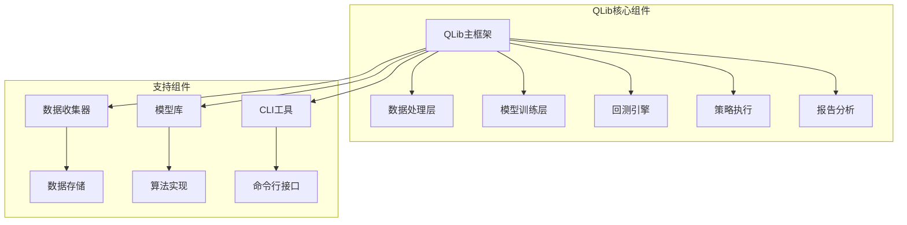
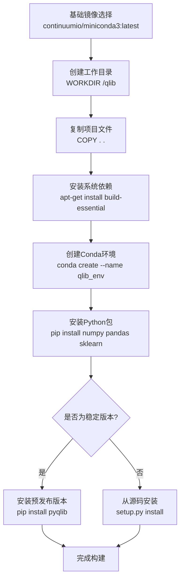
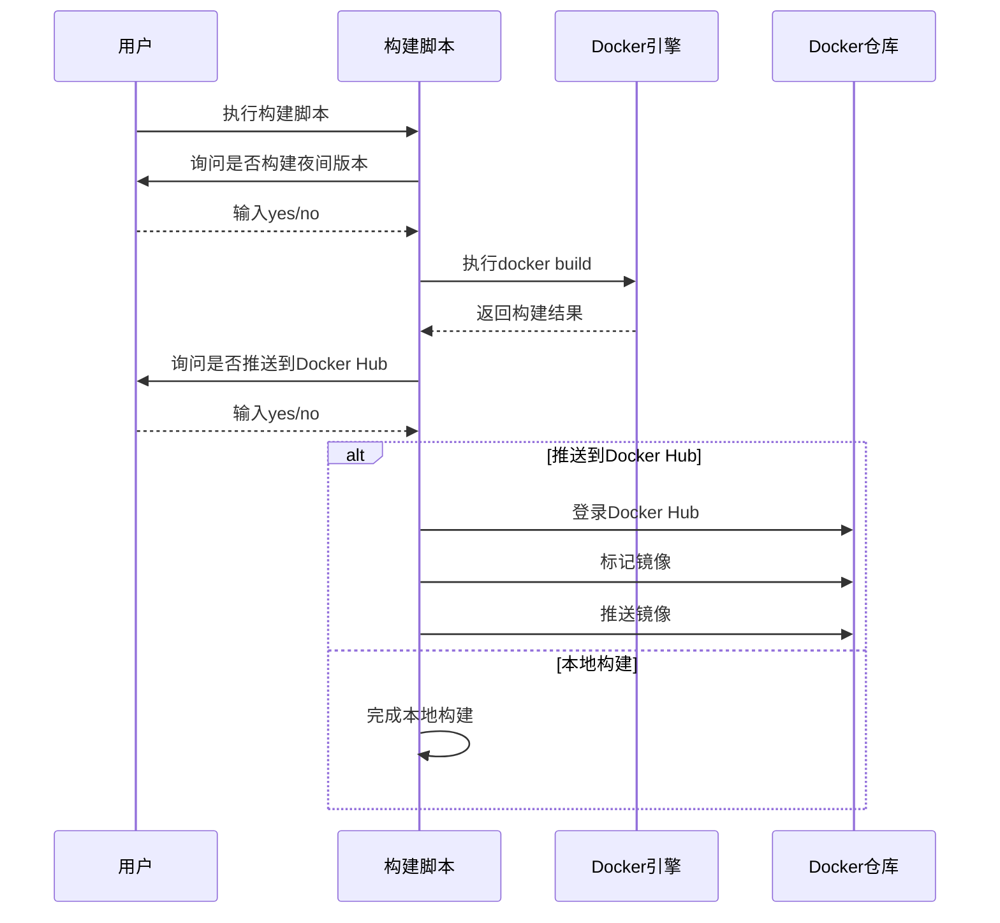
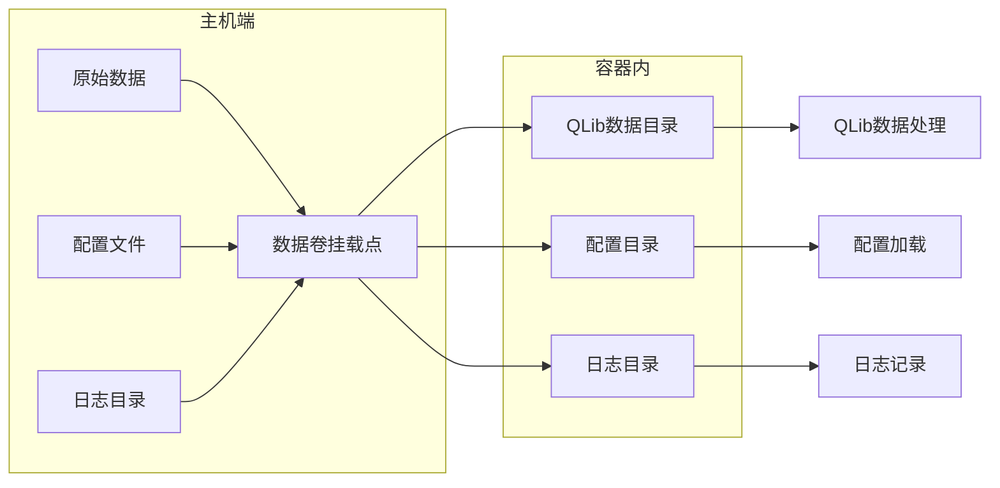

# Qlib Docker部署指南

<cite>
**本文档引用的文件**
- [Dockerfile](file://Dockerfile)
- [build_docker_image.sh](file://build_docker_image.sh)
- [Makefile](file://Makefile)
- [pyproject.toml](file://pyproject.toml)
- [setup.py](file://setup.py)
- [README.md](file://README.md)
- [examples/README.md](file://examples/README.md)
</cite>

## 目录
1. [简介](#简介)
2. [项目结构概览](#项目结构概览)
3. [Docker镜像构建](#docker镜像构建)
4. [Dockerfile详解](#dockerfile详解)
5. [构建脚本分析](#构建脚本分析)
6. [环境变量配置](#环境变量配置)
7. [容器运行最佳实践](#容器运行最佳实践)
8. [生产环境部署](#生产环境部署)
9. [开发环境部署](#开发环境部署)
10. [性能优化与安全加固](#性能优化与安全加固)
11. [故障排除指南](#故障排除指南)
12. [总结](#总结)

## 简介

QLib是一个开源的人工智能量化投资平台，支持从探索想法到实现生产的完整量化研究工作流程。本指南详细介绍了如何使用Docker容器化QLib应用，包括镜像构建、容器运行、环境配置和部署最佳实践。

QLib支持多种机器学习建模范式，包括监督学习、市场动态建模和强化学习，并涵盖了量化投资的整个链条：alpha挖掘、风险建模、投资组合优化和订单执行。

## 项目结构概览

QLib项目采用模块化的架构设计，主要组件包括：



**图表来源**
- [Dockerfile](file://Dockerfile#L1-L32)
- [pyproject.toml](file://pyproject.toml#L1-L120)

**章节来源**
- [README.md](file://README.md#L1-L199)
- [examples/README.md](file://examples/README.md#L1-L10)

## Docker镜像构建

### 构建流程概述

QLib的Docker镜像构建遵循多阶段构建策略，确保最终镜像的轻量化和安全性。构建过程包括以下关键步骤：



**图表来源**
- [Dockerfile](file://Dockerfile#L1-L32)
- [build_docker_image.sh](file://build_docker_image.sh#L1-L32)

### 镜像类型选择

QLib提供了两种类型的Docker镜像：

1. **稳定版本镜像** (`stable`)：基于PyPI发布的稳定版本
2. **夜间版本镜像** (`nightly`)：基于最新主分支代码构建

**章节来源**
- [build_docker_image.sh](file://build_docker_image.sh#L1-L32)
- [Dockerfile](file://Dockerfile#L20-L32)

## Dockerfile详解

### 基础镜像配置

```dockerfile
FROM continuumio/miniconda3:latest
```

QLib使用Miniconda作为基础镜像，提供完整的Python环境和包管理功能。这种选择的优势包括：
- 轻量级的基础镜像
- 内置包管理工具
- 支持多版本Python
- 广泛的科学计算包支持

### 工作目录设置

```dockerfile
WORKDIR /qlib
```

工作目录设置为`/qlib`，这是QLib项目的根目录。所有后续操作都在此目录下进行。

### 文件复制策略

```dockerfile
COPY . .
```

将项目根目录下的所有文件复制到容器中。这种策略适用于开发和测试环境，但在生产环境中可能需要更精细的控制。

### 系统依赖安装

```dockerfile
RUN apt-get update && \
    apt-get install -y build-essential
```

安装编译Python扩展所需的系统依赖，特别是Cython和NumPy等包的编译需求。

### Conda环境配置

```dockerfile
RUN conda create --name qlib_env python=3.8 -y
RUN echo "conda activate qlib_env" >> ~/.bashrc
ENV PATH /opt/conda/envs/qlib_env/bin:$PATH
```

创建专用的Conda环境并配置PATH变量，确保QLib及其依赖项在隔离的环境中运行。

### Python包安装策略

```dockerfile
RUN python -m pip install --upgrade pip
RUN python -m pip install numpy==1.23.5
RUN python -m pip install pandas==1.5.3
RUN python -m pip install importlib-metadata==5.2.0
RUN python -m pip install "cloudpickle<3"
RUN python -m pip install scikit-learn==1.3.2
```

固定版本号安装关键依赖包，确保环境的一致性和可重现性。

### 可选依赖安装

```dockerfile
RUN python -m pip install cython packaging tables matplotlib statsmodels
RUN python -m pip install pybind11 cvxpy
```

安装额外的科学计算和数据分析包，支持更复杂的量化分析任务。

### 版本选择机制

```dockerfile
ARG IS_STABLE="yes"

RUN if [ "$IS_STABLE" = "yes" ]; then \
        python -m pip install pyqlib; \
    else \
        python setup.py install; \
    fi
```

通过构建参数控制安装方式，支持从PyPI安装稳定版本或从源码安装最新版本。

**章节来源**
- [Dockerfile](file://Dockerfile#L1-L32)

## 构建脚本分析

### 自动化构建流程

build_docker_image.sh脚本提供了自动化的镜像构建和推送流程：



**图表来源**
- [build_docker_image.sh](file://build_docker_image.sh#L1-L32)

### 构建参数配置

脚本支持灵活的构建参数配置：

```bash
# 默认使用稳定版本
docker build -t qlib_image -f ./Dockerfile .

# 使用夜间版本构建
docker build --build-arg IS_STABLE=no -t qlib_image -f ./Dockerfile .
```

### 自动化推送流程

```bash
# 登录Docker Hub
docker login

# 标记镜像
docker tag qlib_image "$docker_user/qlib_image:$image_tag"

# 推送镜像
docker push "$docker_user/qlib_image:$image_tag"
```

**章节来源**
- [build_docker_image.sh](file://build_docker_image.sh#L1-L32)

## 环境变量配置

### 构建时环境变量

QLib Docker镜像支持以下构建时环境变量：

| 变量名 | 默认值 | 描述 |
|--------|--------|------|
| `IS_STABLE` | `"yes"` | 控制安装方式：稳定版或开发版 |

### 运行时环境变量

在容器运行时，可以配置以下重要环境变量：

```bash
# 数据路径配置
export QLIB_DATA_PATH="/qlib_data"
export QLIB_MOUNT_PATH="/mnt/qlib_data"

# Redis缓存配置
export REDIS_HOST="redis://localhost:6379"
export REDIS_PASSWORD="your_password"

# 日志级别配置
export QLIB_LOG_LEVEL="INFO"
```

### 持久化配置

```bash
# MongoDB配置
export MONGO_URI="mongodb://mongo:27017/qlib_db"

# NFS挂载配置
export NFS_SERVER="nfs-server.example.com"
export NFS_SHARE="/data/qlib"
```

## 容器运行最佳实践

### 基本容器启动

```bash
# 启动QLib容器
docker run -d \
  --name qlib_container \
  -p 8080:8080 \
  -v /host/data:/qlib_data \
  -v /host/logs:/logs \
  -e QLIB_DATA_PATH=/qlib_data \
  qlib_image
```

### 数据卷挂载策略



**图表来源**
- [build_docker_image.sh](file://build_docker_image.sh#L1-L32)

### 网络配置

```bash
# 创建自定义网络
docker network create --driver bridge --subnet=172.18.0.0/16 qlib_network

# 在网络中启动多个服务
docker run -d --network qlib_network --name redis redis:latest
docker run -d --network qlib_network --name mongo mongo:latest
docker run -d --network qlib_network --name qlib qlib_image
```

### 资源限制配置

```bash
# 设置内存和CPU限制
docker run -d \
  --memory=8g \
  --cpus=2.0 \
  --name qlib_container \
  qlib_image
```

**章节来源**
- [examples/README.md](file://examples/README.md#L1-L10)

## 生产环境部署

### 多容器编排

```yaml
# docker-compose.yml
version: '3.8'

services:
  qlib:
    build: .
    ports:
      - "8080:8080"
    volumes:
      - ./data:/qlib_data
      - ./logs:/logs
    environment:
      - QLIB_DATA_PATH=/qlib_data
      - REDIS_HOST=redis://redis:6379
      - MONGO_URI=mongodb://mongo:27017/qlib_db
    depends_on:
      - redis
      - mongo
    networks:
      - qlib_network

  redis:
    image: redis:latest
    ports:
      - "6379:6379"
    networks:
      - qlib_network

  mongo:
    image: mongo:latest
    ports:
      - "27017:27017"
    volumes:
      - mongodb_data:/data/db
    networks:
      - qlib_network

volumes:
  mongodb_data:

networks:
  qlib_network:
    driver: bridge
```

### 高可用配置

```yaml
# 生产环境高可用配置
version: '3.8'

services:
  qlib-primary:
    build: .
    deploy:
      replicas: 1
      restart_policy:
        condition: on-failure
        delay: 5s
        max_attempts: 3
    healthcheck:
      test: ["CMD", "curl", "-f", "http://localhost:8080/health"]
      interval: 30s
      timeout: 10s
      retries: 3
      start_period: 40s

  qlib-worker:
    build: .
    deploy:
      replicas: 3
      restart_policy:
        condition: on-failure
    depends_on:
      - qlib-primary
```

### 监控和日志

```bash
# 启用监控
docker run -d \
  --name qlib_monitor \
  -p 9090:9090 \
  -v prometheus.yml:/etc/prometheus/prometheus.yml \
  prom/prometheus

# 启用日志收集
docker run -d \
  --name qlib_logstash \
  -p 5044:5044 \
  -v logstash.conf:/usr/share/logstash/pipeline/logstash.conf \
  docker.elastic.co/logstash/logstash:latest
```

## 开发环境部署

### 快速开发环境

```bash
# 开发模式启动
docker run -it --rm \
  -p 8888:8888 \
  -v $(pwd):/qlib \
  -w /qlib \
  --entrypoint bash \
  qlib_image
```

### 热重载配置

```bash
# 开发环境热重载
docker run -d \
  --name qlib_dev \
  -p 8888:8888 \
  -v $(pwd):/qlib \
  -v /tmp/.X11-unix:/tmp/.X11-unix \
  -e DISPLAY=$DISPLAY \
  qlib_image
```

### 调试配置

```bash
# 启用调试模式
docker run -d \
  --name qlib_debug \
  -p 5678:5678 \
  -v $(pwd):/qlib \
  -e PYDEV_DEBUG=1 \
  qlib_image
```

**章节来源**
- [Makefile](file://Makefile#L1-L210)

## 性能优化与安全加固

### 镜像优化策略

```dockerfile
# 多阶段构建优化
FROM continuumio/miniconda3:latest AS builder

WORKDIR /qlib
COPY . .

# 只安装必要的包
RUN conda create --name qlib_env python=3.8 -y
ENV PATH /opt/conda/envs/qlib_env/bin:$PATH

# 最终镜像
FROM continuumio/miniconda3:latest

# 只复制必要的文件
COPY --from=builder /opt/conda /opt/conda
COPY --from=builder /qlib /qlib

WORKDIR /qlib
```

### 安全加固措施

```dockerfile
# 使用非root用户
RUN useradd -m -u 1000 qlibuser
USER qlibuser

# 只读文件系统
RUN chmod -R 555 /opt/conda/envs/qlib_env/lib/python3.8/site-packages/

# 禁用不必要的网络访问
RUN iptables -A OUTPUT -p tcp --dport 80 -j DROP
```

### 资源优化

```bash
# CPU和内存优化
docker run -d \
  --cpuset-cpus="0,1" \
  --memory-reservation=4g \
  --memory-swap=8g \
  --cpu-shares=1024 \
  qlib_image
```

### 缓存优化

```bash
# 层缓存优化
RUN apt-get update && \
    apt-get install -y --no-install-recommends build-essential && \
    rm -rf /var/lib/apt/lists/*
```

## 故障排除指南

### 常见问题及解决方案

#### 权限错误

```bash
# 问题：容器内文件权限错误
# 解决方案：使用正确的用户ID
docker run -d \
  --user $(id -u):$(id -g) \
  -v $(pwd):/qlib \
  qlib_image
```

#### 依赖冲突

```bash
# 问题：Python包版本冲突
# 解决方案：使用虚拟环境
docker run -it --rm \
  -v $(pwd):/qlib \
  --entrypoint bash \
  qlib_image
# 在容器内手动解决依赖
pip install --force-reinstall numpy==1.23.5
```

#### 网络连接问题

```bash
# 问题：无法连接外部数据源
# 解决方案：检查网络配置
docker run -d \
  --network host \
  qlib_image
```

#### 内存不足

```bash
# 问题：容器内存不足
# 解决方案：增加内存限制
docker run -d \
  --memory=16g \
  --memory-swap=16g \
  qlib_image
```

### 调试工具

```bash
# 进入容器调试
docker exec -it qlib_container bash

# 查看容器日志
docker logs qlib_container

# 监控容器资源使用
docker stats qlib_container
```

### 性能诊断

```bash
# 检查磁盘使用情况
docker run --rm -v /:/host:ro qlib_image df -h /host

# 检查网络连接
docker run --rm qlib_image ping -c 4 google.com

# 检查Python环境
docker run --rm qlib_image python -c "import sys; print(sys.version)"
```

**章节来源**
- [Dockerfile](file://Dockerfile#L1-L32)
- [build_docker_image.sh](file://build_docker_image.sh#L1-L32)

## 总结

本指南详细介绍了QLib的Docker部署方案，包括：

1. **镜像构建**：使用多阶段构建策略，支持稳定版和开发版两种构建模式
2. **容器配置**：提供完整的环境变量配置和数据卷挂载方案
3. **部署策略**：涵盖生产环境和开发环境的不同需求
4. **性能优化**：包括镜像大小优化、安全加固和资源管理
5. **故障排除**：提供常见问题的诊断和解决方案

通过遵循本指南的最佳实践，可以确保QLib在Docker环境中的稳定运行和高效部署。建议根据实际需求调整资源配置和安全策略，以获得最佳的部署效果。