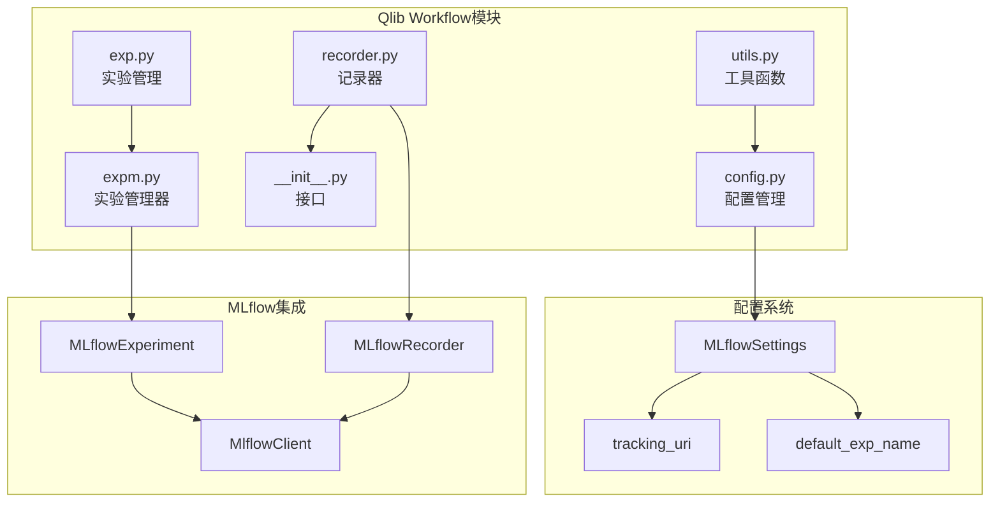
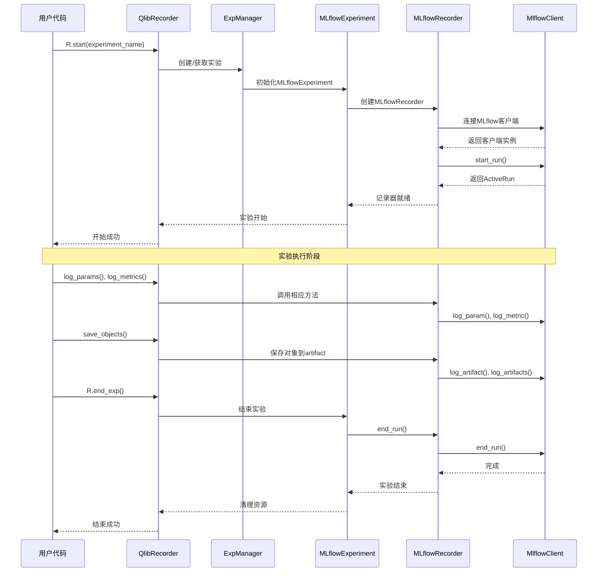
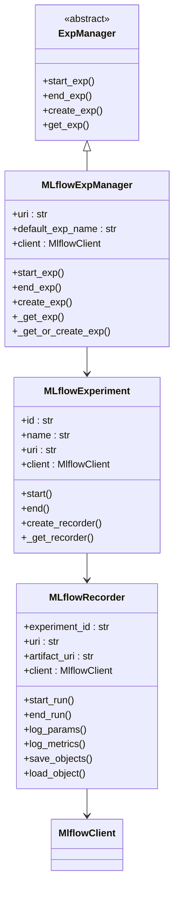
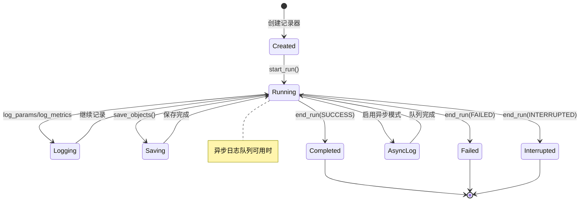
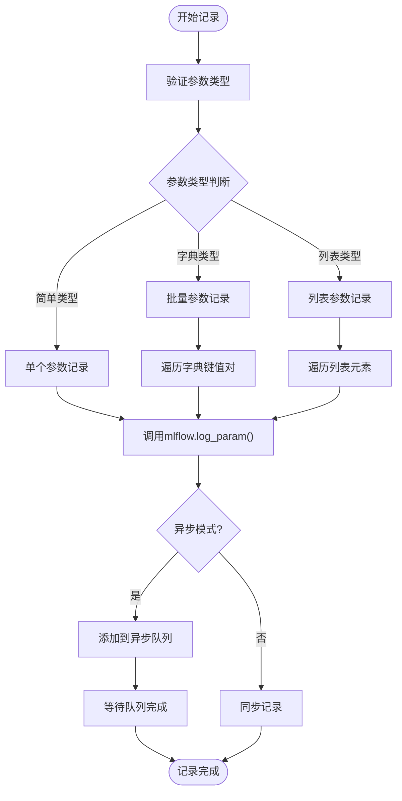
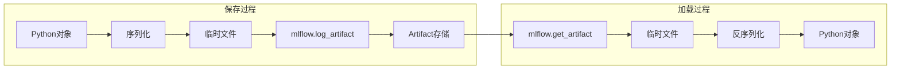
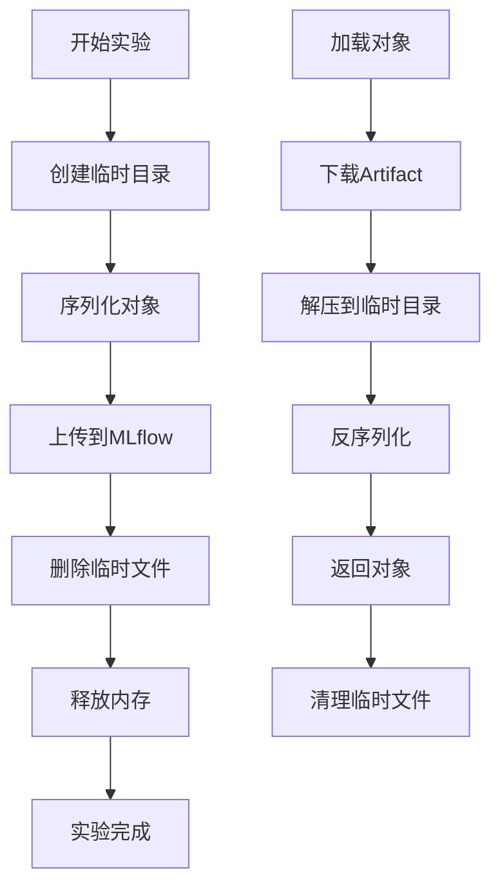

# Qlib与MLflow集成详细文档

<cite>
**本文档中引用的文件**
- [qlib/workflow/exp.py](file://qlib/workflow/exp.py)
- [qlib/workflow/recorder.py](file://qlib/workflow/recorder.py)
- [qlib/workflow/expm.py](file://qlib/workflow/expm.py)
- [qlib/workflow/__init__.py](file://qlib/workflow/__init__.py)
- [qlib/workflow/utils.py](file://qlib/workflow/utils.py)
- [qlib/config.py](file://qlib/config.py)
- [qlib/__init__.py](file://qlib/__init__.py)
- [examples/workflow_by_code.py](file://examples/workflow_by_code.py)
- [examples/tutorial/detailed_workflow.ipynb](file://examples/tutorial/detailed_workflow.ipynb)
- [tests/dependency_tests/test_mlflow.py](file://tests/dependency_tests/test_mlflow.py)
</cite>

## 目录
1. [简介](#简介)
2. [项目结构](#项目结构)
3. [核心组件](#核心组件)
4. [架构概览](#架构概览)
5. [详细组件分析](#详细组件分析)
6. [配置管理](#配置管理)
7. [实验与记录器操作](#实验与记录器操作)
8. [性能优化](#性能优化)
9. [故障排除指南](#故障排除指南)
10. [结论](#结论)

## 简介

Qlib是一个面向量化投资研究的Python库，提供了完整的机器学习工作流支持。为了实现实验跟踪和模型管理，Qlib集成了MLflow作为后端存储解决方案。本文档详细介绍了Qlib与MLflow的集成机制，包括配置设置、实验创建、记录器管理、模型保存和指标记录等核心功能。

MLflow集成使得Qlib能够：
- 自动记录实验参数和指标
- 持久化模型文件和预测结果
- 提供可视化界面进行实验比较
- 支持多用户协作和命名空间管理
- 实现异步日志记录和批量处理

## 项目结构

Qlib的MLflow集成主要集中在以下关键目录和文件中：



**图表来源**
- [qlib/workflow/exp.py](file://qlib/workflow/exp.py#L236-L303)
- [qlib/workflow/recorder.py](file://qlib/workflow/recorder.py#L236-L411)
- [qlib/config.py](file://qlib/config.py#L25-L30)

**章节来源**
- [qlib/workflow/exp.py](file://qlib/workflow/exp.py#L1-L50)
- [qlib/workflow/recorder.py](file://qlib/workflow/recorder.py#L1-L50)

## 核心组件

### MLflowExperiment类

`MLflowExperiment`是Qlib中用于管理MLflow实验的核心类，继承自基础`Experiment`类：

```python
class MLflowExperiment(Experiment):
    """
    使用mlflow实现Experiment。
    """
    def __init__(self, id, name, uri):
        super(MLflowExperiment, self).__init__(id, name)
        self._uri = uri
        self._default_rec_name = "mlflow_recorder"
        self._client = mlflow.tracking.MlflowClient(tracking_uri=self._uri)
```

该类的主要功能包括：
- **实验生命周期管理**：启动、结束和状态管理
- **记录器创建**：自动创建和管理MLflow记录器
- **实验查询**：通过ID或名称查找现有实验
- **多用户支持**：支持并发实验和命名空间隔离

### MLflowRecorder类

`MLflowRecorder`负责具体的实验记录和数据持久化：

```python
class MLflowRecorder(Recorder):
    """
    使用mlflow实现Recorder。
    
    因为mlflow只能从文件或目录记录artifacts，我们决定使用文件管理器来帮助维护项目中的对象。
    """
    def __init__(self, experiment_id, uri, name=None, mlflow_run=None):
        super(MLflowRecorder, self).__init__(experiment_id, name)
        self._uri = uri
        self._artifact_uri = None
        self.client = mlflow.tracking.MlflowClient(tracking_uri=self._uri)
```

核心特性：
- **异步日志记录**：支持异步写入以提高性能
- **自动文件管理**：临时文件的创建和清理
- **状态跟踪**：完整的实验状态管理和异常处理
- **本地目录访问**：支持本地文件系统的直接访问

**章节来源**
- [qlib/workflow/exp.py](file://qlib/workflow/exp.py#L236-L303)
- [qlib/workflow/recorder.py](file://qlib/workflow/recorder.py#L236-L411)

## 架构概览

Qlib与MLflow的集成采用分层架构设计，确保了良好的可扩展性和维护性：



**图表来源**
- [qlib/workflow/exp.py](file://qlib/workflow/exp.py#L269-L303)
- [qlib/workflow/recorder.py](file://qlib/workflow/recorder.py#L383-L411)
- [qlib/workflow/expm.py](file://qlib/workflow/expm.py#L317-L389)

## 详细组件分析

### 实验管理器（ExpManager）

`MLflowExpManager`是实验管理的核心组件，负责协调整个实验生命周期：



**图表来源**
- [qlib/workflow/expm.py](file://qlib/workflow/expm.py#L317-L389)
- [qlib/workflow/exp.py](file://qlib/workflow/exp.py#L236-L303)
- [qlib/workflow/recorder.py](file://qlib/workflow/recorder.py#L236-L411)

### 记录器状态管理

MLflow记录器支持多种状态管理机制：



**图表来源**
- [qlib/workflow/recorder.py](file://qlib/workflow/recorder.py#L383-L411)

### 参数和指标记录流程



**图表来源**
- [qlib/workflow/recorder.py](file://qlib/workflow/recorder.py#L82-L122)

**章节来源**
- [qlib/workflow/expm.py](file://qlib/workflow/expm.py#L317-L389)
- [qlib/workflow/recorder.py](file://qlib/workflow/recorder.py#L236-L411)

## 配置管理

### MLflow配置设置

Qlib通过Pydantic的`BaseSettings`类管理MLflow配置：

```python
class MLflowSettings(BaseSettings):
    uri: str = "file:" + str(Path(os.getcwd()).resolve() / "mlruns")
    default_exp_name: str = "Experiment"
```

默认配置说明：
- **tracking_uri**: 默认为当前工作目录下的`mlruns`目录
- **default_exp_name**: 默认实验名称为"Experiment"

### 全局配置集成

```python
class QSettings(BaseSettings):
    mlflow: MLflowSettings = MLflowSettings()
    provider_uri: str = "~/.qlib/qlib_data/cn_data"
```

配置优先级：
1. 通过`qlib.init()`传入的参数
2. QSettings中的默认值
3. 环境变量（QLIB_MLFLOW_URI等）

### 实验管理器配置

```python
"exp_manager": {
    "class": "MLflowExpManager",
    "module_path": "qlib.workflow.expm",
    "kwargs": {
        "uri": QSETTINGS.mlflow.uri,
        "default_exp_name": QSETTINGS.mlflow.default_exp_name,
    },
}
```

**章节来源**
- [qlib/config.py](file://qlib/config.py#L25-L50)
- [qlib/config.py](file://qlib/config.py#L400-L420)

## 实验与记录器操作

### 基本使用示例

#### 单次实验流程

```python
# 初始化Qlib
qlib.init(provider_uri="~/.qlib/qlib_data/cn_data", region=REG_CN)

# 开始实验
with R.start(experiment_name="my_experiment"):
    # 记录实验参数
    R.log_params(**{"learning_rate": 0.01, "batch_size": 32})
    
    # 训练模型
    model = train_model()
    
    # 保存训练好的模型
    R.save_objects(**{"trained_model.pkl": model})
    
    # 获取记录器并生成信号
    recorder = R.get_recorder()
    sr = SignalRecord(model, dataset, recorder)
    sr.generate()
```

#### 多阶段实验流程

```python
# 第一阶段：模型训练
with R.start(experiment_name="workflow"):
    model.fit(dataset)
    R.save_objects(trained_model=model)
    
    # 获取记录器ID以便后续使用
    recorder = R.get_recorder()
    rid = recorder.id

# 第二阶段：推理和分析
with R.start(experiment_name="workflow", recorder_id=rid, resume=True):
    # 信号分析
    sar = SigAnaRecord(recorder)
    sar.generate()
    
    # 组合分析
    par = PortAnaRecord(recorder, port_analysis_config, "day")
    par.generate()
```

### 高级使用模式

#### 并行实验管理

```python
# 不同实验名称的并行实验
with R.start(experiment_name="experiment_A"):
    # 实验A逻辑
    
with R.start(experiment_name="experiment_B"):
    # 实验B逻辑
```

#### 实验恢复机制

```python
# 恢复之前的实验
recorder = R.get_recorder(recorder_id="previous_run_id", experiment_name="my_experiment")
# 重新加载之前的结果
predictions = recorder.load_object("pred.pkl")
```

### 对象保存和加载



**图表来源**
- [qlib/workflow/recorder.py](file://qlib/workflow/recorder.py#L383-L411)

**章节来源**
- [examples/workflow_by_code.py](file://examples/workflow_by_code.py#L67-L85)
- [examples/tutorial/detailed_workflow.ipynb](file://examples/tutorial/detailed_workflow.ipynb#L981-L1100)

## 性能优化

### 异步日志记录

MLflowRecorder支持异步日志记录以提高性能：

```python
def end_run(self, status=Recorder.STATUS_S):
    if self.status != Recorder.STATUS_S:
        self.status = status
    if self.async_log is not None:
        # 在mlflow.end_run之前等待队列完成
        with TimeInspector.logt("waiting `async_log`"):
            self.async_log.wait()
    self.async_log = None
    mlflow.end_run(status)
```

### 批量日志记录

对于大量参数和指标，系统会自动进行批量处理：

```python
# 批量参数记录
params = {
    "lr": 0.01,
    "batch_size": 32,
    "epochs": 100,
    "optimizer": "adam"
}
R.log_params(**params)
```

### 内存管理



**图表来源**
- [qlib/workflow/recorder.py](file://qlib/workflow/recorder.py#L383-L411)

### 多用户环境优化

在多用户环境中，MLflow提供了以下优化策略：

1. **命名空间隔离**：每个实验名称对应独立的命名空间
2. **并发控制**：通过FileLock防止并发冲突
3. **资源清理**：自动清理临时文件和过期记录

**章节来源**
- [qlib/workflow/recorder.py](file://qlib/workflow/recorder.py#L383-L411)
- [tests/dependency_tests/test_mlflow.py](file://tests/dependency_tests/test_mlflow.py#L15-L30)

## 故障排除指南

### 常见问题和解决方案

#### 1. MLflow连接失败

**问题症状**：无法连接到MLflow服务器或本地存储

**解决方案**：
```python
# 检查URI配置
print("MLflow URI:", C.mlflow.uri)

# 尝试手动创建客户端
try:
    client = mlflow.tracking.MlflowClient(tracking_uri=C.mlflow.uri)
    print("Connection successful")
except Exception as e:
    print(f"Connection failed: {e}")
```

#### 2. 权限问题

**问题症状**：无法写入MLflow存储目录

**解决方案**：
```bash
# 检查目录权限
ls -la mlruns/

# 修改权限
chmod -R 755 mlruns/
chown -R $USER:$USER mlruns/
```

#### 3. 实验恢复失败

**问题症状**：无法找到之前的实验记录

**解决方案**：
```python
# 列出所有实验
experiments = client.search_experiments()
for exp in experiments:
    print(f"Experiment ID: {exp.experiment_id}, Name: {exp.name}")

# 列出特定实验的所有运行
runs = client.search_runs(experiment_ids=[experiment_id])
for run in runs:
    print(f"Run ID: {run.info.run_id}, Status: {run.info.status}")
```

### 调试技巧

#### 启用详细日志

```python
import logging
logging.getLogger("qlib.workflow").setLevel(logging.DEBUG)
```

#### 检查实验状态

```python
# 获取活跃实验信息
active_exp = R.get_active_experiment()
print(f"Active experiment: {active_exp}")

# 获取活跃记录器信息
active_rec = R.get_active_recorder()
print(f"Active recorder: {active_rec}")
```

**章节来源**
- [qlib/workflow/utils.py](file://qlib/workflow/utils.py#L15-L47)
- [tests/dependency_tests/test_mlflow.py](file://tests/dependency_tests/test_mlflow.py#L15-L30)

## 结论

Qlib与MLflow的集成提供了一个强大而灵活的实验跟踪和模型管理平台。通过本文档的详细介绍，用户可以：

1. **理解架构设计**：掌握MLflow集成的整体架构和组件关系
2. **配置系统设置**：正确配置MLflow后端存储和artifact路径
3. **实施实验管理**：学会创建、记录和恢复实验
4. **优化性能**：利用异步记录和批量处理提升效率
5. **解决常见问题**：快速诊断和解决集成过程中遇到的问题

这种集成不仅简化了量化研究中的实验管理流程，还为团队协作和长期项目维护提供了坚实的基础。随着Qlib和MLflow的持续发展，这一集成将继续演进，为用户提供更加强大和易用的功能。