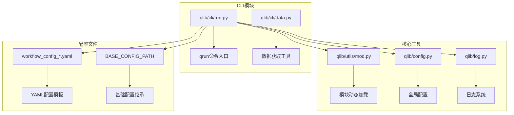
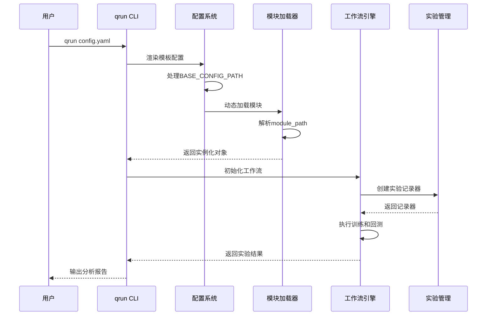
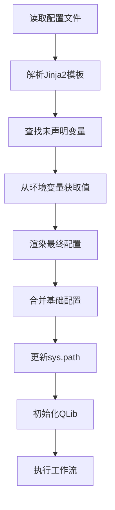
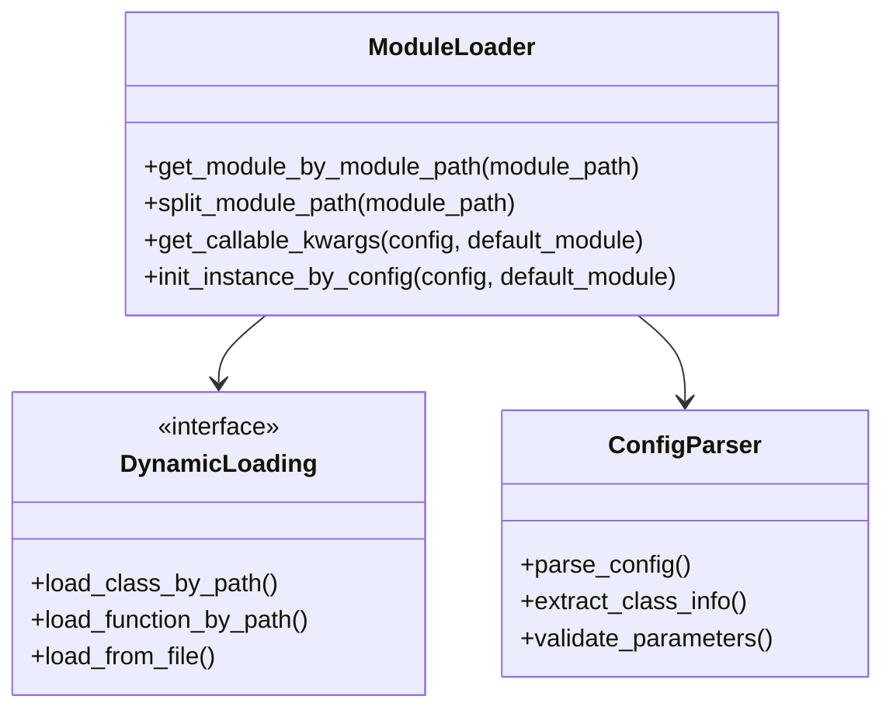
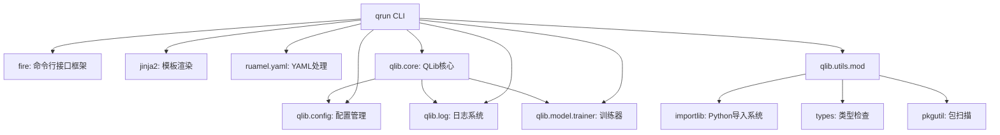

# 命令行接口（CLI）详细API文档

<cite>
**本文档引用的文件**
- [qlib/cli/run.py](file://qlib/cli/run.py)
- [qlib/cli/data.py](file://qlib/cli/data.py)
- [qlib/utils/mod.py](file://qlib/utils/mod.py)
- [pyproject.toml](file://pyproject.toml)
- [examples/benchmarks/LightGBM/workflow_config_lightgbm_Alpha158.yaml](file://examples/benchmarks/LightGBM/workflow_config_lightgbm_Alpha158.yaml)
- [examples/benchmarks/LightGBM/workflow_config_lightgbm_Alpha360.yaml](file://examples/benchmarks/LightGBM/workflow_config_lightgbm_Alpha360.yaml)
- [examples/benchmarks/MLP/workflow_config_mlp_Alpha158.yaml](file://examples/benchmarks/MLP/workflow_config_mlp_Alpha158.yaml)
- [examples/workflow_by_code.py](file://examples/workflow_by_code.py)
- [README.md](file://README.md)
</cite>

## 目录
1. [简介](#简介)
2. [项目结构](#项目结构)
3. [核心组件](#核心组件)
4. [架构概览](#架构概览)
5. [详细组件分析](#详细组件分析)
6. [依赖关系分析](#依赖关系分析)
7. [性能考虑](#性能考虑)
8. [故障排除指南](#故障排除指南)
9. [结论](#结论)

## 简介

QLib命令行接口（CLI）是一个强大的量化研究工作流自动化工具，主要通过`qrun`命令提供服务。该CLI系统允许用户通过配置文件定义完整的量化研究流程，包括数据准备、模型训练、回测和评估等步骤。

CLI系统的核心优势：
- **配置驱动**：通过YAML配置文件定义工作流，无需编写代码
- **模块化设计**：支持灵活的组件组合和扩展
- **模板渲染**：支持Jinja2模板引擎进行配置变量替换
- **动态加载**：通过`qlib.utils.mod`模块实现动态类和函数加载
- **实验管理**：集成MLflow进行实验跟踪和结果保存

## 项目结构

QLib CLI系统的核心文件组织如下：



**图表来源**
- [qlib/cli/run.py](file://qlib/cli/run.py#L1-L158)
- [qlib/utils/mod.py](file://qlib/utils/mod.py#L1-L241)

**章节来源**
- [qlib/cli/run.py](file://qlib/cli/run.py#L1-L158)
- [pyproject.toml](file://pyproject.toml#L1-L120)

## 核心组件

### qrun命令入口

`qrun`命令是QLib CLI的主要入口点，通过`pyproject.toml`中的脚本配置注册：

```python
[project.scripts]
qrun = "qlib.cli.run:run"
```

该命令的核心功能由`workflow`函数实现，负责：
- 配置文件模板渲染
- 基础配置继承机制
- 模块路径配置
- 实验初始化和管理

### 数据获取工具

`data.py`提供了简单的数据获取功能，通过Fire框架暴露为命令行工具：

```python
if __name__ == "__main__":
    fire.Fire(GetData)
```

这个工具主要用于快速获取QLib所需的基础数据集。

**章节来源**
- [qlib/cli/run.py](file://qlib/cli/run.py#L140-L158)
- [qlib/cli/data.py](file://qlib/cli/data.py#L1-L10)

## 架构概览

QLib CLI系统采用分层架构设计，确保了良好的可扩展性和维护性：



**图表来源**
- [qlib/cli/run.py](file://qlib/cli/run.py#L75-L140)
- [qlib/utils/mod.py](file://qlib/utils/mod.py#L25-L50)

## 详细组件分析

### 配置文件模板渲染

CLI系统支持Jinja2模板引擎进行配置文件渲染，允许使用环境变量动态替换配置值：



**图表来源**
- [qlib/cli/run.py](file://qlib/cli/run.py#L55-L75)

模板渲染的关键函数`render_template`实现了以下功能：

1. **变量检测**：使用Jinja2的`meta.find_undeclared_variables`检测配置文件中的未声明变量
2. **环境变量映射**：将匹配的环境变量名称映射到实际值
3. **安全渲染**：仅使用存在的环境变量进行渲染，避免未定义变量错误

### 基础配置继承机制

CLI支持通过`BASE_CONFIG_PATH`实现配置继承，允许用户复用标准配置并自定义特定参数：

```yaml
qlib_init:
    provider_uri: "~/.qlib/qlib_data/cn_data"
    region: cn
BASE_CONFIG_PATH: "workflow_config_lightgbm_Alpha158.yaml"
market: csi300
```

这种设计的优势：
- **配置复用**：避免重复定义通用配置
- **版本控制**：标准配置集中管理
- **灵活性**：用户只需修改差异部分

### 模块动态加载机制

`qlib.utils.mod`模块提供了强大的动态加载功能，支持两种加载模式：



**图表来源**
- [qlib/utils/mod.py](file://qlib/utils/mod.py#L25-L100)

动态加载的核心功能：

1. **模块路径解析**：支持相对路径和绝对路径
2. **文件导入**：直接从Python文件导入模块
3. **类实例化**：根据配置信息动态创建实例
4. **错误处理**：提供详细的导入错误信息

**章节来源**
- [qlib/cli/run.py](file://qlib/cli/run.py#L25-L75)
- [qlib/utils/mod.py](file://qlib/utils/mod.py#L1-L241)

### 实验管理和记录

CLI系统集成了MLflow进行实验管理，每个工作流执行都会创建独立的实验记录：

```python
if "experiment_name" in config:
    experiment_name = config["experiment_name"]
recorder = task_train(config.get("task"), experiment_name=experiment_name)
recorder.save_objects(config=config)
```

实验管理的特点：
- **自动命名**：支持自定义实验名称
- **结果保存**：自动保存配置和中间结果
- **URI管理**：支持本地和远程存储

**章节来源**
- [qlib/cli/run.py](file://qlib/cli/run.py#L130-L140)

## 依赖关系分析

CLI系统的依赖关系体现了清晰的分层架构：



**图表来源**
- [pyproject.toml](file://pyproject.toml#L30-L50)
- [qlib/cli/run.py](file://qlib/cli/run.py#L1-L20)

关键依赖说明：

1. **fire**：简化命令行接口开发
2. **jinja2**：支持配置模板渲染
3. **ruamel.yaml**：高性能YAML处理
4. **importlib**：Python标准库模块导入
5. **mlflow**：实验跟踪和管理

**章节来源**
- [pyproject.toml](file://pyproject.toml#L30-L50)
- [qlib/cli/run.py](file://qlib/cli/run.py#L1-L20)

## 性能考虑

CLI系统在设计时充分考虑了性能优化：

### 并发处理
- **多线程支持**：模型训练支持多线程配置
- **GPU利用**：PyTorch模型支持GPU加速
- **内存管理**：大型数据集采用流式处理

### 缓存机制
- **数据缓存**：避免重复下载和预处理
- **模型缓存**：保存训练好的模型
- **实验缓存**：重用历史实验结果

### 错误恢复
- **断点续传**：支持实验中断后恢复
- **资源清理**：自动清理临时文件
- **异常捕获**：提供详细的错误信息

## 故障排除指南

### 常见问题及解决方案

#### 1. 配置文件路径错误

**问题症状**：
```
FileNotFoundError: Can't find the BASE_CONFIG file: workflow_config_lightgbm_Alpha158.yaml
```

**解决方案**：
- 检查配置文件路径是否正确
- 使用绝对路径或相对于当前目录的路径
- 确保文件存在于指定位置

#### 2. 模块导入失败

**问题症状**：
```
ModuleNotFoundError: No module named 'qlib.contrib.model.gbdt'
```

**解决方案**：
- 检查模块路径格式是否正确
- 确保依赖包已安装
- 验证PYTHONPATH设置

#### 3. 环境变量未定义

**问题症状**：
```
KeyError: 'ENV_VAR_NAME'
```

**解决方案**：
- 设置必要的环境变量
- 在配置文件中提供默认值
- 使用Jinja2条件语句处理可选变量

#### 4. 内存不足

**问题症状**：
```
MemoryError: Unable to allocate memory for dataset
```

**解决方案**：
- 减少batch_size参数
- 使用数据采样策略
- 增加系统内存或使用分布式训练

### 调试技巧

1. **启用调试模式**：
```bash
python -m pdb qlib/cli/run.py config.yaml
```

2. **查看详细日志**：
```bash
export QLIB_LOG_LEVEL=DEBUG
qrun config.yaml
```

3. **验证配置**：
```bash
# 检查YAML语法
python -c "import yaml; yaml.safe_load(open('config.yaml'))"
```

**章节来源**
- [qlib/cli/run.py](file://qlib/cli/run.py#L85-L105)

## 结论

QLib命令行接口提供了一个强大而灵活的量化研究工作流自动化平台。通过配置驱动的方式，用户可以轻松定义复杂的研究流程，同时保持高度的可定制性和可扩展性。

### 主要优势

1. **易用性**：通过简单的YAML配置即可启动完整的工作流
2. **灵活性**：支持模板渲染和配置继承，适应不同需求
3. **可扩展性**：模块化设计支持自定义组件和扩展
4. **可靠性**：完善的错误处理和实验管理机制
5. **性能**：优化的并发处理和缓存机制

### 最佳实践建议

1. **配置管理**：使用BASE_CONFIG_PATH复用标准配置
2. **环境隔离**：为不同项目创建独立的虚拟环境
3. **实验跟踪**：充分利用MLflow进行实验管理和比较
4. **监控告警**：设置适当的日志级别和错误处理
5. **资源规划**：合理配置计算资源以获得最佳性能

QLib CLI系统为量化研究人员提供了一个高效、可靠的工作流自动化解决方案，大大简化了从数据准备到模型部署的整个研究过程。