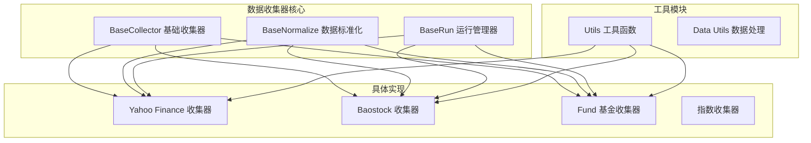
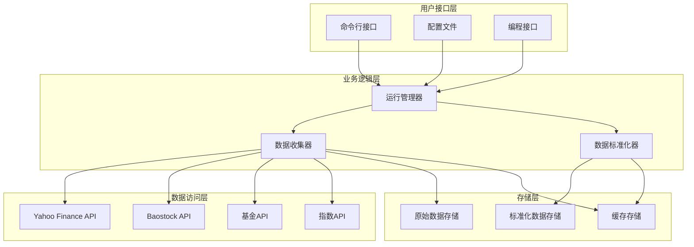
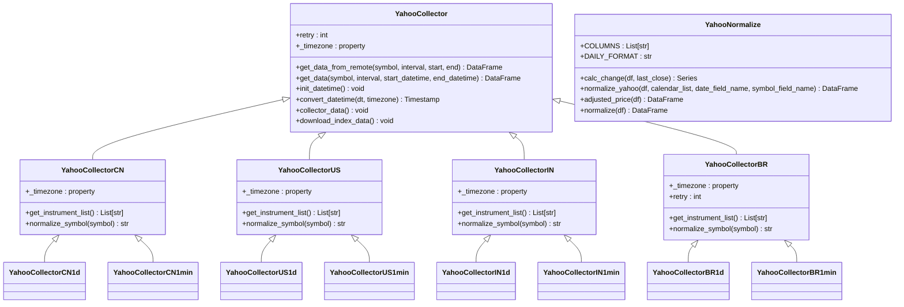
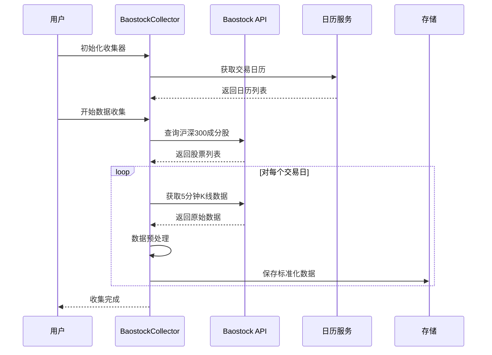
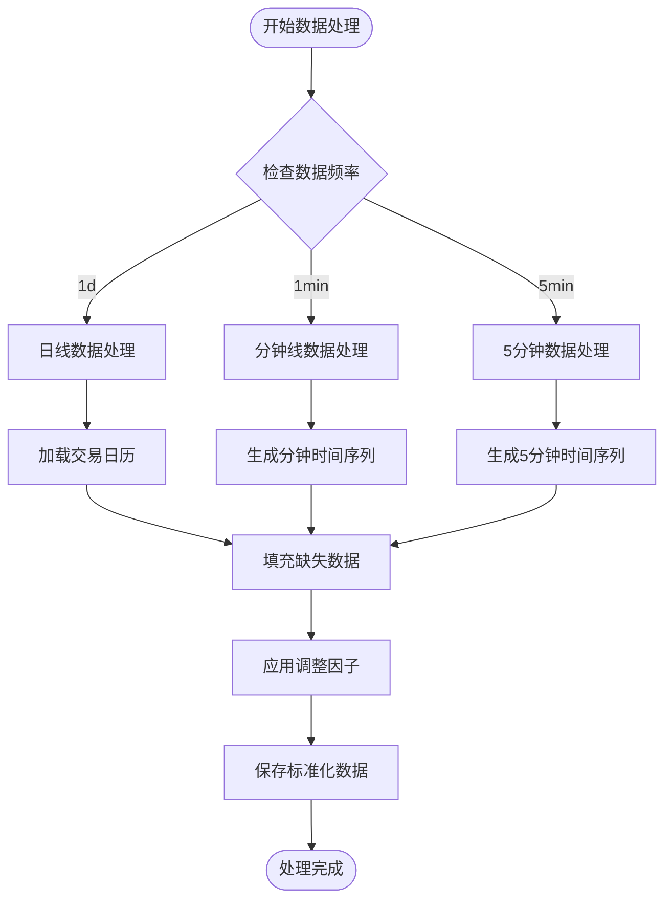

基于我对QLib项目的深入分析，现在我将创建关于数据源集成的全面指南文档。

<docs>
# QLib数据源集成指南

<cite>
**本文档引用的文件**
- [base.py](file://scripts/data_collector/base.py)
- [yahoo/collector.py](file://scripts/data_collector/yahoo/collector.py)
- [baostock_5min/collector.py](file://scripts/data_collector/baostock_5min/collector.py)
- [fund/collector.py](file://scripts/data_collector/fund/collector.py)
- [utils.py](file://scripts/data_collector/utils.py)
- [README.md](file://scripts/data_collector/README.md)
- [workflow_config_lightgbm_Alpha158.yaml](file://examples/benchmarks/LightGBM/workflow_config_lightgbm_Alpha158.yaml)
- [test_get_data.py](file://tests/test_get_data.py)
</cite>

## 目录
1. [简介](#简介)
2. [项目结构](#项目结构)
3. [核心组件](#核心组件)
4. [架构概览](#架构概览)
5. [详细组件分析](#详细组件分析)
6. [数据源类型详解](#数据源类型详解)
7. [自定义数据源扩展](#自定义数据源扩展)
8. [高级特性](#高级特性)
9. [性能优化](#性能优化)
10. [故障排除指南](#故障排除指南)
11. [总结](#总结)

## 简介

QLib是一个面向量化投资研究的Python框架，其数据源集成功能提供了强大的多源数据收集能力。本指南详细介绍了QLib支持的各种数据源类型、收集器实现机制、配置参数、认证方式和数据格式，并提供了自定义数据源扩展的开发步骤。

QLib的数据源集成系统采用模块化设计，通过统一的接口规范支持多种金融数据提供商，包括Yahoo Finance、Baostock、沪深指数、基金数据等。系统具备完整的数据质量检查、异常重试机制和高性能并发处理能力。

## 项目结构

QLib的数据源集成主要位于`scripts/data_collector`目录下，包含以下核心组件：



**图表来源**
- [base.py](file://scripts/data_collector/base.py#L1-L440)
- [yahoo/collector.py](file://scripts/data_collector/yahoo/collector.py#L1-L1022)

**章节来源**
- [README.md](file://scripts/data_collector/README.md#L1-L60)

## 核心组件

### BaseCollector - 基础收集器

`BaseCollector`是所有数据收集器的基础类，定义了统一的数据收集接口和通用功能：

```python
class BaseCollector(abc.ABC):
    CACHE_FLAG = "CACHED"
    NORMAL_FLAG = "NORMAL"
    
    DEFAULT_START_DATETIME_1D = pd.Timestamp("2000-01-01")
    DEFAULT_START_DATETIME_1MIN = pd.Timestamp(datetime.datetime.now() - pd.Timedelta(days=5*6-1)).date()
    
    def __init__(self, save_dir, start=None, end=None, interval="1d", 
                 max_workers=1, max_collector_count=2, delay=0, 
                 check_data_length=None, limit_nums=None):
        # 初始化参数和验证
        self.save_dir = Path(save_dir).expanduser().resolve()
        self.save_dir.mkdir(parents=True, exist_ok=True)
        
        # 并发控制参数
        self.max_workers = max_workers
        self.max_collector_count = max_collector_count
        
        # 时间范围参数
        self.start_datetime = self.normalize_start_datetime(start)
        self.end_datetime = self.normalize_end_datetime(end)
        
        # 数据质量检查
        self.check_data_length = max(int(check_data_length) if check_data_length is not None else 0, 0)
```

### BaseNormalize - 数据标准化

`BaseNormalize`负责将原始数据转换为QLib标准格式：

```python
class BaseNormalize(abc.ABC):
    def __init__(self, date_field_name="date", symbol_field_name="symbol", **kwargs):
        self._date_field_name = date_field_name
        self._symbol_field_name = symbol_field_name
        self.kwargs = kwargs
        self._calendar_list = self._get_calendar_list()
    
    @abc.abstractmethod
    def normalize(self, df: pd.DataFrame) -> pd.DataFrame:
        # 实现数据标准化逻辑
        raise NotImplementedError("")
    
    @abc.abstractmethod
    def _get_calendar_list(self) -> Iterable[pd.Timestamp]:
        # 获取交易日历
        raise NotImplementedError("")
```

### BaseRun - 运行管理器

`BaseRun`提供命令行接口和工作流管理：

```python
class BaseRun(abc.ABC):
    def __init__(self, source_dir=None, normalize_dir=None, max_workers=1, interval="1d"):
        # 初始化目录路径
        if source_dir is None:
            source_dir = Path(self.default_base_dir).joinpath("source")
        self.source_dir = Path(source_dir).expanduser().resolve()
        
        if normalize_dir is None:
            normalize_dir = Path(self.default_base_dir).joinpath("normalize")
        self.normalize_dir = Path(normalize_dir).expanduser().resolve()
    
    def download_data(self, max_collector_count=2, delay=0, 
                     start=None, end=None, check_data_length=None, 
                     limit_nums=None, **kwargs):
        # 下载数据的主入口
        _class = getattr(self._cur_module, self.collector_class_name)
        _class(self.source_dir, max_workers=self.max_workers, 
               max_collector_count=max_collector_count, delay=delay,
               start=start, end=end, interval=self.interval,
               check_data_length=check_data_length, limit_nums=limit_nums,
               **kwargs).collector_data()
```

**章节来源**
- [base.py](file://scripts/data_collector/base.py#L18-L150)

## 架构概览

QLib数据源集成采用分层架构设计，确保了系统的可扩展性和维护性：



**图表来源**
- [base.py](file://scripts/data_collector/base.py#L350-L440)
- [yahoo/collector.py](file://scripts/data_collector/yahoo/collector.py#L800-L1022)

## 详细组件分析

### Yahoo Finance 收集器

Yahoo Finance收集器是最复杂和功能最丰富的数据源实现：



**图表来源**
- [yahoo/collector.py](file://scripts/data_collector/yahoo/collector.py#L30-L200)
- [yahoo/collector.py](file://scripts/data_collector/yahoo/collector.py#L200-L400)

#### Yahoo Finance 收集器特性

1. **多区域支持**：支持中国、美国、印度、巴西等多个市场的股票数据
2. **多频率支持**：支持日线(1d)和分钟线(1min)数据
3. **智能重试**：内置异常重试机制，提高数据获取成功率
4. **指数数据**：自动下载基准指数数据
5. **时区处理**：自动处理不同市场的时区差异

```python
class YahooCollectorCN(YahooCollector, ABC):
    def get_instrument_list(self):
        logger.info("get HS stock symbols......")
        symbols = get_hs_stock_symbols()
        logger.info(f"get {len(symbols)} symbols.")
        return symbols
    
    def normalize_symbol(self, symbol):
        symbol_s = symbol.split(".")
        symbol = f"sh{symbol_s[0]}" if symbol_s[-1] == "ss" else f"sz{symbol_s[0]}"
        return symbol
    
    @property
    def _timezone(self):
        return "Asia/Shanghai"
```

### Baostock 收集器

Baostock收集器专门用于获取中国股市的高频数据：



**图表来源**
- [baostock_5min/collector.py](file://scripts/data_collector/baostock_5min/collector.py#L15-L100)

**章节来源**
- [yahoo/collector.py](file://scripts/data_collector/yahoo/collector.py#L1-L200)
- [baostock_5min/collector.py](file://scripts/data_collector/baostock_5min/collector.py#L1-L150)

## 数据源类型详解

### 支持的数据源类型

QLib支持以下主要数据源类型：

#### 1. Yahoo Finance (全球市场)
- **覆盖范围**：支持中国、美国、印度、巴西等市场的股票和指数
- **数据类型**：OHLCV价格、成交量、调整因子、复权价
- **时间频率**：日线(1d)、分钟线(1min)
- **特殊功能**：
  - 自动下载基准指数数据
  - 智能异常检测和修复
  - 多时区支持
  - 异常重试机制

#### 2. Baostock (中国股市高频数据)
- **覆盖范围**：沪深300成分股
- **数据类型**：5分钟K线数据
- **时间频率**：5分钟线
- **特殊功能**：
  - 高频数据标准化
  - 成交量因子计算
  - 交易暂停标识

#### 3. 基金数据 (东方财富)
- **覆盖范围**：中国公募基金
- **数据类型**：净值数据、累计净值、分红信息
- **时间频率**：日线
- **特殊功能**：
  - 净值异常检测
  - 基金分类识别
  - 历史数据完整性检查

#### 4. 指数数据 (沪深指数)
- **覆盖范围**：沪深300、沪深500、中证100等指数
- **数据类型**：指数行情数据
- **时间频率**：日线
- **特殊功能**：
  - 权重数据更新
  - 组成股变更追踪

### 数据收集器配置参数

每个数据收集器都支持以下通用配置参数：

| 参数名称 | 类型 | 默认值 | 描述 |
|---------|------|--------|------|
| `save_dir` | str/path | 必需 | 数据保存目录 |
| `start` | str | None | 起始日期 |
| `end` | str | None | 结束日期 |
| `interval` | str | "1d" | 数据频率 |
| `max_workers` | int | 1 | 并发工作进程数 |
| `max_collector_count` | int | 2 | 最大收集尝试次数 |
| `delay` | float | 0 | 请求延迟时间(秒) |
| `check_data_length` | int | None | 数据长度检查阈值 |
| `limit_nums` | int | None | 限制收集的标的数量 |

### 认证方式和数据格式

#### Yahoo Finance 认证
- **无需认证**：直接使用Yahoo Finance公开API
- **速率限制**：内置延迟机制防止被封禁
- **异常处理**：网络异常自动重试

#### Baostock 认证
- **无需认证**：免费的开源数据接口
- **请求频率**：建议设置适当的延迟避免过载

#### 基金数据认证
- **无需认证**：使用东方财富网公开API
- **数据质量**：内置数据完整性检查

**章节来源**
- [yahoo/collector.py](file://scripts/data_collector/yahoo/collector.py#L30-L100)
- [baostock_5min/collector.py](file://scripts/data_collector/baostock_5min/collector.py#L20-L80)
- [fund/collector.py](file://scripts/data_collector/fund/collector.py#L30-L100)

## 自定义数据源扩展

### 扩展开发步骤

创建自定义数据源需要遵循以下步骤：

#### 1. 创建数据源目录结构

```
custom_data_source/
├── collector.py          # 主要实现文件
├── README.md            # 文档说明
└── requirements.txt     # 依赖包列表
```

#### 2. 实现收集器类

```python
class CustomCollector(BaseCollector):
    def __init__(self, save_dir, start=None, end=None, interval="1d", 
                 max_workers=1, max_collector_count=2, delay=0, 
                 check_data_length=None, limit_nums=None, **kwargs):
        super().__init__(save_dir, start, end, interval, max_workers, 
                         max_collector_count, delay, check_data_length, limit_nums)
        
        # 自定义初始化逻辑
        self.api_key = kwargs.get('api_key')
        self.base_url = kwargs.get('base_url', 'https://api.customsource.com')
    
    def get_instrument_list(self):
        """获取标的列表"""
        logger.info("get custom stock symbols......")
        # 实现获取标的列表的逻辑
        symbols = self.fetch_instrument_list_from_api()
        logger.info(f"get {len(symbols)} symbols.")
        return symbols
    
    def normalize_symbol(self, symbol):
        """标准化符号格式"""
        # 实现符号标准化逻辑
        return self.standardize_symbol(symbol)
    
    def get_data(self, symbol, interval, start_datetime, end_datetime):
        """获取数据的核心方法"""
        @deco_retry(retry_sleep=self.delay, retry=5)
        def _get_simple(start_, end_):
            self.sleep()
            return self.fetch_data_from_api(symbol, interval, start_, end_)
        
        try:
            _result = _get_simple(start_datetime, end_datetime)
            return pd.DataFrame() if _result is None else _result
        except Exception as e:
            logger.warning(f"get data error: {symbol}--{start_datetime}--{end_datetime}")
            return pd.DataFrame()
```

#### 3. 实现数据标准化类

```python
class CustomNormalize(BaseNormalize):
    COLUMNS = ["open", "close", "high", "low", "volume"]
    
    def __init__(self, date_field_name="date", symbol_field_name="symbol", **kwargs):
        super().__init__(date_field_name, symbol_field_name, **kwargs)
        # 自定义初始化逻辑
        
    def _get_calendar_list(self):
        """获取交易日历"""
        # 实现获取交易日历的逻辑
        return self.fetch_calendar_list()
    
    def normalize(self, df):
        """标准化数据"""
        if df.empty:
            return df
            
        # 实现数据标准化逻辑
        df = self.normalize_custom_data(df, self._calendar_list, 
                                      self._date_field_name, self._symbol_field_name)
        
        # 应用调整因子
        df = self.adjusted_price(df)
        return df
    
    def adjusted_price(self, df):
        """计算调整价格"""
        # 实现调整价格计算逻辑
        return self.calculate_adjusted_prices(df)
```

#### 4. 实现运行管理类

```python
class Run(BaseRun):
    def __init__(self, source_dir=None, normalize_dir=None, max_workers=1, 
                 interval="1d", region="CUSTOM"):
        super().__init__(source_dir, normalize_dir, max_workers, interval)
        self.region = region
    
    @property
    def collector_class_name(self):
        return f"CustomCollector{self.region.upper()}{self.interval}"
    
    @property
    def normalize_class_name(self):
        return f"CustomNormalize{self.region.upper()}{self.interval}"
    
    @property
    def default_base_dir(self):
        return Path(__file__).resolve().parent
```

#### 5. 编写README文档

```markdown
# Custom Data Source

## Introduction

Custom data source implementation for QLib.

## Setup

1. Install dependencies:
   ```
   pip install -r requirements.txt
   ```

2. Configure API credentials in collector.py

## Usage

Download data:
```
python collector.py download_data \
  --source_dir ~/.qlib/custom_data/source \
  --region CUSTOM \
  --start 2020-01-01 \
  --end 2020-12-31 \
  --interval 1d
```

Normalize data:
```
python collector.py normalize_data \
  --source_dir ~/.qlib/custom_data/source \
  --normalize_dir ~/.qlib/custom_data/normalize \
  --region CUSTOM \
  --interval 1d
```
```

#### 6. 编写requirements.txt

```
# 基础依赖
requests>=2.25.1
pandas>=1.2.0
numpy>=1.19.0

# 可选依赖
# 如果需要特定的API客户端库
custom-api-client>=1.0.0
```

### 继承基类的关键方法

在实现自定义数据源时，需要重点实现以下关键方法：

1. **`get_instrument_list()`**：获取标的列表
2. **`normalize_symbol(symbol)`**：标准化符号格式
3. **`get_data()`**：获取数据的核心方法
4. **`_get_calendar_list()`**：获取交易日历
5. **`normalize()`**：数据标准化方法
6. **`adjusted_price()`**：调整价格计算

### 注册到系统

完成自定义数据源后，需要将其注册到QLib系统中：

```python
# 在collector.py中添加以下代码
if __name__ == "__main__":
    fire.Fire(Run)
```

然后可以通过命令行使用：

```bash
# 下载数据
python collector.py download_data --source_dir ~/.qlib/custom_data/source --region CUSTOM --start 2020-01-01 --end 2020-12-31

# 标准化数据
python collector.py normalize_data --source_dir ~/.qlib/custom_data/source --normalize_dir ~/.qlib/custom_data/normalize --region CUSTOM
```

**章节来源**
- [README.md](file://scripts/data_collector/README.md#L10-L30)
- [base.py](file://scripts/data_collector/base.py#L200-L350)

## 高级特性

### 数据频率处理

QLib支持多种数据频率的统一处理：



**图表来源**
- [utils.py](file://scripts/data_collector/utils.py#L700-L800)

### 时区转换机制

QLib内置了完善的时区转换机制：

```python
@staticmethod
def convert_datetime(dt: [pd.Timestamp, datetime.date, str], timezone):
    try:
        dt = pd.Timestamp(dt, tz=timezone).timestamp()
        dt = pd.Timestamp(dt, tz=tzlocal(), unit="s")
    except ValueError as e:
        pass
    return dt
```

### 异常重试机制

系统实现了智能的异常重试机制：

```python
def deco_retry(retry: int = 5, retry_sleep: int = 3):
    def deco_func(func):
        @functools.wraps(func)
        def wrapper(*args, **kwargs):
            _retry = 5 if callable(retry) else retry
            _result = None
            for _i in range(1, _retry + 1):
                try:
                    _result = func(*args, **kwargs)
                    break
                except Exception as e:
                    logger.warning(f"{func.__name__}: {_i} :{e}")
                    if _i == _retry:
                        raise
                time.sleep(retry_sleep)
            return _result
        return wrapper
    return deco_func(retry) if callable(retry) else deco_func
```

### 数据质量检查

系统提供了多层次的数据质量检查：

1. **数据长度检查**：确保获取的数据量达到预期
2. **异常值检测**：识别和处理异常的价格波动
3. **完整性验证**：检查数据的完整性和连续性
4. **重复数据处理**：自动去重和合并

```python
def cache_small_data(self, symbol, df):
    if len(df) < self.check_data_length:
        logger.warning(f"the number of trading days of {symbol} is less than {self.check_data_length}!")
        _temp = self.mini_symbol_map.setdefault(symbol, [])
        _temp.append(df.copy())
        return self.CACHE_FLAG
    else:
        if symbol in self.mini_symbol_map:
            self.mini_symbol_map.pop(symbol)
        return self.NORMAL_FLAG
```

**章节来源**
- [base.py](file://scripts/data_collector/base.py#L150-L250)
- [utils.py](file://scripts/data_collector/utils.py#L750-L849)

## 性能优化

### 并发处理优化

QLib采用了多种并发处理策略来提高数据收集效率：

#### 1. 多进程并行处理

```python
def _collector(self, instrument_list):
    error_symbol = []
    res = Parallel(n_jobs=self.max_workers)(
        delayed(self._simple_collector)(_inst) for _inst in tqdm(instrument_list)
    )
    for _symbol, _result in zip(instrument_list, res):
        if _result != self.NORMAL_FLAG:
            error_symbol.append(_symbol)
    return sorted(set(error_symbol))
```

#### 2. 进程池管理

```python
class Normalize:
    def normalize(self):
        logger.info("normalize data......")
        
        with ProcessPoolExecutor(max_workers=self._max_workers) as worker:
            file_list = list(self._source_dir.glob("*.csv"))
            with tqdm(total=len(file_list)) as p_bar:
                for _ in worker.map(self._executor, file_list):
                    p_bar.update()
```

### 内存优化策略

1. **流式处理**：对大数据集采用流式处理避免内存溢出
2. **数据分块**：将大文件分割成小块处理
3. **及时释放**：处理完成后及时释放不再使用的数据

### 网络优化

1. **连接池**：复用HTTP连接减少建立连接的开销
2. **请求合并**：将多个小请求合并为大请求
3. **缓存机制**：缓存频繁访问的数据减少网络请求

### 大规模数据采集性能调优建议

#### 1. 合理设置并发参数

```python
# 推荐配置
collector = YahooCollector(
    save_dir="/data/qlib",
    max_workers=8,           # 根据CPU核心数调整
    max_collector_count=3,   # 失败重试次数
    delay=0.5,              # 请求间隔时间
    interval="1d"
)
```

#### 2. 分批处理策略

```python
# 将标的分成小批次处理
def batch_collect(collector, symbols, batch_size=100):
    for i in range(0, len(symbols), batch_size):
        batch = symbols[i:i + batch_size]
        collector.instrument_list = batch
        collector.collector_data()
```

#### 3. 增量更新机制

```python
# 只更新新增或修改的数据
def incremental_update(collector, last_update_time):
    # 获取上次更新后的新增标的
    new_symbols = get_new_symbols_since(last_update_time)
    
    # 只处理新增标的
    collector.instrument_list = new_symbols
    collector.collector_data()
```

#### 4. 磁盘I/O优化

```python
# 使用更快的存储设备
collector = YahooCollector(
    save_dir="/fast_ssd/qlib_data",  # 使用SSD
    max_workers=4
)

# 批量写入减少磁盘IO
def save_batch_data(batch_data):
    with open("/tmp/batch_data.csv", "w") as f:
        for df in batch_data:
            df.to_csv(f, header=f.tell()==0, index=False)
```

**章节来源**
- [base.py](file://scripts/data_collector/base.py#L180-L250)
- [yahoo/collector.py](file://scripts/data_collector/yahoo/collector.py#L150-L250)

## 故障排除指南

### 常见问题及解决方案

#### 1. 网络连接问题

**问题症状**：
- 数据获取失败
- 请求超时错误
- 连接被拒绝

**解决方案**：
```python
# 增加重试次数和延迟
collector = YahooCollector(
    save_dir="/data/qlib",
    max_workers=1,           # 减少并发避免被封禁
    max_collector_count=5,   # 增加重试次数
    delay=1.0,              # 增加请求间隔
    interval="1d"
)

# 使用代理服务器
import os
os.environ['HTTP_PROXY'] = 'http://proxy.example.com:8080'
os.environ['HTTPS_PROXY'] = 'http://proxy.example.com:8080'
```

#### 2. 数据质量问题

**问题症状**：
- 数据缺失严重
- 异常价格波动
- 重复数据

**解决方案**：
```python
# 启用数据质量检查
collector = YahooCollector(
    save_dir="/data/qlib",
    check_data_length=252,   # 检查至少一年的数据
    max_collector_count=3
)

# 手动清理异常数据
def clean_data(df):
    # 移除异常值
    q_low = df['close'].quantile(0.01)
    q_hi = df['close'].quantile(0.99)
    df = df[(df['close'] < q_hi) & (df['close'] > q_low)]
    
    # 处理缺失值
    df = df.fillna(method='ffill')  # 前向填充
    return df
```

#### 3. 内存不足问题

**问题症状**：
- 内存溢出错误
- 系统响应缓慢
- 进程被杀死

**解决方案**：
```python
# 减少并发工作进程
collector = YahooCollector(
    save_dir="/data/qlib",
    max_workers=2,           # 减少并发数
    max_collector_count=2
)

# 分批处理数据
def process_large_dataset(collector, symbols, chunk_size=50):
    for i in range(0, len(symbols), chunk_size):
        chunk = symbols[i:i + chunk_size]
        collector.instrument_list = chunk
        collector.collector_data()
        gc.collect()  # 手动垃圾回收
```

#### 4. 文件权限问题

**问题症状**：
- 无法创建文件
- 权限拒绝错误
- 存储空间不足

**解决方案**：
```python
# 检查目录权限
import os
save_dir = "/data/qlib"
if not os.access(save_dir, os.W_OK):
    os.chmod(save_dir, 0o755)

# 检查磁盘空间
import shutil
total, used, free = shutil.disk_usage(save_dir)
if free < 10 * 1024 * 1024 * 1024:  # 少于10GB
    raise Exception("Not enough disk space")

# 使用临时目录
import tempfile
with tempfile.TemporaryDirectory() as temp_dir:
    collector = YahooCollector(save_dir=temp_dir, ...)
```

### 调试技巧

#### 1. 启用详细日志

```python
import logging
logging.basicConfig(level=logging.DEBUG)

# 或者在代码中启用
logger = logging.getLogger()
logger.setLevel(logging.DEBUG)
```

#### 2. 使用调试模式

```python
# 限制处理的标的数量进行测试
collector = YahooCollector(
    save_dir="/data/qlib",
    limit_nums=10,           # 只处理10个标的
    max_workers=1,           # 单线程便于调试
    delay=0                  # 不延迟
)

# 执行单个标的测试
collector.instrument_list = ["AAPL"]
collector.collector_data()
```

#### 3. 数据验证

```python
# 验证数据完整性
def validate_data(df, symbol):
    errors = []
    
    if df.empty:
        errors.append(f"Empty data for {symbol}")
    
    if 'date' not in df.columns:
        errors.append(f"Missing date column for {symbol}")
    
    if 'close' not in df.columns:
        errors.append(f"Missing close price for {symbol}")
    
    # 检查数据连续性
    dates = pd.to_datetime(df['date'])
    if len(dates) > 1:
        gaps = dates.diff().dt.days[1:]
        large_gaps = gaps[gaps > 5]  # 大于5天的间隔
        if len(large_gaps) > 0:
            errors.append(f"Large gaps found in {symbol} data")
    
    return errors

# 在数据处理后验证
for symbol in successful_symbols:
    df = pd.read_csv(f"/data/qlib/{symbol}.csv")
    errors = validate_data(df, symbol)
    if errors:
        logger.warning(f"Validation errors for {symbol}: {errors}")
```

**章节来源**
- [base.py](file://scripts/data_collector/base.py#L100-L150)
- [utils.py](file://scripts/data_collector/utils.py#L700-L750)

## 总结

QLib的数据源集成系统是一个功能强大、设计精良的多源数据收集平台。通过本文档的详细介绍，我们了解了：

### 核心优势

1. **统一接口**：所有数据源都遵循相同的接口规范，便于扩展和维护
2. **多区域支持**：支持全球多个市场的金融数据
3. **高并发处理**：内置高效的并发处理机制
4. **智能重试**：完善的异常处理和重试机制
5. **数据质量保证**：多层次的数据质量检查和验证

### 主要特性

- **多样化数据源**：支持Yahoo Finance、Baostock、基金数据等多种数据源
- **多频率支持**：从日线到分钟线的全频段数据支持
- **时区处理**