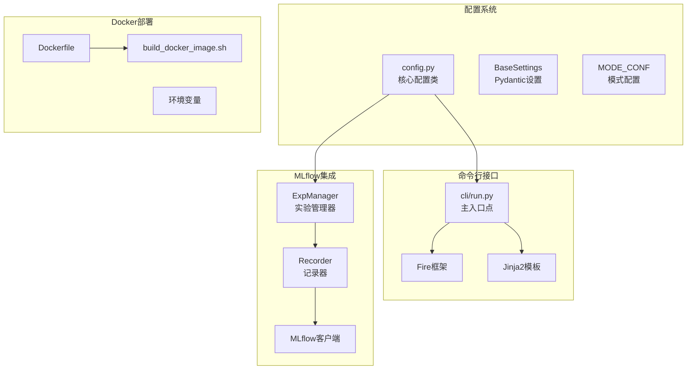
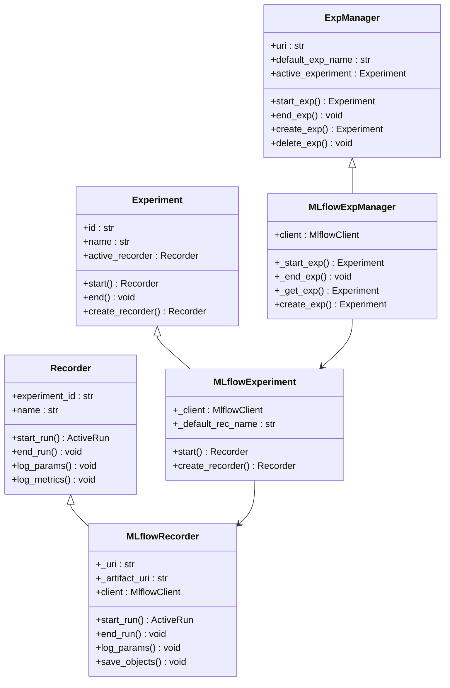
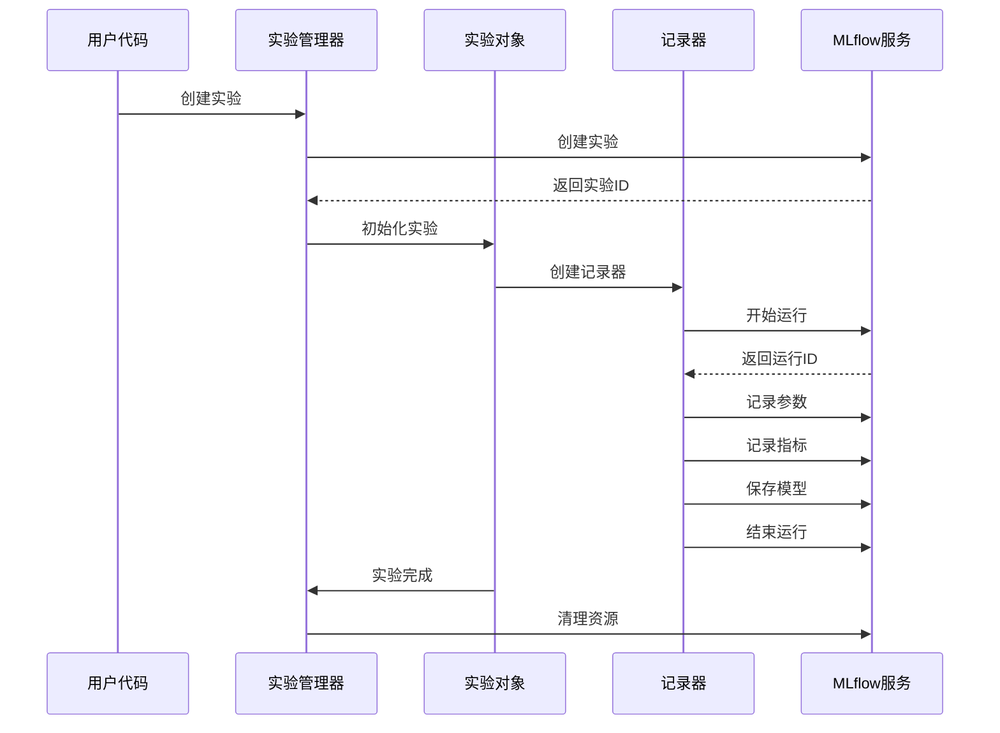
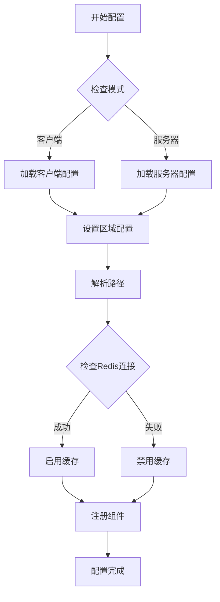
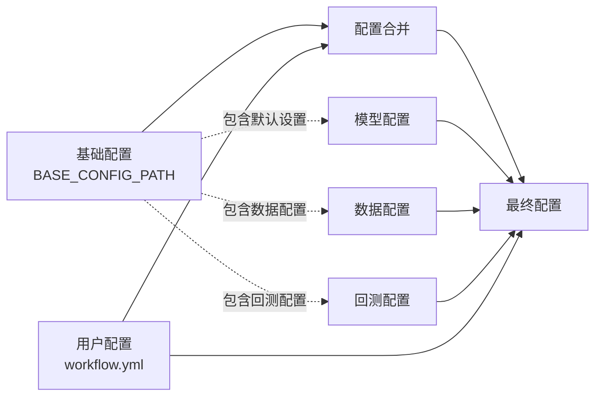
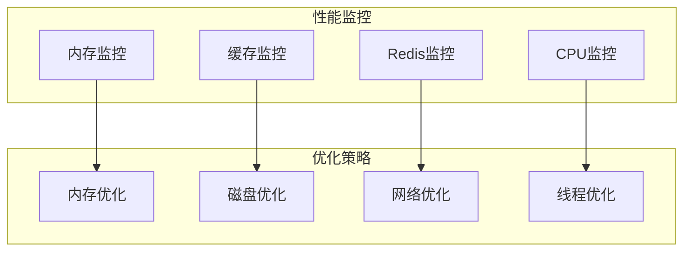

# Qlib配置与集成API文档

<cite>
**本文档中引用的文件**
- [qlib/cli/run.py](file://qlib/cli/run.py)
- [qlib/config.py](file://qlib/config.py)
- [qlib/workflow/expm.py](file://qlib/workflow/expm.py)
- [qlib/workflow/recorder.py](file://qlib/workflow/recorder.py)
- [qlib/workflow/exp.py](file://qlib/workflow/exp.py)
- [Dockerfile](file://Dockerfile)
- [build_docker_image.sh](file://build_docker_image.sh)
- [pyproject.toml](file://pyproject.toml)
- [examples/benchmarks/LightGBM/workflow_config_lightgbm_Alpha158.yaml](file://examples/benchmarks/LightGBM/workflow_config_lightgbm_Alpha158.yaml)
- [scripts/get_data.py](file://scripts/get_data.py)
- [tests/dependency_tests/test_mlflow.py](file://tests/dependency_tests/test_mlflow.py)
</cite>

## 目录
1. [简介](#简介)
2. [项目结构概览](#项目结构概览)
3. [命令行接口配置](#命令行接口配置)
4. [Docker部署配置](#docker部署配置)
5. [MLflow集成配置](#mlflow集成配置)
6. [核心配置系统](#核心配置系统)
7. [工作流配置示例](#工作流配置示例)
8. [环境变量配置](#环境变量配置)
9. [性能优化配置](#性能优化配置)
10. [故障排除指南](#故障排除指南)
11. [总结](#总结)

## 简介

Qlib是一个面向量化研究的平台，提供了完整的配置与集成解决方案。本文档详细介绍了Qlib的配置系统、命令行接口、Docker部署以及MLflow集成等关键功能。

Qlib的配置系统采用分层设计，支持多种部署模式（客户端/服务器），并提供了灵活的扩展机制。通过统一的配置接口，用户可以轻松地在不同环境中部署和运行量化研究工作流。

## 项目结构概览



**图表来源**
- [qlib/config.py](file://qlib/config.py#L1-L50)
- [qlib/cli/run.py](file://qlib/cli/run.py#L1-L30)
- [qlib/workflow/expm.py](file://qlib/workflow/expm.py#L1-L50)

## 命令行接口配置

### qrun命令

Qlib提供了强大的命令行工具`qrun`，用于执行量化研究工作流。该工具支持模板渲染、配置继承和环境变量替换。

#### 基本用法

```bash
# 执行基础工作流
qrun workflow_config.yaml

# 指定实验名称
qrun workflow_config.yaml --experiment_name="my_experiment"

# 指定URI文件夹
qrun workflow_config.yaml --uri_folder="mlruns_custom"
```

#### 配置文件格式

```yaml
# 基础配置
qlib_init:
    provider_uri: "~/.qlib/qlib_data/cn_data"
    region: cn

# 变量模板支持
market: &market csi300
benchmark: &benchmark SH000300

# 数据处理器配置
data_handler_config: &data_handler_config
    start_time: 2008-01-01
    end_time: 2020-08-01
    instruments: *market

# 任务配置
task:
    model:
        class: LGBModel
        module_path: qlib.contrib.model.gbdt
        kwargs:
            loss: mse
            num_threads: 20
    dataset:
        class: DatasetH
        module_path: qlib.data.dataset
        kwargs:
            handler:
                class: Alpha158
                module_path: qlib.contrib.data.handler
                kwargs: *data_handler_config
```

#### 模板渲染机制

Qlib支持Jinja2模板语法，允许在配置文件中使用环境变量：

```yaml
# 使用环境变量
provider_uri: "{{ PROVIDER_URI }}"
market: "{{ MARKET_INDEX | default('csi300') }}"

# 条件配置

logging_level: DEBUG

logging_level: INFO

```

**章节来源**
- [qlib/cli/run.py](file://qlib/cli/run.py#L1-L158)

## Docker部署配置

### Dockerfile配置

Qlib提供了完整的Docker配置，支持稳定版和夜间版本的构建。

#### 核心配置

```dockerfile
FROM continuumio/miniconda3:latest

WORKDIR /qlib
COPY . .

# 安装系统依赖
RUN apt-get update && \
    apt-get install -y build-essential

# 创建Conda环境
RUN conda create --name qlib_env python=3.8 -y
RUN echo "conda activate qlib_env" >> ~/.bashrc
ENV PATH /opt/conda/envs/qlib_env/bin:$PATH

# 安装Python依赖
RUN python -m pip install --upgrade pip
RUN python -m pip install numpy==1.23.5
RUN python -m pip install pandas==1.5.3
RUN python -m pip install mlflow
```

#### 构建脚本

```bash
#!/bin/bash
docker_user="your_dockerhub_username"

# 选择构建版本
read -p "Build nightly version? (yes/no): " answer
answer=$(echo "$answer" | tr '[:upper:]' '[:lower:]')

if [ "$answer" = "yes" ]; then
    # 夜间版本构建
    docker build --build-arg IS_STABLE=no -t qlib_image -f ./Dockerfile .
    image_tag="nightly"
else
    # 稳定版本构建
    docker build -t qlib_image -f ./Dockerfile .
    image_tag="stable"
fi

# 推送到Docker Hub
read -p "Upload to Docker Hub? (yes/no): " answer
if [ "$answer" = "yes" ]; then
    docker login
    docker tag qlib_image "$docker_user/qlib_image:$image_tag"
    docker push "$docker_user/qlib_image:$image_tag"
fi
```

#### 容器运行配置

```bash
# 运行容器
docker run -it --rm \
    -v $(pwd)/data:/qlib/data \
    -v $(pwd)/mlruns:/qlib/mlruns \
    -p 8080:8080 \
    qlib_image bash

# 设置环境变量
docker run -it --rm \
    -e QLIB_PROVIDER_URI="/data" \
    -e QLIB_MLFLOW_URI="file:/mlruns" \
    qlib_image python -c "import qlib; print(qlib.__version__)"
```

**章节来源**
- [Dockerfile](file://Dockerfile#L1-L32)
- [build_docker_image.sh](file://build_docker_image.sh#L1-L32)

## MLflow集成配置

### 实验管理器配置

Qlib深度集成了MLflow，提供了完整的实验跟踪和管理功能。

#### MLflow设置

```python
# MLflow配置类
class MLflowSettings(BaseSettings):
    uri: str = "file:" + str(Path(os.getcwd()).resolve() / "mlruns")
    default_exp_name: str = "Experiment"

# Qlib全局设置
class QSettings(BaseSettings):
    mlflow: MLflowSettings = MLflowSettings()
    provider_uri: str = "~/.qlib/qlib_data/cn_data"
```

#### 实验管理器架构



**图表来源**
- [qlib/workflow/expm.py](file://qlib/workflow/expm.py#L1-L100)
- [qlib/workflow/exp.py](file://qlib/workflow/exp.py#L1-L100)
- [qlib/workflow/recorder.py](file://qlib/workflow/recorder.py#L1-L100)

#### 记录器配置

```python
# MLflow记录器初始化
class MLflowRecorder(Recorder):
    def __init__(self, experiment_id, uri, name=None, mlflow_run=None):
        super(MLflowRecorder, self).__init__(experiment_id, name)
        self._uri = uri
        self._artifact_uri = None
        self.client = mlflow.tracking.MlflowClient(tracking_uri=self._uri)
        
        # 支持从现有MLflow运行构造
        if mlflow_run is not None:
            self.name = mlflow_run.data.tags["mlflow.runName"]
            self.id = mlflow_run.info.run_id
            self.status = mlflow_run.info.status
```

#### 实验跟踪流程



**图表来源**
- [qlib/workflow/expm.py](file://qlib/workflow/expm.py#L317-L363)
- [qlib/workflow/recorder.py](file://qlib/workflow/recorder.py#L236-L291)

**章节来源**
- [qlib/workflow/expm.py](file://qlib/workflow/expm.py#L1-L433)
- [qlib/workflow/recorder.py](file://qlib/workflow/recorder.py#L1-L385)
- [qlib/workflow/exp.py](file://qlib/workflow/exp.py#L1-L325)

## 核心配置系统

### 配置层次结构

Qlib的配置系统采用分层设计，支持默认配置、模式配置和用户自定义配置的合并。

#### 默认配置

```python
# 核心配置类
class Config:
    def __init__(self, default_conf):
        self.__dict__["_default_config"] = copy.deepcopy(default_conf)
        self.reset()

    def reset(self):
        self.__dict__["_config"] = copy.deepcopy(self._default_config)

    def update(self, *args, **kwargs):
        self.__dict__["_config"].update(*args, **kwargs)
```

#### 模式配置

```python
# 客户端模式配置
CLIENT_MODE_CONFIG = {
    "provider_uri": QSETTINGS.provider_uri,
    "dataset_cache": None,
    "local_cache_path": Path("~/.cache/qlib_simple_cache").expanduser().resolve(),
    "mount_path": None,
    "auto_mount": False,
    "timeout": 100,
    "logging_level": logging.INFO,
    "region": REG_CN,
    "custom_ops": [],
}

# 服务器模式配置
SERVER_MODE_CONFIG = {
    "provider_uri": "",
    "redis_host": "127.0.0.1",
    "redis_port": 6379,
    "redis_task_db": 1,
    "expression_cache": DISK_EXPRESSION_CACHE,
    "dataset_cache": DISK_DATASET_CACHE,
    "local_cache_path": Path("~/.cache/qlib_simple_cache").expanduser().resolve(),
    "mount_path": None,
}
```

#### 高频数据配置

```python
HIGH_FREQ_CONFIG = {
    "provider_uri": "~/.qlib/qlib_data/cn_data_1min",
    "dataset_cache": None,
    "expression_cache": "DiskExpressionCache",
    "region": REG_CN,
}
```

### 数据路径管理



**图表来源**
- [qlib/config.py](file://qlib/config.py#L400-L526)

**章节来源**
- [qlib/config.py](file://qlib/config.py#L1-L526)

## 工作流配置示例

### 基准测试配置

以下是一个完整的LightGBM基准测试配置示例：

```yaml
qlib_init:
    provider_uri: "~/.qlib/qlib_data/cn_data"
    region: cn

market: &market csi300
benchmark: &benchmark SH000300

data_handler_config: &data_handler_config
    start_time: 2008-01-01
    end_time: 2020-08-01
    fit_start_time: 2008-01-01
    fit_end_time: 2014-12-31
    instruments: *market

port_analysis_config: &port_analysis_config
    strategy:
        class: TopkDropoutStrategy
        module_path: qlib.contrib.strategy
        kwargs:
            signal: <PRED>
            topk: 50
            n_drop: 5
    backtest:
        start_time: 2017-01-01
        end_time: 2020-08-01
        account: 100000000
        benchmark: *benchmark
        exchange_kwargs:
            limit_threshold: 0.095
            deal_price: close
            open_cost: 0.0005
            close_cost: 0.0015
            min_cost: 5

task:
    model:
        class: LGBModel
        module_path: qlib.contrib.model.gbdt
        kwargs:
            loss: mse
            colsample_bytree: 0.8879
            learning_rate: 0.2
            subsample: 0.8789
            lambda_l1: 205.6999
            lambda_l2: 580.9768
            max_depth: 8
            num_leaves: 210
            num_threads: 20
    dataset:
        class: DatasetH
        module_path: qlib.data.dataset
        kwargs:
            handler:
                class: Alpha158
                module_path: qlib.contrib.data.handler
                kwargs: *data_handler_config
            segments:
                train: [2008-01-01, 2014-12-31]
                valid: [2015-01-01, 2016-12-31]
                test: [2017-01-01, 2020-08-01]
    record: 
        - class: SignalRecord
          module_path: qlib.workflow.record_temp
          kwargs: 
            model: <MODEL>
            dataset: <DATASET>
        - class: SigAnaRecord
          module_path: qlib.workflow.record_temp
          kwargs: 
            ana_long_short: False
            ann_scaler: 252
        - class: PortAnaRecord
          module_path: qlib.workflow.record_temp
          kwargs: 
            config: *port_analysis_config
```

### 配置继承机制



**图表来源**
- [qlib/cli/run.py](file://qlib/cli/run.py#L80-L120)

**章节来源**
- [examples/benchmarks/LightGBM/workflow_config_lightgbm_Alpha158.yaml](file://examples/benchmarks/LightGBM/workflow_config_lightgbm_Alpha158.yaml#L1-L72)

## 环境变量配置

### Qlib环境变量

Qlib支持通过环境变量进行配置，使用Pydantic的环境变量解析功能：

```bash
# 数据提供程序URI
export QLIB_PROVIDER_URI="~/.qlib/qlib_data/cn_data"

# MLflow跟踪URI
export QLIB_MLFLOW_URI="file:/mlruns"

# 默认实验名称
export QLIB_MLFLOW_DEFAULT_EXP_NAME="quant_experiment"

# 日志级别
export QLIB_LOGGING_LEVEL="INFO"

# Redis配置
export QLIB_REDIS_HOST="127.0.0.1"
export QLIB_REDIS_PORT="6379"
```

### 系统路径配置

```python
def sys_config(config, config_path):
    """
    配置sys模块部分
    """
    sys_config = config.get("sys", {})
    
    # 绝对路径添加
    for p in get_path_list(sys_config.get("path", [])):
        sys.path.append(p)
    
    # 相对路径到配置路径
    for p in get_path_list(sys_config.get("rel_path", [])):
        sys.path.append(str(Path(config_path).parent.resolve().absolute() / p))
```

### 模板变量替换

```python
def render_template(config_path: str) -> str:
    """
    基于环境渲染模板
    """
    with open(config_path, "r") as f:
        config = f.read()
    
    # 设置Jinja2环境
    template = Template(config)
    
    # 解析模板查找未声明变量
    env = template.environment
    parsed_content = env.parse(config)
    variables = meta.find_undeclared_variables(parsed_content)
    
    # 从os.environ获取上下文
    context = {var: os.getenv(var, "") for var in variables if var in os.environ}
    
    # 渲染模板
    rendered_content = template.render(context)
    return rendered_content
```

**章节来源**
- [qlib/cli/run.py](file://qlib/cli/run.py#L30-L80)

## 性能优化配置

### 缓存配置

Qlib提供了多层次的缓存机制来提升性能：

```python
# 缓存类型常量
DISK_DATASET_CACHE = "DiskDatasetCache"
SIMPLE_DATASET_CACHE = "SimpleDatasetCache"
DISK_EXPRESSION_CACHE = "DiskExpressionCache"

# Redis缓存依赖关系
DEPENDENCY_REDIS_CACHE = (DISK_DATASET_CACHE, DISK_EXPRESSION_CACHE)

# 默认缓存配置
_default_config = {
    "expression_cache": None,
    "calendar_cache": None,
    "local_cache_path": None,
    "dataset_cache": None,
    "mem_cache_size_limit": 500,
    "mem_cache_limit_type": "length",
    "mem_cache_expire": 60 * 60,
    "dataset_cache_dir_name": "dataset_cache",
    "features_cache_dir_name": "features_cache",
}
```

### 并发配置

```python
# CPU核数配置
NUM_USABLE_CPU = max(multiprocessing.cpu_count() - 2, 1)

# 默认并发配置
_default_config = {
    "kernels": NUM_USABLE_CPU,
    "maxtasksperchild": None,
    "joblib_backend": "multiprocessing",
    "default_disk_cache": 1,
}
```

### 内存管理

```python
# 内存缓存配置
_default_config = {
    "mem_cache_size_limit": 500,  # MB
    "mem_cache_limit_type": "length",  # length或bytes
    "mem_cache_expire": 60 * 60,  # 秒
}
```

### 性能监控



**章节来源**
- [qlib/config.py](file://qlib/config.py#L100-L200)

## 故障排除指南

### 常见配置问题

#### 1. MLflow连接问题

```python
# 错误：MLflow客户端创建失败
try:
    client = mlflow.tracking.MlflowClient(tracking_uri=uri)
except Exception as e:
    logger.error(f"MLflow client creation failed: {e}")
    # 尝试使用本地文件存储
    uri = "file:" + str(Path(os.getcwd()).resolve() / "mlruns")
    client = mlflow.tracking.MlflowClient(tracking_uri=uri)
```

#### 2. Redis连接问题

```python
# 检查Redis连接
def can_use_cache():
    try:
        redis.Redis(host="127.0.0.1", port=6379).ping()
        return True
    except:
        return False

# 自动降级缓存
if not can_use_cache():
    if self.is_depend_redis(self["expression_cache"]):
        self["expression_cache"] = None
    if self.is_depend_redis(self["dataset_cache"]):
        self["dataset_cache"] = None
```

#### 3. 路径解析问题

```python
# 数据路径管理
class DataPathManager:
    def get_data_uri(self, freq: Optional[Union[str, Freq]] = None) -> Path:
        if freq is None or freq not in self.provider_uri:
            freq = QlibConfig.DEFAULT_FREQ
        
        _provider_uri = self.provider_uri[freq]
        if self.get_uri_type(_provider_uri) == QlibConfig.LOCAL_URI:
            return Path(_provider_uri)
        elif self.get_uri_type(_provider_uri) == QlibConfig.NFS_URI:
            return Path(self.mount_path[freq])
        else:
            raise NotImplementedError(f"Unsupported URI type")
```

### 调试配置

```python
# 启用调试日志
import logging
from qlib.log import get_module_logger

logger = get_module_logger("workflow", logging.DEBUG)

# 配置调试模式
_default_config = {
    "logging_level": logging.DEBUG,
    "logging_config": {
        "version": 1,
        "formatters": {
            "logger_format": {
                "format": "[%(process)s:%(threadName)s](%(asctime)s) %(levelname)s - %(name)s - [%(filename)s:%(lineno)d] - %(message)s"
            }
        },
        "handlers": {
            "console": {
                "class": "logging.StreamHandler",
                "level": logging.DEBUG,
                "formatter": "logger_format",
            }
        },
        "loggers": {
            "qlib": {
                "level": logging.DEBUG,
                "handlers": ["console"],
                "propagate": False,
            }
        },
    },
}
```

### 性能诊断

```python
# MLflow客户端性能测试
def test_mlflow_client_performance():
    """
    测试MLflow客户端创建性能
    """
    start = time.time()
    for i in range(10):
        _ = mlflow.tracking.MlflowClient(tracking_uri=str(tmp_path))
    end = time.time()
    elapsed = end - start
    
    if platform.system() == "Linux":
        assert elapsed < 1e-2  # Linux下应在10ms内完成
    else:
        assert elapsed < 2e-2  # 其他系统应在20ms内完成
```

**章节来源**
- [tests/dependency_tests/test_mlflow.py](file://tests/dependency_tests/test_mlflow.py#L1-L39)

## 总结

Qlib的配置与集成系统提供了完整而灵活的解决方案，支持多种部署模式和集成方式：

### 主要特性

1. **统一配置接口**：通过分层配置系统，支持默认配置、模式配置和用户自定义配置的无缝集成
2. **模板化配置**：支持Jinja2模板语法，允许动态配置和环境变量替换
3. **多模式支持**：提供客户端和服务器两种部署模式，适应不同的使用场景
4. **MLflow深度集成**：完整的实验跟踪和管理功能，支持参数、指标和模型的自动记录
5. **Docker友好**：提供完整的Docker配置和构建脚本，支持容器化部署
6. **性能优化**：多层次缓存机制和并发优化，确保高效运行

### 最佳实践

1. **配置管理**：使用配置继承机制，将通用配置与特定配置分离
2. **环境隔离**：通过环境变量实现不同环境的配置隔离
3. **缓存策略**：根据数据规模和硬件条件合理配置缓存策略
4. **监控告警**：建立完善的监控体系，及时发现和解决配置问题
5. **版本控制**：将配置文件纳入版本控制系统，便于团队协作和版本管理

### 未来发展方向

1. **云原生支持**：进一步优化Kubernetes部署和云服务集成
2. **自动化运维**：开发更多自动化工具和脚本，简化部署和维护工作
3. **配置验证**：增强配置文件的验证机制，减少配置错误
4. **可视化界面**：开发图形化的配置管理界面，降低使用门槛

通过本文档的详细介绍，用户可以充分利用Qlib的配置与集成功能，构建高效、可靠的量化研究平台。