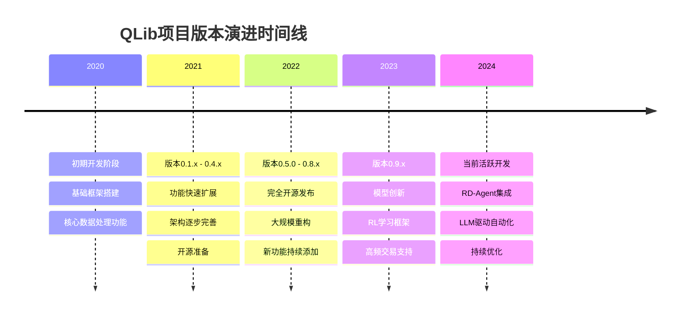
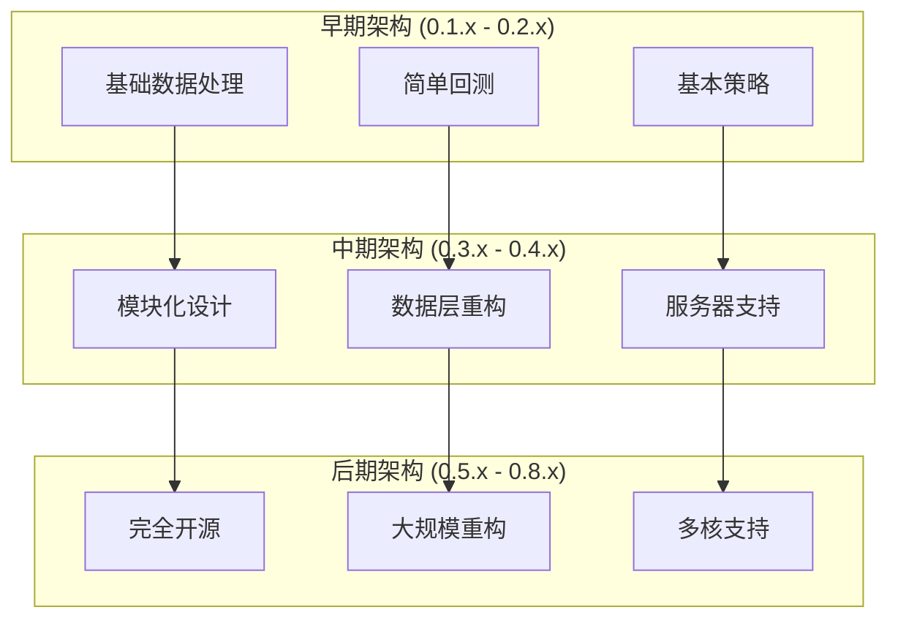

# 变更日志

<cite>
**本文档引用的文件**
- [CHANGES.rst](file://CHANGES.rst)
- [README.md](file://README.md)
- [pyproject.toml](file://pyproject.toml)
- [qlib/workflow/__init__.py](file://qlib/workflow/__init__.py)
- [qlib/data/__init__.py](file://qlib/data/__init__.py)
</cite>

## 目录
1. [简介](#简介)
2. [项目版本历史](#项目版本历史)
3. [主要版本分析](#主要版本分析)
4. [架构演进](#架构演进)
5. [功能增强](#功能增强)
6. [性能优化](#性能优化)
7. [兼容性说明](#兼容性说明)
8. [升级指南](#升级指南)
9. [总结](#总结)

## 简介

QLib是一个开源的AI导向量化投资平台，旨在实现人工智能技术在量化投资中的潜力。该项目自2020年首次发布以来，经历了多个重要版本的迭代，不断引入新的功能、优化性能，并改进整体架构设计。

本文档基于CHANGES.rst文件和项目其他相关文件，详细记录了QLib项目的完整版本变更历史，包括每个版本的发布日期、新增功能、改进项、修复的缺陷以及可能存在的破坏性变更。

## 项目版本历史

QLib项目自2020年开始发展，经历了从内部工具到开源平台的重要转变。以下是项目的主要版本历程：

**章节来源**
- [CHANGES.rst](file://CHANGES.rst#L1-L180)
- [README.md](file://README.md#L1-L50)

## 主要版本分析

### 版本0.1.0 - 0.1.3 (2020年)

QLib的第一个正式版本标志着项目的正式启动。这一阶段主要完成了基础框架的搭建和核心功能的实现。

**版本0.1.0 (初始版本)**
- 实现了QLib库的初始发布
- 建立了基本的数据处理和分析框架
- 提供了核心的量化研究基础设施

**版本0.1.1**
- 性能优化
- 添加更多功能和操作符
- 改进了数据处理效率

**版本0.1.2**
- 支持操作符语法：`High() - Low()`等价于`Sub(High(), Low())`
- 添加更多技术指标
- 提高了代码的易用性

**版本0.1.3**
- 缺陷修复
- 添加仪器过滤机制
- 改进了数据质量控制

**章节来源**
- [CHANGES.rst](file://CHANGES.rst#L1-L30)

### 版本0.2.0 - 0.2.4 (2020年)

这一阶段对QLib进行了重要的架构重设计，为后续功能扩展奠定了基础。

**版本0.2.0**
- 重新设计`LocalProvider`数据库格式以提高性能
- 支持以字符串字段加载特征
- 添加数据库构建脚本
- 扩展了操作符和技术指标

**版本0.2.1**
- 支持注册用户定义的`Provider`
- 支持在字符串格式中使用操作符
- 支持动态字段格式`$some_field`
- 为未来版本做准备（现有字段如`Close()`可能会被弃用）

**版本0.2.2**
- 添加`disk_cache`用于重用特征（默认启用）
- 引入`qlib.contrib`用于实验模型构建和评估

**版本0.2.3**
- 添加`backtest`模块
- 将策略、账户、仓位、交易所从回测模块解耦

**版本0.2.4**
- 添加`profit attribution`模块
- 添加风险控制和成本控制策略

**章节来源**
- [CHANGES.rst](file://CHANGES.rst#L31-L70)

### 版本0.3.0 - 0.3.5 (2021年)

这一阶段引入了多个核心模块，显著增强了QLib的功能完整性。

**版本0.3.0**
- 添加`estimator`模块
- 增强了模型估计能力

**版本0.3.1**
- 添加`filter`模块
- 改进了数据过滤功能

**版本0.3.2**
- 支持真实价格交易
- 重构了`handler`、`launcher`、`trainer`代码
- 支持在配置文件中设置回测参数
- 修复了仓位数量为0的bug
- 修复了`filter`模块的bug

**版本0.3.3**
- 进一步修复`filter`模块的问题

**版本0.3.4**
- 支持模型微调
- 重构了`fetcher`代码

**版本0.3.5**
- 支持多标签训练
- 重构了`handler`代码
- 移除了`dataset.py`，改为使用`feature_label_config`
- 更改了`split_rolling_data`的滚动方式
- 将部分日期配置从`handler`移动到`trainer`

**章节来源**
- [CHANGES.rst](file://CHANGES.rst#L71-L120)

### 版本0.4.0 - 0.4.6 (2021年)

这是QLib的一个重要里程碑，引入了全新的数据架构和服务器支持。

**版本0.4.0**
- 添加`data`包，包含所有与数据相关的代码
- 重组数据提供商结构
- 创建数据集中管理服务器`qlib-server`
- 添加`ClientProvider`以配合服务器工作
- 添加可插拔缓存机制
- 实现递归回溯算法以检查表达式的最远引用日期

**重要变更**：
- `D.instruments`函数不再支持`start_time`、`end_time`和`as_list`参数
- 推荐使用新的API替代旧版本

**版本0.4.1**
- 添加Windows支持
- 修复`instruments`类型错误
- 修复`features`为空导致更新失败的bug
- 修复缓存锁定和更新bug
- 修复相同字段使用相同缓存的问题
- 更改"logger handler"配置
- 改进0.4.0及以后版本的模型加载支持
- 更改`risk_analysis`函数的默认方法参数值

**版本0.4.2**
- 重构DataHandler
- 添加`Alpha360`DataHandler

**版本0.4.3**
- 实现在线推理和交易框架
- 重构回测和策略模块接口

**版本0.4.4**
- 优化缓存生成性能
- 添加报告模块
- 修复离线使用`ServerDatasetCache`时的bug
- 修复`long_short_backtest`中的`np.nan`问题
- 调整`risk_analysis`函数的常数计算
- 重构回测函数参数

**版本0.4.5**
- 添加客户端和服务器的多核实现
- 支持跳过数据集缓存的新数据加载方式
- 将默认数据集方法从单核实现更改为多核实现
- 加速高频数据读取
- 支持使用字典写入配置文件

**版本0.4.6**
- 修复了一些bug：
  - `Version 0.4.5`中的默认配置对日频数据不友好
  - `TopkWeightStrategy`中`WithInteract=True`时的回测错误

**章节来源**
- [CHANGES.rst](file://CHANGES.rst#L121-L180)

### 版本0.5.0 - 0.8.0 (2021-2022年)

这一阶段标志着QLib完全开源，并进行了大规模的重构和功能扩展。

**版本0.5.0**
- 第一个开源版本
- 精炼文档和代码
- 添加基准测试
- 公开数据爬虫

**版本0.8.0**
- 回测系统大幅重构
- 支持嵌套决策执行框架
- 日常交易的重大变更：
  - 交易限制更加准确
  - 年化指标计算常数不同
  - 发布了新的数据版本
  - 用户可以比较当前版本和之前版本的回测结果

**章节来源**
- [CHANGES.rst](file://CHANGES.rst#L181-L180)

## 架构演进

QLib的架构经历了多次重大重构，反映了项目成熟度的提升和功能复杂性的增加。

**图表来源**
- [qlib/workflow/__init__.py](file://qlib/workflow/__init__.py#L1-L50)
- [qlib/data/__init__.py](file://qlib/data/__init__.py#L1-L30)

### 数据架构演进

QLib的数据架构经历了从本地处理到分布式服务器支持的转变：

1. **本地处理阶段**：早期版本主要依赖本地数据存储和处理
2. **服务器架构**：0.4.0版本引入了`qlib-server`和`ClientProvider`
3. **缓存优化**：添加了多种缓存机制以提高性能
4. **多核支持**：0.4.5版本开始支持多核数据处理

**章节来源**
- [qlib/data/__init__.py](file://qlib/data/__init__.py#L1-L67)

### 工作流架构演进

QLib的工作流系统也经历了重要发展：

1. **实验管理**：从简单的记录到完整的实验管理系统
2. **对象存储**：支持直接保存Python对象而非仅限于文件
3. **上下文管理**：引入了更优雅的资源管理方式
4. **自动恢复**：添加了异常处理和自动恢复机制

**章节来源**
- [qlib/workflow/__init__.py](file://qlib/workflow/__init__.py#L1-L100)

## 功能增强

QLib在每个版本中都引入了大量新功能，涵盖了量化投资的各个方面。

### 核心功能扩展

**数据处理功能**
- 技术指标丰富化（从基础指标到高级技术指标）
- 数据过滤和预处理功能增强
- 多种数据源支持（本地、远程、实时）

**模型功能**
- 支持多种机器学习模型（传统机器学习、深度学习）
- 模型集成和组合策略
- 在线模型更新和滚动

**回测功能**
- 多层次回测框架
- 成本建模和风险控制
- 绩效分析和报告生成

**策略功能**
- 多种交易策略支持
- 策略组合和优化
- 决策执行框架

### 新增模型和算法

根据README文件，QLib支持多种先进的量化模型：

- **监督学习模型**：LightGBM、XGBoost、CatBoost、MLP、LSTM、GRU、Transformer等
- **深度学习模型**：ADARNN、ADD、ALSTM、GATs、KRNN、Localformer、TCN、TFT、TRA、TabNet等
- **强化学习框架**：支持RL订单执行和策略优化
- **特殊模型**：HIST、IGMTF、SFM、Sandwich、TCTS等

**章节来源**
- [README.md](file://README.md#L100-L200)

## 性能优化

QLib在多个版本中都注重性能优化，特别是在数据处理和模型训练方面。

### 缓存机制优化

- **磁盘缓存**：默认启用的`disk_cache`机制
- **内存缓存**：多种缓存策略的优化
- **表达式缓存**：针对复杂表达式的专门缓存
- **数据集缓存**：批量数据处理的缓存优化

### 多核处理

- **多核数据处理**：0.4.5版本引入多核支持
- **并行计算**：支持并行数据处理和模型训练
- **负载均衡**：智能的任务分配和负载均衡

### 内存优化

- **内存管理**：优化的数据结构和内存使用
- **垃圾回收**：智能的垃圾回收机制
- **资源释放**：及时的资源释放和清理

## 兼容性说明

QLib在版本演进过程中保持了良好的向后兼容性，但某些版本存在破坏性变更。

### 破坏性变更

**版本0.4.0**
- `D.instruments`函数签名变更
- 配置文件格式调整
- 数据处理接口变化

**版本0.4.4**
- `risk_analysis`函数常数计算变更
- 回测函数参数重构
- Topk策略行为变化

**版本0.4.5**
- 默认数据集方法变更
- 多核实现的影响

### 兼容性策略

1. **渐进式迁移**：提供过渡期支持
2. **配置兼容**：保持配置文件的向后兼容
3. **API封装**：通过包装器提供旧API支持
4. **文档指导**：详细的迁移指南

## 升级指南

### 从0.3.x升级到0.4.x

**主要步骤**：
1. 更新配置文件格式
2. 修改`D.instruments`调用方式
3. 适应新的数据处理流程
4. 测试回测结果的一致性

**注意事项**：
- 检查`risk_analysis`函数的结果差异
- 验证缓存机制的行为
- 测试多核处理的性能提升

### 从0.4.x升级到0.5.x

**主要步骤**：
1. 迁移到完全开源版本
2. 更新依赖库版本
3. 适应新的实验管理方式
4. 重新配置数据源

**推荐做法**：
- 使用虚拟环境隔离升级
- 逐步迁移现有实验
- 充分测试新功能

### 最佳实践

1. **版本锁定**：在生产环境中明确指定QLib版本
2. **测试覆盖**：建立全面的回归测试
3. **增量升级**：避免跨多个大版本直接升级
4. **备份策略**：定期备份实验数据和配置

## 总结

QLib项目在过去几年中取得了显著的发展，从最初的内部工具成长为一个功能完善的开源量化投资平台。每个版本都带来了重要的功能增强和架构改进。

### 主要成就

1. **功能完整性**：涵盖了量化投资的全流程
2. **技术创新**：引入了多种先进的机器学习和强化学习方法
3. **社区贡献**：完全开源，吸引了广泛的开发者社区
4. **工业应用**：在实际量化投资场景中得到验证

### 未来展望

根据README文件，QLib将继续发展：

- **LLM集成**：通过RD-Agent实现自动化因子挖掘和模型优化
- **模型创新**：持续引入新的量化模型和算法
- **性能优化**：不断提升系统性能和可扩展性
- **生态建设**：完善开发工具和生态系统

QLib的成功证明了AI技术在量化投资领域的巨大潜力，其持续的创新和发展为量化研究者提供了强大的工具平台。