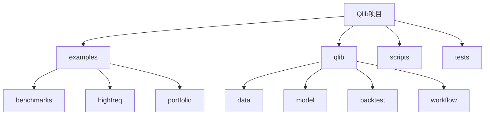
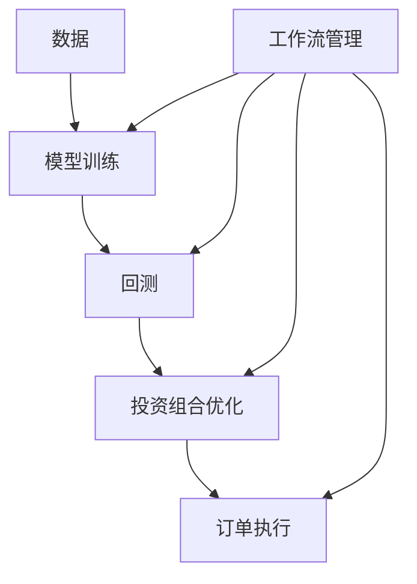
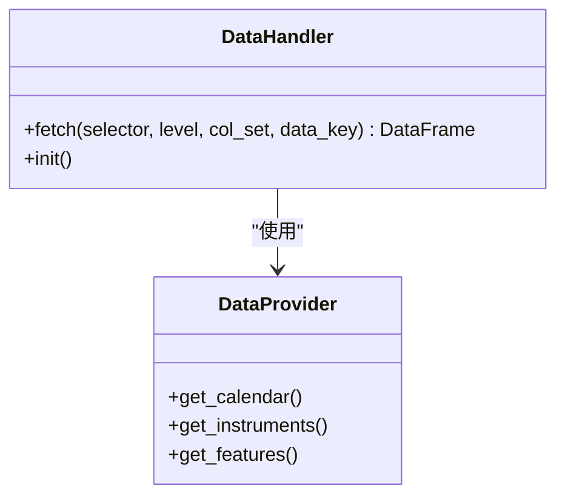
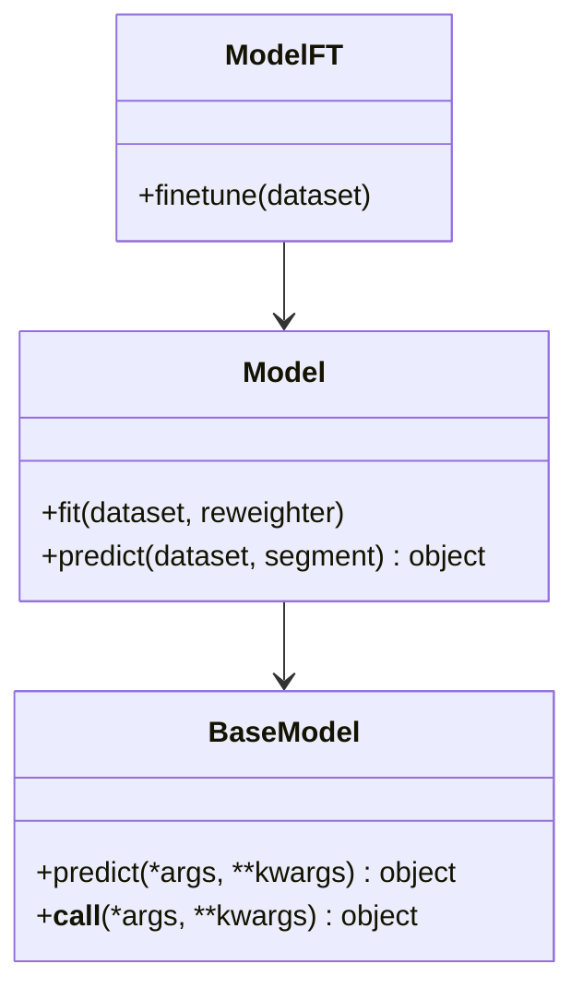
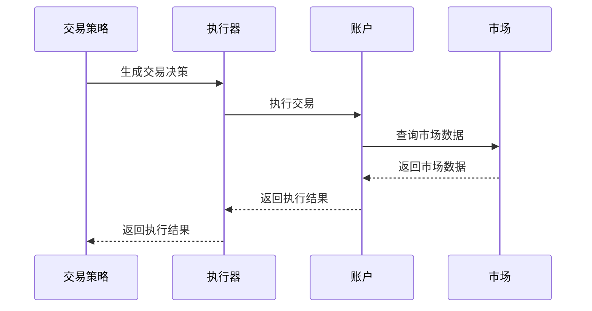
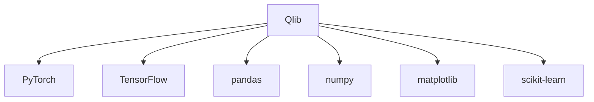

# 项目概述

<cite>
**本文档引用的文件**
- [README.md](file://README.md)
- [qlib/__init__.py](file://qlib/__init__.py)
- [qlib/config.py](file://qlib/config.py)
- [qlib/data/__init__.py](file://qlib/data/__init__.py)
- [qlib/data/dataset/handler.py](file://qlib/data/dataset/handler.py)
- [qlib/data/data.py](file://qlib/data/data.py)
- [qlib/model/base.py](file://qlib/model/base.py)
- [qlib/backtest/backtest.py](file://qlib/backtest/backtest.py)
- [qlib/workflow/exp.py](file://qlib/workflow/exp.py)
- [qlib/contrib/model/catboost_model.py](file://qlib/contrib/model/catboost_model.py)
</cite>

## 目录
1. [简介](#简介)
2. [项目结构](#项目结构)
3. [核心组件](#核心组件)
4. [架构概述](#架构概述)
5. [详细组件分析](#详细组件分析)
6. [依赖分析](#依赖分析)
7. [性能考虑](#性能考虑)
8. [故障排除指南](#故障排除指南)
9. [结论](#结论)

## 简介
Qlib 是一个开源的、面向人工智能的量化投资平台，旨在实现人工智能技术在量化投资中的潜力，赋能研究并创造价值。该平台支持多种机器学习建模范式，包括监督学习、市场动态建模和强化学习。Qlib 包含了完整的机器学习流水线，涵盖数据处理、模型训练和回测，并覆盖了量化投资的整个链条：Alpha 寻找、风险建模、投资组合优化和订单执行。

## 项目结构
Qlib 项目具有清晰的模块化结构，主要分为以下几个部分：
- **examples**: 包含各种基准模型和使用示例
- **qlib**: 核心代码库，包含数据、模型、回测等核心功能
- **scripts**: 数据收集和处理脚本
- **tests**: 测试代码

**图表来源**
- [README.md](file://README.md)

**章节来源**
- [README.md](file://README.md)

## 核心组件
Qlib 的核心组件包括数据处理、模型训练、回测和工作流管理。这些组件设计为松耦合模块，可以独立使用。数据处理模块负责加载和预处理金融数据；模型模块提供多种机器学习算法实现；回测模块模拟交易策略的执行；工作流模块管理整个研究流程。

**章节来源**
- [qlib/__init__.py](file://qlib/__init__.py)
- [qlib/config.py](file://qlib/config.py)

## 架构概述
Qlib 的高层架构设计为支持量化研究的强大基础设施。各组件被设计为松耦合模块，每个组件都可以独立使用。平台提供强大的学习框架，支持多种学习范式（如强化学习、监督学习）和不同层次的模式（如市场动态建模）。通过市场建模，交易策略将生成交易决策并执行。多个交易策略和执行器可以在不同层次或粒度上嵌套以进行优化和共同运行。最后，将提供全面的分析，模型可以以低成本在线服务。

**图表来源**
- [README.md](file://README.md)

**章节来源**
- [README.md](file://README.md)

## 详细组件分析
### 数据处理组件分析
Qlib 的数据处理组件负责管理金融数据的加载、缓存和预处理。它提供了统一的接口来访问不同频率和来源的数据。

**图表来源**
- [qlib/data/dataset/handler.py](file://qlib/data/dataset/handler.py)
- [qlib/data/data.py](file://qlib/data/data.py)

**章节来源**
- [qlib/data/__init__.py](file://qlib/data/__init__.py)
- [qlib/data/dataset/handler.py](file://qlib/data/dataset/handler.py)

### 模型组件分析
Qlib 的模型组件提供了多种机器学习算法的实现，包括传统的机器学习算法和深度学习模型。

**图表来源**
- [qlib/model/base.py](file://qlib/model/base.py)

**章节来源**
- [qlib/model/base.py](file://qlib/model/base.py)

### 回测组件分析
Qlib 的回测组件模拟交易策略的执行过程，评估策略的性能。

**图表来源**
- [qlib/backtest/backtest.py](file://qlib/backtest/backtest.py)

**章节来源**
- [qlib/backtest/backtest.py](file://qlib/backtest/backtest.py)

## 依赖分析
Qlib 项目依赖于多个第三方库，包括机器学习框架（如 PyTorch、TensorFlow）、数据处理库（如 pandas、numpy）和可视化库。这些依赖关系通过 pip 或 conda 进行管理。

**图表来源**
- [README.md](file://README.md)

**章节来源**
- [README.md](file://README.md)

## 性能考虑
Qlib 在设计时充分考虑了性能问题。数据服务器的性能对于数据驱动的方法（如人工智能技术）至关重要。Qlib 提供了数据存储和处理的解决方案，并通过与其他存储解决方案的比较展示了其性能优势。Qlib 数据以紧凑格式存储，便于组合成科学计算所需的数组。

## 故障排除指南
在使用 Qlib 时可能遇到的一些常见问题包括数据加载失败、模型训练中断和回测结果异常。建议首先检查数据路径是否正确，然后确认依赖库版本是否匹配，最后查看日志文件以获取详细错误信息。

**章节来源**
- [README.md](file://README.md)

## 结论
Qlib 作为一个面向人工智能的量化投资平台，提供了完整的机器学习流水线和量化投资的整个链条。其模块化设计使得各个组件可以独立使用，同时也支持复杂的嵌套决策框架。通过持续的功能更新和技术改进，Qlib 正在成为量化投资研究的重要工具。