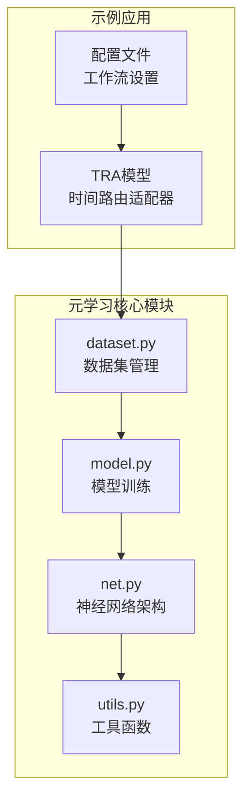
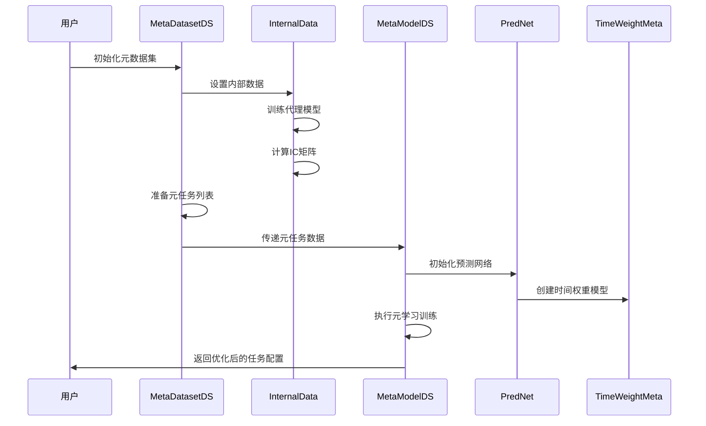
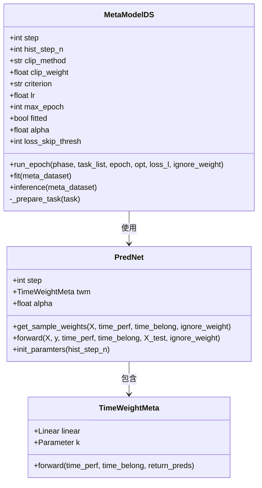
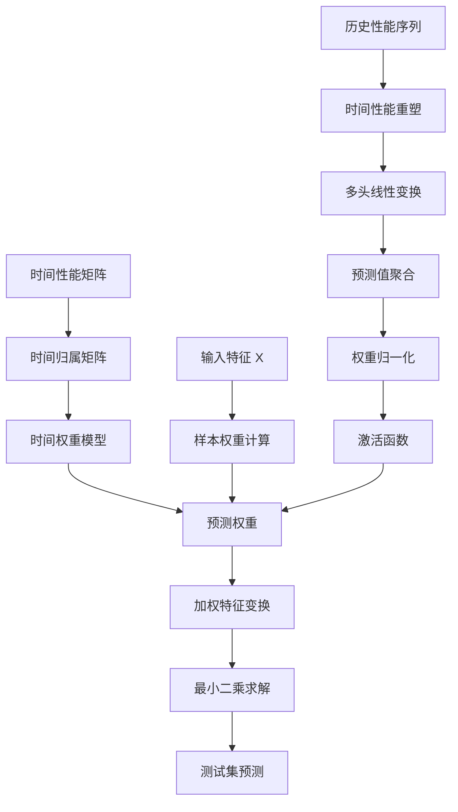
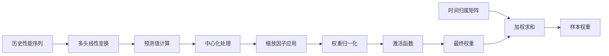
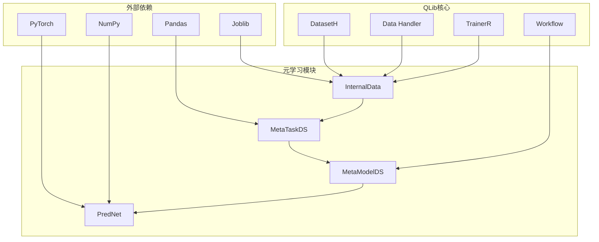

# 元学习功能技术文档

<cite>
**本文档引用的文件**
- [dataset.py](file://qlib/contrib/meta/data_selection/dataset.py)
- [model.py](file://qlib/contrib/meta/data_selection/model.py)
- [net.py](file://qlib/contrib/meta/data_selection/net.py)
- [utils.py](file://qlib/contrib/meta/data_selection/utils.py)
- [__init__.py](file://qlib/contrib/meta/data_selection/__init__.py)
- [dataset.py](file://examples/benchmarks/TRA/src/dataset.py)
- [model.py](file://examples/benchmarks/TRA/src/model.py)
- [workflow_config_tra_Alpha360.yaml](file://examples/benchmarks/TRA/workflow_config_tra_Alpha360.yaml)
</cite>

## 目录
1. [简介](#简介)
2. [项目结构](#项目结构)
3. [核心组件](#核心组件)
4. [架构概览](#架构概览)
5. [详细组件分析](#详细组件分析)
6. [依赖关系分析](#依赖关系分析)
7. [性能考虑](#性能考虑)
8. [故障排除指南](#故障排除指南)
9. [结论](#结论)

## 简介

QLib的元学习功能是一个先进的自动化机器学习框架，专门设计用于解决金融市场的动态数据选择和模型适应问题。该系统通过data_selection子模块实现了任务感知的数据筛选机制，能够根据历史表现智能地选择最优数据集进行模型训练。

元学习的核心思想是"学会学习"，即通过元学习算法自动调整数据选择策略，使模型能够在不同市场环境下保持良好的泛化能力。这种自适应的数据选择机制特别适用于金融市场这种高度动态和非平稳的环境。

## 项目结构

元学习功能主要位于`qlib/contrib/meta/data_selection/`目录下，包含以下关键文件：



**图表来源**
- [dataset.py](file://qlib/contrib/meta/data_selection/dataset.py#L1-L50)
- [model.py](file://qlib/contrib/meta/data_selection/model.py#L1-L50)
- [net.py](file://qlib/contrib/meta/data_selection/net.py#L1-L50)

**章节来源**
- [dataset.py](file://qlib/contrib/meta/data_selection/dataset.py#L1-L417)
- [model.py](file://qlib/contrib/meta/data_selection/model.py#L1-L197)

## 核心组件

### 数据选择子模块

数据选择子模块是元学习系统的核心，负责智能地选择最适合当前市场环境的数据进行模型训练。

#### InternalData类
InternalData类负责内部数据的初始化和预测性能评估：

```python
class InternalData:
    def __init__(self, task_tpl: dict, step: int, exp_name: str):
        self.task_tpl = task_tpl
        self.step = step
        self.exp_name = exp_name
```

该类的主要功能包括：
- **代理模型预测**：为每个数据片段训练代理模型并记录预测结果
- **相似性矩阵计算**：基于IC（Information Coefficient）指标构建数据相似性矩阵
- **滚动任务生成**：根据指定步长生成滚动训练任务

#### MetaTaskDS类
MetaTaskDS类实现了元任务的数据选择逻辑：

```python
class MetaTaskDS(MetaTask):
    """Meta Task for Data Selection"""
    
    def __init__(self, task: dict, meta_info: pd.DataFrame, 
                 mode: str = MetaTask.PROC_MODE_FULL, fill_method="max"):
```

该类的关键特性：
- **时间性能矩阵**：维护历史数据的性能表现矩阵
- **时间归属矩阵**：记录样本属于哪个时间段的数据
- **填充方法**：支持多种缺失值填充策略（最大值、零值等）

**章节来源**
- [dataset.py](file://qlib/contrib/meta/data_selection/dataset.py#L20-L150)
- [dataset.py](file://qlib/contrib/meta/data_selection/dataset.py#L112-L200)

## 架构概览

元学习系统采用分层架构设计，从底层的数据处理到顶层的模型决策形成完整的闭环：



**图表来源**
- [dataset.py](file://qlib/contrib/meta/data_selection/dataset.py#L20-L100)
- [model.py](file://qlib/contrib/meta/data_selection/model.py#L39-L100)
- [net.py](file://qlib/contrib/meta/data_selection/net.py#L1-L50)

## 详细组件分析

### MetaModelDS - 元模型训练器

MetaModelDS是整个元学习系统的核心控制器，负责协调数据选择和模型训练过程：



**图表来源**
- [model.py](file://qlib/contrib/meta/data_selection/model.py#L39-L80)
- [net.py](file://qlib/contrib/meta/data_selection/net.py#L15-L40)

#### 内外循环机制

元学习训练采用经典的内外循环机制：

**内循环（Inner Loop）**：
- 在每个元任务上进行模型训练
- 计算预测损失和IC指标
- 更新梯度并调整模型参数

**外循环（Outer Loop）**：
- 基于内循环的表现更新元模型
- 调整数据选择权重
- 优化整体性能指标

```python
def run_epoch(self, phase, task_list, epoch, opt, loss_l, ignore_weight=False):
    if phase == "train":
        self.tn.train()
        torch.set_grad_enabled(True)
    else:
        self.tn.eval()
        torch.set_grad_enabled(False)
        
    running_loss = 0.0
    pred_y_all = []
    for task in tqdm(task_list, desc=f"{phase} Task", leave=False):
        meta_input = task.get_meta_input()
        pred, weights = self.tn(...)
        # 计算损失并更新梯度
```

**章节来源**
- [model.py](file://qlib/contrib/meta/data_selection/model.py#L80-L150)

### PredNet - 神经网络架构

PredNet实现了基于时间权重的线性回归模型，其核心设计如下：



**图表来源**
- [net.py](file://qlib/contrib/meta/data_selection/net.py#L40-L75)

#### 关键算法实现

PredNet的核心算法包括：

1. **样本权重计算**：
```python
def get_sample_weights(self, X, time_perf, time_belong, ignore_weight=False):
    weights = torch.from_numpy(np.ones(X.shape[0])).float().to(X.device)
    if not ignore_weight:
        if time_perf is not None:
            weights_t = self.twm(time_perf, time_belong)
            weights = weights * weights_t
    return weights
```

2. **前向传播**：
```python
def forward(self, X, y, time_perf, time_belong, X_test, ignore_weight=False):
    weights = self.get_sample_weights(X, time_perf, time_belong, ignore_weight=ignore_weight)
    X_w = X.T * weights.view(1, -1)
    theta = torch.inverse(X_w @ X + self.alpha * torch.eye(X_w.shape[0])) @ X_w @ y
    return X_test @ theta, weights
```

**章节来源**
- [net.py](file://qlib/contrib/meta/data_selection/net.py#L40-L75)

### 时间权重模型

TimeWeightMeta实现了基于历史性能的时间加权机制：



**图表来源**
- [net.py](file://qlib/contrib/meta/data_selection/net.py#L15-L35)

**章节来源**
- [net.py](file://qlib/contrib/meta/data_selection/net.py#L15-L35)

### 损失函数设计

系统实现了专门针对金融数据的IC损失函数：

```python
class ICLoss(nn.Module):
    def __init__(self, skip_size=50):
        super().__init__()
        self.skip_size = skip_size

    def forward(self, pred, y, idx):
        # 按日期分组计算IC值
        # 跳过样本量不足或标准差过小的日期
        # 计算平均IC损失
        ic_mean = ic_all / (len(diff_point) - 1 - skip_n)
        return -ic_mean  # IC损失取负值
```

**章节来源**
- [utils.py](file://qlib/contrib/meta/data_selection/utils.py#L10-L70)

## 依赖关系分析

元学习系统的依赖关系呈现清晰的层次结构：



**图表来源**
- [dataset.py](file://qlib/contrib/meta/data_selection/dataset.py#L1-L20)
- [model.py](file://qlib/contrib/meta/data_selection/model.py#L1-L20)

**章节来源**
- [dataset.py](file://qlib/contrib/meta/data_selection/dataset.py#L1-L20)
- [model.py](file://qlib/contrib/meta/data_selection/model.py#L1-L20)

## 性能考虑

### 计算开销分析

元学习系统在性能方面需要平衡准确性和效率：

1. **内存使用**：
   - 内部数据缓存占用大量内存
   - 时间性能矩阵存储历史数据的IC值
   - 预测权重矩阵需要额外存储空间

2. **计算复杂度**：
   - 内部数据初始化：O(N×M)，其中N是数据点数，M是代理模型数量
   - 元学习训练：O(E×T×B)，其中E是训练轮数，T是任务数量，B是批次大小
   - 推理阶段：O(T×D)，其中D是测试数据点数

3. **优化策略**：
   - 使用并行计算加速代理模型训练
   - 实现增量更新避免重复计算
   - 采用近似算法减少计算复杂度

### 收益评估

元学习在动态市场环境中的优势：

1. **适应性增强**：能够快速适应市场变化
2. **数据利用效率**：智能选择高质量数据
3. **泛化能力**：提高模型在新环境下的表现
4. **风险管理**：通过数据选择降低过拟合风险

## 故障排除指南

### 常见问题及解决方案

1. **内存不足错误**：
   - 减少历史步数（hist_step_n）
   - 降低代理模型数量
   - 使用更高效的填充方法

2. **训练收敛困难**：
   - 调整学习率参数
   - 增加正则化强度（alpha值）
   - 检查数据质量

3. **IC损失计算异常**：
   - 增加skip_size阈值
   - 检查数据分布是否正常
   - 验证标签数据质量

**章节来源**
- [utils.py](file://qlib/contrib/meta/data_selection/utils.py#L70-L119)

## 结论

QLib的元学习功能通过data_selection子模块实现了先进的自动化数据选择和模型适应机制。该系统的核心优势在于：

1. **智能化数据选择**：基于历史表现的IC指标实现数据质量评估
2. **自适应学习机制**：通过内外循环实现元学习训练
3. **高效神经网络架构**：PredNet结合时间权重模型实现快速推理
4. **金融领域专用**：专门针对金融市场特点设计的损失函数和权重机制

该系统特别适用于需要在动态市场环境中保持良好性能的量化投资场景，能够显著提升模型的泛化能力和风险管理水平。通过合理的配置和调优，可以在保证计算效率的同时获得优异的预测效果。