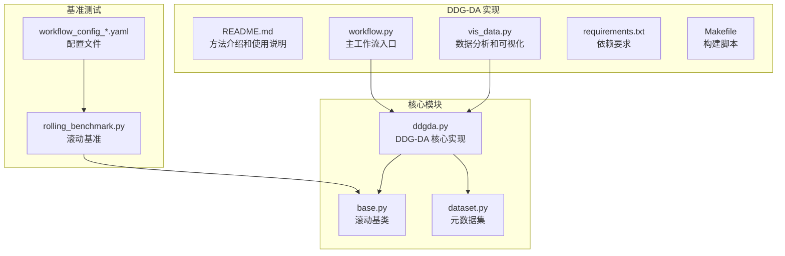
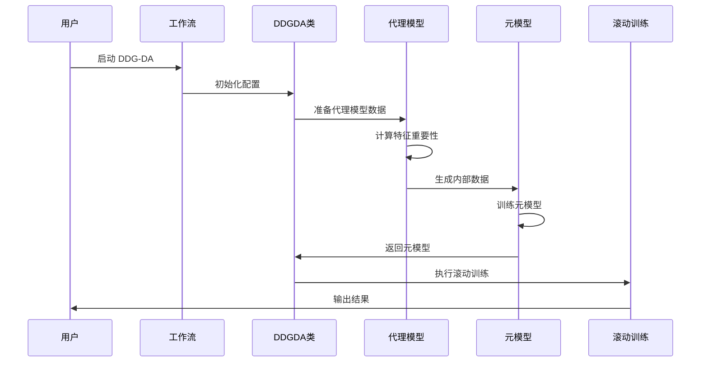
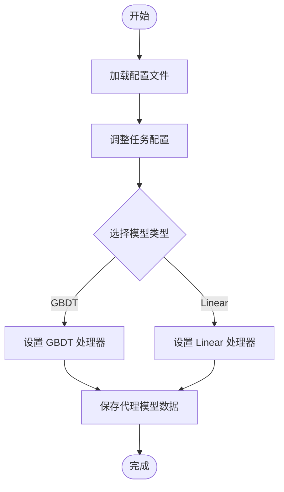
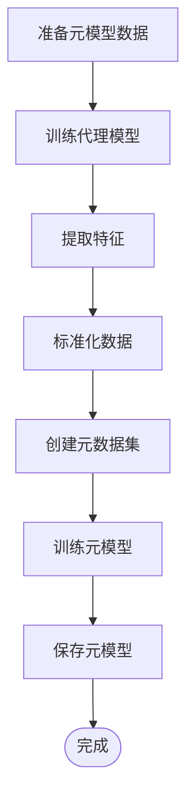
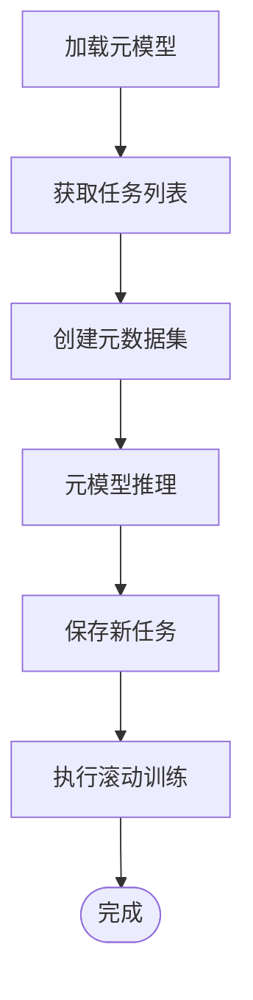
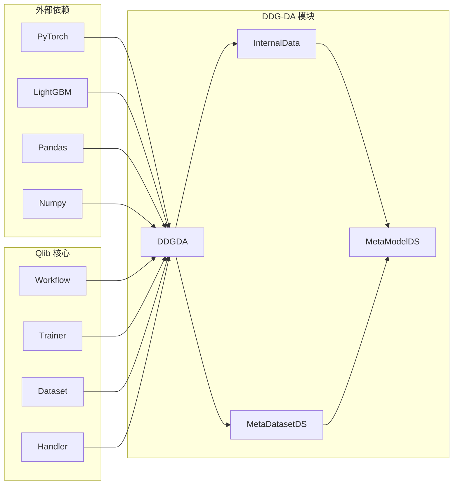

# 动态市场适应

<cite>
**本文档引用的文件**
- [README.md](file://examples/benchmarks_dynamic/DDG-DA/README.md)
- [workflow.py](file://examples/benchmarks_dynamic/DDG-DA/workflow.py)
- [ddgda.py](file://qlib/contrib/rolling/ddgda.py)
- [base.py](file://qlib/contrib/rolling/base.py)
- [dataset.py](file://qlib/contrib/meta/data_selection/dataset.py)
- [rolling_benchmark.py](file://examples/benchmarks_dynamic/baseline/rolling_benchmark.py)
- [workflow_config_linear_Alpha158.yaml](file://examples/benchmarks_dynamic/baseline/workflow_config_linear_Alpha158.yaml)
- [workflow_config_lightgbm_Alpha158.yaml](file://examples/benchmarks_dynamic/baseline/workflow_config_lightgbm_Alpha158.yaml)
- [vis_data.py](file://examples/benchmarks_dynamic/DDG-DA/vis_data.py)
</cite>

## 目录
1. [简介](#简介)
2. [项目结构](#项目结构)
3. [核心组件](#核心组件)
4. [架构概览](#架构概览)
5. [详细组件分析](#详细组件分析)
6. [依赖关系分析](#依赖关系分析)
7. [性能考虑](#性能考虑)
8. [故障排除指南](#故障排除指南)
9. [结论](#结论)

## 简介

DDG-DA（Data Distribution Generation for Predictable Concept Drift Adaptation）是 Qlib 中实现的一种先进的动态市场适应方法。该方法专门设计用于处理金融市场中不可预测的概念漂移（concept drift），通过预测数据分布的未来演变来提高模型性能。

### 核心原理

DDG-DA 方法的核心思想是：
1. **预测未来数据分布**：首先训练一个预测器来估计未来的数据分布
2. **生成训练样本**：利用预测器生成训练样本
3. **模型训练**：在生成的数据上训练模型

这种方法特别适用于金融市场环境，其中市场结构会随着时间发生变化，而这些变化往往具有可预测性。

### 主要优势

- **提前适应市场变化**：能够预测并适应市场的未来变化
- **减少概念漂移的影响**：通过预测漂移趋势来减轻其负面影响
- **提高模型性能**：在测试阶段可以看到代理模型的 IC 值和预测模型性能的上升趋势

## 项目结构



**图表来源**
- [workflow.py](file://examples/benchmarks_dynamic/DDG-DA/workflow.py#L1-L46)
- [ddgda.py](file://qlib/contrib/rolling/ddgda.py#L1-L388)
- [base.py](file://qlib/contrib/rolling/base.py#L1-L265)

**章节来源**
- [README.md](file://examples/benchmarks_dynamic/DDG-DA/README.md#L1-L36)
- [workflow.py](file://examples/benchmarks_dynamic/DDG-DA/workflow.py#L1-L46)

## 核心组件

### DDGDA 类

DDGDA 类是整个动态市场适应系统的核心，继承自 Rolling 基类，提供了完整的 DDG-DA 实现。

```python
class DDGDA(Rolling):
    """
    基于 DDG-DA 的滚动实现
    
    注意事项：
    在运行示例之前，请使用以下命令清理之前的实验结果：
    - `rm -r mlruns`
    """
```

### 关键参数配置

DDGDA 类支持多种配置参数：

- **sim_task_model**: 用于计算数据相似性的模型类型（"linear" 或 "gbdt"）
- **meta_1st_train_end**: 第一次元任务训练结束的时间
- **alpha**: Ridge 回归的 L2 正则化参数
- **loss_skip_thresh**: 每天跳过损失计算的阈值
- **fea_imp_n**: 特征重要性选择的数量
- **meta_data_proc**: 元数据处理方式
- **segments**: 训练数据比例或分割点
- **hist_step_n**: 历史步数数量
- **working_dir**: 工作目录

**章节来源**
- [ddgda.py](file://qlib/contrib/rolling/ddgda.py#L70-L150)

## 架构概览



**图表来源**
- [ddgda.py](file://qlib/contrib/rolling/ddgda.py#L370-L388)
- [workflow.py](file://examples/benchmarks_dynamic/DDG-DA/workflow.py#L1-L46)

## 详细组件分析

### 数据准备阶段



**图表来源**
- [ddgda.py](file://qlib/contrib/rolling/ddgda.py#L150-L200)

#### 特征重要性计算

DDGDA 使用 LightGBM 模型来计算特征重要性：

```python
def _get_feature_importance(self):
    # 必须使用 LightGBM，因为它需要获取特征重要性
    task = self.basic_task(enable_handler_cache=False)
    task = self._adjust_task(task, astype="gbdt")
    task = replace_task_handler_with_cache(task, self.working_dir)
    
    with R.start(experiment_name="feature_importance"):
        model = init_instance_by_config(task["model"])
        dataset = init_instance_by_config(task["dataset"])
        model.fit(dataset)
    
    fi = model.get_feature_importance()
    # 处理特征重要性数据
    df = dataset.prepare(segments=slice(None), col_set="feature", data_key=DataHandlerLP.DK_R)
    cols = df.columns
    fi_named = {cols[int(k.split("_")[1])]: imp for k, imp in fi.to_dict().items()}
    
    return pd.Series(fi_named)
```

### 元模型训练阶段



**图表来源**
- [ddgda.py](file://qlib/contrib/rolling/ddgda.py#L200-L300)

#### 内部数据处理

元模型使用 InternalData 类来处理内部数据：

```python
class InternalData:
    def __init__(self, task_tpl: dict, step: int, exp_name: str):
        self.task_tpl = task_tpl
        self.step = step
        self.exp_name = exp_name
    
    def setup(self, trainer=TrainerR, trainer_kwargs={}):
        """
        设置内部数据，完成后 self.data_ic_df 将被设置
        每列代表一个数据，每行代表该数据的性能时间戳
        """
        # 准备代理模型的预测
        perf_task_tpl = deepcopy(self.task_tpl)
        perf_task_tpl["record"] = ["qlib.workflow.record_temp.SignalRecord"]
        
        # 训练新模型
        trainer = auto_filter_kwargs(trainer)(experiment_name=self.exp_name, **trainer_kwargs)
        trainer.train(gen_task)
        
        # 提取相似性矩阵
        recorders = R.list_recorders(experiment_name=self.exp_name)
        ic_l = []
        for _, rec in tqdm(recorders.items(), desc="calc"):
            pred = rec.load_object("pred.pkl")
            task = rec.load_object("task")
            data_key = task["dataset"]["kwargs"]["segments"]["train"]
            ic_l.append(delayed(self._calc_perf)(pred.iloc[:, 0], label_df.iloc[:, 0]))
        
        ic_l = Parallel(n_jobs=-1)(ic_l)
        self.data_ic_df = pd.DataFrame(dict(zip(key_l, ic_l)))
        self.data_ic_df = self.data_ic_df.sort_index().sort_index(axis=1)
```

### 滚动训练阶段



**图表来源**
- [ddgda.py](file://qlib/contrib/rolling/ddgda.py#L300-L370)

**章节来源**
- [ddgda.py](file://qlib/contrib/rolling/ddgda.py#L150-L388)

## 依赖关系分析



**图表来源**
- [ddgda.py](file://qlib/contrib/rolling/ddgda.py#L1-L20)
- [README.md](file://examples/benchmarks_dynamic/DDG-DA/README.md#L30-L36)

### 核心依赖项

1. **PyTorch**: 用于深度学习模型的训练和推理
2. **LightGBM**: 用于梯度提升决策树模型
3. **Pandas/Numpy**: 数据处理和分析
4. **Qlib Workflow**: 整个工作流程的管理
5. **Meta Controller**: 元控制器组件

**章节来源**
- [README.md](file://examples/benchmarks_dynamic/DDG-DA/README.md#L30-L36)

## 性能考虑

### 计算资源需求

根据 README 文档，DDG-DA 的最小硬件要求如下：

- **内存**: 45GB
- **磁盘空间**: 4GB
- **CPU**: PyTorch CPU 和 RAM 足以运行此示例

### 性能优化策略

1. **特征选择**: 通过特征重要性筛选关键特征
2. **数据缓存**: 使用缓存机制减少重复数据处理
3. **并行计算**: 利用多线程进行特征重要性计算
4. **内存管理**: 及时释放不需要的大型对象

### 与传统滚动策略的对比

| 特性 | 传统滚动策略 | DDG-DA |
|------|-------------|---------|
| **适应能力** | 基于历史数据 | 预测未来变化 |
| **计算复杂度** | 较低 | 较高 |
| **准确性** | 一般 | 更高 |
| **实时性** | 较差 | 较好 |
| **资源需求** | 低 | 高 |

## 故障排除指南

### 常见问题及解决方案

#### 1. 过拟合问题

**症状**: 模型在训练集上表现良好，但在测试集上表现不佳

**解决方案**:
- 调整正则化参数 `alpha`
- 增加训练数据量
- 使用早停机制

```python
# 在初始化时调整 alpha 参数
ddgda = DDGDA(alpha=0.01, loss_skip_thresh=50)
```

#### 2. 延迟响应

**症状**: 模型对市场变化反应滞后

**解决方案**:
- 减少历史步数 `hist_step_n`
- 缩短滚动步长 `step`
- 增加特征重要性筛选数量 `fea_imp_n`

#### 3. 内存不足

**症状**: 计算过程中出现内存溢出错误

**解决方案**:
- 减少批次大小
- 使用更小的特征子集
- 定期清理中间结果

#### 4. 训练不稳定

**症状**: 模型训练过程不收敛或波动剧烈

**解决方案**:
- 调整学习率
- 增加训练轮数
- 使用更好的初始化策略

### 参数调优建议

1. **特征重要性筛选**: `fea_imp_n=30`（默认值）
2. **正则化强度**: `alpha=0.01`（默认值）
3. **历史步数**: `hist_step_n=30`（默认值）
4. **损失跳过阈值**: `loss_skip_thresh=50`（默认值）

### 配置示例

#### 使用 Linear 模型

```bash
python workflow.py run
```

#### 使用 LightGBM 模型

```bash
python workflow.py --conf_path=../workflow_config_lightgbm_Alpha158.yaml run
```

**章节来源**
- [README.md](file://examples/benchmarks_dynamic/DDG-DA/README.md#L15-L30)
- [workflow.py](file://examples/benchmarks_dynamic/DDG-DA/workflow.py#L20-L40)

## 结论

DDG-DA 是一种创新的动态市场适应方法，它通过预测数据分布的未来演变来提高金融模型的性能。该方法的主要优势包括：

1. **前瞻性适应**: 能够预测并适应市场的未来变化
2. **性能提升**: 在测试阶段可以看到 IC 值和模型性能的上升趋势
3. **灵活配置**: 支持多种模型类型和参数配置
4. **完整集成**: 与 Qlib 的工作流程无缝集成

### 应用场景

- **高频交易**: 适应快速变化的市场条件
- **投资组合管理**: 动态调整资产配置
- **风险管理**: 预测潜在的风险因素
- **策略开发**: 开发适应性强的投资策略

### 未来发展方向

1. **扩展到其他领域**: 将 DDG-DA 应用到其他类型的金融市场
2. **算法优化**: 改进预测算法和模型训练效率
3. **实时应用**: 开发实时市场适应系统
4. **多市场适配**: 支持多个市场的协同适应

DDG-DA 为金融市场的动态适应提供了一个强大的工具，通过其独特的预测机制，能够在不断变化的市场环境中保持模型的有效性和准确性。