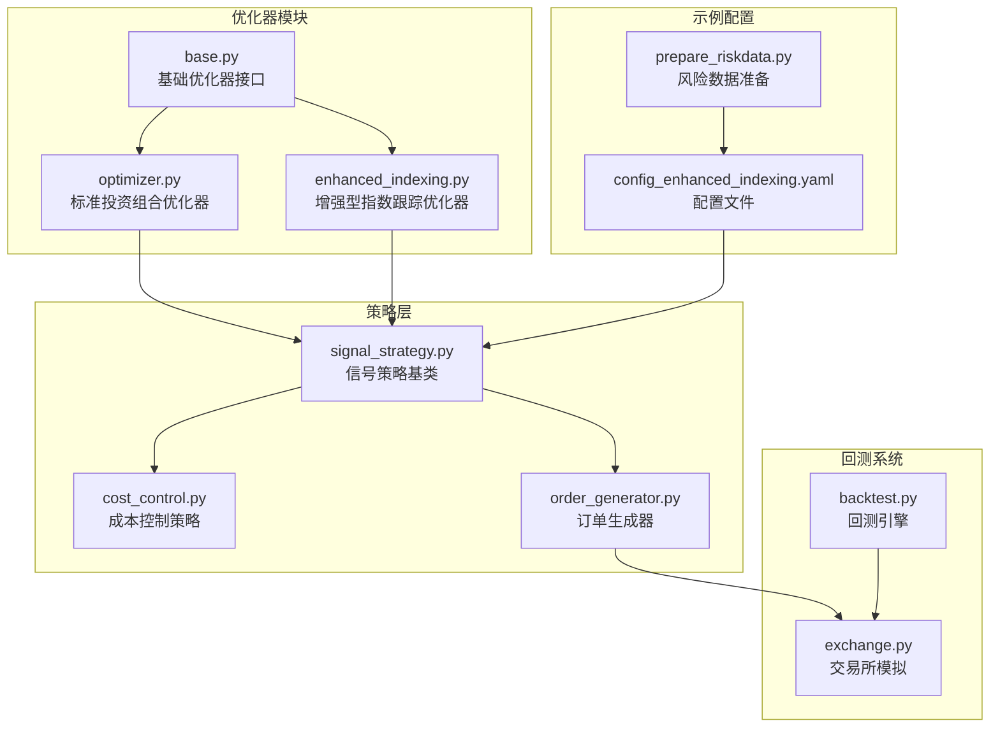
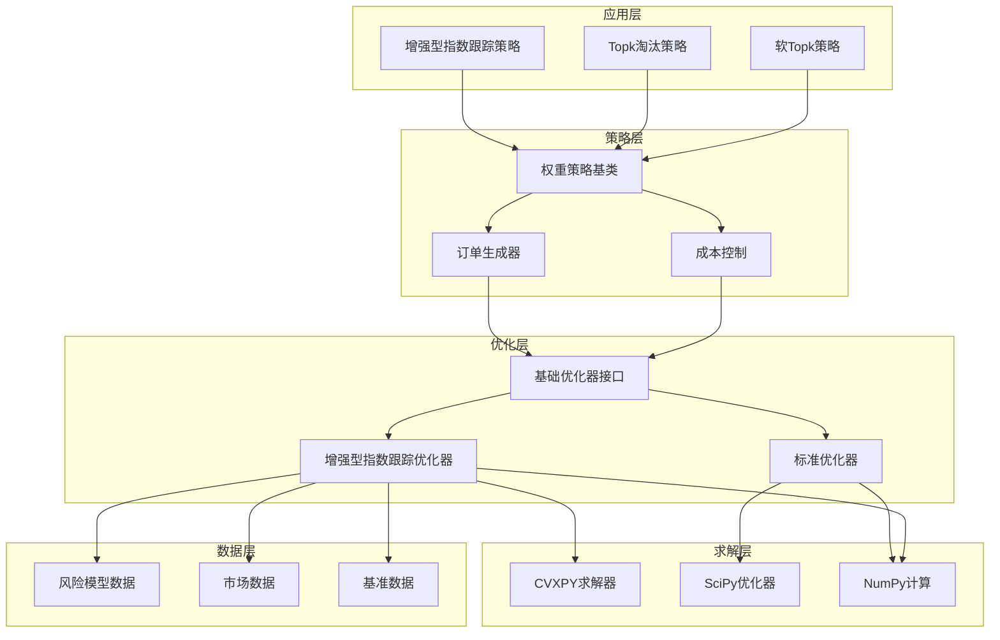
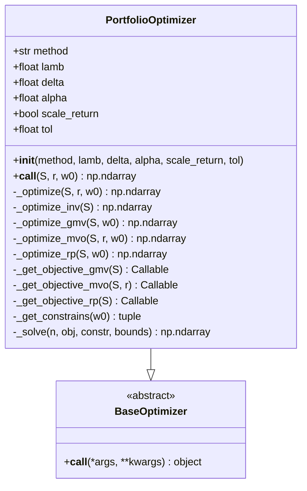
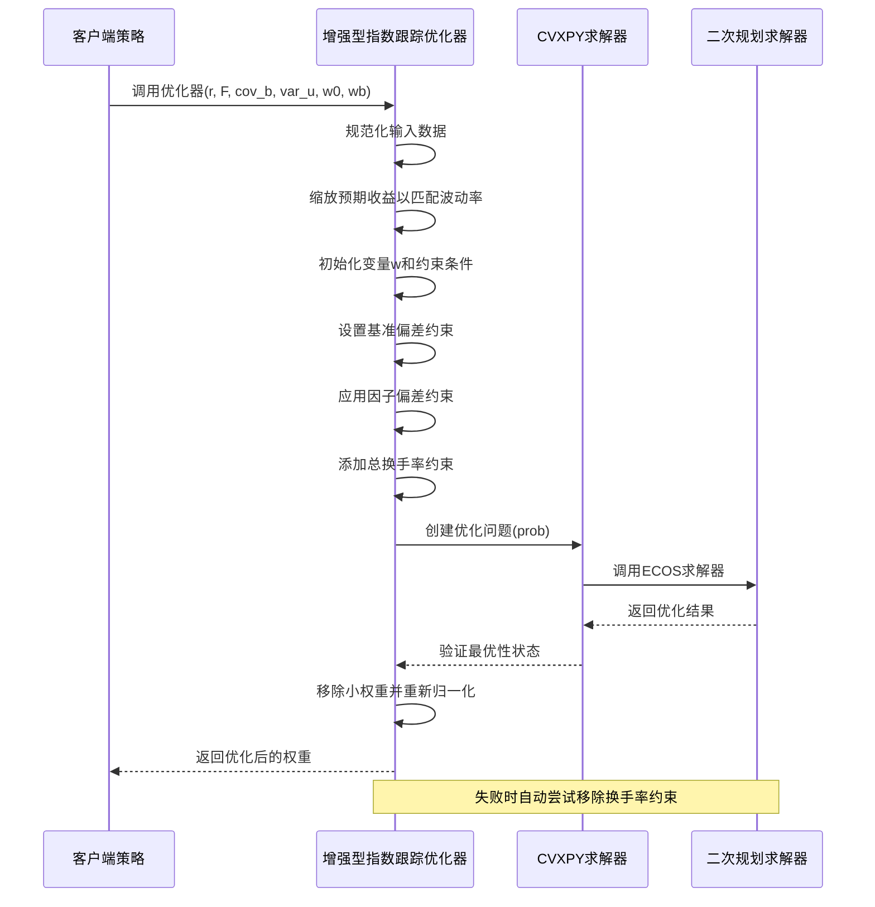
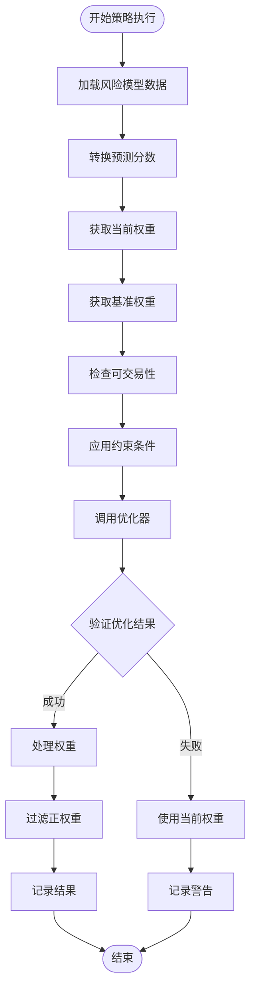
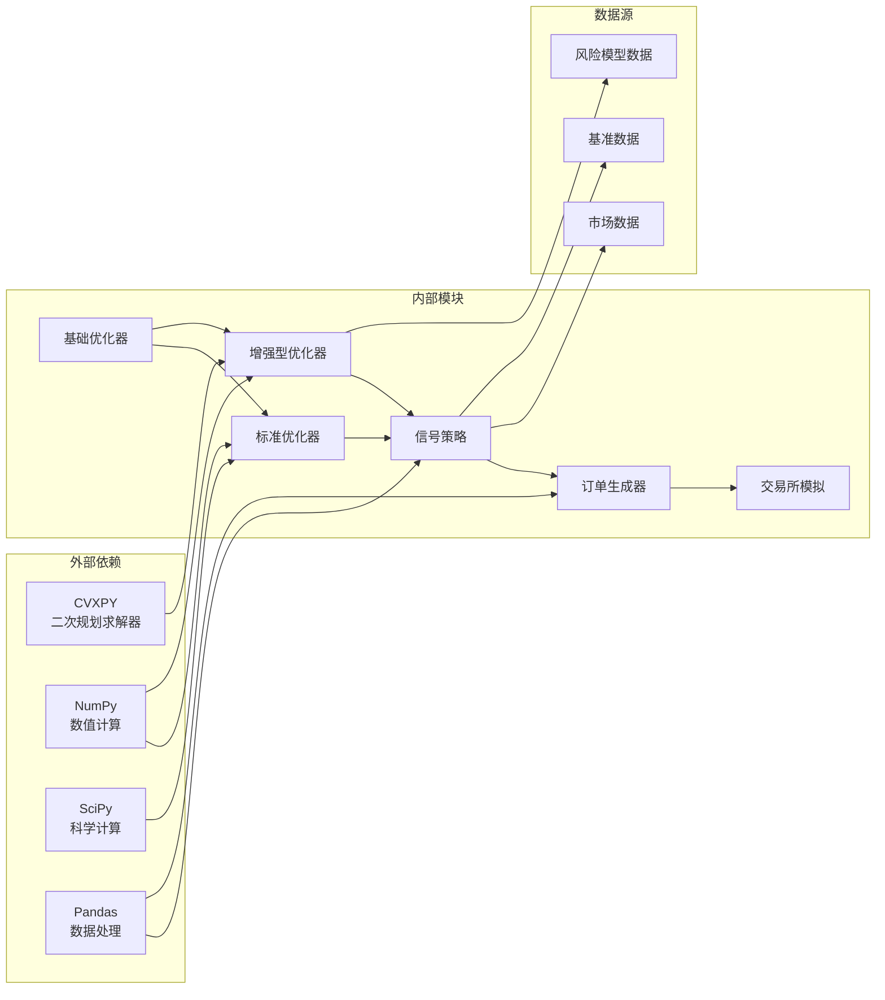

# 投资组合优化

<cite>
**本文档中引用的文件**
- [base.py](file://qlib/contrib/strategy/optimizer/base.py)
- [optimizer.py](file://qlib/contrib/strategy/optimizer/optimizer.py)
- [enhanced_indexing.py](file://qlib/contrib/strategy/optimizer/enhanced_indexing.py)
- [__init__.py](file://qlib/contrib/strategy/optimizer/__init__.py)
- [signal_strategy.py](file://qlib/contrib/strategy/signal_strategy.py)
- [cost_control.py](file://qlib/contrib/strategy/cost_control.py)
- [order_generator.py](file://qlib/contrib/strategy/order_generator.py)
- [backtest.py](file://qlib/backtest/backtest.py)
- [exchange.py](file://qlib/backtest/exchange.py)
- [config_enhanced_indexing.yaml](file://examples/portfolio/config_enhanced_indexing.yaml)
- [prepare_riskdata.py](file://examples/portfolio/prepare_riskdata.py)
- [README.md](file://examples/portfolio/README.md)
</cite>

## 目录
1. [简介](#简介)
2. [项目结构](#项目结构)
3. [核心组件](#核心组件)
4. [架构概览](#架构概览)
5. [详细组件分析](#详细组件分析)
6. [依赖关系分析](#依赖关系分析)
7. [性能考虑](#性能考虑)
8. [故障排除指南](#故障排除指南)
9. [结论](#结论)

## 简介

QLib的投资组合优化系统是一个强大的金融建模框架，专门设计用于处理复杂的资产配置问题。该系统提供了多种优化算法，包括全局最小方差组合、均值-方差优化组合、风险平价组合和反波动率组合。特别地，增强型指数跟踪（Enhanced Indexing）功能允许投资者在跟踪基准指数的同时追求超额收益。

该系统的核心优势在于其模块化设计，支持灵活的约束条件配置、目标函数设定，并与回测系统无缝集成。通过CVXPY等现代优化库的支持，系统能够处理复杂的数学规划问题，同时提供数值稳定性和高效的求解策略。

## 项目结构

QLib的投资组合优化功能主要位于`qlib/contrib/strategy/optimizer/`目录下，包含以下关键文件：



**图表来源**
- [base.py](file://qlib/contrib/strategy/optimizer/base.py#L1-L13)
- [optimizer.py](file://qlib/contrib/strategy/optimizer/optimizer.py#L1-L50)
- [enhanced_indexing.py](file://qlib/contrib/strategy/optimizer/enhanced_indexing.py#L1-L50)

**章节来源**
- [__init__.py](file://qlib/contrib/strategy/optimizer/__init__.py#L1-L8)
- [README.md](file://examples/portfolio/README.md#L1-L48)

## 核心组件

### 基础优化器接口

所有优化器都继承自`BaseOptimizer`抽象基类，该类定义了统一的接口规范：

```python
class BaseOptimizer(abc.ABC):
    """基于优化方法构建投资组合的构造器"""
    
    @abc.abstractmethod
    def __call__(self, *args, **kwargs) -> object:
        """生成优化后的投资组合分配"""
```

这种设计确保了不同类型的优化器具有相同的调用接口，便于在策略中灵活切换不同的优化算法。

### 标准投资组合优化器

`PortfolioOptimizer`类实现了四种主流的投资组合优化算法：

1. **全局最小方差组合（GMV）**：最小化投资组合的整体风险
2. **均值-方差优化组合（MVO）**：在预期收益和风险之间进行权衡
3. **风险平价组合（RP）**：使每个资产对总风险的贡献相等
4. **反波动率组合（INV）**：按资产的反波动率分配权重

每种算法都有其特定的应用场景和数学模型，用户可以根据具体需求选择合适的优化策略。

### 增强型指数跟踪优化器

`EnhancedIndexingOptimizer`是专门为增强型指数跟踪场景设计的高级优化器。它结合了主动管理的艺术和被动管理的优势，旨在超越基准指数的表现，同时控制风险暴露（即跟踪误差）。

该优化器采用先进的数学规划技术，能够处理复杂的约束条件，包括：
- 基准偏离限制
- 因子偏离限制
- 总换手率限制
- 强制持有和强制卖出约束

**章节来源**
- [base.py](file://qlib/contrib/strategy/optimizer/base.py#L1-L13)
- [optimizer.py](file://qlib/contrib/strategy/optimizer/optimizer.py#L1-L100)
- [enhanced_indexing.py](file://qlib/contrib/strategy/optimizer/enhanced_indexing.py#L1-L100)

## 架构概览

QLib的投资组合优化系统采用了分层架构设计，从底层的基础优化算法到上层的策略应用，形成了完整的优化生态系统：



**图表来源**
- [signal_strategy.py](file://qlib/contrib/strategy/signal_strategy.py#L1-L50)
- [order_generator.py](file://qlib/contrib/strategy/order_generator.py#L1-L50)
- [enhanced_indexing.py](file://qlib/contrib/strategy/optimizer/enhanced_indexing.py#L1-L100)

## 详细组件分析

### PortfolioOptimizer 详细分析

`PortfolioOptimizer`类是QLib中最基础的投资组合优化器，提供了四种标准的优化算法：



**图表来源**
- [optimizer.py](file://qlib/contrib/strategy/optimizer/optimizer.py#L15-L100)

#### 优化算法详解

1. **反波动率优化（INV）**
   - 基于资产的反波动率分配权重
   - 计算公式：`w = 1 / √diag(S)`，其中S为协方差矩阵
   - 适用于波动率较低的资产

2. **全局最小方差优化（GMV）**
   - 最小化投资组合的总体风险
   - 数学模型：`min_w w' S w`，约束条件：`w ≥ 0, sum(w) = 1`
   - 适合风险厌恶型投资者

3. **均值-方差优化（MVO）**
   - 在预期收益和风险之间进行权衡
   - 数学模型：`min_w -w' r + λw' S w`
   - 参数λ控制风险厌恶程度

4. **风险平价优化（RP）**
   - 使每个资产对总风险的贡献相等
   - 数学模型：`min_w Σ_i [w_i - (w' S w) / ((S w)_i * N)]^2`
   - 平衡不同资产的风险贡献

**章节来源**
- [optimizer.py](file://qlib/contrib/strategy/optimizer/optimizer.py#L15-L200)

### EnhancedIndexingOptimizer 详细分析

`EnhancedIndexingOptimizer`是QLib中最为复杂和强大的优化器，专为增强型指数跟踪场景设计：



**图表来源**
- [enhanced_indexing.py](file://qlib/contrib/strategy/optimizer/enhanced_indexing.py#L80-L200)

#### 数学模型解析

增强型指数跟踪的核心优化问题是最大化超额收益减去风险惩罚：

```
max_w d'r - λ(v'cov_b*v + var_u*d²)
s.t. w ≥ 0
     sum(w) = 1
     sum(|w - w₀|) ≤ δ
     -b_dev ≤ d ≤ b_dev
     -f_dev ≤ v ≤ f_dev
```

其中：
- `d = w - wb`：相对于基准的权重偏差
- `v = d@F`：相对于基准的因子暴露偏差
- `λ`：风险厌恶参数
- `δ`：总换手率限制
- `b_dev`：基准偏差限制
- `f_dev`：因子偏差限制

#### 约束条件详解

1. **权重非负约束**：确保没有卖空操作
2. **全投资约束**：确保权重总和为1
3. **换手率约束**：限制交易频率和成本
4. **基准偏差约束**：控制与基准的偏离程度
5. **因子偏差约束**：控制因子暴露的偏离
6. **强制持有约束**：保护当前持仓不被强制卖出
7. **强制卖出约束**：禁止某些特定股票的买入

**章节来源**
- [enhanced_indexing.py](file://qlib/contrib/strategy/optimizer/enhanced_indexing.py#L1-L203)

### 策略集成分析

#### 增强型指数跟踪策略

`EnhancedIndexingStrategy`是连接优化器和回测系统的桥梁：



**图表来源**
- [signal_strategy.py](file://qlib/contrib/strategy/signal_strategy.py#L400-L523)

#### 成本控制机制

QLib提供了多层次的成本控制机制：

1. **交易成本模型**：包括买卖手续费、最小成本限制
2. **市场冲击成本**：考虑大额交易对市场价格的影响
3. **滑点控制**：通过影响成本率来模拟流动性风险
4. **预算分配**：动态调整投资金额以适应市场条件

**章节来源**
- [signal_strategy.py](file://qlib/contrib/strategy/signal_strategy.py#L400-L523)
- [cost_control.py](file://qlib/contrib/strategy/cost_control.py#L1-L102)

## 依赖关系分析

QLib投资组合优化系统的依赖关系呈现清晰的层次结构：



**图表来源**
- [optimizer.py](file://qlib/contrib/strategy/optimizer/optimizer.py#L1-L15)
- [enhanced_indexing.py](file://qlib/contrib/strategy/optimizer/enhanced_indexing.py#L1-L15)

### 关键依赖说明

1. **CVXPY**：用于求解复杂的二次规划问题，特别是增强型指数跟踪场景
2. **NumPy/SciPy**：提供基础的数值计算能力，支持各种优化算法
3. **Pandas**：处理时间序列数据和金融数据结构
4. **风险模型数据**：提供因子暴露、因子协方差和特异性风险信息
5. **市场数据**：包括价格、成交量等实时市场信息

**章节来源**
- [optimizer.py](file://qlib/contrib/strategy/optimizer/optimizer.py#L1-L20)
- [enhanced_indexing.py](file://qlib/contrib/strategy/optimizer/enhanced_indexing.py#L1-L10)

## 性能考虑

### 数值稳定性

QLib的投资组合优化系统在设计时充分考虑了数值稳定性：

1. **输入数据规范化**：自动处理缺失值和异常值
2. **约束条件验证**：确保所有约束条件合理且可满足
3. **求解器容错**：当主求解器失败时自动尝试备用方案
4. **结果后处理**：去除小数值权重，避免浮点数精度问题

### 求解效率

1. **缓存机制**：缓存已计算的风险模型数据，避免重复计算
2. **稀疏矩阵优化**：利用稀疏矩阵特性提高计算效率
3. **并行计算**：支持多线程并行处理大规模优化问题
4. **增量更新**：只更新发生变化的数据部分

### 实际交易成本控制

1. **交易成本建模**：精确模拟真实市场的交易成本
2. **滑点估计**：通过影响成本率来模拟流动性风险
3. **批量交易**：合并小额交易以降低平均成本
4. **时间窗口优化**：考虑交易执行的时间窗口效应

## 故障排除指南

### 常见问题及解决方案

1. **优化失败**
   - 检查约束条件是否过于严格
   - 验证输入数据的质量和完整性
   - 尝试调整求解器参数

2. **数值不稳定**
   - 规范化输入数据
   - 检查协方差矩阵的正定性
   - 使用更稳定的求解器设置

3. **性能问题**
   - 减少优化频率
   - 使用缓存机制
   - 优化数据存储格式

4. **回测结果异常**
   - 检查交易成本设置
   - 验证市场数据质量
   - 确认策略参数合理性

**章节来源**
- [enhanced_indexing.py](file://qlib/contrib/strategy/optimizer/enhanced_indexing.py#L150-L203)

## 结论

QLib的投资组合优化系统是一个功能强大、设计精良的金融建模框架。它不仅提供了多种标准的优化算法，还针对增强型指数跟踪等复杂场景进行了专门优化。系统的模块化设计使其具有良好的可扩展性和维护性，而完善的错误处理和性能优化机制则确保了其在实际应用中的可靠性。

通过合理的配置和使用，该系统能够帮助投资者实现有效的资产配置，在控制风险的同时追求超额收益。随着金融市场的不断发展和技术的进步，QLib的投资组合优化系统将继续演进，为投资者提供更加智能和高效的投资决策支持工具。