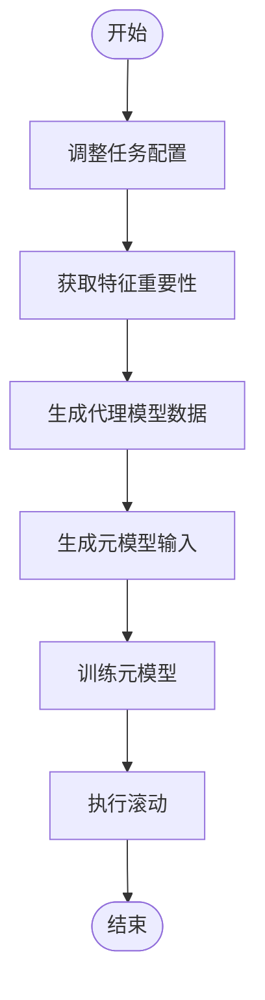
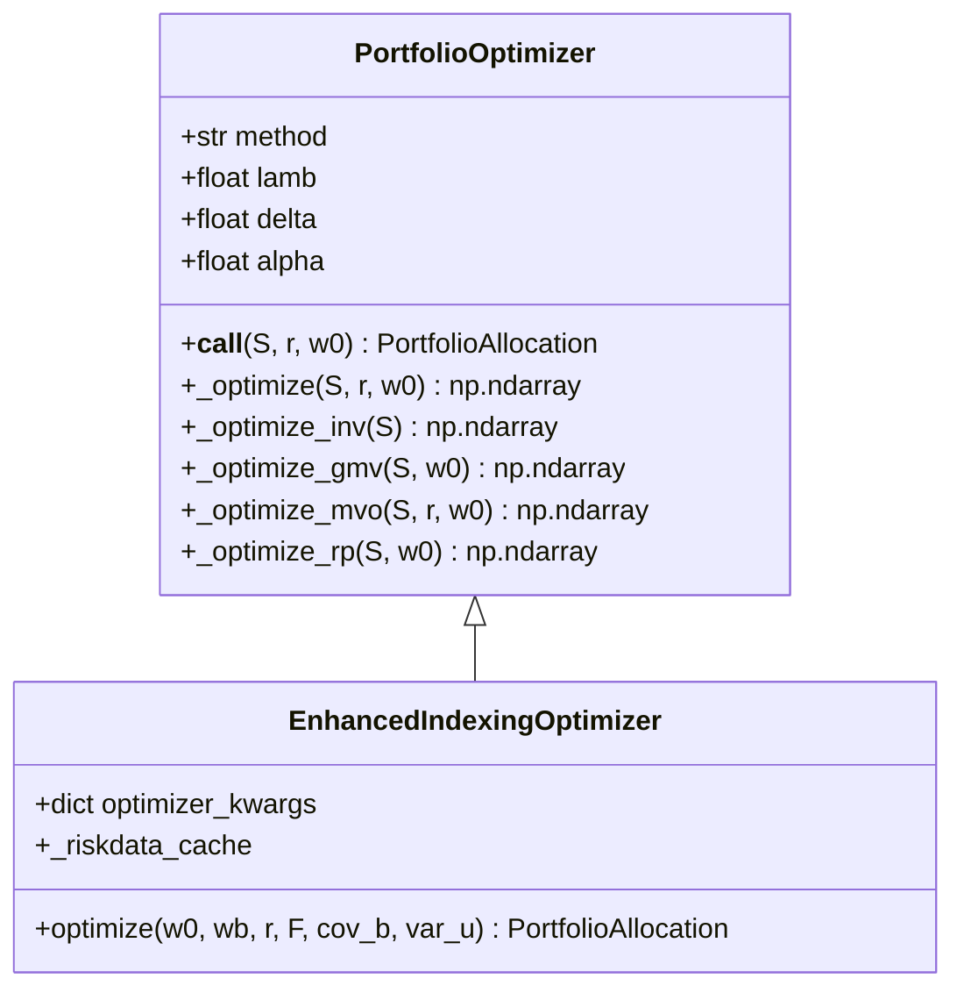
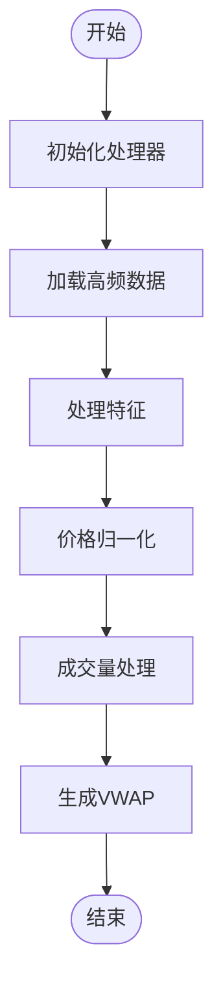
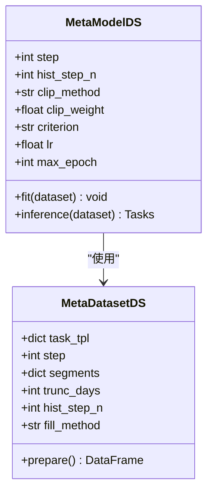

# 高级功能

<cite>
**本文档中引用的文件**  
- [ddgda.py](file://qlib/contrib/rolling/ddgda.py)
- [workflow.py](file://examples/benchmarks_dynamic/DDG-DA/workflow.py)
- [optimizer.py](file://qlib/contrib/strategy/optimizer/optimizer.py)
- [highfreq_handler.py](file://examples/highfreq/highfreq_handler.py)
- [enhanced_indexing.py](file://qlib/contrib/strategy/optimizer/enhanced_indexing.py)
- [signal_strategy.py](file://qlib/contrib/strategy/signal_strategy.py)
- [portfolio/README.md](file://examples/portfolio/README.md)
- [DDG-DA/README.md](file://examples/benchmarks_dynamic/DDG-DA/README.md)
- [workflow_config_lightgbm_Alpha158.yaml](file://examples/benchmarks_dynamic/baseline/workflow_config_lightgbm_Alpha158.yaml)
</cite>

## 目录
1. [动态市场适应（DDG-DA）](#动态市场适应ddg-da)
2. [投资组合优化](#投资组合优化)
3. [高频交易](#高频交易)
4. [元学习](#元学习)
5. [与核心模块的关系](#与核心模块的关系)
6. [常见问题及解决方案](#常见问题及解决方案)
7. [性能考虑](#性能考虑)

## 动态市场适应（DDG-DA）

DDG-DA（Data Distribution Generation for Predictable Concept Drift Adaptation）是一种基于QLib的元控制器组件实现的动态市场适应方法。该方法通过预测数据分布的演变趋势来提高模型性能。具体实现包括三个主要步骤：首先训练一个预测器来估计未来的数据分布，然后利用该预测器生成训练样本，最后在生成的数据上训练模型。

DDG-DA的实现位于`qlib/contrib/rolling/ddgda.py`文件中，其核心类为`DDGDA`，继承自`Rolling`基类。该类通过调整任务配置、提取特征重要性、生成代理模型数据、训练元模型等步骤来实现动态适应。在初始化时，用户可以指定模拟任务模型类型（线性或GBDT）、元模型训练结束时间、L2正则化参数等。

**图示来源**
- [ddgda.py](file://qlib/contrib/rolling/ddgda.py#L244-L258)

**本节来源**
- [ddgda.py](file://qlib/contrib/rolling/ddgda.py#L0-L387)
- [workflow.py](file://examples/benchmarks_dynamic/DDG-DA/workflow.py#L0-L44)
- [DDG-DA/README.md](file://examples/benchmarks_dynamic/DDG-DA/README.md#L0-L35)

## 投资组合优化

QLib提供了多种投资组合优化策略，其中增强型指数化策略（EnhancedIndexingStrategy）是核心功能之一。该策略结合了主动管理和被动管理的优点，旨在在控制风险暴露（即跟踪误差）的同时，使投资组合收益优于基准指数。

投资组合优化的核心实现位于`qlib/contrib/strategy/optimizer/`目录下，主要包括`PortfolioOptimizer`和`EnhancedIndexingOptimizer`两个类。`PortfolioOptimizer`支持多种优化算法，如全局最小方差（GMV）、均值-方差优化（MVO）、风险平价（RP）和逆波动率（INV）等。

增强型指数化策略需要准备风险模型数据，包括因子暴露、因子协方差、特异性风险等。用户可以通过`qlib.model.riskmodel.structured.StructuredCovEstimator`来准备这些数据。在配置文件中，可以通过修改策略部分来使用`EnhancedIndexingStrategy`。

**图示来源**
- [optimizer.py](file://qlib/contrib/strategy/optimizer/optimizer.py#L0-L265)
- [enhanced_indexing.py](file://qlib/contrib/strategy/optimizer/enhanced_indexing.py#L0-L44)

**本节来源**
- [optimizer.py](file://qlib/contrib/strategy/optimizer/optimizer.py#L0-L265)
- [signal_strategy.py](file://qlib/contrib/strategy/signal_strategy.py#L358-L433)
- [portfolio/README.md](file://examples/portfolio/README.md#L0-L47)

## 高频交易

QLib支持高频交易功能，主要通过`examples/highfreq/`目录下的模块实现。高频交易处理器（HighFreqHandler）和回测处理器（HighFreqBacktestHandler）是两个核心类，分别用于处理高频数据和执行高频回测。

高频交易功能支持1分钟频率的数据处理，并提供了多种特征工程方法，如价格归一化、成交量处理等。在`highfreq_handler.py`文件中，定义了如何从原始数据中提取高频特征，包括开盘价、最高价、最低价、收盘价、VWAP和成交量等。

**图示来源**
- [highfreq_handler.py](file://examples/highfreq/highfreq_handler.py#L0-L158)

**本节来源**
- [highfreq_handler.py](file://examples/highfreq/highfreq_handler.py#L0-L158)

## 元学习

元学习在QLib中主要用于数据选择和动态适应。`qlib/contrib/meta/data_selection/`目录下实现了基于元学习的数据选择功能，包括`MetaModelDS`和`MetaDatasetDS`等核心类。

元学习模型通过学习历史数据的分布特征，来指导未来数据的选择和加权。在DDG-DA实现中，元模型被用来预测未来的数据分布趋势，并据此调整训练样本的权重。元学习的训练过程包括准备内部数据、设置元任务、训练元模型等步骤。

**图示来源**
- [model.py](file://qlib/contrib/meta/data_selection/model.py#L39-L71)
- [dataset.py](file://qlib/contrib/meta/data_selection/dataset.py#L268-L295)

**本节来源**
- [ddgda.py](file://qlib/contrib/rolling/ddgda.py#L244-L258)
- [model.py](file://qlib/contrib/meta/data_selection/model.py#L39-L71)

## 与核心模块的关系

高级功能与QLib的核心模块紧密集成。动态市场适应（DDG-DA）基于滚动框架（Rolling）实现，利用元控制器组件进行概念漂移适应。投资组合优化策略与回测模块（backtest）和信号生成模块（signal）协同工作，实现从预测到执行的完整流程。

高频交易功能依赖于数据处理模块（data.dataset.handler）和特征工程模块（data.ops），通过自定义处理器来支持高频数据的特殊处理需求。元学习功能则与模型训练模块（model.trainer）和工作流管理模块（workflow）深度集成，实现了跨任务的知识迁移。

这些高级功能共同构成了QLib的量化投资工作流，从数据预处理、特征工程、模型训练到投资组合优化和执行，形成了一个完整的闭环系统。

**本节来源**
- [ddgda.py](file://qlib/contrib/rolling/ddgda.py#L0-L387)
- [optimizer.py](file://qlib/contrib/strategy/optimizer/optimizer.py#L0-L265)
- [highfreq_handler.py](file://examples/highfreq/highfreq_handler.py#L0-L158)

## 常见问题及解决方案

在使用高级功能时，可能会遇到一些常见问题。对于DDG-DA，由于需要大量的内存和磁盘空间，建议确保至少45GB内存和4GB磁盘空间。如果遇到特征重要性计算问题，可以检查是否正确配置了GBDT模型参数。

在投资组合优化中，如果出现优化失败的情况，可能是由于协方差矩阵非正定导致的。解决方案包括使用结构化协方差估计器（StructuredCovEstimator）或增加L2正则化参数。对于高频交易，需要注意Yahoo数据源缺少VWAP字段，需要使用辛普森积分法近似计算。

元学习训练过程中可能出现梯度爆炸问题，建议使用梯度裁剪（gradient clipping）技术。此外，所有高级功能都依赖于正确的数据配置，建议在运行前仔细检查工作流配置文件。

**本节来源**
- [DDG-DA/README.md](file://examples/benchmarks_dynamic/DDG-DA/README.md#L0-L35)
- [portfolio/README.md](file://examples/portfolio/README.md#L0-L47)
- [ddgda.py](file://qlib/contrib/rolling/ddgda.py#L0-L387)

## 性能考虑

高级功能的性能表现受多个因素影响。DDG-DA由于涉及多次模型训练和数据生成，计算开销较大，建议在高性能计算环境中运行。投资组合优化的计算