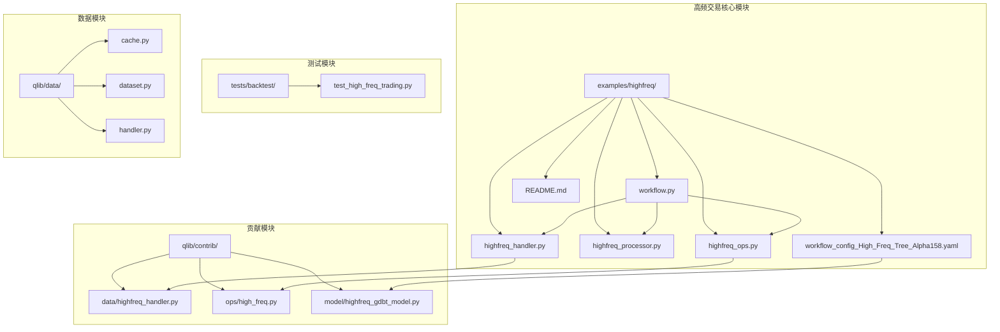
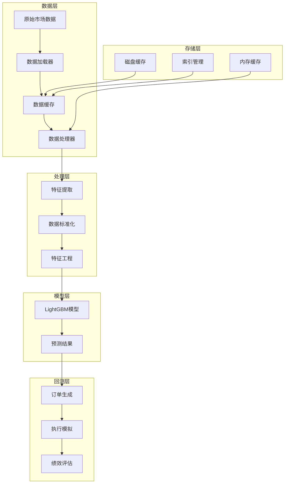
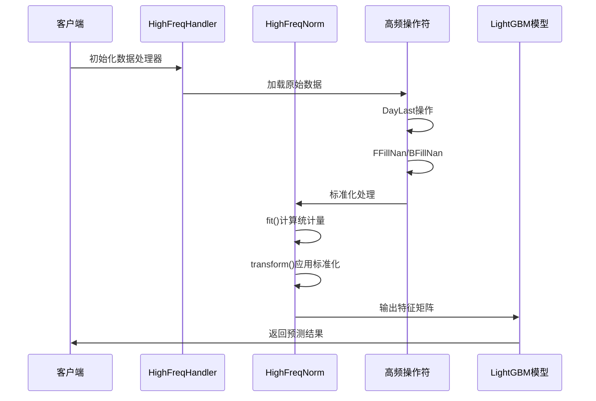
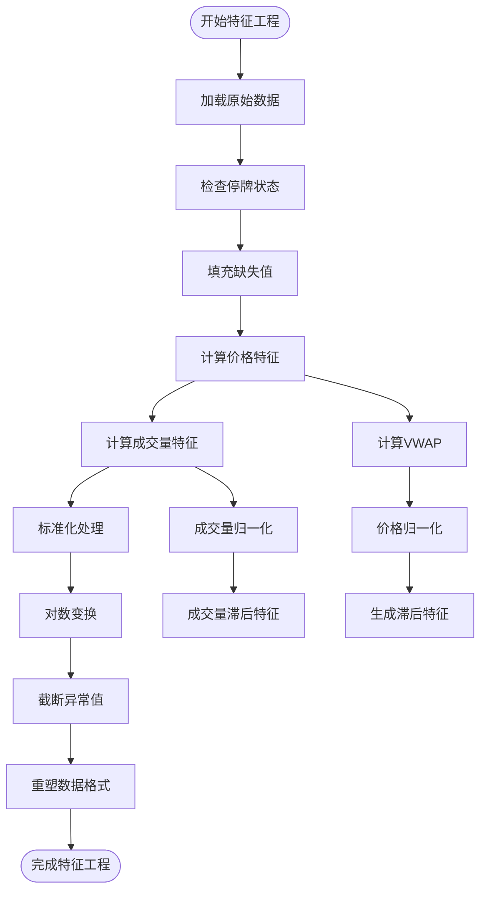
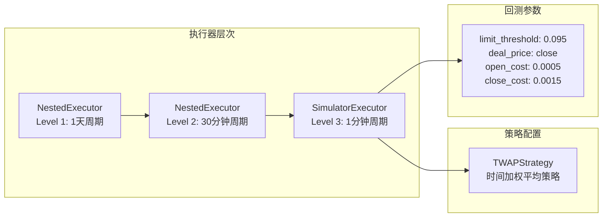
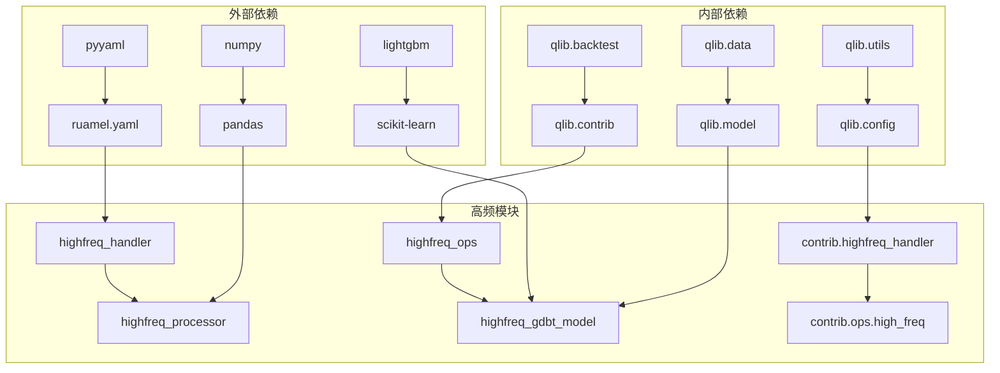

# 高频交易支持功能

<cite>
**本文档中引用的文件**
- [README.md](file://examples/highfreq/README.md)
- [workflow.py](file://examples/highfreq/workflow.py)
- [highfreq_handler.py](file://examples/highfreq/highfreq_handler.py)
- [highfreq_processor.py](file://examples/highfreq/highfreq_processor.py)
- [highfreq_ops.py](file://examples/highfreq/highfreq_ops.py)
- [highfreq_gdbt_model.py](file://qlib/contrib/model/highfreq_gdbt_model.py)
- [highfreq_handler.py](file://qlib/contrib/data/highfreq_handler.py)
- [high_freq.py](file://qlib/contrib/ops/high_freq.py)
- [test_high_freq_trading.py](file://tests/backtest/test_high_freq_trading.py)
- [workflow_config_High_Freq_Tree_Alpha158.yaml](file://examples/highfreq/workflow_config_High_Freq_Tree_Alpha158.yaml)
- [data_mem_resuse_demo.py](file://examples/data_demo/data_mem_resuse_demo.py)
</cite>

## 目录
1. [简介](#简介)
2. [项目结构](#项目结构)
3. [核心组件](#核心组件)
4. [架构概览](#架构概览)
5. [详细组件分析](#详细组件分析)
6. [依赖关系分析](#依赖关系分析)
7. [性能考虑](#性能考虑)
8. [故障排除指南](#故障排除指南)
9. [结论](#结论)

## 简介

高频交易（High Frequency Trading, HFT）系统是一个专门设计用于处理高时间分辨率金融数据的复杂框架。该系统通过专门的处理器、操作符和模型，实现了从原始市场数据到可预测信号的完整转换管道。

本系统的核心特点包括：
- 支持1分钟级别的高频数据处理
- 实时数据对齐和去噪机制
- 高效的特征提取和标准化
- 延迟敏感的数据存储和缓存策略
- 内存复用和性能优化技术

## 项目结构

高频交易支持功能主要分布在以下目录结构中：



**图表来源**
- [workflow.py](file://examples/highfreq/workflow.py#L1-L176)
- [highfreq_handler.py](file://examples/highfreq/highfreq_handler.py#L1-L159)
- [highfreq_processor.py](file://examples/highfreq/highfreq_processor.py#L1-L77)

## 核心组件

### 数据处理器（HighFreqNorm）

HighFreqNorm是高频数据标准化的核心组件，负责将原始价格和成交量数据转换为适合机器学习模型使用的标准化格式。

```python
class HighFreqNorm(Processor):
    def __init__(self, fit_start_time, fit_end_time):
        self.fit_start_time = fit_start_time
        self.fit_end_time = fit_end_time
    
    def fit(self, df_features):
        # 计算中位数和标准差统计量
        # 对价格和成交量进行log变换
        # 应用截断处理防止异常值影响
```

### 高频处理器（HighFreqHandler）

HighFreqHandler继承自DataHandlerLP，专门处理高频金融数据的加载和预处理。

```python
class HighFreqHandler(DataHandlerLP):
    def __init__(self, instruments="csi300", start_time=None, end_time=None):
        # 配置1分钟频率的数据加载器
        # 设置特征配置模板
        # 处理停牌和缺失值问题
```

### 高频操作符

高频操作符提供了专门针对高频数据的操作功能：

- **DayLast**: 获取每日最后一个值
- **FFillNan/BFillNan**: 前向/后向填充缺失值
- **Date**: 提取日期信息
- **Select**: 条件选择操作
- **IsNull/IsInf**: 检查空值和无穷值
- **Cut**: 裁剪数据边界

**章节来源**
- [highfreq_processor.py](file://examples/highfreq/highfreq_processor.py#L1-L77)
- [highfreq_handler.py](file://examples/highfreq/highfreq_handler.py#L1-L159)
- [highfreq_ops.py](file://examples/highfreq/highfreq_ops.py#L1-L168)

## 架构概览

高频交易系统采用分层架构设计，确保高效的数据处理和模型训练：



**图表来源**
- [workflow.py](file://examples/highfreq/workflow.py#L20-L80)
- [highfreq_handler.py](file://examples/highfreq/highfreq_handler.py#L10-L30)

## 详细组件分析

### 高频数据处理流水线

高频数据处理遵循严格的流水线模式，确保每个阶段的输出都符合后续处理的要求：



**图表来源**
- [highfreq_handler.py](file://examples/highfreq/highfreq_handler.py#L10-L50)
- [highfreq_processor.py](file://examples/highfreq/highfreq_processor.py#L10-L40)

### 特征工程流程

高频特征工程包含多个关键步骤，确保数据质量和模型性能：



**图表来源**
- [highfreq_handler.py](file://examples/highfreq/highfreq_handler.py#L30-L100)
- [highfreq_processor.py](file://examples/highfreq/highfreq_processor.py#L20-L60)

### 高频操作符详解

#### DayLast操作符

DayLast操作符用于获取每个交易日的最后一个值，这对于计算日间统计量至关重要：

```python
class DayLast(ElemOperator):
    def _load_internal(self, instrument, start_index, end_index, freq):
        _calendar = get_calendar_day(freq=freq)
        series = self.feature.load(instrument, start_index, end_index, freq)
        return series.groupby(_calendar[series.index], group_keys=False).transform("last")
```

#### 数据标准化算法

HighFreqNorm使用robust标准化方法处理高频数据：

```python
def __call__(self, df_features):
    # 对价格特征进行中位数标准化
    df_values[:, name_val] -= self.feature_med[name]
    df_values[:, name_val] /= self.feature_std[name]
    
    # 截断异常值
    slice0 = df_values[:, name_val] > 3.0
    slice1 = df_values[:, name_val] > 3.5
    slice2 = df_values[:, name_val] < -3.0
    slice3 = df_values[:, name_val] < -3.5
    
    # 应用渐进式截断
    df_values[:, name_val][slice0] = 3.0 + (df_values[:, name_val][slice0] - 3.0) / (self.feature_vmax[name] - 3) * 0.5
```

**章节来源**
- [high_freq.py](file://qlib/contrib/ops/high_freq.py#L100-L150)
- [highfreq_processor.py](file://examples/highfreq/highfreq_processor.py#L40-L70)

### 模型训练和回测

#### LightGBM模型配置

高频场景下使用的LightGBM模型经过特殊优化：

```yaml
task:
    model:
        class: "HFLGBModel"
        module_path: "qlib.contrib.model.highfreq_gdbt_model"
        kwargs:
            objective: 'binary'
            metric: ['binary_logloss','auc']
            verbosity: -1
            learning_rate: 0.01
            max_depth: 8
            num_leaves: 150
            lambda_l1: 1.5
            lambda_l2: 1
            num_threads: 20
```

#### 回测执行器

高频回测使用多层执行器架构：



**图表来源**
- [test_high_freq_trading.py](file://tests/backtest/test_high_freq_trading.py#L60-L100)

**章节来源**
- [workflow_config_High_Freq_Tree_Alpha158.yaml](file://examples/highfreq/workflow_config_High_Freq_Tree_Alpha158.yaml#L30-L65)
- [test_high_freq_trading.py](file://tests/backtest/test_high_freq_trading.py#L40-L80)

## 依赖关系分析

高频交易系统的依赖关系呈现清晰的分层结构：



**图表来源**
- [workflow.py](file://examples/highfreq/workflow.py#L1-L15)
- [highfreq_handler.py](file://examples/highfreq/highfreq_handler.py#L1-L5)

**章节来源**
- [workflow.py](file://examples/highfreq/workflow.py#L1-L20)
- [highfreq_processor.py](file://examples/highfreq/highfreq_processor.py#L1-L10)

## 性能考虑

### 数据存储优化

高频交易系统采用多层次缓存策略来优化数据访问性能：

1. **内存缓存**: 使用H字典进行快速数据访问
2. **磁盘缓存**: HDF5格式存储大规模数据集
3. **索引管理**: 快速定位特定时间段的数据

### 内存复用技术

系统实现了智能的内存管理机制：

```python
# 数据处理后的内存释放
del df_features
df_values = fetch_df.values

# 内存映射文件减少内存占用
r = np.hstack([df.index[0], expression_data]).astype("<f")
r.tofile(str(cache_path))
```

### 并行处理优化

- 使用多进程数据加载
- 支持NUMA感知的内存分配
- 异步I/O操作减少等待时间

### 缓存策略

高频数据缓存采用以下策略：
- **表达式缓存**: 单个字段的缓存
- **数据集缓存**: 整体数据集的缓存
- **索引缓存**: 快速数据定位

## 故障排除指南

### 常见问题和解决方案

#### 数据加载失败

**问题**: 高频数据无法正确加载
**解决方案**:
1. 检查数据路径配置
2. 验证数据文件完整性
3. 清除损坏的缓存文件

```python
# 清除缓存的代码示例
def clear_cache(cp_cache_uri):
    if not self.check_cache_exists(cp_cache_uri):
        self.logger.info(f"The cache {cp_cache_uri} has corrupted. It will be removed")
        self.clear_cache(cp_cache_uri)
        return 2
```

#### 内存不足错误

**问题**: 处理大量高频数据时出现内存溢出
**解决方案**:
1. 启用数据分块处理
2. 减少批处理大小
3. 使用磁盘缓存替代内存缓存

#### 性能瓶颈识别

**问题**: 数据处理速度过慢
**解决方案**:
1. 分析CPU使用率
2. 检查I/O等待时间
3. 优化数据加载顺序

### 调试工具

系统提供了多种调试和监控工具：

```python
# 时间测量装饰器
with TimeInspector.logt("The time with reusing processed data in memory:"):
    task_train(new_task, experiment_name=exp_name)

# 数据质量检查
def check_data_quality(df_features):
    # 检查缺失值比例
    # 验证数据范围合理性
    # 确认数据类型正确性
```

**章节来源**
- [cache.py](file://qlib/data/cache.py#L564-L590)
- [data_mem_resuse_demo.py](file://examples/data_demo/data_mem_resuse_demo.py#L30-L50)

## 结论

高频交易支持功能是一个高度优化的系统，专门设计用于处理高时间分辨率的金融数据。通过精心设计的架构和优化策略，该系统能够：

1. **高效处理**: 支持1分钟级别的实时数据处理
2. **可靠存储**: 多层次缓存机制确保数据访问性能
3. **灵活扩展**: 模块化设计便于功能扩展和定制
4. **易于维护**: 清晰的代码结构和完善的文档支持

该系统特别适用于需要低延迟响应和高精度预测的高频交易场景，为量化交易者提供了强大的技术支持平台。

在实际部署中，建议根据具体需求调整缓存策略、并行度设置和内存分配参数，以获得最佳性能表现。