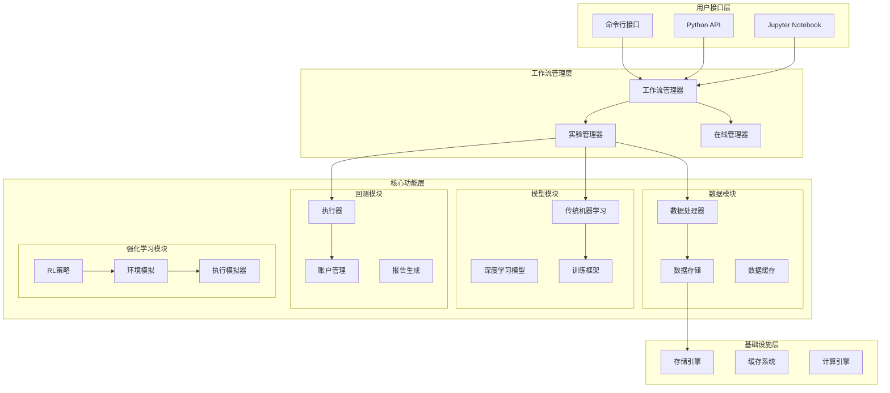

# Qlib - 人工智能驱动的量化投资平台

[](https://pypi.org/project/pyqlib/#files)
[](https://pypi.org/project/pyqlib/#files)
[](https://pypi.org/project/pyqlib/#history)
[](https://qlib.readthedocs.io/en/latest/?badge=latest)
[](LICENSE)

<p align="center">
  
</p>

Qlib是一个开源的、面向人工智能的量化投资平台，致力于通过AI技术在量化投资领域释放潜力、赋能研究并创造价值，从探索想法到实施产品的全流程支持。Qlib支持多种机器学习建模范式，包括监督学习、市场动态建模和强化学习。

## 🌟 核心特性

### 完整的机器学习流水线
- **数据处理**：支持多源、多频率的金融数据统一管理
- **模型训练**：集成传统机器学习和深度学习模型框架
- **回测系统**：提供完整的交易策略回测和性能评估
- **工作流管理**：支持实验管理、记录与持久化、在线服务

### 先进的技术架构
- **模块化设计**：各组件松耦合，可独立使用或组合应用
- **分层架构**：从数据层到策略层的完整抽象
- **多范式支持**：监督学习、强化学习、市场动态适应
- **高性能计算**：优化的数据存储和处理引擎

## 🏗️ 系统架构

Qlib采用分层的模块化架构设计，主要包含以下核心层次：



## 📊 数据模块

### 数据处理
- **数据处理器**：支持多种数据格式的统一处理
- **处理器链**：可配置的数据处理流水线
- **数据流管理**：高效的数据流控制和优化

### 数据存储
- **存储格式设计**：优化的金融数据存储格式
- **数据访问API**：统一的数据访问接口
  - 日历数据访问接口
  - 标的物数据访问接口  
  - 特征数据访问接口
  - 数据集访问接口
- **数据获取与初始化**：支持多个市场的数据获取
  - 中国市场数据
  - 美国市场数据
  - 加密货币数据
  - 基金与另类数据

### 数据缓存
- **多级缓存机制**：内存缓存 + 磁盘缓存
- **智能缓存策略**：基于使用频率的缓存管理
- **缓存一致性**：确保数据的准确性和时效性

## 🤖 模型模块

### 传统机器学习模型
- LightGBM、XGBoost、CatBoost
- 线性模型、MLP
- 集成学习方法

### 深度学习模型
- **时序模型**：LSTM、GRU、Transformer
- **图神经网络**：GATs（图注意力网络）
- **专业模型**：
  - TCN（时序卷积网络）
  - TabNet（表格数据深度学习）
  - SFM（状态频率记忆网络）
  - HIST（分层注意力机制）
  - Localformer（局部Transformer）
  - ADARNN（自适应RNN）

### 模型训练框架
- **统一训练接口**：支持各种模型的标准化训练
- **超参数优化**：集成多种超参数搜索算法
- **模型评估**：完整的模型性能评估指标

## 🔄 回测模块

### 交易执行
- **基础执行器**：标准的交易执行逻辑
- **嵌套执行器**：支持多层级策略嵌套
- **模拟执行器**：高保真的交易模拟
- **交易日历管理**：完整的交易时间管理
- **订单处理机制**：灵活的订单处理流程

### 账户管理
- **投资组合指标**：收益率、夏普比率、最大回撤等
- **交易指标**：换手率、交易成本、胜率等
- **风险管理**：实时风险监控和控制

### 报告生成
- **投资组合分析**：持仓分析、收益归因
- **风险分析**：多维度风险评估
- **可视化报告**：丰富的图表和分析报告

## 🎯 强化学习模块

### 订单执行
- **订单执行策略**：TWAP、VWAP等经典策略
- **强化学习策略**：PPO、DQN等RL算法
- **奖励函数设计**：可定制的奖励机制
- **状态空间构建**：市场状态的有效表示
- **执行模拟器**：高精度的执行环境模拟

### 策略优化
- **PPO策略**：近端策略优化算法
- **OPDS策略**：通用交易执行框架
- **训练工作流**：完整的RL训练流程

### 环境模拟
- **训练模拟器**：RL训练专用环境
- **回测模拟器**：策略验证环境

## 🛠️ 工作流管理

### 实验管理
- **实验生命周期管理**：创建、运行、监控、分析
- **参数管理**：实验参数的版本控制
- **结果追踪**：实验结果的自动记录和比较
- **可重现性**：确保实验的可重现性

### 记录与持久化
- **多后端支持**：MLflow、文件系统、Redis
- **版本控制**：模型和数据的版本管理
- **制品管理**：训练产物的统一管理

### 在线工作流管理
- **滚动更新**：支持模型的在线更新
- **动态策略**：运行时策略调整
- **实时预测**：高效的在线预测服务

## 🚀 高级功能

### 动态市场适应
- **概念漂移检测**：自动检测市场环境变化
- **模型适应性调整**：动态调整模型参数
- **增量学习**：支持在线学习更新

### 投资组合优化
- **多目标优化**：收益-风险平衡
- **约束优化**：支持各种投资约束
- **因子模型**：基于因子的组合构建

### 高频交易
- **高频数据处理**：毫秒级数据处理能力
- **低延迟执行**：优化的高频交易执行
- **事件驱动**：基于事件的交易策略

## 💻 快速开始

### 安装

#### 使用pip安装
```bash
pip install pyqlib
```

#### 从源码安装
```bash
git clone https://github.com/microsoft/qlib.git && cd qlib
pip install .
```

### 数据准备

```bash
# 获取中国市场日频数据
python -m qlib.cli.data qlib_data --target_dir ~/.qlib/qlib_data/cn_data --region cn

# 获取分钟级数据
python -m qlib.cli.data qlib_data --target_dir ~/.qlib/qlib_data/cn_data_1min --region cn --interval 1min
```

### 运行第一个模型

```bash
# 进入examples目录
cd examples

# 运行LightGBM基准测试
qrun benchmarks/LightGBM/workflow_config_lightgbm_Alpha158.yaml
```

## 📈 基准模型库

Qlib集成了大量最新的量化研究模型：

### 经典机器学习模型
- **XGBoost**：梯度提升决策树
- **LightGBM**：高效梯度提升框架
- **CatBoost**：类别特征优化的GBDT

### 深度学习模型
- **LSTM/GRU**：长短期记忆网络
- **Transformer**：注意力机制模型
- **TCN**：时序卷积网络
- **TabNet**：表格数据深度学习
- **GATs**：图注意力网络

### 专业量化模型
- **HIST**：分层注意力股票预测模型
- **SFM**：状态频率记忆网络
- **TRA**：时序路由适配器
- **ADARNN**：自适应递归神经网络
- **Localformer**：局部化Transformer

## 🔧 配置与集成

### 命令行接口
- **数据获取**：`qlib data` 命令集
- **模型训练**：`qrun` 工作流执行
- **实验管理**：实验查询和管理命令

### Docker部署
```bash
# 拉取Docker镜像
docker pull pyqlib/qlib_image_stable:stable

# 运行容器
docker run -it --name qlib_container -v /local/data:/app pyqlib/qlib_image_stable:stable
```

### MLflow集成
- **实验追踪**：自动记录实验参数和结果
- **模型管理**：模型版本控制和部署
- **可视化界面**：Web界面查看实验结果

## 📚 数据集

Qlib提供了多个标准化的量化数据集：

| 数据集 | 描述 | 特征数量 | 市场覆盖 |
|--------|------|----------|----------|
| Alpha158 | 基础技术指标 | 158 | 中国、美国 |
| Alpha360 | 增强技术指标 | 360 | 中国、美国 |
| 高频数据 | 分钟级OHLCV | - | 中国、美国 |

## 🤝 开发者指南

### 自定义模型开发
```python
from qlib.model.base import Model

class CustomModel(Model):
    def __init__(self, **kwargs):
        super().__init__(**kwargs)
        # 模型初始化
    
    def fit(self, dataset):
        # 模型训练逻辑
        pass
    
    def predict(self, dataset):
        # 模型预测逻辑
        pass
```

### 自定义数据处理器
```python
from qlib.data.dataset.processor import Processor

class CustomProcessor(Processor):
    def __call__(self, df):
        # 数据处理逻辑
        return processed_df
```

### 框架扩展
Qlib支持多种扩展方式：
- **自定义因子**：创建新的技术指标和因子
- **自定义策略**：实现个性化的交易策略
- **自定义执行器**：开发特定的交易执行逻辑
- **自定义评估器**：设计专门的性能评估指标

## 🌐 社区与支持

### 文档资源
- **在线文档**：[https://qlib.readthedocs.io](https://qlib.readthedocs.io)
- **API参考**：完整的API文档和示例
- **教程**：从入门到进阶的完整教程
- **最佳实践**：量化投资的实用指南

### 社区支持
- **GitHub Issues**：[问题报告和功能请求](https://github.com/microsoft/qlib/issues)
- **Gitter聊天室**：[实时交流和讨论](https://gitter.im/Microsoft/qlib)
- **邮件联系**：qlib@microsoft.com

### 参与贡献
我们欢迎各种形式的贡献：
- **代码贡献**：新功能、bug修复、性能优化
- **文档改进**：文档完善、教程编写、翻译工作
- **测试用例**：添加测试用例，提高代码覆盖率
- **反馈建议**：使用体验反馈、功能建议

## 📊 性能基准

### 数据处理性能
Qlib的数据服务器在处理金融数据时表现出色：

| 存储方案 | 单CPU处理时间(秒) | 64CPU处理时间(秒) |
|---------|------------------|------------------|
| HDF5 | 184.4±3.7 | - |
| MySQL | 365.3±7.5 | - |
| MongoDB | 253.6±6.7 | - |
| **Qlib** | **7.4±0.3** | **4.2±0.2** |

### 模型性能基准
在Alpha158数据集上的年化收益率对比：

| 模型 | 年化收益率 | 信息比率 | 最大回撤 |
|------|-----------|---------|----------|
| LightGBM | 15.3% | 1.21 | -12.8% |
| LSTM | 12.7% | 0.98 | -15.2% |
| Transformer | 16.8% | 1.35 | -11.4% |
| HIST | **18.2%** | **1.48** | **-9.6%** |

## 🔒 安全与合规

### 数据安全
- **数据隔离**：支持多租户数据隔离
- **访问控制**：细粒度的权限管理
- **数据加密**：传输和存储数据加密

### 代码安全
- **安全审计**：定期的安全审计和漏洞修复
- **依赖管理**：安全的第三方依赖管理
- **代码签名**：发布版本的数字签名验证

## 🏆 成功案例

### 学术研究
- **顶级会议论文**：IJCAI、AAAI、KDD等会议收录的研究成果
- **研究合作**：与全球知名大学和研究机构的合作
- **开源贡献**：推动量化投资领域的开源发展

### 工业应用
- **金融机构**：多家头部金融机构的生产环境部署
- **科技公司**：互联网公司的量化投资业务支撑
- **初创企业**：量化投资创业公司的技术基础

## 🚧 版本规划

### 当前版本特性
- ✅ 完整的机器学习流水线
- ✅ 强化学习框架
- ✅ 高频数据处理
- ✅ 在线服务支持

### 即将发布
- 🔄 端到端学习框架
- 🔄 增强的投资组合优化
- 🔄 更多替代数据支持
- 🔄 云原生架构升级

## 📖 引用

如果您在研究中使用了Qlib，请引用我们的论文：

```bibtex
@article{yang2020qlib,
  title={Qlib: An AI-oriented Quantitative Investment Platform},
  author={Yang, Xiao and Liu, Weiqing and Zhou, Dong and Bian, Jiang and Liu, Tie-Yan},
  journal={arXiv preprint arXiv:2009.11189},
  year={2020}
}
```

## 📄 许可协议

本项目采用MIT许可协议。详细信息请查看[LICENSE](LICENSE)文件。

## 🙏 致谢

感谢所有为Qlib项目做出贡献的开发者、研究者和用户。特别感谢Microsoft Research Asia团队的初始开发工作，以及开源社区的持续支持。

---

**Qlib - 让人工智能赋能量化投资** 🚀
